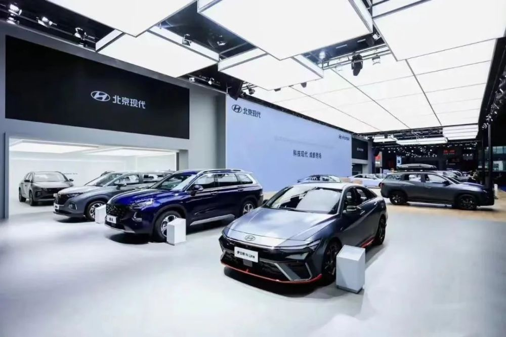
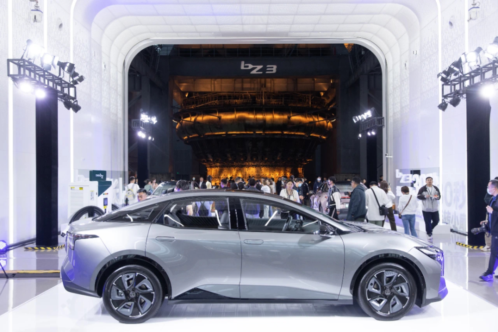
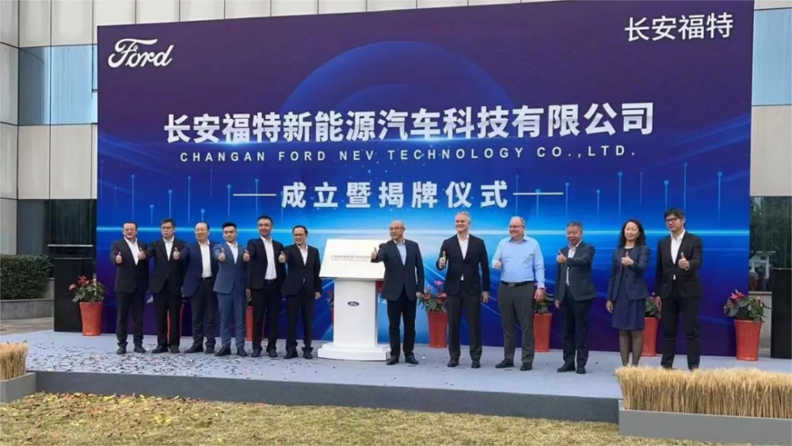
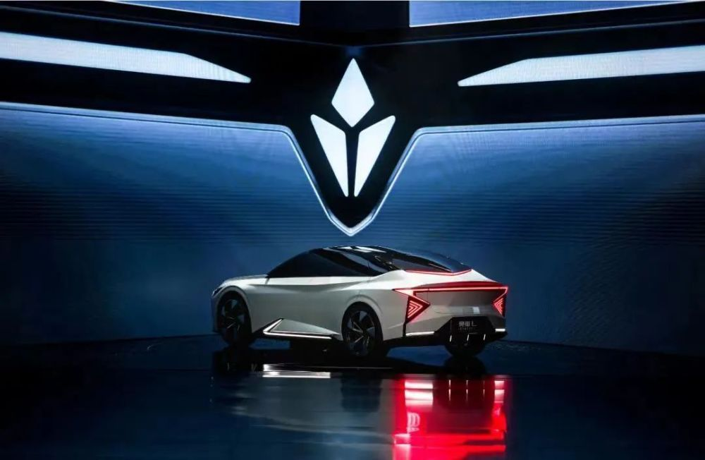

# 销量下滑、电动化转型跟不上中国市场，合资品牌在华求生谋变

是加倍押注扭转局面，还是及时止损避免更大损失？一些跨国汽车公司其实已经作出了不同的抉择。

文 ｜腾讯汽车特约作者 帮宁工作室

合资车企正在调整经营战略，以应对销量下滑带来的冲击，并设法改变电动化、智能化落后于中国品牌的局面。

2023年10月12日，据韩国媒体报道，现代汽车已同意生产北京汽车旗下Arcfox极狐品牌电动汽车，双方仍在讨论细节。按照此说法，北京现代将代工生产中国品牌汽车，这是现代汽车首次生产外国品牌汽车。

此前不久，国内媒体爆料称，现代汽车与北汽集团就合作开发电动汽车项目进行商谈——北汽将为该项目提供技术支持，车型品牌将归属北京现代旗下，由北京现代负责销售等。

这两则消息均未得到北京现代官方确认，但现代汽车上个月表示，正在谋求与中国本土电动化企业开展全方位合作，而且对合作对象持开放态度。可以确定是，其将在中国市场打开全新的合资合作模式。

现代汽车正在努力重建在华业务，并扭转去年中国约6亿美元的运营亏损。自2017年以来，现代汽车在华销量大幅下滑，其中，北京现代从高光时期的百万辆降至2022年约26万辆。

今年1-9月，北京现代销量为17.3万辆，其中，伊兰特、SUV双子星、沐飒等车型终端销量为5.1万辆——这些相对更适合本土销售，且更具性价比的车型，虽然在支撑北京现代销量回暖，但尚不能扭转亏损局面。

与在中国业绩形成鲜明对比，2022年，现代汽车全球销量为684.82万辆，成为继丰田汽车和大众汽车集团之后的全球第三大汽车制造商。而且，其电动汽车产品（艾尼氪系列）在欧美市场的表现可圈可点。

北京现代的处境，是在华合资汽车品牌的缩影，销量下滑、电动化转型跟不上中国市场，几乎成为合资品牌的共性。在此背景下，中国汽车新一轮大调整陆续展开，不断有新的合资合作模式面世。

高溢价时代终结

在刚刚过去的9月，合资品牌进行了一轮反攻，销量普遍上涨。不仅燃油车销量有所回暖，上汽大众和一汽-
大众的ID.系列，以及上汽通用别克E5和别克微蓝6等电动车的销量也大幅增长。

主流观点认为，这得益于其降价行为。最典型的案例是上汽大众ID.3。今年7月，上汽大众宣布ID.3车型下调售价3.7万元，起售价降至史上最低价12.59万元。也正因此，上汽大众ID.系列月销量首次破万。至今，优惠政策还在持续中，终端优惠幅度更甚。

ID.3降价举措见效后，上汽大众又对另外两款电动车——ID.4X和ID.6X展开降价。一汽-大众也随其步伐降价，2024款ID.6
CROZZ降价4.5万元，优惠后价格为21.39万～29.19万元。

大众汽车希望通过降低售价，扩大电动汽车市场份额。上汽大众总经理贾健旭在最近一次受访中提到，ID.3的电池将由三元锂电池，更换为磷酸铁锂电池，这将把每辆车的成本降低约1.9万元。

除了南北大众，另一家通过降价取得明显销量增长的是上汽通用。同样是从7月开始，上汽通用旗下凯迪拉克、别克等品牌陆续降价。其中，凯迪拉克锐歌、别克E5和微蓝6等取得不错的成绩。9月，上汽通用旗下新能源车销量突破万辆。

今年更早些时候，东风日产、南北丰田等也对旗下电动车展开大幅降价攻势，但未能达到如ID.3的效果，主要还是其性价比不够高。

降价之后，合资品牌的溢价已经大幅减弱，尤其是电动汽车，他们普遍意识到，唯有提高性价比，才能与中国汽车品牌竞争。由此，合资品牌面临价格体系重塑。

降价只是短期策略，大众汽车实际上更希望能在电动化，尤其是智能化方面补课，以追赶中国市场的变化速度。

7月，大众汽车与小鹏汽车签署技术合作框架协议，双方基于小鹏G9车型平台、智能座舱和高阶辅助驾驶系统软件，共同开发两款大众汽车品牌电动车型。同时，大众深化与上汽集团之间的合作，包括联合开发车型和一个新平台。

丰田汽车也希望通过与中国企业合作，扩大其电动车市场规模。丰田与比亚迪合作推出的产品——bZ3除了在近两个月销售5千辆左右，其他月份并不突出，但总体上比丰田bZ系列另一款车型bZ4X的表现好得多。

8月，广汽丰田、丰田中国投资公司和小马智行签署三方协议，总投资10亿元人民币，计划成立一家合资公司。不同于大众入股小鹏，丰田希望让该创业公司充当其新业务的运营商。

以电动化、智能化为突破口，中国新能源汽车产业迎来爆发期，市场规模效应凸显。目前，国内头部车企都在完善新能源汽车产业链生态。

对于合资品牌而言，要与中国品牌比拼性价比，可能会更加困难，但这又是合资电动车的必经之路。如果再按照以往的合资模式，可能翻身会遥遥无期。

整体上看，合资品牌电动车几乎都水土不服，在华的日产、丰田、本田、福特、大众等品牌无一例外。现代汽车或许是看到了这种现象，故而迟迟没有引进艾尼氪系列，而是希望与北汽重新打造一个新品牌，或者直接为北汽旗下极狐品牌代工。

根据乘联会数据，9月，自主品牌新能源车渗透率为49.9%；豪华车中的新能源车渗透率为31.1%；主流合资品牌新能源车渗透率仅为5.8%，其中，南北大众和上汽通用占了主要份额。

残酷的现实，逼迫合资车企不得不探索新的合资合作模式。除了前文中提到的大众和现代，其他品牌也开始探索新出路。

合资品牌再创业

长安福特在开辟一种合资新模式。

10月11日，长安福特新能源汽车科技有限公司举行挂牌成立仪式。国家企业信用信息公示系统显示，该公司于今年9月20日成立，由长安福特汽车有限公司与长安汽车共同持股，股比分别为60%和40%。

不仅福特电马业务并入新公司，长安福特全国销售服务机构(NDSD)也将并入长安福特新能源，长安福特的车型销售工作和销售渠道将由长安福特新能源管理。今年8月，长安福特宣布接手福特电马在中国的业务，时间不长，其业务模式再次发生变化。

长安汽车本来就持有长安福特50%的股权，算下来，长安汽车在新合资企业中占股7成。可见，在新合资公司中，长安汽车有更大的话语权。

不同于大众和丰田在原合作伙伴基础上寻求新合作伙伴的方式，长安福特新能源其实是长安汽车和福特汽车的再创业。新公司将利用长安汽车以及福特汽车的优势资源，加速长安福特电气化战略落地。

今年5月，福特宣布要在全球市场缩减投资，提高盈利能力，其中，希望专注于商用业务、电动汽车和出口，以扭转在中国连续5年销量下滑的局面。“我们将在中国开展投资更少、更精简、更专注、回报更高的业务。”福特汽车首席执行官吉姆·法利（Jim
Farley）曾表示。

做减法、更聚焦，正在成为更多跨国公司在中国的战略，但这并不意味着他们会放弃中国市场，而是希望借力中国本土汽车企业在电动化、智能化领域的优势，弥补其电动汽车业务的不足。

同样选择与原合作伙伴再创业的，还有东风本田和东风日产。但与长安福特不同，这两家合资车企都选择押注合资自主品牌——东风日产是利用原有的启辰品牌，作为其新能源领域的主战场；东风本田则推出全新品牌灵悉，希望给消费者带来更年轻化的车型选择。

灵悉品牌第一款车型将在明年上市，之后3年，将每年推出一款新品，涵盖轿车、SUV等细分市场。预计至2025年，东风本田电动化产品比例将超过50%，2030年累计推出10款以上纯电动车型。

启辰品牌则计划每年推出至少2款全新新能源车型，并逐步挑战年销50万辆的目标。目前，启辰大VDD-i初步打开了销量和市场，后续仍需加快产品投放节奏。

灵悉与启辰相似，都是中方将资源反哺合资外方，实现反向输出，双方都希望新品牌成为合资公司第二增长曲线。在新合资时代，这种模式或将成为合资车企的新趋势。

尽管在中方反哺下，合资品牌推出的电动化产品更加符合中国市场需求，但还需加快转型速度。

国内新能源市场已经进入拼刺刀的环节，一些长续航且有高阶辅助驾驶配置的车型在不断优化成本，甚至不惜损失利润，以离谱的低价入市，意图先形成规模和市场份额。

这加大了合资品牌转型挑战。有可能当其新产品推出时，就已经落后于头部队列，根本没有竞争力。对他们的考验是，如何把眼光放得比中国品牌更远，大大缩短车型开发周期，以及提升OTA迭代能力。

是加倍押注扭转局面，还是及时止损避免更大损失？一些跨国汽车公司其实已经作出了不同的抉择。激进者如大众，加大在华投资力度；温和者如日产和本田，在合资公司中推出新品牌；保守者如福特，在部分市场缩减投资。

未来，或许会有更多的合资模式。

