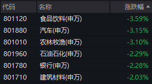
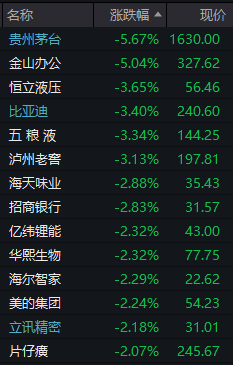

# A股3000点保卫战再打响：权重股补跌等所致，大盘正加速赶底

A股再次打响3000点保卫战。

10月19日，A股三大指数悉数大幅回调，均跌逾1%。其中，上证指数跌超1.7%退守3000点，深证成指同样跌超1.5%下行1.65%，创业板指跌1.28%。

对于市场的加速下行，市场人士分析称主要是四方面因素所致：一是资金面北向资金的大幅流出；二是大量权重股都出现了调整；三是情绪面市场信心受到一定程度打击；四是海外相关不确定性。

“接下来，上证指数短期有不小的概率跌破3000点。”沪上某券商首席投顾对澎湃新闻记者表示，不过，破掉3000点以后大概率会有一些反弹，但反弹的力度仍有待观察。

方正证券分析师赵伟也在10月19日的最新研报中指出，由于大市值蓝筹股的补跌拖累，大盘还会走势反复，3000点关口面临考验。

“从历史规律看，大盘最后一跌，就是蓝筹股下跌拖累的虚跌，虚跌指数的同时，结构性牛市行情就已兴起。中长期看，大盘向上空间远远大于向下空间，且大盘向下空间有限。”赵伟称。

**全线调整**

截至10月19日收盘，上证综指跌1.74%，报3005.39点；科创50指数涨0.04%，报870.1点；深证成指跌1.65%，报9655.09点；创业板指跌1.28%，报1913.7点。

盘面上看，市场普跌格局突出。个股方面，Wind统计显示，两市有多达3928家公司的股票出现下跌。

板块方面，申万一级行业分类下，31个子板块全部收绿。其中，食品饮料、汽车、农林牧渔等板块均跌超3%；石油石化、银行、建筑材料等板块均跌逾2%。

对于市场的调整，分析人士指出，主要是资金面、情绪面和权重股悉数调整等因素综合作用所致。

“资金方面，周四（10月19日）在美元强势等因素影响下，出现了大幅净流出，而北向资金的持仓包含大量权重股。”前述券商首席投顾表示。

Wind资料显示，北向资金10月19日全天大幅净卖出117.04亿元，年内第三次单日减仓超百亿，连续5日净卖出累计近290亿元。

“周四（10月19日），以贵州茅台（600519）为代表的大市值权重蓝筹股出现了大面积调整，指数层面的表现自然不佳。”有券商策略分析师说。

Wind资料显示，10月19日茅指数（8841415）大跌1.81%。其中，42只成分股，仅智飞生物（300122）和中芯国际（688981）出现微涨，其余40只成分股悉数下行，且多达33只跌超1%。

其中，贵州茅台、金山办公（688111）跌幅居前，均跌超5%；比亚迪（002594）、五粮液（000858）等跌超3%；招商银行（600036）、美的集团（000333）等跌超2%。

情绪面上，赵伟表示，周四（10月19日）大盘在白酒、银行、保险等大市值蓝筹股大幅下跌拖累下，走出了大幅低开、盘中大幅震荡走势，3050点盘中直接被击穿，并留下一个13.86个点的向下跳空缺口，形成平台破位下行走势，市场信心遭到重创。

“尤其是大市值蓝筹股及防御性股的股价大幅回落，让市场多方的最后防线被击破。”赵伟说。

**A股“市场底”特征突出**

市场加速调整后，接下来将作何表现呢？

“短期来看，上证指数有不小的概率跌破3000点，之后有望出现一定程度的反弹。”上述券商首席投顾进一步指出，“但反弹的力度还有待观察，虽然最新的经济数据略超预期，但反应到二级市场上，能够带动市场上行的亮点相对有限。”

赵伟指出，由于大市值蓝筹股的补跌拖累，大盘还会走势反复，3000点关口面临考验。

中原证券分析师张刚则在10月19日的研报中判断，国内市场在经济持续好转的推动下，未来股指总体预计将维持蓄势震荡格局。

值得关注的是，赵伟认为，当前市场盘面的多个表现，均反映了“市场底”特征。首先，大盘及上证50指数的MACD指标与其它宽基指数一样，出现了技术性底背离现象，这就意味着除小市值的中证1000及国证2000外，所有能够影响大盘走势的主要宽基指数全部发出了见底信号，这为市场“共振”反转创造了非常有利的条件。

“其次，大市值蓝筹股的补跌行为，是大盘加速赶底并完成‘市场底’构筑典型特征。虽然大市值蓝筹股的下跌拖累大盘走势，但也是大盘完成‘市场底’构筑的最后不得不面对的条件。”赵伟指出。

赵伟进一步指出，周四大盘在大市值蓝筹股补跌的拖累下破位下行，但之前率先跌破“政策底”的宽基指数、行业指数及个股却逆势走强，即便调整也跌幅不大，市场的盘口特征从之前的“二八”现象，转变为“八二”现象，这也是“市场底”特征。

“从历史规律看，大盘最后一跌，就是蓝筹股下跌拖累的虚跌，虚跌指数的同时，结构性牛市行情就已兴起。中长期看，大盘向上空间远远大于向下空间，且大盘向下空间有限。配置方面，建议投资者关注近日率先企稳逆势走强的行业与个股。”赵伟说。

