# A股再次打响3000点保卫战，“股王”茅台大跌超5%，原因找到了

中国基金报 泰勒

兄弟姐妹啊，疯狂星期四，今天的A股，大跌！再一次，打响3000点保卫战！

一起看看今天发生了什么。

今天三大指数全线调整！沪指距离3000点整数关口仅一步之遥，深成指、创业板指继续创下年内新低。没想到，又要见证历史了！

今日成交8132亿元。截止收盘沪指跌1.74%，深成指跌1.65%，创业板指跌1.28%。

共1171只个股上涨，3935只个股下跌，北上资金卖出近120亿。

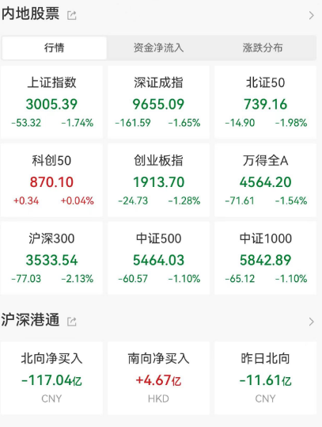

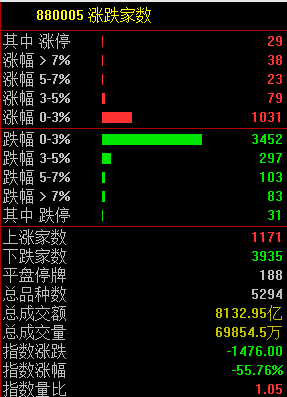

今天的原因， **第一是外资卖出**
，北向资金成交金额1097.37亿元，占A股总成交额13.54%，交易活跃度上升7.26%。北向资金保持连续5日净卖出，净卖出额分别为64.39亿元、64.77亿元、30.58亿元、11.61亿元、117.04亿元，合计净卖出288.39亿元。

第二是 **茅台的下杀带动了空头情绪的宣泄。**

茅台今天为何大跌5%？消息面上，一份茅台小范围交流文件在流传，内容是四季度业绩增速放缓的“小作文”。

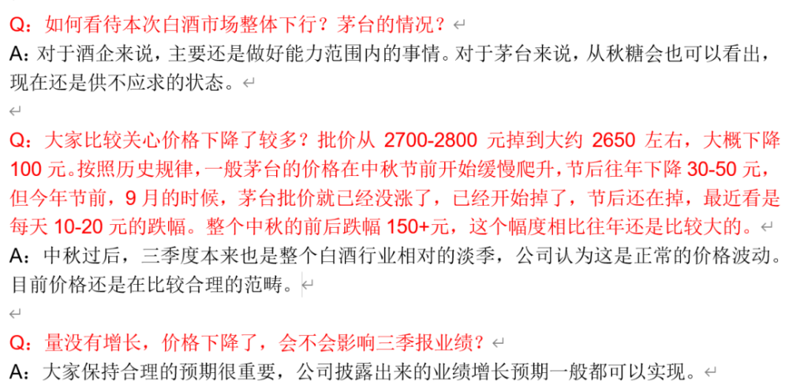

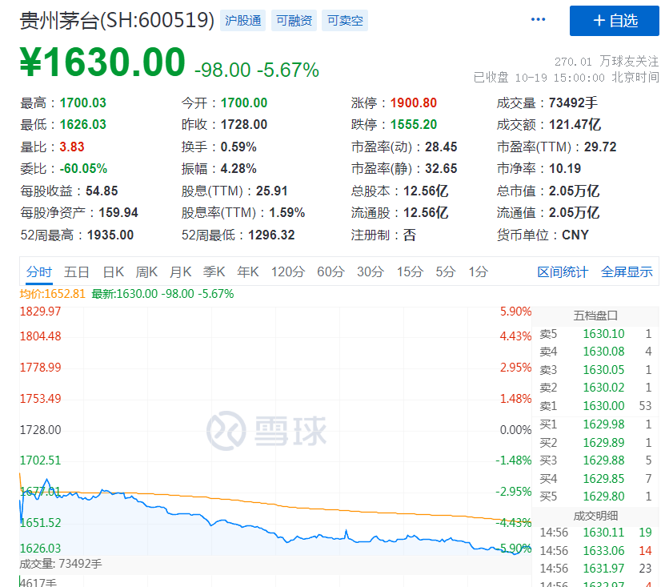

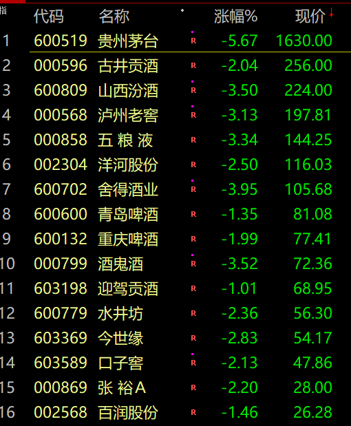

泰勒也找来券商的解读。

**【招商食品】贵州茅台：情绪错杀提供加仓机会**

受到市场预期下修及美债快速上涨，茅台今日盘中大跌。

我们认为担忧实属过度，情绪错杀带来加仓机会。

1） 普茅每月配额固定，当前发货进度与往年并无明显落后，非标维持较快增长，i茅台投放量环比Q2也未降速。

2） 价格端，飞天Q3以来保持上涨，节后受需求回落和到货节奏影响回落属于正常现象，环比年初也有涨幅。

3） 业绩端，根据历史经验，我们认为年报披露目标是达成底线，实际仍有望超额完成。中长期看，增长工具箱充分，预计维持稳定。

当前白酒估值水平已回到17H1，渠道利润下降导致负面情绪蔓延，实际旺季动销流速正常，高端畅销品同比仍有双位数增长。茅台作为行业龙头，业绩高确定性，且公司积极拥抱市场打造新增长驱动极，当前股价对应24年25xPE，情绪错杀提供加仓机会，重申强烈推荐。

**【国金食饮】重视白酒龙头布局机会！**

盘中市场情绪回落，主要系传闻茅台业绩增速放缓，前期汾酒、老窖等业绩亦有传闻。#我们认为茅台H2双位数&全年15%以上置信度强；预期&估值低位时布局优势凸显；渠道利润丰厚、业绩工具箱充足。

基本面看，10月配额基本到货后批价已经企稳回升（散瓶低点2660回升至2690），龙头横渡周期的实力不容小觑，行业弱复苏期龙头会通过完善SKU架构等逐步放大品牌优势，名酒库存均较为良性。目前茅五泸汾24年分别24X/16X/18X/20X，洋河/古井分别13X/24X，把握高端及赛道龙头的性价比配置契机！

此外，猪肉股午后持续走弱，牧原股份触及跌停，海大集团、唐人神、巨星农牧、新希望、金新农等跟跌。

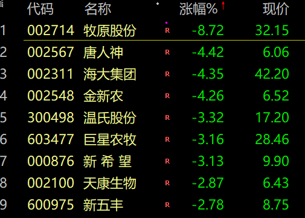

高位股集体调整，减肥概念都崩了！

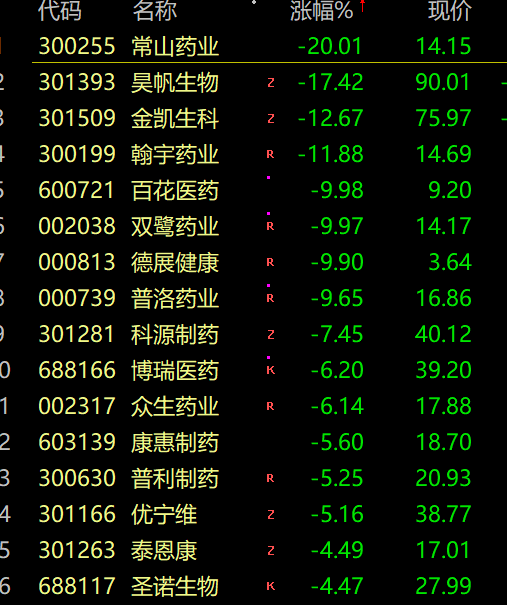

华为概念赛力斯也顶不住了。

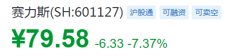

今天只有半导体板块上涨。主要是受美国拜登政府计划阻止英伟达等公司向中国出口先进AI芯片影响。炒得是国产替代概念。

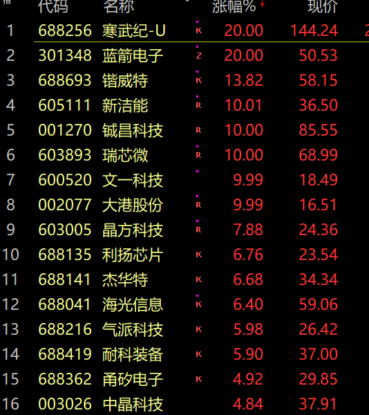

今天不光是A股，日本韩国股市都大跌了。

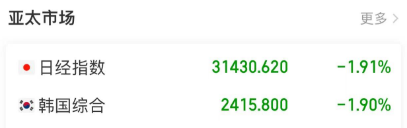

方正证券指出，或许由于大市值蓝筹股的补跌拖累，大盘还会走势反复，甚至3000点关口面临考验，但大盘是否能跌破3000点已不重要，即便跌破也仅是盘中的瞬时而已，这些都不是主要问题，从历史规律看，大盘最后一跌，就是蓝筹股下跌拖累的虚跌，虚跌指数的同时，结构性牛市行情就已兴起，与其临渊慕鱼，不如挖掘新投资机会，关注近日率先企稳逆势走强的行业与个股。

西部利得基金经理盛丰衍今日表示，对市场再次超乎寻常地乐观。他从择时模型来看，诸多模型触发A股触底信号。截止今日中午收盘，上证指数收于3021.55，创出年内新低，离3000点一步之遥。“看着这样的市场，我对小伙伴说：我想发微博了。”他表示，身边出现了很多诡异的事。唱多的被骂，看空的被夸。市场对利好几乎免疫。监管对于A股的呵护，对于舆论的极速响应，千亿级别真金白银的利好。今年无风险收益率谱系显著下降，但货币供应量依然高增等多方面原因来分析，积极因素在逐步积累，只欠东风。

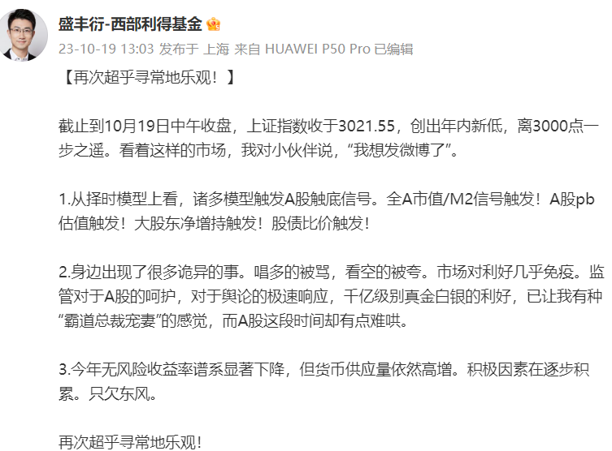

祝福大家，祝福A股。

