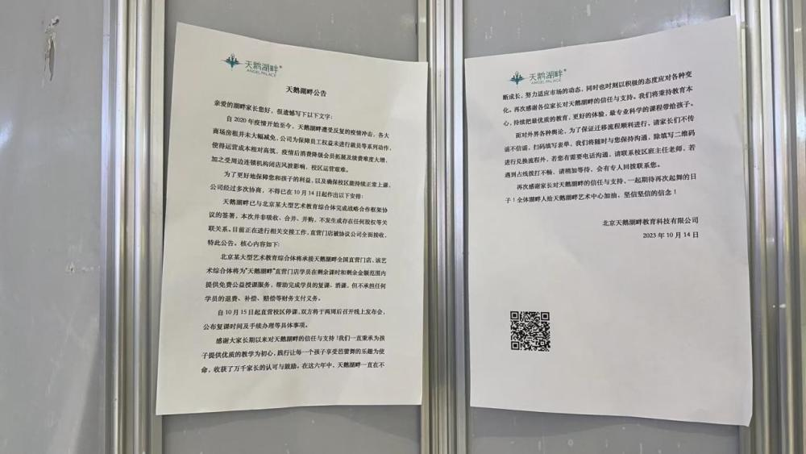

# “像韭菜被割了一轮又一轮！”有家长称3年碰上4家培训机构爆雷跑路

中国经济周刊-经济网讯（记者 张燕） 又一家培训机构突然宣布停止营业。

天鹅湖畔少儿芭蕾（以下简称“天鹅湖畔”）10月14日晚间发布微信公告称，自开办以来，天鹅湖畔遭受反复的疫情冲击、运营成本相对高筑，疫情后消费降级会员拓展及续费难度大增，加之受周边连锁机构闭店风波影响，校区运营艰难。10月15日起，直营校区全部停课。

公开资料显示，天鹅湖畔少儿芭蕾（全称“北京天鹅湖畔教育科技有限公司”），目前在全国共有26个校区，遍及北京、上海、广州、苏州、重庆、南京、成都、青岛、武汉九个省市。仅在北京就有12个校区，均为直营店。

10月19日凌晨，“天鹅湖畔”再次发布公告称，北京的两家校区将以0元承接直营校区的方式转为加盟校区，计划在21日复课。

在各校区家长维权群内传播的登记表上显示，目前已近2000多名家长在上面填写还未完成的课时及相关金额，累计金额已经超过3000万元。

 _位于北京市朝阳区合生汇三层的“天鹅湖畔”已经人去楼空。（受访者供图）_

有校区关门当天还在上课

在收到通知的第二天一大早，郭一诺就来到位于北京市朝阳区合生汇商场的天鹅湖畔门店，这里大门紧闭，门上贴了一纸公告，现场除了闻讯赶来的家长们，还有警察和商场员工在做登记。

郭一诺去年秋天为女儿在这里报了芭蕾舞课程。就在三个月前，她刚刚进行了续费，新购买的课包一共有60个课时，共花费13100元，到现在还没有开始上。

郭一诺给《中国经济周刊》记者出示的聊天信息显示，10月13日晚上，她孩子所在的班级老师还给她发信息提醒第二天上课的须知事项。14日下午两点多，她带着孩子前往合生汇，路上收到了老师的信息，说自己身体不舒服，当天的课暂停一节。

“我当时也没有多想，看到说不上课了也没有再去门店核实一下，就直接带孩子去公园了。直到晚上临睡的时候，突然看到了公众号的公告，吓了一跳。”郭一诺告诉记者。

与郭一诺不同，另一位家长谢菲早在9月份就听到了天鹅湖畔拖欠员工工资的传闻。为了核实，她还曾经向孩子所在班级的老师以及销售都咨询过。聊天记录显示，天鹅湖畔合生汇店的员工向她承诺，传闻只是竞争对手拿来“黑”该机构的手段。而就在“爆雷”的前一天，谢菲再次就北京其他门店停课的事情向其咨询时，该员工再次表示合生汇门店作为全国盈利靠前的直营门店，绝对不会出现停课的情况。

而当停课公告发出后，谢菲再次联系该名员工，该员工不仅更换了微信头像和名称，而且再也没有回复谢菲的消息。

一名在天鹅湖畔工作的舞蹈老师告诉《中国经济周刊》记者，他们也是闭店当天才得到消息。今年8月开始，公司以资金周转困难为理由开始拖欠她的工资和社保。不仅如此，其实早在半年前，门店就因运营经费紧张开始缩减各项开支。

“比如，孩子们上课绑头发用的发网，我们门店最近一个月都是缺货状态。汇报上去都是说正在采购，然后就没有下文了。”该老师称。

据该老师给记者提供的公司内部群截图，天鹅湖畔创始人刘铁军近日一直在群内发声。刘铁军表示，公司走到今天这个地步，其负有不可推卸的责任。近日其已经被北京市文旅局约谈，正在积极寻找解决方案，后续将就员工社保、公积金、薪资等问题负责到底。

截至发稿，记者多次联系刘铁军的电话，皆无人接听。

“家长就像‘韭菜’，被割了一轮又一轮”

在北京天鹅湖畔合生汇门店的维权家长中，郭一诺发现了不少熟面孔。熟悉的原因不仅仅是因为他们的孩子都在天鹅湖畔学习芭蕾，而是因为就在去年年初，因为北京合生汇内另一家英语培训机构的跑路，他们也一起为维权“斗争”过。

郭一诺告诉《中国经济周刊》记者，天鹅湖畔已经是她三年来遇上的第四家“爆雷”的培训机构了，其中有两家都在合生汇营业。“我们家离这里比较近，平时周末也会带孩子来逛街吃饭，所以总会注意到这里的一些兴趣培训。其他的家长估计和我们一样，大家都在这一带住着，都是他们的目标用户，结果就被当成‘韭菜’被割了一轮又一轮。”郭一诺说。

去年春节假期刚结束，刚刚准备带孩子来合生汇上课的郭一诺就收到了幼儿英语培训机构PlayABC倒闭的消息。当时他们所购买的课时还剩不到三分之一，眼看维权无望，最后他们选择了“转课”的方式，将剩下的课时转到了一家绘画的机构。如今再一次遭遇机构“爆雷”的情况，郭一诺表示如果可能的话，她还是希望能够原址复课或者退费。

“天鹅湖畔”最新的公告称，计划于10月21日复课的校区转为加盟校区后，将为所有学员在剩余课时和剩余金额范围内提供免费公益授课服务，此外，加盟校区不承担任何学员的退费、补偿等财务支付义务。

“宣布复课的两家校区，据说是有家长出手，以0元加盟费的方式承接了门店接下来的运营。也就是说接下来的开支都由这些家长负责。换言之，如果我们的校区没有这样一位家长，是不可能以这样的方式实现复课的。”郭一诺对记者表示，她是绝对不会带孩子去这两家校区消课的。

“之前每节课只有6-8个学生，现在12个校区的学生都涌过去，怎么保障一样的教学质量？”郭一诺告诉记者，“天鹅湖畔”停业后，陆陆续续有三四家芭蕾教学机构联系她提供公益授课。“他们所谓的‘公益’，都是为了获取生源，消课后希望我们能继续交费上课。就和上次英语转课去的机构一样。但即使这样，按照课时的单价来算仍然是吃亏的。比如他们正常一个课时200元，但是转课一个课时会按照300-400元来核算。而且那两家校区离我都很远，太折腾了。”郭一诺说。

尽管希望能够退费，但郭一诺也自知希望渺茫。此前“跑路”的英语机构也被很多家长起诉，最终虽然胜诉了，但因为法人名下无可供执行的财产，最终不了了之。

“10月18日中午我接到了朝阳区文旅局的回电，对方表示已经注意到了相关情况，已经约谈了天鹅湖畔法人，将会在15个工作日左右给我们一个回复。”郭一诺告诉记者，她在合生汇三层的三家门店都有预存费用，其中两家分别坐落在“天鹅湖畔”一左一右。这个周末她要做的第一件事，就是去申请退费。

此前多次推出活动售卖万元以上“大课包”

为加强对校外培训机构的监管、防范“卷款跑路”等资金风险，去年12月底，北京市文化和旅游局等4部门印发了《北京市营利性文化艺术类校外培训机构培训课程预付费管理办法（试行）》（以下简称《管理办法》）。《管理办法》规定，文化艺术类培训机构可采用一次（一课）一结和预付费两种收费方式。通过预付费收取费用的，应在区文化和旅游局的指导下，在本辖区内选择一家符合条件的商业银行作为存管银行，开立唯一的资金存管专用账户，将预收资金全额纳入监管范围。文化艺术类校外培训机构不得一次性收取或变相收取超过60课时或时间跨度超过90日的培训费用，且不得超过5000元。该办法自今年4月10日起执行。

记者获得的一份标记为“天鹅湖畔”内部工作群的聊天记录显示，“天鹅湖畔”已按照相关规定开设了资金存管监管专用账户，但目前其中并没有资金。

多位家长告诉《中国经济周刊》记者，今年上半年，天鹅湖畔陆续推出了多个酬宾活动，大课包的价格一降再降。单个课时的价格从之前“大课包”近300元降到了200元一个。此外，天鹅湖畔的销售还表示，以后按规定全部销售小课包，单课的价格会涨近一倍。正因为这样，好几位已购课时还没用完的家长，又付费购买了3万多元的“大课包”。

值得一提的是，10月15日起，《校外培训行政处罚暂行办法》（下称《办法》）正式施行。《办法》明确规定，校外培训机构不得收取超过3个月或60个课时的费用，学科类培训收取费用不得超过政府指导价限额标准，非学科类培训一次性收费不得超过5000元。校外培训机构预收费管理违反法律法规和国务院相关部门有关规定的，责令限期改正，并予以警告；有违法所得的，退还所收费用后没收违法所得；情节严重的，责令停止招收学员、吊销许可证件。

“新规15日开始执行，他们14日晚上宣布关门，很难说是不是早有预谋。”有家长对记者说。

（文中郭一诺、谢菲为化名）

责编：郭霁瑶

（版权属《中国经济周刊》杂志社所有，任何媒体、 网站或个人未经授权不得转载、摘编、链接、转贴或以其他方式使用。）

