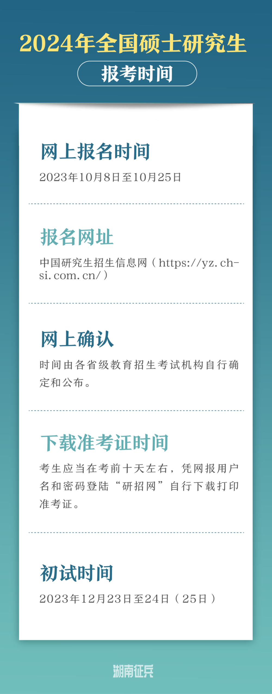
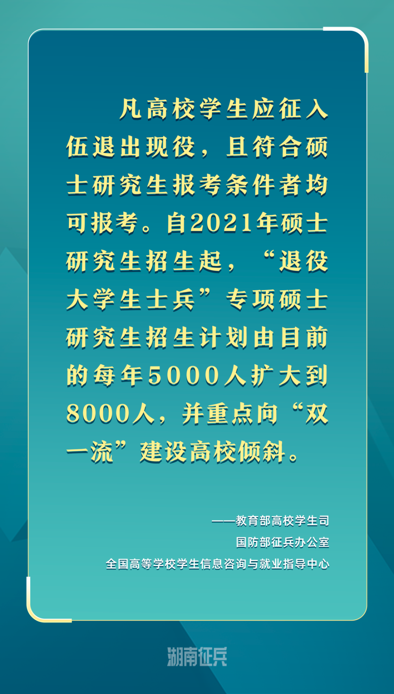
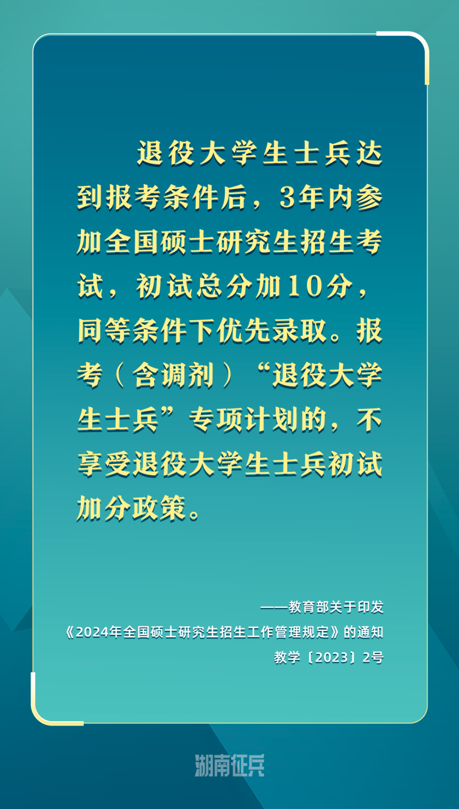
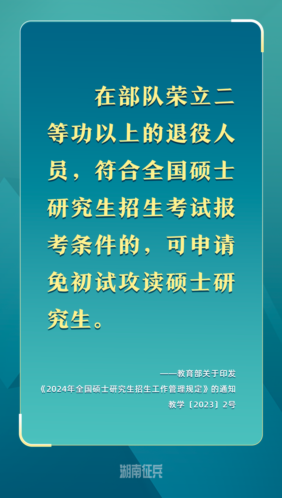
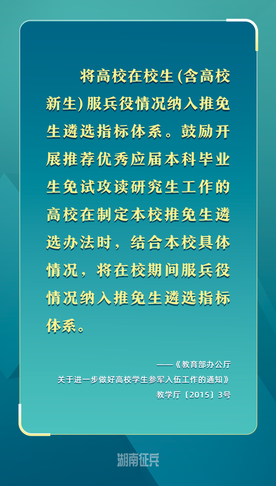

# 免试、加分、单独划线！退役士兵考研优待政策请查收

湖南征兵官微消息，2024年全国硕士研究生招生考试报名已开始。

退役士兵报考硕士研究生优待政策如下：

**报考时限：**

无限制。

**学校与专业：**

当年承担计划的学校与专业，重点向“双一流”建设高校倾斜。

**分数线划定：**

低于统考分数线，单独划定分数线。

**竞争人群：**

只与“退役大学生士兵”专项计划考生竞争。

**注：** 纳入“退役大学生士兵”专项计划招录的考生不再享受退役大学生士兵初试加分政策。。

**报考时限：**

达到报考条件后3年内。

**学校与专业：**

无限制。

**分数线划定：**

全国统考分数线。

**竞争人群：**

与所有普通考生竞争。

**注：** 纳入“退役大学生士兵”专项计划招录的考生不再享受退役大学生士兵初试加分政策。

**报考时限：**

无限制。

**学校与专业：**

无限制。

**注：**
符合免试攻读硕士研究生资格条件（如在部队荣立二等功等）的人员，应在国家规定的全国统考报名时间内登陆“全国推荐免试攻读研究生信息公开暨管理服务系统”报名。

**注：** 这里需要说明的是，最终是否能免推需要综合考量学生的成绩、表现等各项综合指标，服兵役情况是其中的一个考量要素。

