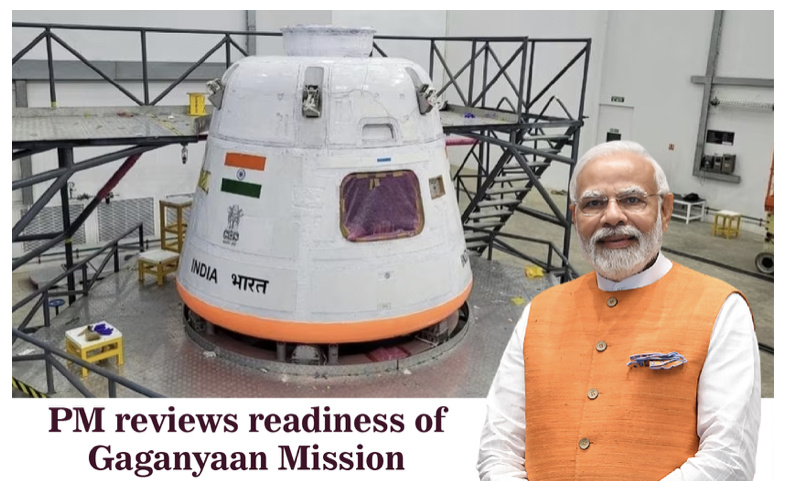

# 印度总理莫迪：2035年建立空间站，2040年将第一个印度人送上月球

导读：在印度太空计划取得成功的基础上，包括最近的月船3号登月任务和太阳神-L1号太阳探测器任务，总理指示印度现在应该瞄准雄心勃勃的新目标，包括到2035年建立印度空间站，到2040年将第一个印度人送上月球。

_印度总理莫迪主持了一次高级别会议，评审印度首次载人航天任务的进展，为印度航天列下目标。图片来自印度总理办公室网站。_

2040年载人登月，2035年建空间站，印度总理莫迪对印度航天志存高远。

10月17日，莫迪主持了一次高级别会议，评审印度首次载人航天任务的进展，为印度航天列下目标。他指示印度空间研究组织到2040年实现载人登月任务，到2035年建立印度空间站。

印度总理办公室的一份官方声明说，“在印度太空计划取得成功的基础上，包括最近的月船3号登月任务和太阳神-L1号太阳探测器任务，总理指示印度现在应该瞄准雄心勃勃的新目标，包括到2035年建立印度空间站（取名为Bharatiya
Antariksha Station），到2040年将第一个印度人送上月球。”

负责监督印度空间研究组织运作的航天部门被指示为印度未来的月球任务制定路线图、开发下一代运载火箭（NGLV）执行返回任务、建造一个新的发射台、建立以人类为中心的实验室和相关技术。在评审会议上，莫迪还呼吁印度科学家为星际任务努力，包括金星轨道飞行器任务和火星着陆器任务。

印度总理办公室的声明说，莫迪表达了对印度能力的信心，并肯定了印度在太空探索方面攀登新高度的承诺。

印度首个载人航天任务Gaganyaan旨在送3名宇航员进入400公里轨道执行3天任务并安全返回，被选中执行任务的宇航员正接受训练，这些宇航员被称为“Gaganauts”。会议评估了该任务的准备情况，确认将于2025年发射。

声明提到，印度航天部门对Gaganyaan任务进行了综合概述，包括迄今为止开发的各种技术，计划进行大约20次主要测试，包括3次载人运载火箭（HLVM3）的无人飞行任务。

Gaganyaan任务的乘员逃逸系统测试飞行器首次演示飞行定于10月21日。据《印度斯坦时报》（Hindustan
Times）报道，这次飞行将模拟Gaganyaan任务上升轨道期间遇到1.2马赫的中止条件。乘员舱和乘员逃逸系统将在大约17公里的高度与测试飞行器分离。随后中止程序将自动执行，包括乘员逃逸系统的分离和一系列降落伞的部署，最终乘员舱安全降落在距离印度斯里哈里科塔（Sriharikota）海岸约10公里的海上。

