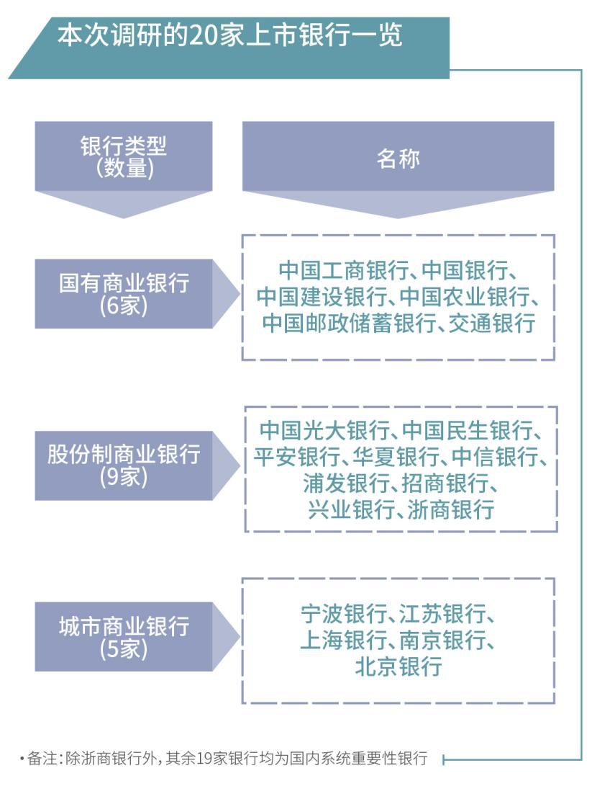
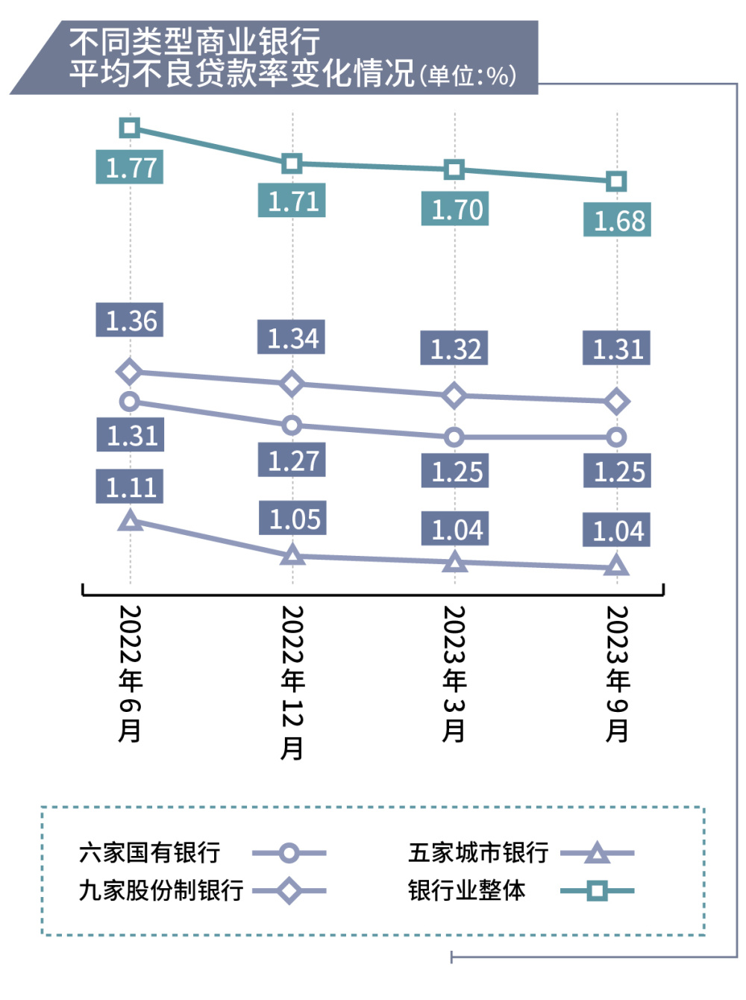
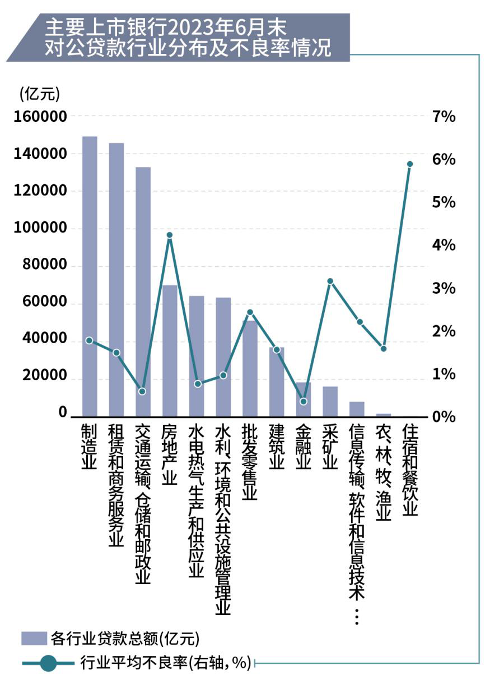
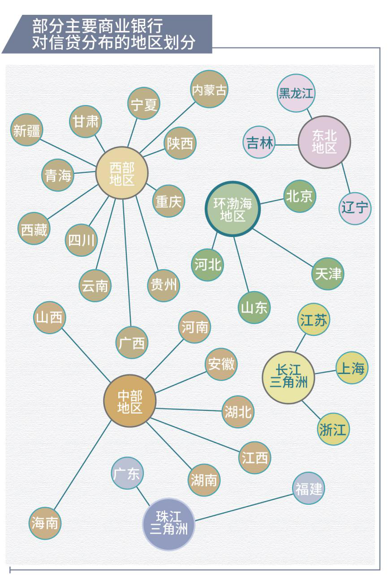
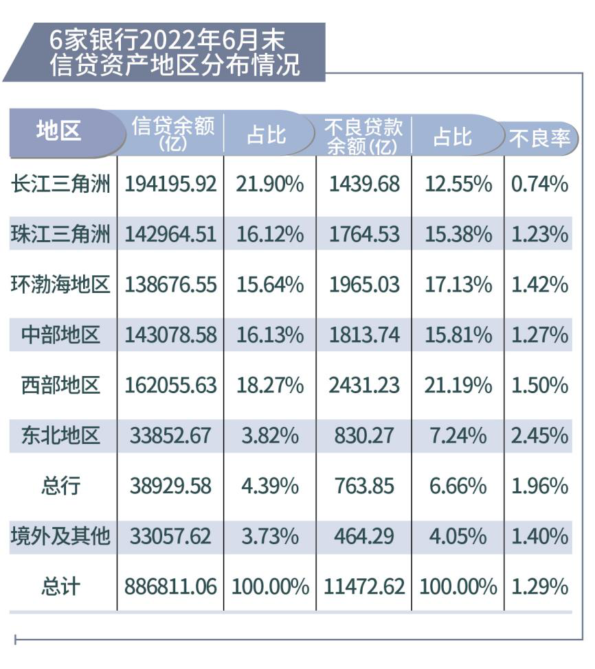
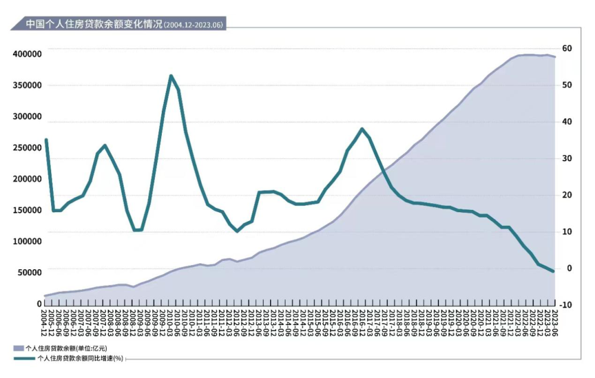
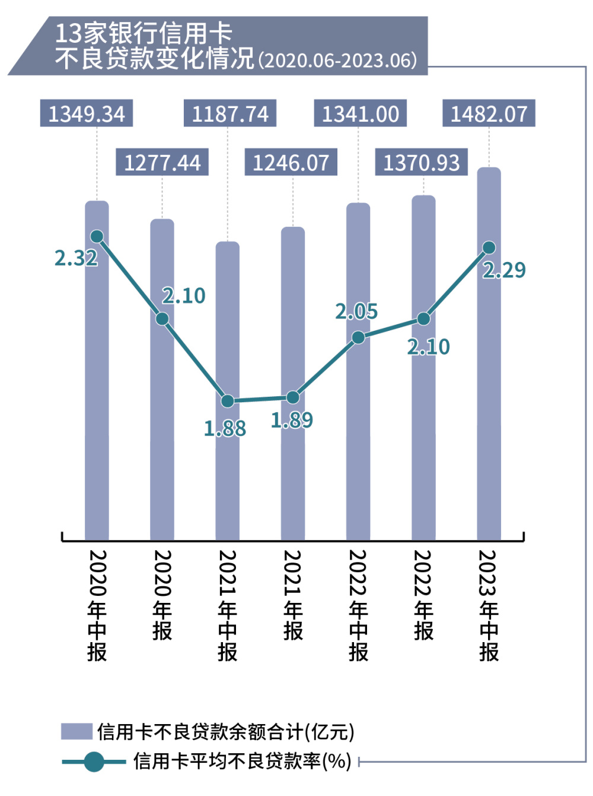
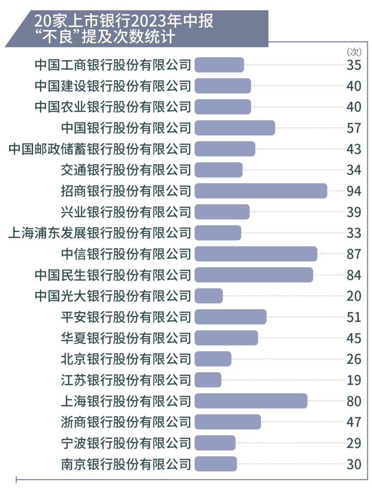

# 揭秘银行信贷分布图：哪里投放最多，哪里不良最高？

银行信贷资产质量变迁映射实体经济的脉动。

中国人民银行宏观审慎管理局局长李斌10月13日出席2023年三季度金融统计数据新闻发布会时说，截至6月末，系统重要性银行平均不良率为1.27%，保持了较高的资产质量。

李斌表示，系统重要性银行资产规模合计占我国银行业总资产61%，占金融业总资产的55%。系统重要性银行结构和业务复杂性比较高，与其他金融机构的关联性比较强。因此，系统重要性银行的数据更体现银行业甚至宏观经济的最新变化。

目前，在20家系统重要性银行中，19家已在沪深交易所上市，是银行业信息披露最为充分的群体。2023年以来，系统重要性银行哪些行业的信贷资产最优与最劣？哪些银行化解不良资产的措施最有效？哪些银行对自身不良资产信息披露最为充分？

南方周末新金融研究中心研究员为此对资产规模最大的20家上市银行（含19家系统重要性银行和浙商银行）中期报告进行了专项梳理和数据分析。研究发现，截至6月末，20家上市银行贷款余额合计近150万亿元，占全部金融机构贷款总规模的63.5%；不良贷款规模合计约1.92万亿，约占金融机构不良资产总规模的48%，平均不良贷款率约1.28%，低于1.62%的银行业不良率平均水平，显示大中型商业银行的信贷质量好于中小银行。

但房地产业、制造业和商务服务业的不良贷款规模位居前三，住宿餐饮业、房地产业和采矿业的平均不良贷款率最高。

信用卡的不良贷款余额3年来首次超过个人住房贷款，且不良贷款率高出个人住房贷款4.2倍。而不良贷款地区分布细则观察，西部地区不良贷款规模最大，东北地区平均不良率最高。

贷款规模大而不良率低：交通运输仓储和邮政业

哪些行业获得银行信贷支持力度最大？它们的不良贷款率与银行支持力度正相关还是负相关？

南方周末新金融研究中心研究员梳理20家上市银行中报发现，各家银行均披露了对公贷款在20个大类行业的分布情况。

制造业、租赁和商务服务业、交通运输仓储和邮政业是20家上市银行信贷投放最多的3个行业，三个行业6月末的贷款余额合计均超过了10万亿元。在监管层大力推动制造业高质量发展背景下，制造业成为各大商业银行高度重视的信贷投放领域。在20家上市银行中，19家银行的制造业投放规模位居行业分布前2名。但租赁和商务服务业出现在20家银行信贷投放行业第一位的次数最多，达10家。

行业信贷投放的大规模增加是否伴随此后不良贷款大幅上升？南方周末新金融研究中心研究员分析发现，部分行业信贷投放增加的确不良贷款增长正相关。房地产业尤为明显，因信贷规模位行业第4、行业平均不良率高居第2，成为商业银行信贷风险最为集中的行业。

但20家上市银行信贷投放的行业分布与不良贷款的行业分布并不完全重合。截至2023年6月末，信贷投放最多的制造业、租赁和商务服务业、交通运输仓储和邮政业，其平均不良率分别仅有1.8%、1.45%和0.64%。而房地产业、制造业、租赁和商务服务业的不良贷款规模最高，不良贷款余额分别达到2951亿、2660亿和2088亿，总规模接近7700亿，占企业贷款不良余额的57%，不良贷款总额的40%。其中，交通运输仓储和邮政业的信贷投放高达13.8万亿元，但其不良率仅有0.64%，是贷款规模较大而不良率较低的典型行业。

研究还发现，某个行业信贷投放规模的增幅不一定伴随不良贷款规模的同比增长。例如，与2022年末相比，截至2023年6月末，制造业贷款余额增幅高达18.83%，贷款增速在全部行业中居于前列，但其不良贷款余额较2022年末持平甚至略有下降。

银行最愿意在长三角放贷

在对不同行业信贷支持力度分化的同时，银行在哪些区域的逆周期投放力度差异化最大？

南方周末新金融研究中心研究员研究发现，20家上市银行中绝大部分对信贷投放的地区分布和不良贷款的地区分布情况进行了披露，但各家银行的地区划分方式上不尽相同。其中，工商银行、农业银行、建设银行、邮储银行、招商银行、民生银行6家银行的地区分布规则完全一致。

南方周末新金融研究中心研究员对上述6家银行中报分析发现，6家银行在长三角地区的信贷规模最大，占比最高，增速最快，而平均不良贷款率却是最低。结合2023年4月南方周末新金融研究中心对苏州金融生态的专题调研（详见南方周末APP“苏州金融生态深调研专题”）的结论，南方周末新金融研究中心研究员认为，作为中国经济引擎地区，长三角地区（主要指上海、江苏、浙江）金融生态在国内各保持领先水平，银行对实体经济普遍想贷、愿贷，而超低的不良率又进一步强化了各家银行在长三角市场敢贷、真贷、加大信贷投放的信心。因此，长三角地区毫无争议是商业银行最敢放贷的地区，也是银行业必争之地。

获评系统重要性银行的5家城商行中，4家来自长三角地区。这些城商行的资产规模、经营效益和资产质量均位居同业前列。这证明长三角地区拥有全国最优良的金融生态环境。

与此对应，20家上市银行在东北地区（黑龙江、吉林、辽宁）的信贷增速最慢，信贷占比持续缩小，而不良贷款率在全国各地区中处于高位。数据显示，国有大型银行在贯彻落实决策层振兴东北等战略意图方面较股份制银行和城商行更加坚定，国有大行对东北地区的金融支持亦是东北地区金融业得以稳定运行的中流砥柱。

个人房贷不良猛增势头缓解

企业贷款虽是商业银行信贷支柱，但个人贷款业务愈加重要，尤其是个人住房贷款。

个人房贷规模在商业银行所有个人贷款中占比保持第一，且不良率在各类贷款业务中长期处于最低水平，因此成为商业银行最看重的优质资产。

个人房贷资产质量有何变化？为便于同口径比较，南方周末新金融研究中心研究员选取10家银行个人房贷业务进行统计分析。这10家银行包括工商银行、农业银行、中国银行、建设银行、邮储银行、交通银行6大国有商业银行和招商银行、兴业银行、浦发银行、民生银行4家全国性股份制商业银行。截至2022年末，10家银行个人房贷业务规模合计占银行业个人房贷总规模的80%。因此，10家银行个人房贷业务具有较强的行业代表性。

研究显示，自2022年开始，个人住房贷款不良贷款余额增速明显提升。2022年6月末，10家上市银行个人住房贷款不良余额合计1048.71亿元，较2021年末猛增168亿元，环比增速高达19.1%；2022年下半年，10家上市银行个人住房贷款不良余额再增304亿元，至2022年末，不良贷款余额合计已增至1352.55亿元，同比增速高达53.6%；2023年上半年，不良贷款余额1386.29亿元，同比增速达32.2%，但环比增速回落至2.5%。

央行第二季度货币政策执行报告显示，6月末，全国主要金融机构（含外资）个人住房贷款余额38.6万亿元，同比下降0.7%，首度出现同比负增长。

受不良贷款余额猛增叠加贷款规模增速停滞转负因素影响，个人住房贷款不良率自2022年以来大幅提升。2023年6月末，10家上市银行个人住房贷款平均不良率0.48%，较2021年末提高了0.15个百分点，增幅达45%。

南方周末新金融研究中心研究员认为，尽管个人住房贷款不良贷款规模和不良率双双较快增长，但与其它信贷品种相比，个人房贷依然是商业银行的优质资产，仍将是各家银行个人贷款业务中的重点。与此同时，央行等多部委接连出台房贷新政，对房地产行业持续松绑，未来个人房贷业务的资产质量有望企稳。

信用卡业务面临考验

除个人房贷业务外，信用卡业务也是各商业银行的战略重点。它的表现如何？

南方周末新金融研究中心研究员对比分析13家披露信用卡贷款质量的商业银行中报发现，信用卡业务自2022年以来出现多个趋势性变化。一是两项重要指标创有纪录以来首度负增长。其中，2022年末，信用卡累计发卡量约7.98亿张，出现有纪录以来首次负增长；信用卡未偿信贷余额8.69万亿元，同比仅增长0.9%，较2019-2021年间年均8%的增速大幅下滑。截至2023年6月末，13家上市银行（信用卡业务规模约占银行业总规模的85%）信用卡未尝信贷余额7.44万亿元，较2022年末竟然下降约230亿元，也为有纪录以来首度下滑。

二是信用卡业务资产质量面临考验。截至2023年6月末，13家商业银行信用卡应收账款不良余额合计达1482亿元，以40亿元额度略超个人住房贷款，继2020年中报后再度成为不良贷款规模最大的个人贷款业务。与之对应，13家银行信用卡应收账款平均不良贷款率2.29%，也是继2020年中报后再创近3年新高。

2020-2023年，商业银行信用卡业务资产质量压力明显加大。其中，2020年6月与2023年6月，信用卡不良贷款余额和不良贷款率分别出现两次峰值，其中2020年6月的峰值略高于2023年6月。

南方周末新金融研究中心研究员对两次峰值进一步研究发现，2020年6月信用卡不良峰值主要是因疫情对居民家庭和个人资产负债表突如其来的打击，叠加疫情期间人员流动受限导致的还款不及时因素；在疫情趋于平缓期，商业银行信用卡不良贷款余额和不良率均趋于回落，但回落低点与疫情前相比仍然明显抬高。2023年以来，商业银行响应监管要求，不再盲目跑马圈地，转而精耕细作，审慎授信，信用卡发卡量、授信规模、未尝信贷规模等指标增长明显放缓甚至出现负增长。这也导致信用卡业务不良率高企。但随着银行持续审慎策略的执行，信用卡不良率有望回落。

哪些银行对不良披露“优化”？

不良贷款余额和不良率两个指标是衡量信贷资产质量的最重要指标，最为敏感。哪些商业银行勇于对自身信贷资产质量进行完整和全面的信息披露呢？

南方周末新金融研究中心研究员对此项的对比研究主要基于20家上市银行对企业贷款按行业、地区分布进行信息披露的同时，是否对不良贷款的行业、地区分别予以披露；对个人贷款的组成成分，包括个人住房贷款、消费贷款、经营贷款、信用卡的贷款余额、占比、增速披露的同时，是否对相应的不良贷款余额和不良率进行披露。

研究发现，在不良贷款情况的信息披露质量方面，20家上市银行的信披水平参差不齐。大型国有银行基本同步对上述信息进行了披露，仅中国银行在其中报里将“不良”表述为“减值”，容易造成一定误解。

在全国性股份制银行中，招商银行不良贷款情况披露最为完整，其他股份制银行则或多或少在披露时按照自身的需求对不良贷款相关数据进行了“优化”。典型的“优化”方式包括设置个性化的“口径”。例如，在披露不良贷款的行业分布时，部分银行不直接披露各行业的不良贷款余额和不良率数据，但通过该行披露的其他相关数据，可以测算出该行不同行业的不良贷款分布情况；再如，在披露个人住房贷款不良情况时，个别银行将该业务与其他持证抵押的个人贷款业务合并披露；另外，在披露不良贷款地区分布时，9家股份制银行中有6家按照长江三角洲、珠江三角洲、环渤海地区、中部地区、西部地区和东北地区共6个地区进行划分并披露，但平安银行和浙商银行则将全国划分为4个区域；兴业银行在地理区域基础上，对总部所在城市、省份或其它重要城市进行单独列示和披露；个别银行还会对某个地区下的省份进行微调，导致该行信贷的地区分布情况难以进行横向和纵向的比较。

部分银行对零售贷款资产质量披露弱于对公贷款。在20家上市银行中，13家银行中报直接披露或间接披露个人贷款分布情况，但扩展至2020年及之前年报和中报，仅有10家左右银行对个人贷款资产质量进行了披露。北京银行作为头部城商行，在其历次年报和中报中，既没有对不良贷款行业分布的披露，也没有对不良贷款地区分布的披露，是20家上市银行中对资产质量情况披露最少的。

财报中对于“不良”的提及频率也可以作为银行在贷款质量方面的信披充分度的表征。南方周末新金融研究中心研究员统计发现，2023年中报中提及“不良”次数最多的是招商银行，共94次，而提及次数最少的是江苏银行，仅19次。

真实、准确、完整、及时和公平是对上市公司信息披露工作的原则要求，规范、易解和易得是对上市公司信息披露形式的基本要求。南方周末新金融研究中心研究员据此认为，已上市的系统重要性银行是中国银行业的标杆，也应是银行业信息披露的标杆，理应在上市公司信息披露各项要求基础上，对年报和中报等重要信息披露工作严格把关。尤其事关银行资产质量的指标及其变化情况，更受投资者和社会公众关注，上市银行更应切实做到真实、准确、完整、及时和公平的信息披露，更应确保所披露的信息规范、易解、易得，不断提升上市银行公司治理的合规性与透明度。

（本稿所有制图：冯庆超）

南方周末新金融研究中心研究员 李鹤鸣 助理研究员 白雨彤

责编 谢艳霞

