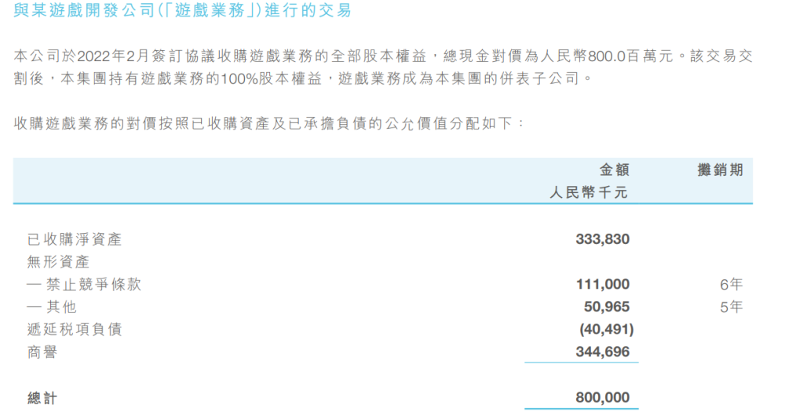

# 斥资8亿的B站广州游戏工作室被曝解散，自研游戏还有戏吗？

界面新闻记者 | 张熹珑

据“游戏新知”10月18日报道，哔哩哔哩（简称“B站”）广州研发工作室宣布解散，CEO丁黔伟将离开公司，除了一款日漫IP改编项目“代号QQ13”因有外部合作合同而被保留了下来，其他项目均被砍掉。

B站广州游戏研发工作室由收购心源互动而来。天眼查显示，广州心源互动科技有限公司成立于2019年，现已更名为广州星奥科技有限公司，为动作类游戏研发商，代表作品包括《雏蜂：深渊天使》、《镇魂街：天生为王》等。

10月19日，界面新闻致电星奥科技。对方表示不清楚该事，也不接受任何采访。在相关招聘平台上，搜索“心源互动”未显示任何结果。B站方面亦向界面新闻表示，暂无可回应消息。

公司2020年度报告显示，参加社保的员工达到408人。到了2022年，这一人数为92人。目前，星奥科技股东为陈华升和占萍，分别持股86.25%和13.75%。丁黔伟已在2022年1月退出股东。

此时距离B站将心源互动收入囊中仅仅不到两年。根据天眼查，2022年3月，B站对心源互动完成了并购。B站2022年财报则显示，公司于2022年2月与某游戏开发公司进行交易，签订协议收购游戏业务的全部股本权益，总现金对价为8亿元，交割后拥有其100%游戏业务。

B站看中的是心源互动的自研能力，在财报中表示“收购产生的商誉归因于本集团扩大其游戏开发方面的自主研发能力的策略”。此次交易产生了3.45亿元的商誉。

当时，心源互动旗下已经有《霓虹序列》、《千星争霸》等在研项目。随着B站的收购，这几款游戏也成为了B站的资产。《霓虹序列》是游戏界较为看好的一个游戏，已经处于待上线状态，但在今年上半年也被突然“腰斩”。

_图片来源：B站财报_

现阶段，B站仍主要依赖于代理手游《碧蓝航线》和《Fate/Grand Order》的存量表现，其中《碧蓝航线》在6周年的非用户数量和收入创下新高。

但代理游戏的增长明显乏力。2020至2022年，移动游戏收入占公司总收入的比重逐年下滑，分别为40%、26%和23%，今年上半年继续跌至19%。单款移动游戏贡献净营业额超过10%的历史，也停留在2020年。

这种情况下，B站表示要走精品自研路线。

在此之前，B站自研游戏的进展并不算顺利。2017年8月B站推出了第一款自研游戏《神代梦华谭》，是魔幻萌系卡牌对战游戏，并没有激起什么浪花。

B站游戏仍处于承压状态，重磅新游《闪耀！优俊少女》推迟上线，叠加代理游戏流水贡献持续下降，上半年移动游戏服务收入为20.23亿元，同比减少16%。截至6月底，游戏收入连续三个季度同比下滑。

公司也将2023年全年净收入的预期调整为225亿元-235亿元，较此前240亿元-260亿元有所下调，主要由于若干游戏推出延迟、以及非核心业务（如IP衍生品及其他）的收入贡献低于预期。

另一方面，自从B站CEO陈睿在去年11月接手游戏业务后，游戏部门的组织架构迎来较大的调整。陈睿认为“过去两年游戏业务发展不如预期，游戏自研走了一些弯路。游戏自研铺得太开，贪多但无果。”

这也能解释为什么2022年下半年B站“终止若干游戏项目的开支”大增。财报显示，2022年，B站终止游戏项目的开支达到5.26亿元，其中下半年达4.17亿元。同年公司经调整净亏损为67.02亿元。

B站正在收拾之前“蒙头狂奔”的烂摊子。2021年，B站在游戏业务方面投资了约20家公司，远多于2020年的7家。在千万级别就投资了3家游戏公司，包括曾打造国风榫卯游戏《匠木》的东极六感，拥有《人偶馆绮幻夜》《埃尔韦拉女神程序》等多个软件著作权的猫树网络以及产品包括《代号：绝世好武功》的幻魔寺游戏。

