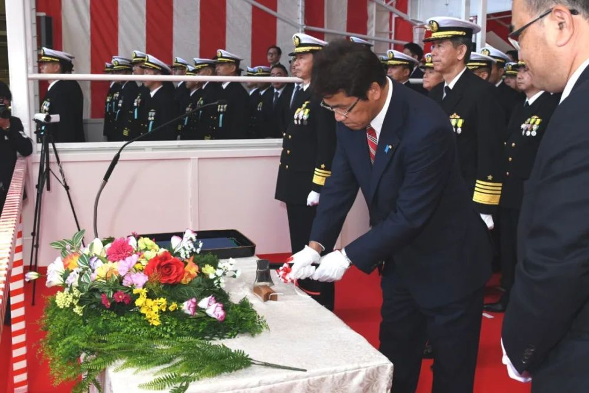

# 日本最新“雷鲸”号潜艇下水，离核潜艇或只差一步

**日本海上自卫队此举旨在战法理念、训练水平以及武器装备等方面强化对抗，可能以“小步快跑”的形式追求自己的“亚核潜艇”，乃至建造或获得核潜艇。**

据新华网19日报道，日本最新“雷鲸”号潜艇日前在川崎重工神户造船厂举行下水仪式。该艇不仅排水量已超过法国红宝石级核潜艇，而且在动力方面的技术也居于世界前列。

在 **上海政法学院东北亚研究中心副主任杨震**
看来，日本近年来在地区海权对抗中日益处于下风，日本海上自卫队此举旨在战法理念、训练水平以及武器装备等方面强化对抗，可能以“小步快跑”的形式追求自己的“亚核潜艇”，乃至建造或获得核潜艇。

**“雷鲸”潜艇不同以往**

“雷鲸”号潜艇是日本海上自卫队最新型大鲸级潜艇的4号艇，舷号SS-516。不同于海上自卫队偏好沿用二战之前海军舰艇名字的做法，“雷鲸”这个名字是首次使用。日方称，“雷鲸”是由象征力量的“雷电”和强大的“鲸鱼”组合而成。

作为日本新一代的主力潜艇，“雷鲸”号潜艇的技术特征备受周边国家关注。“雷鲸”号排水量超过3000吨，全长84米，宽9.1米，仅吃水深度就超过10米。从现场照片来看，“雷鲸”号潜艇的庞大身躯令旁边观礼的日方人员的身形显得异常渺小。

 _“雷鲸”号潜艇体型巨大，建造费高达约702亿日元。 图源：GJ_

潜艇的排水量在很大程度上决定了潜艇所能容纳的武器、燃料与设备的多少，进而影响着潜艇的作战能力。“雷鲸”号及其姊妹艇已是当前世界上最大的主力常规潜艇，其排水量甚至超过了法国仍在服役的红宝石级核潜艇。同时，该艇配备艇员仅约70人，自动化程度由此可见一斑。

杨震表示，相比于常规潜艇，核潜艇在打击威力、续航能力、机动性以及探测能力等方面处于全面优势地位。从日本常规潜艇的发展趋势看，其追赶核潜艇技术能力的意图是非常明显的。

事实上，“雷鲸”号潜艇最令人瞩目的特征也不是其体型，而是机动性和探测能力的提升。大鲸级潜艇采用了大容量的锂离子电池与先进柴油发动机相结合的动力系统，已经较目前主流的不依赖空气推进系统更为先进。“雷鲸”号则在此基础上又迈进一步，不仅更换了2台功率更大的川崎柴油机，还匹配了适应增强发电功率的新型通气管系统。

 _即便是目前仍属先进的不依赖空气推进技术，日本也已经看不上眼。图源：GJ_

川崎重工方面表示，潜艇专用柴油机具备水面船舶用柴油机所不具备的特殊功能，能够在进排气压力条件较为苛刻的情况下实现正常运转。这一改进如果属实，将显著改善常规潜艇在机动性上与核潜艇的差距，极具实战意义。

此外，在事关潜艇生命力的降噪方面，“雷鲸”号采用了先进核潜艇青睐的泵喷式推进器，而非传统的螺旋桨。这在降低噪音的同时，提高了潜艇航速。综合上述特征，外界认为，日本海上自卫队“距核潜艇仅剩一座反应堆”。

**日本注重水下战力**

近年来，日本在自我松绑的过程中，对于水下作战力量的发展予以格外重视。

根据日本防卫大纲，日方已将现役潜艇总数从16艘增至22艘，并且用新型潜艇加速替换相对陈旧的潜艇。例如，除去刚刚下水的“雷鲸”号，还有4艘大鲸级潜艇正在或将要建造，以替换现役的8艘亲潮级潜艇。

需要注意的是，日方被退役的潜艇只是相对陈旧，其总体技术性能在世界范围内依然不俗。这些退役潜艇大多也只是被暂时封存，并未被拆毁。同时，日方也非常注重潜艇人才储备，培训的潜艇士官数量超过现役潜艇所需。

_日本几十年来一直保持每服役一艘新潜艇的同时退役一艘老潜艇的传统。图源：GJ_

在潜艇武器系统领域，日方借国际政治形势的改变，尽可能地进行升级。“雷鲸”号潜艇升级了作战管理系统、声呐装置和鱼雷反制系统，装备了日本国产的18式重型鱼雷和进口的美制“鱼叉”Block2潜射反舰导弹。因此，“雷鲸”号潜艇的战场感知能力和打击能力都升级到一个新的高度。

去年12月，日本内阁会议通过了新版《国家安全保障战略》《国家防卫战略》《防卫力量整备计划》，即所谓的新“安保三文件”，规定日本防卫费未来5年将接近翻倍，提升至占GDP总额约2%的水平。

根据日本新“安保三文件”，日方将大力发展所谓“区域拒止”能力，以及在敌方防区外进行攻击的能力，日方潜艇在其中均扮演重要角色。

杨震表示，在发展潜艇战力上，日本今后仍很可能参照将“出云”级改造为准航母的经验，继续采取“小步快跑”的方式，以改装的方式打造自己的“亚核潜艇”，乃至建成自己的核潜艇。

“尽管从综合战力看，‘雷鲸’号仍与核潜艇存在明显差距，战术运用也受到限制，但是日方发展反航母能力的意图昭然若揭。”杨震表示，“长此以往，日方潜艇部队必然对亚太地区的海洋安全构成更大威胁。”

**出品 深海区工作室**

**撰稿 杨一帆**

**视频 深海獭**

**编辑 深海獭**

