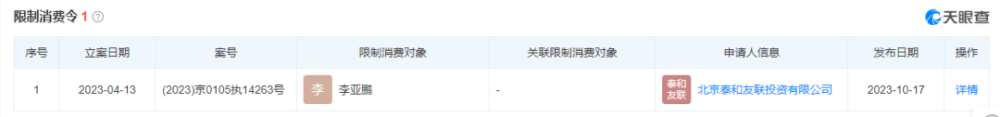
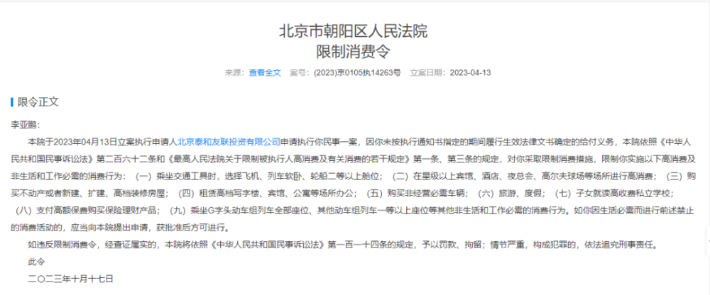
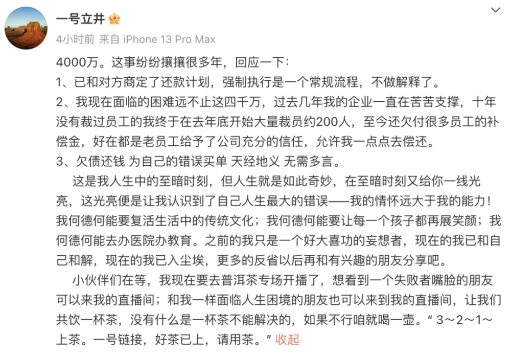
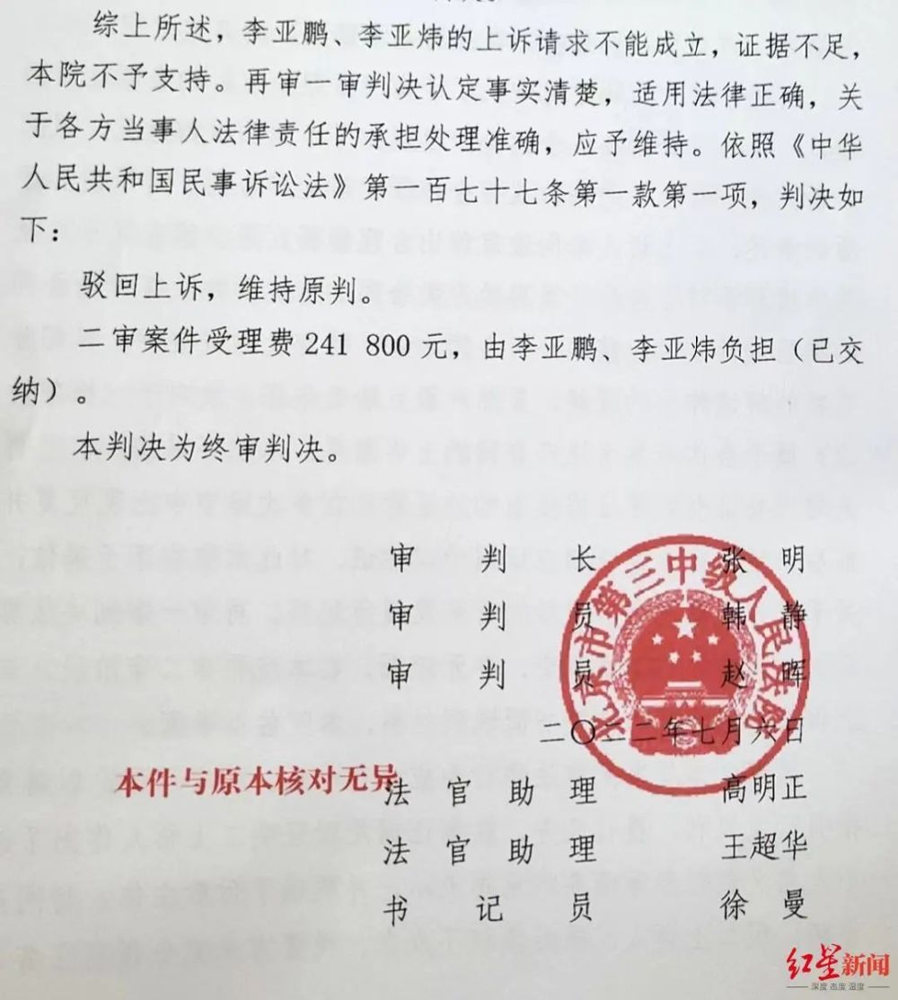
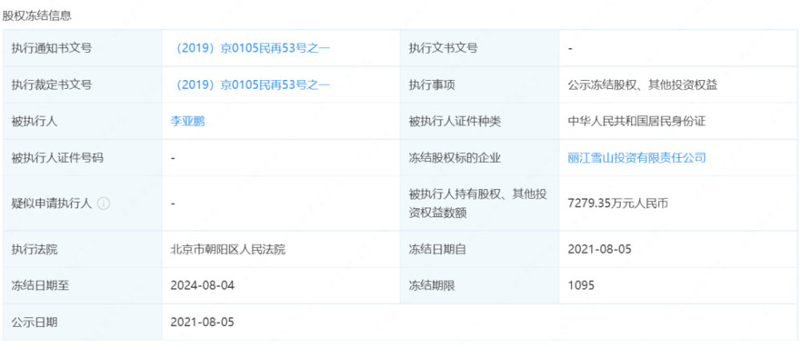

# 李亚鹏，被限制高消费

据天眼查App显示，近日， **因未按时履行生效法律文书确定的给付义务，李亚鹏及哥哥李亚炜被限制高消费，**
申请人为北京泰和友联投资有限公司，执行法院为北京市朝阳区人民法院。

案件流程显示， **今年4月，两人已被强制执行4000万。**

相关文书显示，北京泰和友联投资有限公司曾出资6000万元对李亚鹏兄弟二人公司（丽江雪山投资有限责任公司）进行注资，并约定获得雪山公司10%的股份，项目3年开发周期届满后由泰和友联公司先行收回约定的固定权益收益4000万元。因李亚鹏一方一直未支付相关款项，泰和友联公司在催款无果后，将李亚鹏、李亚炜和担保公司诉至北京市朝阳区人民法院。法院一审判决李亚鹏、李亚炜向泰和友联公司支付4000万元及利息。

 _李亚鹏，图据李亚鹏微博_

对被强制执行4000万一事，李亚鹏今年4月28日在微博发长文回应称，“欠债4000万元”一事，已纷纷攘攘多年，“已和对方商定了还款计划，强制执行是一个常规流程，不做解释了。”

李亚鹏还表示，自己面临的困难远不止这4000万元，他承认自己的“情怀远大于能力”，但他也表示，“欠债还钱，为自己的错误买单，天经地义，无需多言。”

在长文的最后，李亚鹏还不忘给自己的直播带货，卖起了茶叶。

回应全文：

公开资料显示，丽江雪山投资有限责任公司成立于2008年，位于云南省丽江市，是一家以从事房地产业为主的企业。企业注册资本26150万元人民币，实缴资本13426.5万元人民币。

丽江雪山投资有限责任公司法定代表人为李国栋，但最终受益人为李亚鹏。

据红星新闻此前报道，2022年7月6日，北京市第三中级人民法院对李亚鹏“欠债4000万元”一案做出终审判决，法院判决，驳回李亚鹏及其哥哥李亚炜的上诉，维持原判。

此前，李亚鹏等人在丽江开发房地产项目并与北京泰和友联投资有限公司产生纠纷，双方从2015年12月开始对簿公堂，该案件经过了6次庭审程序，其中包括一次再审程序和一次重审程序。

根据报道，该案除4000万元本金外另有上千万的利息。

此外，李亚鹏还有7279.35万元丽江雪山投资有限公司的股份被法院冻结。

来源：成都商报综合自天眼查、此前报道等

