# 深海考古重要发现！我国首次在南海千米级海底发现大型古代沉船遗址

10月19日上午，国家文物局发布水下考古三个重要项目的考古新发现。其中，深海考古获得多项重要发现，南海西北陆坡一号、二号沉船遗址是我国首次在南海千米级海底发现的大型古代沉船遗址。遗址位于海南本岛与西沙群岛北礁之间约1500米深的南海海底。

南海西北陆坡一号、二号沉船遗址发现于2022年10月，根据国家文物局的统筹部署和工作安排，2023年5月至6月、9月至10月，国家文物局考古研究中心、中国科学院深海科学与工程研究所、中国（海南）南海博物馆联合对二处沉船遗址进行了两个阶段的深海考古调查。

**南海西北陆坡一号、二号沉船遗址：**

**我国首次在南海千米级海底发现**

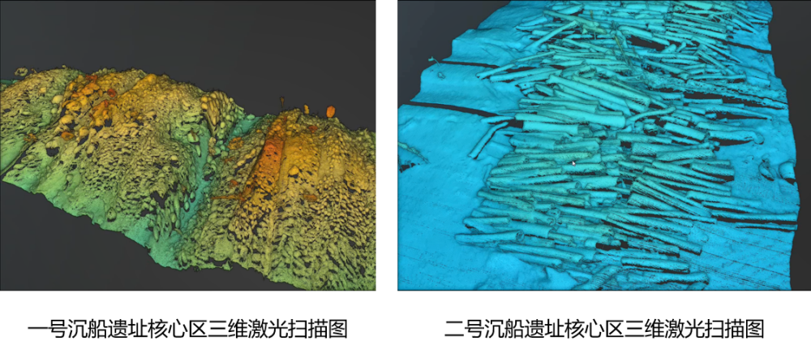

**一号沉船：大量码放整齐的陶瓷器、铁器等堆积**

一号沉船遗址由核心区、环形散落区和条形散落区组成，年代为明正德年间。核心区为船体和大量堆叠有序、码放整齐的陶瓷器、铁器等构成的堆积，长约37米，宽约11米，环形散落区、条形散落区由散落的船载物品构成，遗物较少。一号沉船上部结构不存，残存船体大部分被掩埋覆盖，仅在部分位置暴露有隔舱板和底板。

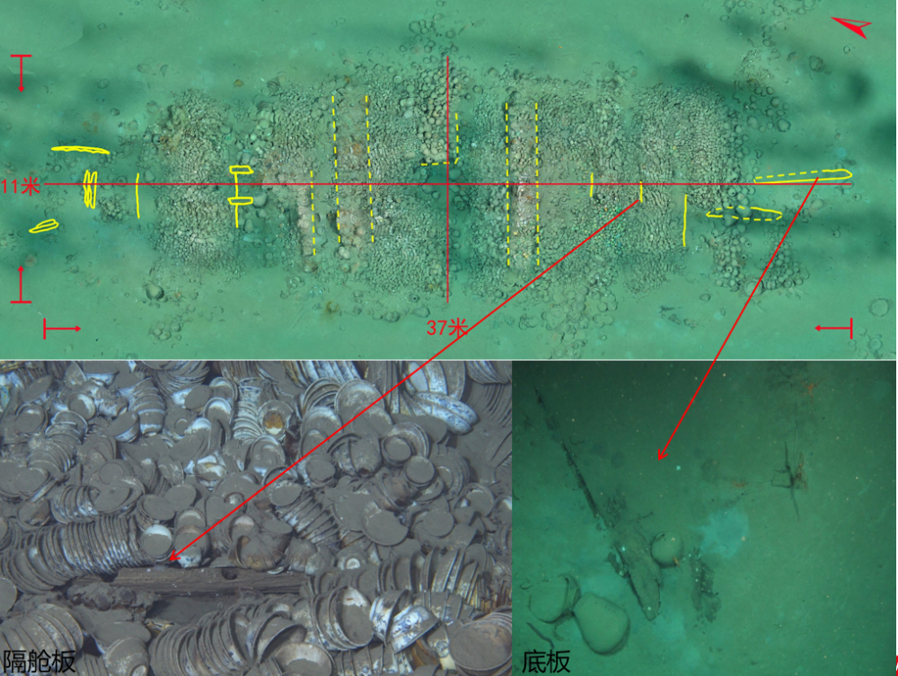

**二号沉船：大量码放整齐的原木堆积**

二号沉船遗址位于一号沉船遗址东北约12海里处，由核心区和散落区组成，年代为明弘治年间。核心区为大量码放整齐的原木堆积，长约21米，最宽约8米，核心区西北及东部各有一处由少量原木和陶瓷器散落形成的堆积。二号沉船暂未发现船体，仅在核心区原木堆积中发现一根疑似船构件的条木。

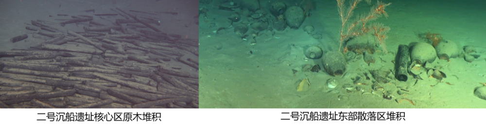

经过调查，探明了一号、二号沉船遗址的分布范围，在二处遗址核心堆积区的西南角布放水下测绘永久基点，完成了遗址三维激光扫描和一号沉船遗址核心区、环形散落区、部分条形散落区和二号沉船遗址核心区、散落区的摄影拼接，从一号沉船遗址提取出水文物标本543件（套），二号沉船遗址提取出水遗物36件。

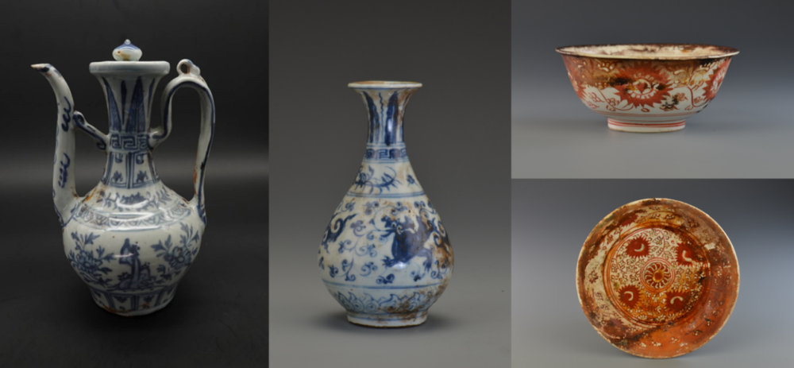

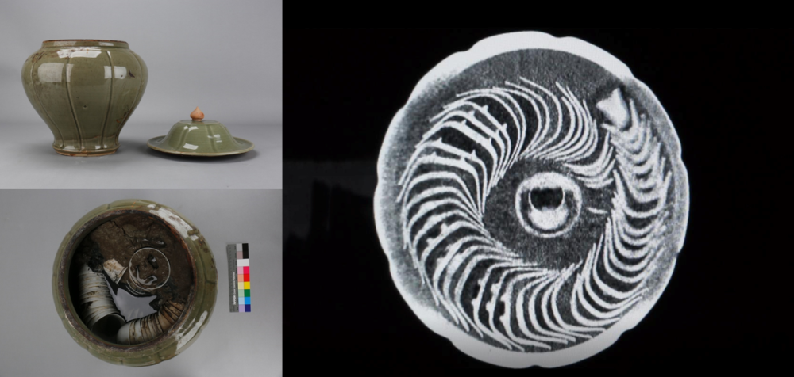

一号沉船遗址有多个隔舱的船货堆积，包括陶器、瓷器、铜器、铁器、竹木器等，数量超十万件，代表性器物有酱釉陶罐，珐华梅瓶，青花执壶、玉壶春瓶，红绿彩碗、盘、杯，青釉玉壶春瓶，青白釉盘、碗，白釉三足圆香炉，蓝釉高足碗，单色釉玉壶春瓶、扁壶，素三彩螺形壶、象形壶、鹤形壶，铁锅，铜盘、铜钱等。二号沉船遗址发现大量尺寸相近、码放整齐的原木及少量陶器、瓷器、蝾螺壳等。

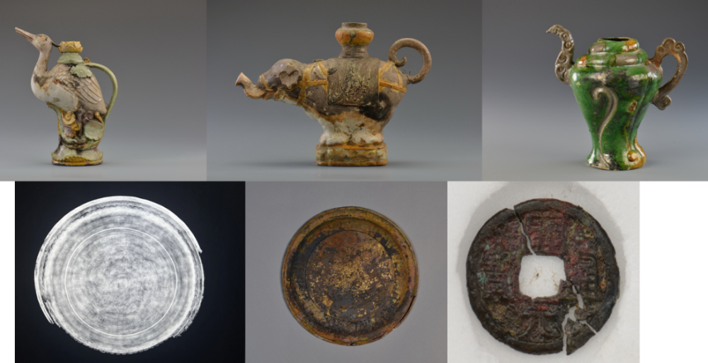

_△一号沉船遗址提取出水文物_

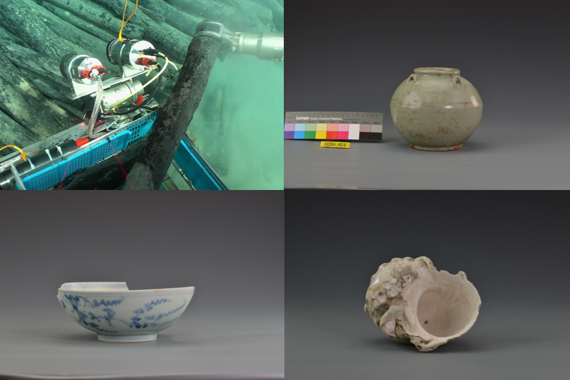

 _△二号沉船遗址提取出水文物_

**我国首次在同一海域发现出航和回航的古代商船**

二处沉船遗址保存相对完好，文物数量巨大，年代比较明确，不仅是我国深海考古的重大发现，也是世界级重大考古发现。一号沉船满载外销的陶瓷器，二号沉船则装载了从海外输入的木材，是我国首次在同一海域发现出航和回航的古代商船，再现了明代中期海上贸易的繁盛景象，有助于深入探索和充分理解古代海上丝绸之路的双向流动。

这一重大发现实证了中国先民开发、利用、往来南海的历史事实，填补了我国古代南海离岸航行路线的缺环，完善了海上丝绸之路南海段航线的历史链条，对中国海洋史、陶瓷史、海外贸易史、海上丝绸之路等方面的研究均具有突破性贡献。

关于航路航线，一号沉船的始发港可能为福建或广东，经华南沿海沿岸航行后，从海南岛东部穿南海西北陆坡海域，沿越南中南部抵达东南亚地区的贸易中转地点。二号沉船在东南亚地区的贸易中转地点装载原木后经越南中南部，穿过南海西北陆坡海域，经海南岛东部，抵达中国港口。

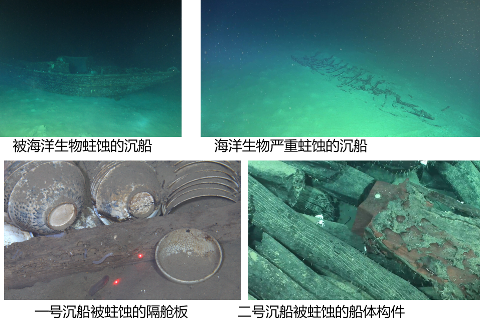

南海西北陆坡一号、二号沉船遗址考古调查是中国水下考古工作者首次运用考古学理论、技术与方法，严格按照水下考古工作规程要求，借助深潜技术与装备，对位于水下千米级深度的古代沉船遗址开展系统、科学的考古调查、记录与研究工作，对于我国深海考古的发展具有重要里程碑的意义。

下一步，国家文物局考古研究中心等单位将于2024年3月至4月开展第三阶段考古调查，以南海西北陆坡一号、二号沉船遗址为重点，开展南海重点区域及重要航线深海考古调查，联合多学科深入推进南海历史航线航路和海上丝绸之路等相关研究，揭示其背后蕴藏的中华文明连续性、创新性、统一性、包容性、和平性。

**漳州圣杯屿元代沉船遗址：**

**科技加持开创低能见度下水下考古精细化发掘**

漳州圣杯屿元代沉船遗址位于福建省漳州市古雷港经济开发区古雷半岛东侧圣杯屿海域。经国家文物局批准，2022—2023年，国家文物局考古研究中心、福建省考古研究院和漳州市文化和旅游局等单位对该遗址进行了水下考古发掘。

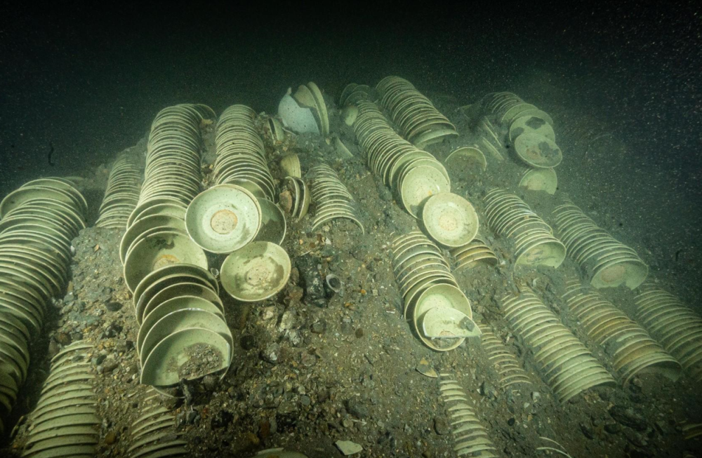

沉船遗址水深约30米，主体区域残存有木质船体和成摞摆放的船货堆积，范围约300平方米。考古发掘发现，沉船船体残长约16.95米，最宽处保存约4.5米，残存9道隔舱板和10个船舱，单层板结构，发现桅座、龙骨板、龙骨补强材以及舭龙骨等船体构件。

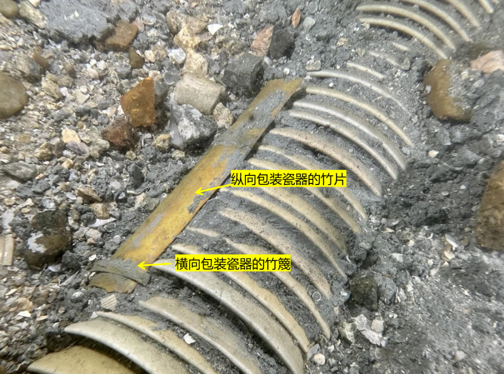

发掘出水文物标本约1.7万件，主要为龙泉青瓷和陶罐、铅锤、印章等船上生活、航海相关文物。其中龙泉青瓷数量达到1.6万余件，器形包括碗、盘、碟、盏、洗、缽、香炉和高足杯等，年代为元代晚期，为典型的外销贸易瓷。结合温州朔门古港的考古发现，推测该沉船可能是从温州港出海前往东南亚的民间贸易商船。

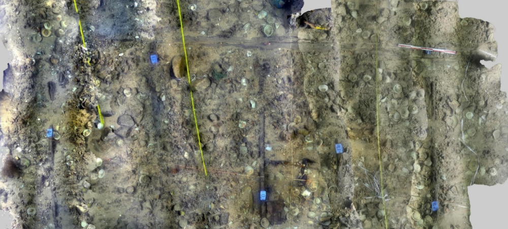

_△水下遗址影像拼接图_

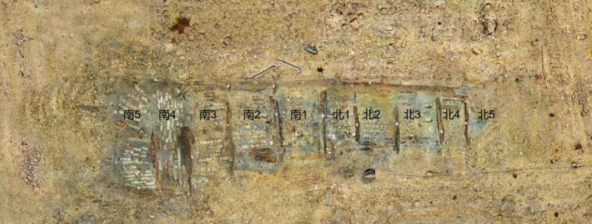

漳州圣杯屿沉船遗址的考古发掘通过科技创新、设备改良，实现了低能见度下水下考古精细化发掘，极大提升了我国水下考古发掘技术水平。沉船、船货以及船上生活、航海相关文物的发现，对深入研究元代航海史、造船史和船上生活等具有重要价值。

圣杯屿沉船重现了元代晚期龙泉青瓷外销和海上丝绸之路的繁荣，是近几年我国海上丝绸之路考古的重要成果。

**威海甲午沉舰遗址：**

**陆续发现定远、靖远、来远三舰**

2017年以来，国家文物局考古研究中心、山东省水下考古研究中心等单位，在威海湾原北洋海军基地附近，通过水下考古调查结合造船档案和战争档案等研究，陆续发现定远、靖远、来远三舰，取得了重要收获。

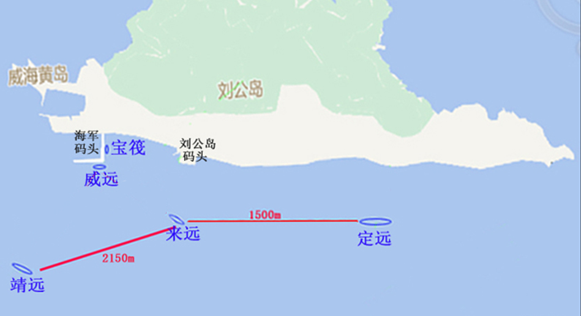

威海湾内的甲午沉舰遗址水深6-10米，遗址分布面积850~2100平方米不等，埋于海泥下0.5~3米，均未发现完整舰体，仅存的遗物呈散落分布状态。发掘出水遗物包括船体构件、船员生活物品和武器弹药等，结合遗物种类能判断原舰体的艏、舯及艉部等位置。其中，定远舰于艏部主炮区发现并成功提取整块重达18.7吨的防护铁甲板。

靖远舰于舯部发现2箱完好的37毫米哈乞开司炮弹、艏部发现1枚210毫米主炮开花弹。

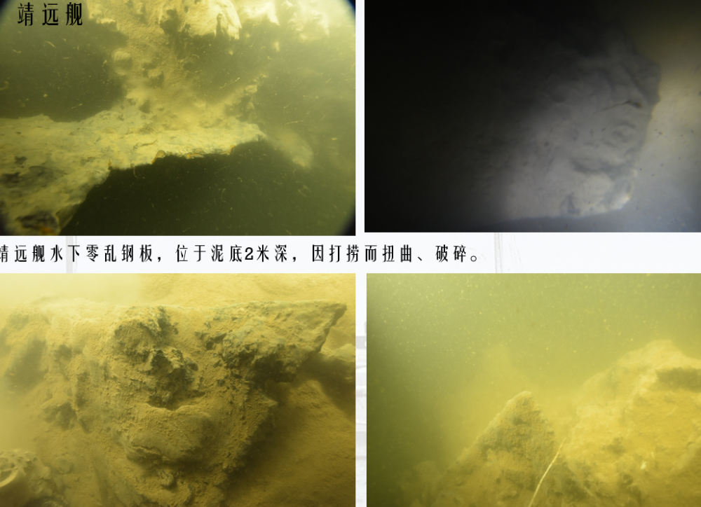

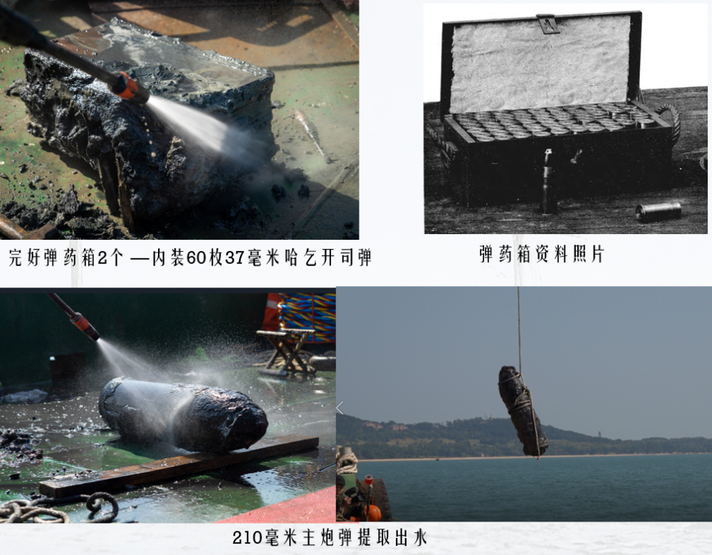

来远舰发现錾刻有“来远”银勺以及两块写有“来远”水手姓名的身份木牌。

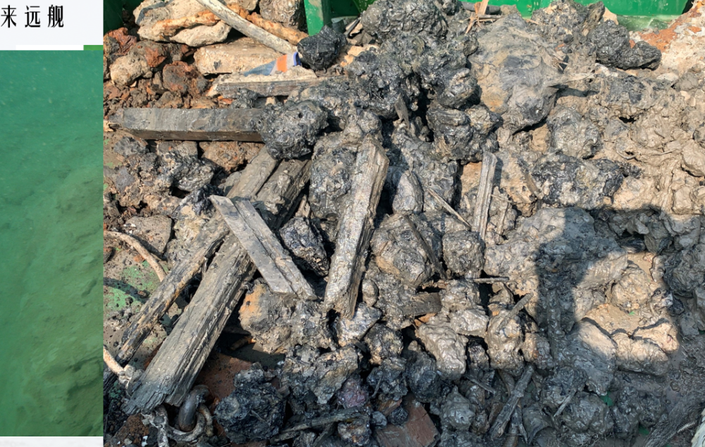

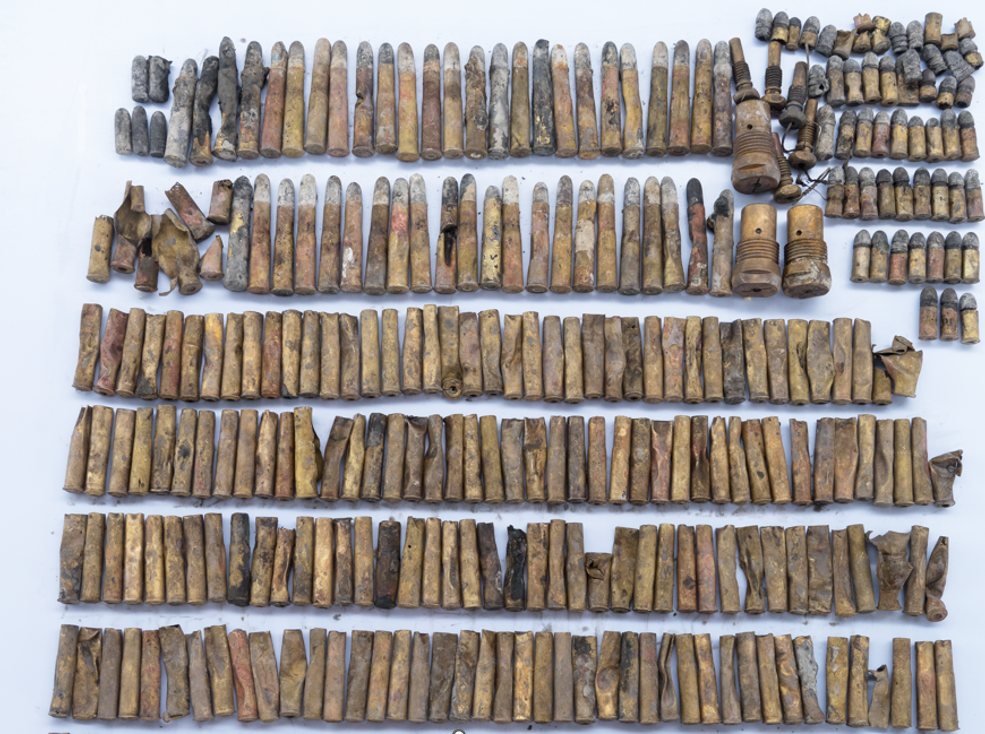

甲午沉舰系列考古工作探索总结了一套实践可行的近现代沉舰考古与保护工作方法，填补了中国海域近现代沉舰水下考古的空白。系列水下考古成果对于推进甲午战争研究、沉舰遗址原址保护等方面发挥了重要作用，也为爱国主义教育提供了生动的实物教材。

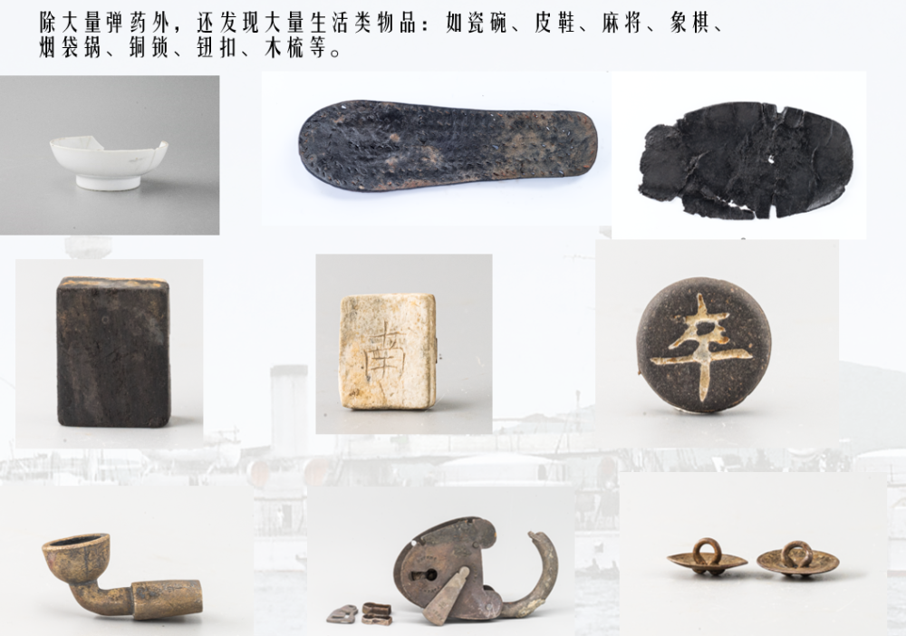

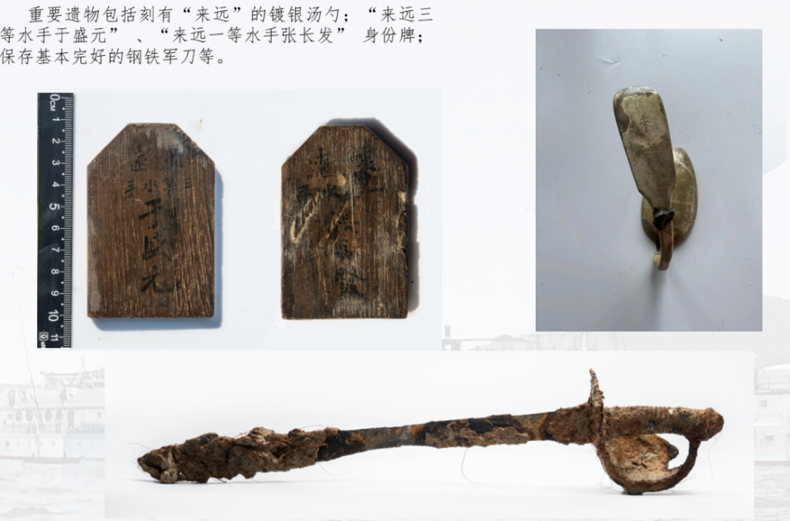

（央视）

