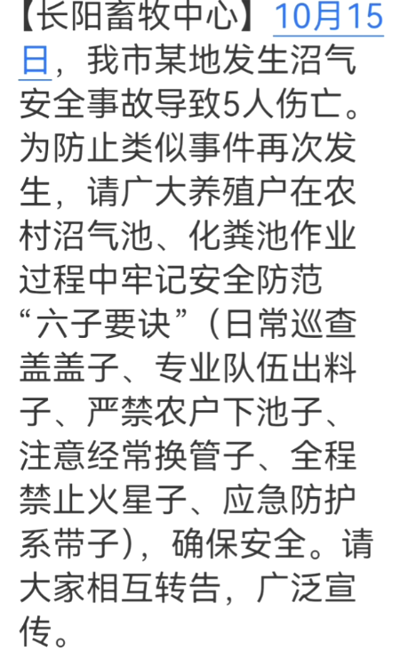
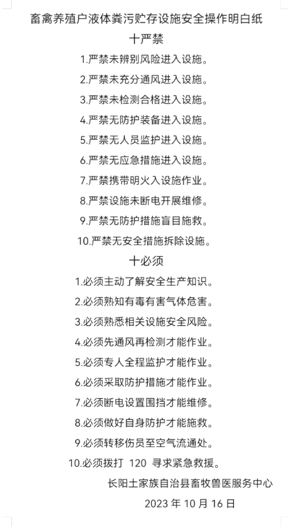

# 湖北宜昌发生沼气安全事故致多人死亡，乡政府：正进行善后工作

近日，湖北宜昌，有网友称收到自己所在地长阳畜牧中心的短信，内容显示10月15日，宜昌市一地发生沼气安全事故致5人死亡。

该短信称，为防止类似事件再次发生，请广大养殖户在农村沼气池、化粪池作业过程中牢记安全防范“六子要诀”（日常巡查盖盖子、专业队伍出料子、严禁农户下池子、注意经常换管子、全程禁止火星子、应急防护系带子），确保安全。请大家相互转告，广泛宣传。

据该网友发布照片，10月16日，长阳畜牧中心发布“十严禁”“十必须”通知，于多个村子张贴。

10月19日，该畜牧中心工作人员告诉潇湘晨报记者，确实有发出此通知，但事发地不在长阳。

记者随后了解到，该事故发生于宜昌市夷陵区下堡坪乡。下堡坪乡政府工作人员称，有组建专班组在调查此事，目前尚在一线处理善后工作。

潇湘晨报记者 吴陈幸子 实习生 罗威翼

