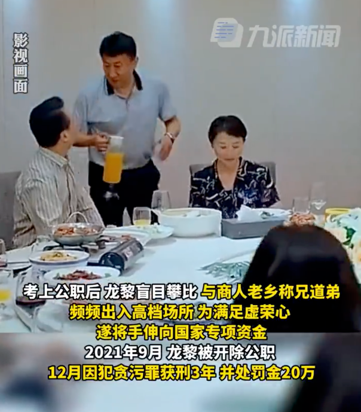
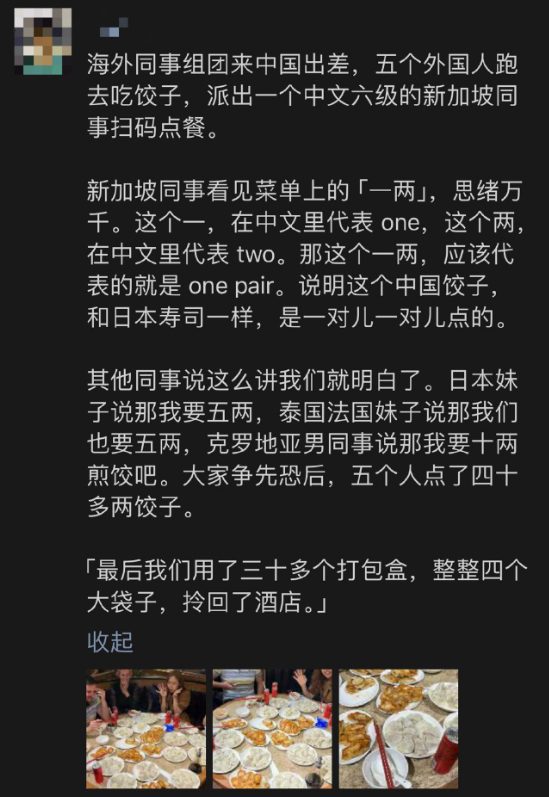
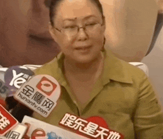
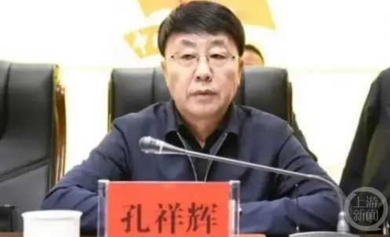
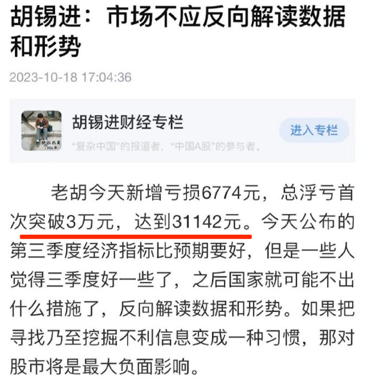
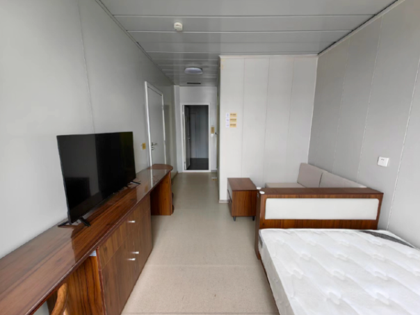
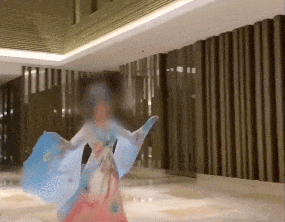
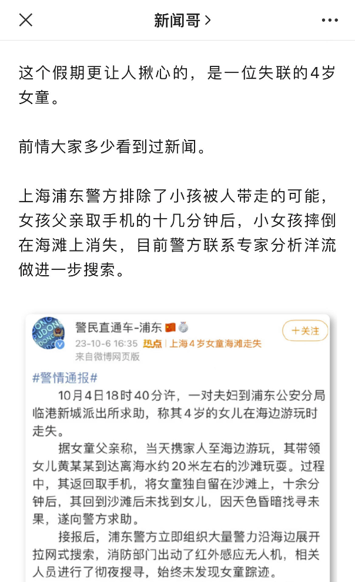
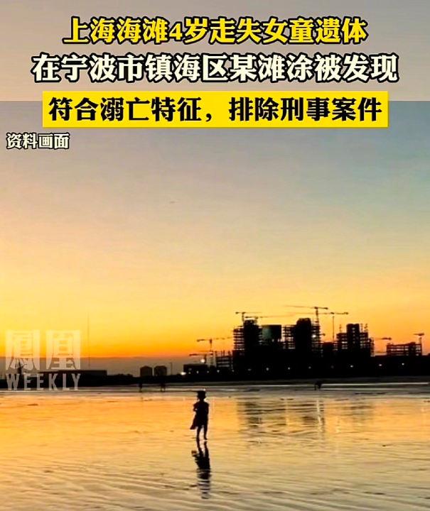

# 男子考公多年终上岸，3个月后开始贪污冒领20万

如果所有人都考公了，那还有谁来开小火车呢？

看到上图：努力生活的人最可爱。

看到下图：谁去帮我踹他一脚。

回来说考公考编。

有的人还没考进去，有的人已经拷进去了。

10月17日，贵州省纪委监委网站公布了一个案件。

1991年出生的男子龙黎，考公多年终于在28岁成功上岸，成为了贵州天柱县的村镇建设服务中心工作员。

没想到才刚工作3个月，龙黎就开始利用漏洞，把手伸向了发给农户的扶贫资金。

在将近2年的时间里，龙黎通过虚报账户，一共冒领了20多万扶贫金。

最终，他因贪污罪被判有期徒刑3年，并处罚金20万元。

至于贪污的动机，龙黎表示，是因为结交了几个商人老乡，经常出入高档场所入不敷出。

富贵，你现在知道我为什么只请你吃便宜的吧。

吃吃喝喝啥的太稀松平常。

来点消费升级。

美容也能跟腐败挂钩。

10月18日，据中央纪委国家监委网站消息，政协北京市延庆区委员会原党组成员、副主席陈桂芬被开除党籍和公职。

除了“违反中央精神，违规收受礼品”，通报还特别提到她“违规接受美容活动安排”。

陈桂芬不是美容腐败第一人。

内蒙古满洲里原市长许爱莲，收钱、收冬虫夏草、也收15万元一支的美容针，专门去上海打的，最后因犯受贿罪被判11年；

辽宁鞍山国税局原局长刘光明，为了勾引官员，前后花500万去各地整容，光臀部整形费就达50万元，被戏称为鞍山市“最美丽的屁股”；

也有男性官员，比如青海茫崖市委原书记孔祥辉，多次和妻子赴成都、上海等地美容整容，花费违法所得306万元，被判13年。

好家伙，原本以为有钱人不在乎自己长相，没想到也这么计较。

还好哥像吴彦祖，不用搞这些有的没的。

唯一美中不足的，就是没钱了。

哥……就不说自己了。

再这样下去，别说买房，租都租不起。

再缺钱，触犯底线的事不能做。

10月18日，河南南阳的百万粉丝网红“罗大美”被曝遇害。

不知道有没有朋友刷到过，他因反串古装美人出名，其账号更新停留在7月5日。

亲属称，7月初罗大美自称私事外出再无消息，8月底家人发现异常后报警，9月初其遗体疑在一红薯窖被找到，“行凶前勒索被害人200万元，望严惩凶手追回赃款”。

据悉，该案3名嫌疑人已全部到案，是罗大美的熟人，案发时将其骗至南召县实施绑架，勒索其大额资金后将其杀害藏尸。

从“罗大美”的亲友采访看得出来，他人挺好，靠直播发达后不忘帮助朋友，养家不说，还借给很多人钱，备忘录里就记了两三百万。

他的朋友说，他应该是“没有想过没钱（的时候）人会害他一把”，实在令人唏嘘。

看到有评论说他炫富活该，就奇怪，大家不知道马斯克王思聪有钱吗？敢去绑架勒索吗？

真希望大家能少一点戾气。

太难。

10月18日，广州一辆宝马车撞上桥墩，燃起熊熊大火。

过路车的行车记录仪显示，事故发生前，这辆宝马曾与一出租车发生碰撞。

两车在碰撞前高速行驶，疑似因斗气互相别车，宝马从最右侧车道连变两道进入最左侧车道 ，随后又向右行驶想和出租车车头接触，结果失控侧翻撞上桥墩。

路人见状上前营救，但火势越来越大只能撤出。

随后消防到场将火扑灭，此时宝马司机已经不幸身亡。

路过司机表示，当时该路段的正常车速，是每小时60公里。

而宝马车和出租车的车速，预计开到了100-120之间。

经对出租车司机的检验，警方已经排除酒驾、毒驾，目前在进一步调查中。

安全意识，强调多少遍都不为多。

还记得那个在海滩边失踪的4岁女孩吗？

10月18日，宁波市镇海区一滩涂发现了一具女童尸体，经法医检测和家属辨认，确认是在上海失踪的女孩。

法医经过勘察检验，女孩的死亡时间和失踪时间吻合，遗体无暴力性损伤，符合溺水死亡特征，排除刑事案件。

4岁的孩子，孤零零的在海上漂了几百公里……

带着孩子到野海滩，留孩子独自在海边，致使孩子遭遇不幸。

如果主语是保姆或者其他人，肯定涉嫌过失致人死亡。

那把主语换成女孩父亲，还算吗？

**【网友问网友】**

评论区的文曲星们，发挥的时候到了。

新闻来源

《90后干部考公上岸后冒领扶贫金：盲目攀比，频频出入高档场所》九派新闻

《广州一宝马与出租车碰撞侧翻起火司机身亡》九派新闻

《警方通报：上海海边走失女童遗体已找到》人民日报

《5个落马官员美容腐败细节：15万元的美容针，50万元的美臀费》上游新闻

《百万粉丝网红罗大美遭熟人绑架杀害，亲属：遗体疑在红薯窖找到》紧急呼叫

