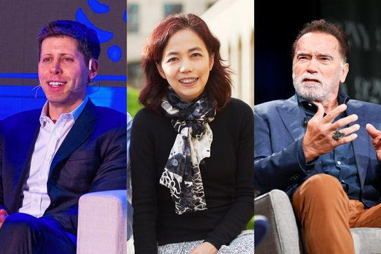

# 科技大咖齐聚加州：十年内AI会取代80%岗位 工作必要性将在25年内消失

**划重点**

  * _1_ 知名风险投资家科斯拉预计，在10年内，人工智能将能够“取代80%的已知工作”，25年后人们将没必要再为生计而工作。
  * _2_ 奥特曼称，OpenAI正在努力使ChatGPT变得更便宜、更快捷，这样它就可以被更广泛地使用。
  * _3_ 咨询公司老板沃尔夫表示，消费者将被TikTok、ChatGPT和其他由生成式AI支持的应用所吸引，而不再使用传统搜索引擎。
  * _4_ Arm CEO哈斯担心，未来能源短缺可能会限制AI的发展，而人才短缺可能会限制半导体的生产。

本周，多位科技行业大咖齐聚美国加州拉古纳比奇，参加《华尔街日报》主办的年度Tech
Live大会，重点讨论了人工智能技术（AI）在商业、技术和政策制定等方面带来的巨大改变。

以下是到目前为止，这些科技领袖在此次会议上表达的主要观点：

**01 十年内AI将取代80%已知工作**

几位科技领袖表示，人工智能可能会给劳动力领域带来翻天覆地的变化，淘汰许多职业，并促使社会重新思考人们该如何利用时间。

OpenAI首席执行官萨姆·奥特曼（Sam
Altman）称，即使社会整体都在进步，但人工智能带来的改变也会对几乎所有人产生巨大影响。而对于那些受影响最严重的人来说，可能需要面临艰难的抉择。

奥特曼说：“我们真的必须为迎接这种转变做点什么，社会将不得不谨慎面对这种变化发生的超快速度。人们需要发挥主观能动性，发挥影响力，我们需要共同成为未来的建筑师”。

人工智能有望通过推动生产率的提高来改变全球经济，但经济学家和科技企业家在这种转变能够以及应该以多快的速度发生，依然存在分歧。

知名风险投资家维诺德·科斯拉(Vinod
Khosla)为人工智能的工作转型制定了一个明确的时间表，他的公司是OpenAI最早的支持者之一，他本人有着40多年的投资经验。科斯拉预计，在10年内，人工智能将能够“完成我们今天所知道的80%工作”。

科斯拉指出，许多类型的医生和会计师都是人工智能可以在很大程度上取代的职业，因为这些系统可以更容易获取广泛的知识。科斯拉将如今劳动力领域的变化与20世纪美国农业大量工作消失相提并论，这种转变往往会持续几代人，而不是短短几年。

然而，人工智能将给采用该技术的社会带来的日益繁荣，将允许那些不想工作的人做出选择，甚至可以不去工作。

科斯拉说：“我相信，对于那些采用这些技术的国家来说，人们工作的必要性将在25年内消失。我确实认为，全民基本收入可以确保最低生存标准，人们将能够做随心所欲去做他们想做的事情。”

但奥特曼认为，仅仅提供基本收入还不够。人们将需要更有创意的表达渠道，以及“为人类物种的发展轨迹做出贡献”的机会。

去年11月，OpenAI推出了聊天机器人ChatGPT，掀起了硅谷当前的人工智能热潮。这款产品的意外成功引发了一场激烈的辩论，即政府和民众如何为人工智能可能带来的全面改变做好准备。

**02 将来可在全新设备上与AI互动**

一个令人担忧的问题是：如何区分真实内容和人工智能生成的内容？人工智能生成的图像已经被用来传播错误信息、侵犯知识产权，而用于检测这类图像的人工智能工具仍在开发中。

奥特曼说，OpenAI明确决定将其聊天机器人命名为ChatGPT，而不是使用类似人的名字，这样人们就不会把这个工具和人混为一谈。

但Meta的首席产品官克里斯·考克斯(Chris Cox)在Tech
Live大会上表示，Meta决定赋予聊天机器人以类人角色，以使它们更有吸引力。用户希望与一个有个性的工具互动，而不是像机器人一样的东西。

今年9月，Meta宣布推出一系列以Naomi Osaka、Snoop Dogg和Tom
Brady等名人为原型的人工智能聊天机器人。在这些聊天机器人中，Meta会在对话开始时做出提醒，人们正在与人工智能交流，而不是真正的名人。

当被问及用户在确定内容是否是人工智能生成时可能遇到的挑战时，OpenAI首席技术官米拉·穆拉蒂(Mira
Murati)表示，该公司正在开发帮助检测图像来源的技术。她说，这个工具“几乎99%的时间都可靠”，但该公司仍在测试它，并希望以一种不会让OpenAI用户感到被监控的方式设计它。

奥特曼表示，他认为未来消费者可以在新型设备上与生成式人工智能互动，但他还不知道以人工智能为中心的设备会是什么样子。

**03 AI将助力创企颠覆老牌巨头**

人工智能始终是今年的热门话题，因为它对商业和社会的影响引发了激烈争论。

奥特曼表示，未来几十年最重要的两件事是丰富而廉价的智能，以及丰富而廉价的能源。OpenAI正在努力使ChatGPT变得更便宜、更快捷，这样它就可以被更广泛地使用。他说：“如果我们能在世界上做到这两件事，那么几乎很难想象我们还有什么是做不到的。”

Inflection AI首席执行官穆斯塔法·苏莱曼（Mustafa
Suleyman）表示，构建AI聊天机器人的竞赛不禁让人想起互联网刚刚诞生时的网站建设热潮，或者智能手机问世后的应用程序开发热潮。

苏莱曼补充说：“这真的只是我们与计算互动方式彻底转变的开始。”Inflection
AI开发的人工智能工具名叫PI，是个人智能的缩写，它被视为ChatGPT的竞争对手。

Meta也对人工智能的影响持乐观态度。该公司首席产品官考克斯表示：“短期内，人工智能最具影响力的应用之一是帮助企业提高效率。”

咨询公司Activate的联合创始人兼首席执行官迈克尔·沃尔夫（Michael
Wolf）表示，消费者将被TikTok、ChatGPT和其他由生成式人工智能支持的应用程序所吸引，而不再使用传统的搜索引擎。

他预测，在价值1000亿美元的搜索行业中，主导地位将“悬而未决”，并补充说，开源人工智能模型的崛起为规模较小的行业参与者铺平了一条道路，让它们能够与老牌大公司展开竞争。

从医生到作家的各类专业人士都在担心人工智能会完全取代某些岗位。对此，奥特曼说：“每一次技术革命都会影响就业市场，我一点也不害怕。这就是进步之路，我们会找到更好的新工作。尽管如此，这不会是一个无缝的过程。”

Adobe数字媒体业务总裁大卫·瓦德瓦尼（David
Wadhwani）称，尽管存在这类担忧，但他认为人工智能是一种能够促进就业而不是让人失业的工具。他说，像Adobe的Firefly等工具可以生成图像和标识，让更多的人成为创意专业人士。

“我们将拥有比以往任何时候都更高效的创意专业人士，世界上将有更多的创意专业人士！”他说。

英国芯片设计公司Arm首席执行官雷内·哈斯（Rene Haas）说，该公司正在利用人工智能来帮助一些难以招到足够人才的领域，比如调试和测试芯片。

但他表示，半导体行业在为人工智能提供动力方面面临一些挑战。他认为，未来能源短缺可能会限制人工智能的发展，人才短缺可能会限制半导体的生产。哈斯说：“我们想要招募的那种人很难找到，我们正在寻找真正专业的工程师。”

**04 现在入场还来得及吗？**

投资者正在权衡进入人工智能领域是否为时已晚。

风险投资家维诺德·科斯拉(Vinod Khosla)说：“今天对人工智能的大部分投资（风险投资）都将赔钱。” 近20年前创立Khosla
Ventures的科斯拉表示，人工智能投资已经进入了一个炒作周期，只有高度自律的投资者才能从这一变革性技术中获益。

不过，这项新技术也引起了极大的担忧。OpenAI首席技术官米拉·穆拉蒂(Mira
Murati)表示：“我们面临着一项艰巨的任务，要弄清楚这些缺点是什么，并发现、理解它们，然后开发工具来解决它们。”

例如，有时聊天机器人会给出似乎不符合其训练数据的信息。穆拉蒂说：“我们在解决GPT-4的幻觉问题上取得了很大进展，但我们还没有达到预期的目标。在某种程度上，我们走上了正确的道路。”

OpenAI正在继续使用包括带有人类反馈的强化学习在内的技术，以减少其模型弥补信息的次数。穆拉蒂说，该公司还在研究可以帮助检测图像来源的技术。

Inflection AI首席执行官苏莱曼表示，另一个问题是，PI和其他人工智能聊天机器人并不是为了怀疑自己而设计的，这使得它们很难知道自己什么时候犯了错。

他建议，对用户来说，一种可能的保障措施是根据机器人的准确性对回复进行排序。他表示，这种对不确定性进行评估的技能是智能的重要组成部分，实际上也是使AI聊天机器人可靠的关键。

**05 AI领域应该获得更多政府支持**

斯坦福大学以人为中心人工智能研究所联席主任、谷歌前副总裁李飞飞表示，美国人工智能领域发展面临的主要风险之一是，公共部门和私营部门在这项很快就会像电力那样无处不在的技术上的投资不平衡。

美国政府的投资和激励措施至少应该与几十年前支持美国宇航局（NASA）探索太空方面的投资相当。李飞飞称：“这项技术和空间技术的影响一样大，甚至更大，我们不能只把它留给私营部门。”

李飞飞还说，美国食品药品监督管理局、环境保护局和其他政府机构应该紧急在规范人工智能方面发挥作用，“很难想象有一个魔戒能号令所有其他戒指”。

游戏公司Roblox首席执行官大卫·巴祖基（David Baszucki）表示，它们在训练人工智能模型时非常谨慎，不会在未经许可的情况下窃取任何人的代码。

与推动人工智能项目相关的能源成本也始终让气候环保者感到担忧。但前Meta首席技术官迈克·施罗普夫(Mike
Schroepfer)称，人工智能将通过其他方式节省能源。他的新公司Gigascale Capital投资于专注于应对气候变化的公司。

在谈到人工智能有望提高效率时，施罗普夫说：“这项技术的确会消耗大量电力，但你也必须考虑到替换成本。”

加密货币是另一个充满陷阱的技术领域。SkyBridge Capital创始人安东尼·斯卡拉穆奇(Anthony
Scaramucci)称，他本应对倒闭的加密货币交易所FTX创始人萨姆·班克曼(Sam Bankman)更加警惕。后者正在纽约受审，面临欺诈和共谋指控。

斯卡拉穆奇说：“我把他（班克曼）在这个领域获得的光环看得太重了，我本应该更多保持怀疑的态度。他犯了罪，我认为他必须进监狱很长一段时间。”

**06 警惕AI对娱乐领域的影响**

科技行业高管们还强调了人工智能给社交媒体带来的风险，尤其是对年轻人来说。

非营利组织#HalfTheStory的创始人兼执行董事拉丽莎·梅（Larissa
May）表示，孩子们平均每天花在电子设备上的时间长达8小时。她说：“我们最好看看他们生活中花费时间最多的地方，包括睡眠。”

社交媒体公司应该更多地考虑年轻人在社交媒体应用程序上花费了多少时间，他们应该找到方法来衡量应用程序是支持还是伤害了孩子们，“这绝不仅仅是一个美元符号”。

喜剧演员兼创作者艾尔莎·马金博（Elsa
Majimbo）说，社交媒体可能充满了消极信息。她称社交媒体平台X（前身为Twitter）是一个“软暗网”，应该设定18岁以下禁入的最低年龄要求。

屡获殊荣的音乐家约翰·传奇(John
Legend)正在创办他的第一家科技创业公司，他也认为人工智能有其局限性。他说，电脑生成的音乐不会取代词曲作者，部分原因是观众喜欢艺术家在音乐创作背后的故事。

美国加州前州长、好莱坞巨星阿诺德·施瓦辛格（Arnold
Schwarzenegger）表示，他在关注人工智能在好莱坞的应用，并听到过模仿他声音的假音频。关于自己的肖像将来是否会被人工智能使用，施瓦辛格认为这是他的孩子们必须考量的问题。他说：“虽然我很想长生不老，但我不会永远陪在他们身边。”

就连风险投资家科斯拉也曾尝试使用人工智能工具。今年早些时候，当他的女儿结婚时，他让ChatGPT把他写的一篇演讲稿变成说唱歌词，然后通过一家名为Splash的人工智能初创公司把歌词变成一首歌。他用扬声器播放了这首歌。科斯拉承认：“它扩展了我的能力，这对我来说意义重大。”

科斯拉还警告说，不要向公众提供先进人工智能模型背后的代码，尽管有些技术专家认为这是促进技术发展的一种方式。他说：“你不会把曼哈顿计划开源。”他指的是美国在第二次世界大战期间秘密制造原子弹的计划。（文/金鹿）

