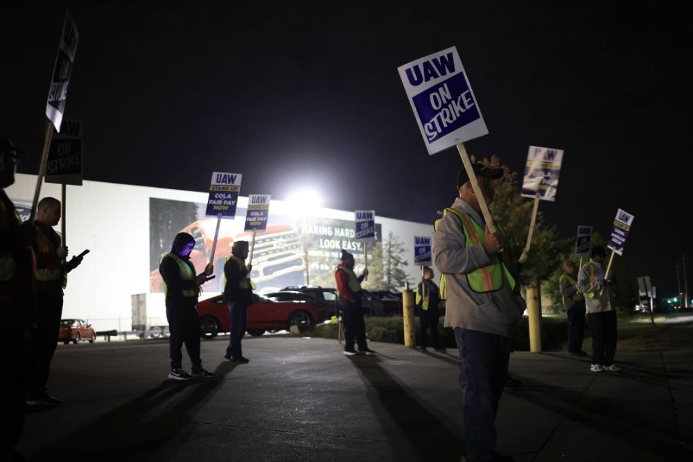

# 美国汽车业罢工持续 福特拉拢工会：丰田和中国车企是真正“敌人”

腾讯新闻《远光灯》作者 纪振宇 发自硅谷

美国三大汽车巨头的大规模罢工活动进入拉锯战，目前劳资双方依然无法达成协议。代表汽车工人利益的工会组织UAW（United Automobile
Workers）对于汽车厂商提出的部分让步依然不满意，仍希望争取到更大的利益。

工厂停工、产量下降，汽车厂商心急如焚，面对着态度强硬的汽车工人工会组织，福特高管甚至打出了“保护主义”牌，试图拉拢工会，称我们应该矛头一致对外，想进入美国市场的中国汽车公司、特斯拉和其他外国汽车公司才是真正的“敌人”。

但这样的“伎俩”却让工会嗤之以鼻。在一份回应的声明中，UAW表示，公司别再“玩游戏”了，并表示，特斯拉、丰田、本田和其他公司的工人不是敌人，他们未来也会是UAW的成员。

这场汽车工人大规模罢工可能会是一场持久战，由此将引发更广泛的效应，除了美国三大汽车巨头损失惨重外，对于身处通胀中的美国消费者也不是个好消息。

**福特拉拢工会：应联合对抗丰田本田和中国公司**

面对双方僵持不下的局面，福特汽车执行主席威廉·C·福特二世打出了“保护主义”的牌，试图拉拢汽车工会组织，将中国汽车厂商、特斯拉和其他国外汽车厂商树立为真正的对立面，声称如果罢工活动继续下去，只会助长这些真正的竞争对手。

“我们（福特）和UAW应该联合起来共同对抗丰田、本田、特斯拉以及所有想进入我们本土市场的中国公司。” 福特近日在位于密歇根州的迪尔伯恩福特鲁奇工厂表示。

“丰田、本田、特斯拉以及其他公司都很喜欢这场罢工，因为他们知道罢工时间越长对他们越有利。”福特说。“他们将获胜，我们所有人都将失败。”

福特的言论提到了几十年前的一段时期，当时UAW赢得了越来越丰厚的合同，后来许多行业专家认为，这些合同使三大汽车巨头在当时面对来自日本和欧洲汽车制造商的竞争时受到拖累。福特、通用汽车和现在隶属于菲亚特克莱斯勒集团的克莱斯勒，在2008年金融危机后，不得不寻求破产保护。

“福特投资未来的能力不仅仅是停留在口头上，”福特说，“这是我们公司的生命线。如果我们失去了它，我们就会输给竞争对手。许多工作岗位都会丢失。”

对于福特的这一番言论，汽车工人并不认同。在一份声明中，UAW主席Shawn
Fain明确回应称，福特应该“停止玩游戏”，满足该联盟的要求，否则“我们会为他关闭鲁奇工厂”。
Fain还补充说，UAW并不是在与该公司作斗争，而是与“公司贪婪”作斗争。

“如果福特想成为代表美国的汽车公司，那他们可以支付代表美国的工资和福利。”
Fain说。“特斯拉、丰田、本田和其他公司的工人不是敌人，他们是未来的UAW成员。”

福特、通用汽车和菲亚特克莱斯勒集团自7月以来一直与UAW进行新的劳资合同谈判。在过去一个月中，该联盟已要求一些工厂的工人进行罢工。这一行动已使三家福特工厂、两家通用汽车工厂和一家菲亚特克莱斯勒集团工厂停工。38家通用汽车和菲亚特克莱斯勒集团零部件仓库的工人也正在罢工。

这一策略旨在对汽车巨头增加压力，迫使这些公司满足该组织对大幅提高工资、缩短工作时间和扩大养老金的要求，并结束向新员工仅支付一半工资的双层工资制度。

这些公司已提出未来四年将工资提高20%以上，以及符合该联盟某些其他要求的措施，但UAW仍在争取更大的让步。上周，该联盟号召肯塔基州路易斯维尔福特最大的卡车工厂8700名工人进行罢工。

**罢工让美国汽车已供应不足**

福特高管上周表示，该公司已向该联盟提出创纪录的报价，提高报价将损害汽车制造商投资电动汽车和其他新型号及新技术的能力。福特自1982年以来参与过每一轮与UAW的谈判，他说，谈判已到达“十字路口”，并警告过高的劳动合同可能会影响美国经济。

UAW主席Shawn
Fain此前在接受采访时表示，尽管工人提高工资待遇的要求看上去十分“激进”，但他们的期待是情有可原的，因为三大汽车巨头过去几年的利润涨了很多。

自2019年以来，福特和通用的年利润增长分别达到34%和50%，另一家Stellantis从2021年至2022年利润增幅为19%。

罢工活动发生后，最直接的影响将是汽车产量。据市场研究机构IHS此前的估计，罢工每持续一周，通用汽车的产量将每周减少5.5万辆，福特周产量减少6.5万辆。

高盛预计，通用汽车和福特每周的收入损失分别为25亿和30亿美元，相应的如果上述两家汽车厂商同意工人40%的涨薪要求，通用和福特将在接下来4年面临40-60亿美元的额外支出。

但UAW有足够的底气在接下来较长的时间内与三大汽车巨头“对垒”，因为这家工会组织此前筹集了8.25亿美元，用于向符合条件的工会成员每周每人支付500美元，这笔钱足够支撑11周。

对于未来有购车打算的消费者来说，汽车生产的中断也不是个好消息。由于新冠疫情的影响，美国汽车市场库存在过去几年总体上趋紧，罢工将使得供应雪上加霜。

汽车行业研究机构Cox
Automotive预计，截止到7月底，美国汽车供应能够覆盖接下来56天的市场需求，这一水平已经低于“60天”的正常水平，更低于2019年疫情前66天的较为宽松的供应水平，供应进一步趋紧无疑将进一步推高汽车售价。

制造业领域的大规模罢工对整个行业甚至区域经济的影响是显著的，最近的一次美国汽车工人大规模罢工事件发生在4年前，当时通用汽车工人进行了长达40天的罢工活动，直接导致当年通用汽车收入减少36亿美元，也让通用总部所在的密歇根州出现单个季度的经济衰退。

值得一提的是，此次涉及到的汽车公司仅仅包括通用、福特和Stellantis这三家美国公司，其他在美国有制造工厂的外国公司，如丰田、本田、大众等并没有工会组织；在电动车制造领域，特斯拉、Rivian等也没有工会组织，对于这些汽车厂商来说，并不面临潜在的工人罢工风险。

