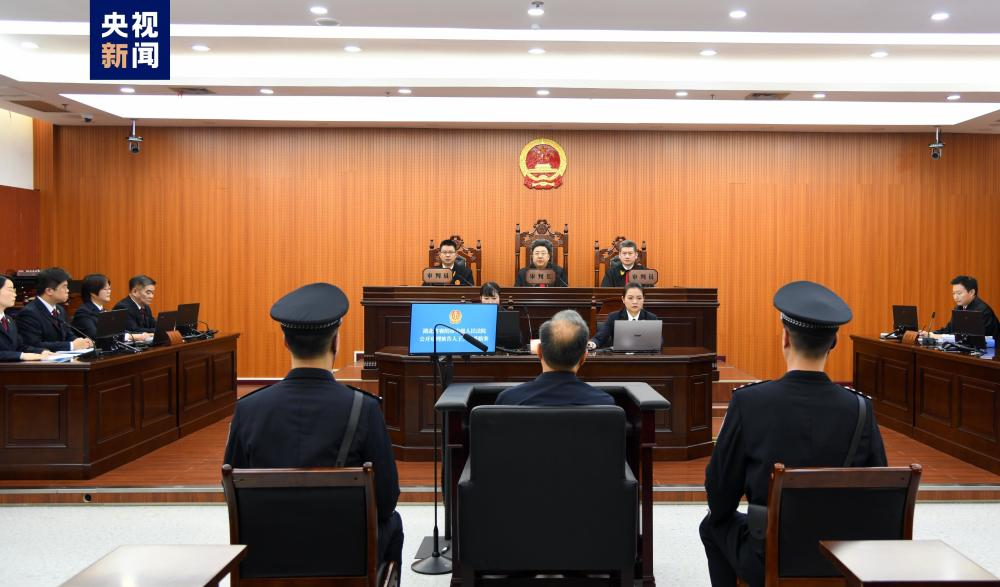

# 辽宁省人民政府原副省长、省公安厅原厅长王大伟受贿案一审开庭

2023年10月19日，湖北省襄阳市中级人民法院一审公开开庭审理了辽宁省人民政府原副省长、省公安厅原厅长王大伟受贿一案。

湖北省襄阳市人民检察院指控：2008年至2022年，被告人王大伟利用担任黑龙江省哈尔滨市委常委、政法委书记，黑龙江省公安厅党委副书记、副厅长，辽宁省公安厅党委书记、厅长，辽宁省人民政府党组成员、省长助理、副省长等职务上的便利以及职权或者地位形成的便利条件，为辽宁忠旺集团有限公司、辽宁红运投资（集团）有限公司、孟冰等单位和个人在企业经营、案件处理以及职务提拔、调整等事项上提供帮助，直接或者通过他人非法收受上述单位和个人给予的钱款、腕表、汽车、翡翠挂件等财物，以及代为支付购房款、购物款，共计折合人民币5.55亿余元。检察机关提请以受贿罪追究王大伟的刑事责任。

庭审中，检察机关出示了相关证据，被告人王大伟及其辩护人进行了质证，控辩双方在法庭主持下充分发表了辩论意见，王大伟进行了最后陈述并当庭表示认罪悔罪。庭审最后，法庭宣布休庭，择期宣判。

人大代表、政协委员和各界群众20余人旁听了庭审。

（央视）

