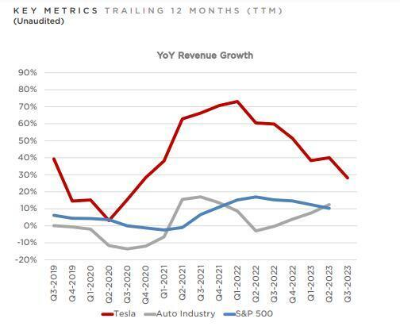

# 降价冲击下特斯拉Q3毛利率再降，加大AI投入，皮卡Cybertruck成焦点

尽管三季度再次祭出降价大招，特斯拉当季的业绩仍不及华尔街预期，降价持续冲击盈利，毛利率今年内持续超预期下降。

不过，特斯拉在披露财务业绩的同时展示了两大业务亮点：一是，发力运用人工智能（AI）技术训练机器人Optimus，二是电动皮卡Cybertruck出于今年内交付的正轨。特斯拉预计11月末开始交付Cybertruck。

财报公布后，周三收跌约4.8%的特斯拉股价盘后先进一步下跌，跌幅曾超过2%，而后反弹转涨。

业绩电话会上，特拉斯CEO马斯克也提到Cybertruck，暗示可能需要很长时间才能盈利。他指出，Cybertruck增产会很艰难，而且给出的年度交付量预期并不乐观。特斯拉股价盘后重回跌势，盘后跌幅曾接近4%。

营收超预期放缓 EPS盈利超预期剧减 毛利率年内持续下滑

美东时间10月18日周三美股盘后，特斯拉公布，今年第三季度的营业收入增长超预期放缓，为年内最低增速，每股收益（EPS）不但继一季度之后今年第二个季度下滑，而且超预期剧减：

三季度营收为233.5亿美元，同比增长9%，分析师预期同比增长12%至240.6亿美元，二季度创单季最高纪录的营收同比增长47%，一季度同比增24%。三季度非美国通用会计准则（GAAP）口径下调整后EPS为0.66美元，同比下降37%，分析师预期下降29.5%至0.74美元。今年一季度调整后EPS同比降21%，为2019年三季度以来首次同比下滑。

在利润端，三季度特斯拉的净利润也超预期猛降，毛利率今年三个季度持续下降，且每个季度都低于市场预期。

三季度调整后净利润为23.18亿美元，同比下降37%，分析预期同比降约30%至25.6亿美元，二季度净利润同比下降3%。三季度GAAP口径下毛利润率为17.9%，预期18%，同比下降719个基点，降幅超过二季度的682个基点，环比二季度下降约30个基点。

财报显示，三季度特斯拉的营业利润率为7.6%，虽然同比下降964个基点，但还远高于汽车行业内水平。

三季度自由现金流远低于预期 “卖碳”收入环比翻倍

三季度特斯拉的自由现金流8.48亿美元，同比下降74%，环比二季度下降15.6%，远低于分析师预期的25.9亿美元。

三季度特斯拉的汽车业务毛利率16.3%，低于分析师预期的17.7%，但特斯拉以往盈利的一大推手——“卖碳”的收入环比大幅增长。三季度通过出售碳排放信用额度获得收入5.54亿美元，几乎是二季度收入的两倍，脱离了二季度所创的跌至2021年三季度以来低谷。

汽车降价继续打击盈利和收入 工厂升级是新增打击因素

财报中，特斯拉总结了一些影响三季度营收和盈利能力的因素，正面影响的因素包括：

汽车交付量增长、汽车以外公司其他业务的收入和毛利增长、每辆车的平均成本下降和美国国税局（IRA）对电动汽车的税收抵免、销售电动汽车的碳排放监管积分增长。

和二季度一样，特斯拉在负面影响因素中再次提到了美元走强的外汇影响、汽车降价、电动皮卡Cybertruck和AI等项目的研发投入，本次还提到了工厂升级。其中，打击营收的因素有：

剔除外汇影响后，汽车平均售价（ASP）同比下跌；外汇对营收的负面影响为4亿美元，连续三个季度对营收的负面影响减少。

打击营业利润的因素包括：

定价方面汽车ASP降价；电动皮卡Cybertruck、AI及其他项目的营业费用增加；生产爬坡的成本及工厂升级的相关闲置成本；外汇的影响。

继续重申今年产量目标180万辆、增速高于50%的长期目标

本月初特斯拉公布三季度交付43.5059万辆车，环比减少3.1万辆，为去年二季度以来首次下滑，也低于分析师预期的44万到45.5万辆水平。特斯拉当时称，交付量环比下降是工厂升级的停工造成。

本周三公布财报时，特斯拉称，三季度的目标仍是削减平均每辆车的成本、产生正自由现金流，同时尽量增加交付量、继续投资AI等增长项目。三季度出售每辆车的成本降至3.75万美元，新工厂的生产成本仍高于老工厂。

三季度进行了必要的工厂升级，以便进一步降低单位成本，“我们依然认为，一个行业的领军人物也需要是成本方面的佼佼者。”

和二季度一样，特斯拉继续重申今年180万辆的生产目标，以及年增速会高于50%，其表示：

我们计划尽快扩大生产，和公司2021年初设定的目标——50%的复合年均增长率（CAGR）保持一致。有些年份，公司的产量增长可能更快，有些年份可能更慢，这要视多种因素而定。2023年，公司仍预计，会领先于50%的长期CAGR目标，年产量约180万辆。

正用AI训练Optimus机器人 AI训练计算规模扩大一倍以上

在AI研发方面，特斯拉表示，在现实世界中安全执行任务的软件是公司AI开发工作的重点。公司委托了最大的超级计算机之一加快自身AI开发步伐，计算能力比第二季度增加了一倍。

特斯拉介绍了利用AI训练类人机器人Optimus的进展：

我们将AI训练计算规模扩大了一倍以上，适应不断增长的数据集以及Optimus机器人项目。我们的人形机器人目前正在通过AI、而不是硬编码软件进行简单任务的训练，并且它的硬件正在进一步升级。

Cybertruck定于11月末首批交付 可能2025年才能交付25万辆

特斯拉曾在二季度的财报中提到，得州的超级工厂正在进行生产Cybertruck的设备安装，仍处于今年实现初步生产的正轨。

本次三季度财报中，特斯拉介绍，得州工厂开始试生产Cybertruck，仍处于今年内开始交付的正轨。特斯拉还在原名推特的社交媒体X透露，按计划，将于11月30日在得州工厂进行Cybertruck的首批交付。

华尔街见闻注意到，在特斯拉介绍的全球各地超级工厂年产能图表中，对得州工厂的标注首次加上了超过12.5万辆Cybertruck，并注明是试产状态

特斯拉CEO马斯克在三季度业绩电话会上透露，已有100万人预订了Cybertruck，同时警告，Cybertruck将至少需要18个月的时间才能成为“重要的正现金流贡献者”。

马斯克说，Cybertruck增产将“极其艰难”，特斯拉可能一年交付25万辆Cybertruck，但那可能要到2025年才能实现。

