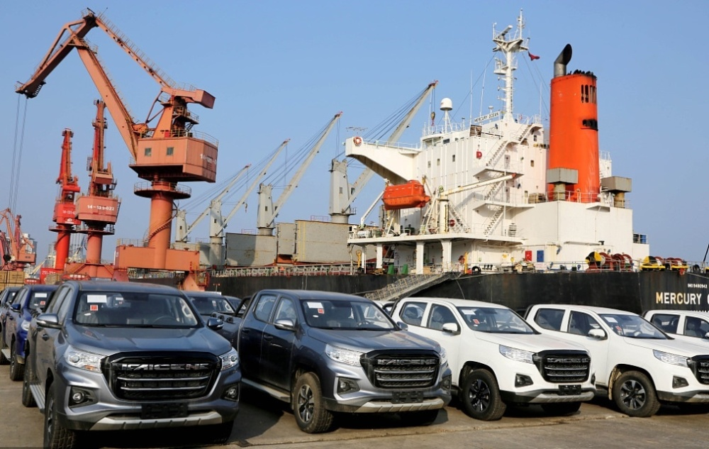
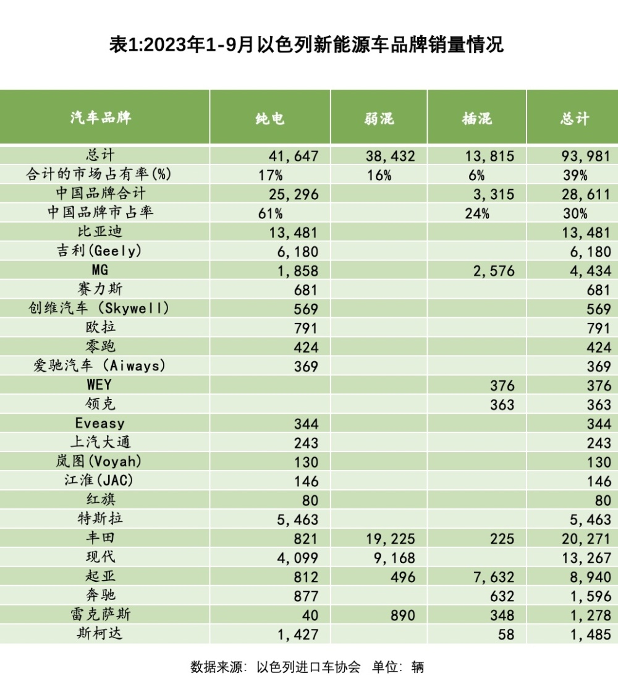

# 中国纯电车在以色列市占率达61%，车企高层称尚未对冲突做影响评估

特约作者 | 元凡

编辑｜陈弗也

出品|棱镜·腾讯小满工作室

“我们已经重新开门营业，整理好了展车。”10月19日，以色列特拉维夫赛力斯品牌展示店的以色列工作人员对《棱镜》说。

自10月7日巴勒斯坦伊斯兰抵抗运动（哈马斯）对以色列发动突袭以来，包括赛力斯在内的多家中国车，一度将展厅关门。

以色列是中国汽车品牌重要的海外市场，尤其是新能源车，几乎所有的中国新能源车品牌都在以色列销售，比如比亚迪、吉利几何、极氪、小鹏、创维汽车、零跑、赛力斯、长城WEY、欧拉、岚图、红旗、威马、爱驰、江铃Eveasy等。

综合多位以色列当地人对《棱镜》的介绍，目前，以色列的生产生活秩序正逐步恢复，部分商场和汽车展厅重新开门营业，学校分年级逐步复课，一些公司员工回到办公室上班，街上的人流、车流也略有恢复。而在此前，很多人在家中躲避战乱。

在以色列售卖的中国车，均以外贸方式用轮船运输。目前，以色列港口物流、海关通关受阻，速度慢、难度大，因为要运输战争物资，安全审查非常严格。

不过，据《棱镜》了解，中国汽车在以色列的履约尚未出现异常。

但令人忧虑的是，战事扩大的风险尚未排除，其所引起的对抗情绪可能会对汽车市场带来难以预测的影响。

**新能源车打开市场**

以色列的汽车市场不算大，年销售30万辆左右，但增速很快。2021年，以色列的汽车销量增长了38%，2022年有所下滑，但2023年恢复明显，前9个月仍增长了10%左右。

更重要的是，以色列新能源车市场发展势头良好，是中国新能源车出海重要市场。

2023年1-9月，以色利市场上卖出的新车39%是新能源车，这个比例高于中国和欧洲。并且，这些新能源车中30%是中国品牌，如果单独看纯电车型，中国品牌更是占到61%。

制图：《棱镜》特约作者元凡

以色利国土面积小，车主没有里程焦虑，3、4小时的车程就能抵达任何想去的市外目的地，日常使用不需要过多的里程。

此前，以色利汽车市场主要以欧美日韩车系为主，中国车的占比不高。2021年，中国品牌在以色列的市占率只有2.1%，但到了2022年市占率提升到7.5%，而今年前9个月，这个数字直接骤升到16.8%。

以色列也是全球少有的中国品牌能与欧美日韩品牌真正抗衡的地方。

此次巴以冲突的另一方巴勒斯坦，中国汽车品牌的出口量不大，但其身后的阿拉伯国家却是出海重镇，也是重要的增长极。根据乘联会数据，2022年，沙特是中国车海外销量最多的国家，阿联酋则排在第七。

虽然中国车在沙特的出口量大，但销售的主力是燃油车，毕竟那里的石油要便宜很多。

制图：《棱镜》特约作者元凡

战争让这些地区的汽车市场充满了未知数，上述赛力斯品牌展示店的以色列工作人员向《棱镜》作者表示，以色列掌握着战争的主动权，公司也会保护好他们的员工。

年轻人是汽车销量的主力，但在此次巴以冲突中，他们被卷入其中。

“周围不少年轻人都应召入伍了。”目前居住在以色列的Sam（化名）对《棱镜》说，她是一位有四个孩子的以色列全职妈妈。战争开始之前，大批以色列人从全球各地返回以色列参战。

以色列国内拥有约930万人，以色利之外则有约830万犹太人，而此次以色列动员的30万人入伍，占其全球总人口的2%，且以年轻人为主。

当然，战争给一个地区带来的冲击不仅局限在汽车市场。以旅游业为例，2022年以色列GDP约10%来自于旅游业，2020年、2021年，这个行业受疫情冲击严重，2022年刚刚略有恢复，如今又遭受了战争的影响。

目前，多个国家已经发出了“撤侨”通告，可以想象的是，在未来一段时间，这个地区的旅游业都将难有起色。

**龙头民营车企：尚未做影响评估**

中国汽车品牌在以色列的销售，主要依靠当地的合作伙伴，以色列也有若干个专门代理中国新能源车品牌的公司，比如，EV
MOTORS专门代理江淮、英伦电动汽车、威马；Metro Motor则主要代理岚图、零跑。

以色列人尼克（化名）就是这样一位代理商，他此前拥有多年的宝马汽车销售经验，2019年前后，他通过中国的合作伙伴联系了零跑、小鹏，希望代理其品牌在以色列的销售。

根据他的介绍，除了销售车辆之外，他还需要负责充电桩、展示门店以及售后保养网点的建设等。

2021年前后，吉利授权Geo
Mobility在以色列销售汽车，由于海外充电设备的插头和标准不同，Geo还需要帮助吉利进行改造。吉利旗下的领克品牌，则是通过原沃尔沃在以色列的经销商Mayer’s
Cars and Trucks进行销售。

比亚迪在2022年通过Champion
Motors在以色列进行销售，后者同时在以色列代理奥迪、斯科达、大众等品牌。2023年1-9月，比亚迪在以色列的销量达到1.3万辆，占其海外总销量的9%左右。

“身边很多朋友都在推荐中国电动车，价格不贵，大部分2万美元左右，空间宽敞、内饰舒适且科技感强。”以色列人Sam对《棱镜》说，经过多年的开拓，中国汽车品牌在以色列市场建立了不错的口碑。

不过，在战争的阴影之下，对立情绪越来越大，这些情绪有可能会逐步蔓延到汽车市场上。

冲突爆发之后，马斯克就宣布以色列的特斯拉超级充电站将免费提供服务，以表示对以色列的支持，但这让他招来了很多反对的声音。麦当劳在以色列的分支向以色列国防军捐赠餐食，很快黎巴嫩的一家麦当劳门店就被冲动的抗议者砸毁。

Sali（化名）是一位做投资生意的以色列女性，她向作者介绍，现在有部分以色列人开始对中国品牌产生了警惕心理。“不过整体上看，以色列人是包容的，相信不会迁怒中国产品。”

2020年前后，受地缘政治影响，来自中国的手机和汽车品牌在印度受到了冲击。此次巴以冲突，也让不少厂商有所担忧。

“我们还在观察，还没有做综合影响评估。”10月19日，某中国龙头民营车企高层向《棱镜》作者说道。

