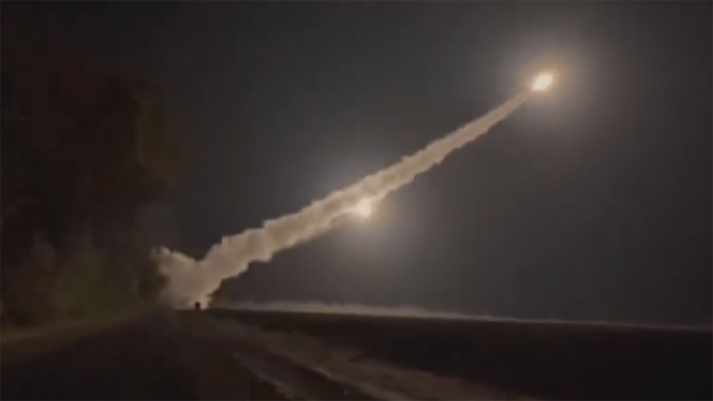

# 乌军称在扎波罗热东南部取得进展，并在第聂伯罗河东岸建立更大桥头堡

据CCTV国际时讯报道，乌克兰总统泽连斯基10月17日表示，乌军首次使用了美国提供的陆军战术导弹系统（ATACMS）对俄军用机场设施进行了打击。白宫当天也证实已向乌克兰运送陆军战术导弹系统。

对此，俄罗斯驻美国大使安东诺夫在社交平台上发文称，美方秘密向乌输送ATACMS导弹系统是“一个严重的错误”。

与此同时，乌克兰军方报告称，乌克兰军队近日在扎波罗热州东南部取得进展，同时还表示其部队已于10月19日渡过赫尔松州南部的第聂伯罗河，在东岸建立了更大的桥头堡。

**乌将定期获得远程导弹**

_视频截图_

当地时间10月20日，乌克兰外交部长库列巴表示，乌克兰将定期接收美国提供的陆军战术导弹系统（ATACMS）。

当被问及是否预计美国会定期向乌克兰运送ATACMS导弹，并增加导弹的数量时，库列巴回应称：“就是这个意思。这是泽连斯基总统和拜登总统9月底在华盛顿举行私人会晤时达成的协议的直接结果。”

据央视报道，白宫方面17日表示，已向乌克兰方面提供了ATACMS导弹，乌克兰总统泽连斯基当天对此予以确认，并称乌军已经在行动中使用上述导弹。此前，乌克兰方面曾多次要求盟国提供ATACMS导弹，暗示它们可以改变俄乌冲突走向。

陆军战术导弹系统由美国洛克希德·马丁公司于上世纪80年代研发，射程达300公里。同时它还可以通过“海马斯”火箭炮发射，并与此前英国提供的机载“风暴之影”巡航导弹形成互补。

在美乌两国确认美方向乌提供ATACMS导弹系统后，俄罗斯驻美国大使安东诺夫在社交平台上发文称，美方秘密向乌输送ATACMS导弹系统是“一个严重的错误”，将产生“严重后果”，美国此举是在继续推动北约与俄罗斯之间发生直接冲突。

**乌军在第聂伯罗河东岸扩大桥头堡**

_当地时间2023年10月18日，扎波罗热地区，乌克兰武装部队国土防卫部队第108独立旅在前线的战壕中接受训练。视觉中国 图_

当地时间10月19日，乌克兰军方报告称，乌军在扎波罗热州东南部取得进展，同时还表示其部队已于19日渡过赫尔松州南部的第聂伯罗河。

在南部前线作战的塔夫里亚集团指挥官亚历山大·塔尔纳夫斯基称，乌克兰军队在扎波罗热州韦尔博韦西南取得了部分胜利。乌克兰军队最近将进攻重点放在
韦尔博韦周围，10月17日，乌军在韦尔博韦以西推进了1公里。

与此同时，乌克兰武装部队总参谋部在10月19日早上发布的最新消息中指出，在空袭和地面战斗后，乌军已进驻赫尔松州第聂伯河东岸的皮什恰尼夫卡村。乌军还在该村北面推进，并进入距离第聂伯河约3公里的波伊马。

对此，俄罗斯方面也在社交平台Telegram频道中发布消息，确认乌克兰方面已控制该地区。

俄罗斯军事博客里巴尔警告称乌克兰军队正在跨河进攻，称乌克兰海军第35和第36海军陆战旅17日下午一度占领波伊马，不过俄军后来将乌军推回河边。

另有俄罗斯分析人士在Telegram上指出，这些进展表明乌克兰正在寻求进一步扩大东岸的桥头堡，乌军或处在跨河大规模进攻行动的初始阶段。

美国智库战争研究所（ISW）19日分析称，俄罗斯方面对可否击退渡过第聂伯河发动攻势的乌军的担忧可能与东岸俄罗斯军队的状况有关。

俄军指挥部已从赫尔松方向抽调更多精锐部队支援扎波罗热西部的防御行动。乌军的行动迫使他们不得不动用后备力量来牵制乌军，这增加了俄军在其他前线的压力。

不过，战争研究所还表示，乌军也不太可能在第聂伯河东岸建立一个“适合此时进一步调动大规模机械化部队”的桥头堡。

对于俄乌冲突局势，俄罗斯总统普京在10月18日称，乌军的反攻“尚未取得结果”。

据央视报道，2022年11月，乌军夺回了赫尔松和第聂伯河西岸的其他定居点，俄军则撤回东岸，此后俄军一直从第聂伯河东岸向西岸开火。近几个月来，乌克兰军队一直在对包括第聂伯河西岸在内的俄军控制下的赫尔松州部分地区进行小规模夜间袭击。

