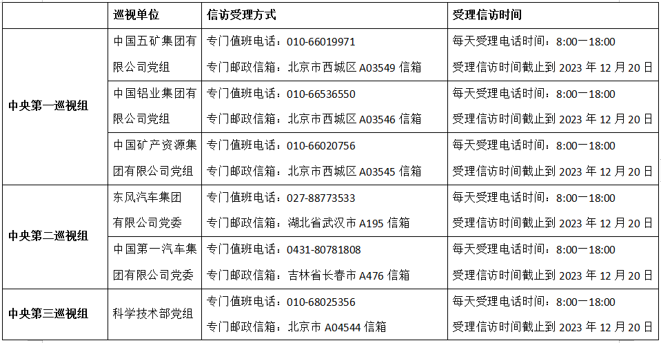
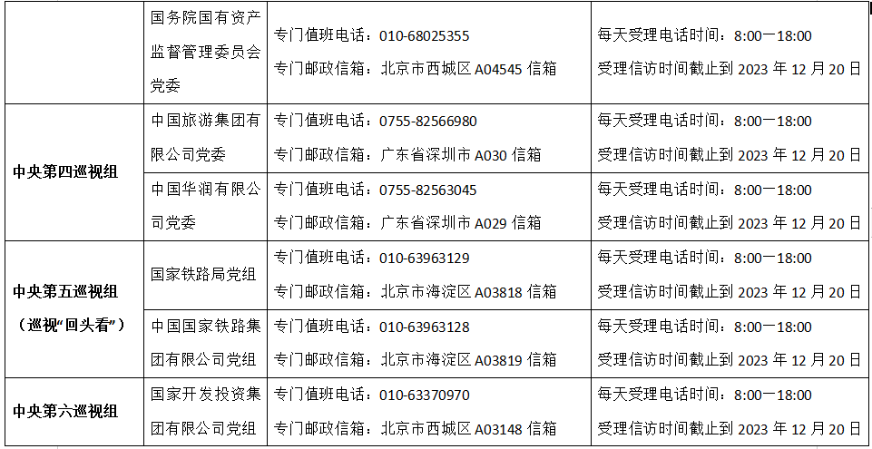
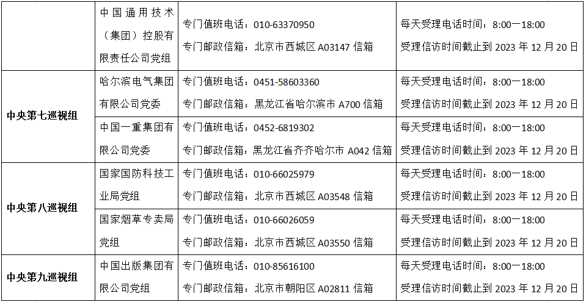
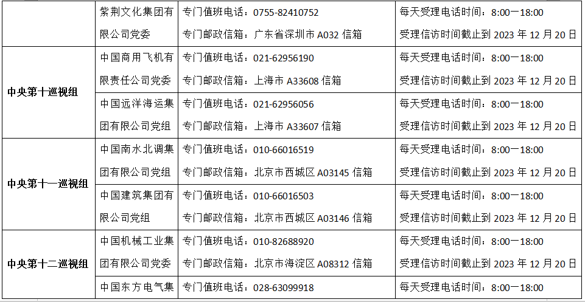
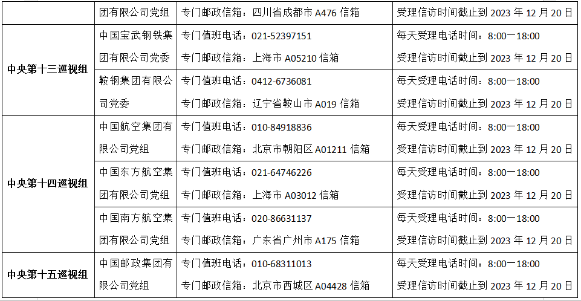
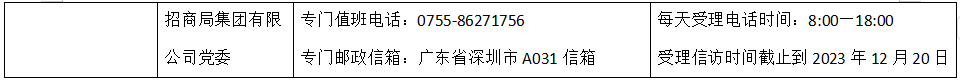

# 二十届中央第二轮巡视已进驻32家单位

据央视新闻，经党中央批准，二十届中央第二轮巡视将对科学技术部、工业和信息化部、国务院国有资产监督管理委员会、国家国防科技工业局、国家烟草专卖局和中国第一汽车集团有限公司、东风汽车集团有限公司等31家单位党委（党组）开展常规巡视；对国家铁路局党组、中国国家铁路集团有限公司党组开展巡视“回头看”。日前，二十届中央第二轮巡视的15个巡视组陆续进驻被巡视单位党组织开展巡视工作。

截至目前，中央巡视组已进驻32家单位，并公布了信访联系方式。

**信访受理范围：**

根据巡视工作条例规定，中央巡视组主要受理反映被巡视单位党组织领导班子及其成员、下一级党组织主要负责人和重点岗位人员问题的来信来电来访，重点是关于违反政治纪律、组织纪律、廉洁纪律、群众纪律、工作纪律和生活纪律等方面的举报和反映。其他不属于巡视受理范围的信访问题，将按规定由被巡视单位和有关部门认真处理。

