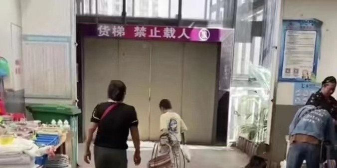

# 云南电梯坠落3死17伤，官方：货梯已用8年，今年5月检测合格

10月18日12时许，云南省红河哈尼族彝族自治州弥勒市佛城商都一期发生一起电梯坠落事故。据弥勒市人民政府新闻办公室发布通报，截至目前，3人抢救无效死亡，4人重伤、13人轻伤。新京报记者多方采访了解到，事发地佛城商都一期作为弥勒市最大的农贸市场，事发当天逢“赶街”，恰是人流量较大的时候。

19日，新京报记者从红河哈尼族彝族自治州应急管理局获悉，经初步了解，涉事电梯系货梯，事发时货梯从二楼坠落至负一楼。涉事货梯于2015年8月向相关部门办理使用登记。货梯制造商为上海爱登堡电梯集团股份有限公司，维保公司为上海爱登堡电梯安装工程有限公司。涉事货梯最近一次检测时间在2023年5月，检测结果为合格。事故原因正在进一步调查中。

**货梯从二楼坠落至负一楼**

10月19日，当地居民何女士告诉新京报记者，事发地位于云南省红河哈尼族彝族自治州弥勒市佛城商都一期，该商城地上共四层。18日11时50分许，正在商城四楼工作的她突然听见一声巨响，“咚的一声，后面我听说电梯那边出事了。有看见的人说，电梯门刚关上电梯就掉下去了。”

据何女士介绍，发生事故的电梯是商城内部的大货梯，“它（货梯）可同时容纳两辆三轮车，平时都是人、车、货一起乘坐。”何女士称，出事的货梯内，平时都会有一名保安负责维护电梯内的秩序。“但他就是管理楼层按钮，人挤的时候说一下，一般不会管人进货梯的事情。商城内除了货梯外，还有小的客梯和扶梯。”

一张由当地商户提供的图片显示，“货梯禁止载人”的标语被贴在涉事货梯入口的上方。

另一位当地居民告诉记者，涉事货梯的一层入口沿街而设，位于佛都商城一号门附近。楼上的商户每天会将采购的货物装在三轮车上通过该货梯运送到店里。在当地，每周三和周六适逢“赶街”，这一天居民都会上街采购日常用品等。发生事故的当天正是周三，前去“赶街”的人很多。

公开资料显示，佛城商都一期于2015年建成投入使用，涵盖生鲜、蔬菜、熟食、水果、特产、干货调料、百货、服饰等多个业态。四楼引摊入市，以农家自种果蔬售卖为主，弥勒特产、特色小吃、传统餐饮为辅。在云南省市场监督管理局官网上，一篇名为《云南省“管集市”专项行动农贸市场星级评价见成效》的文章提到，作为弥勒市最大的农贸市场，佛城商都市场日均人流量可达到2万-3万人。

19日12时许，新京报记者联系到红河哈尼族彝族自治州应急管理局。一名工作人员告诉记者，经初步了解，涉事电梯系商城内部货梯，事发时电梯从二楼坠落至负一楼，造成多名人员伤亡，死伤者基本都是弥勒市当地人。涉事货梯于2015年8月12日向相关部门办理使用登记，最近一次检测时间在2023年5月，检测结果为合格。电梯厂商为上海爱登堡电梯集团股份有限公司，由上海爱登堡电梯安装工程有限公司负责电梯维保工作。目前，国家市场监督管理总局以及应急部相关专家正在赶往现场，具体的事故原因还有待进一步调查。

_事发商城。受访者供图_

天眼查显示，近年来上海爱登堡电梯安装工程有限公司因多次未按《中华人民共和国特种设备安全法》以及安全技术规范进行电梯维护保养、维保记录缺失、电梯内部设置故障但未如实记录等问题，被成都、岳阳、厦门等地的市场监管部门处罚。最近一次，2023年1月18日，成都市双流区市场监督管理局执法人员对电梯进行抽查，发现维保记录第一次维保时间是2022年5月11日，最后一次维保记录时间2022年9月26日。维保单位上海爱登堡电梯安装工程有限公司的工作人员表示后期维保记录都是通过手机APP进行维保登记，但通过手机APP查询，仅查询到2023年1月16日有一次维保记录，涉嫌违反了《中华人民共和国特种设备安全法》第八条第一款的规定。

**业内人士：电梯发生坠落事故的概率极低**

多名电梯行业的从业者表示，电梯发生坠落事故的概率极低。

从事电梯行业40年的丁先生告诉记者，从目前网传的视频画面来看，涉事电梯系大型货梯。“首先，用来承载电梯重量的钢丝绳全部断裂的可能性极低，再加上货梯自身安全系统的保护，电梯坠落的情况非常罕见。”丁先生表示。

导致电梯坠落的原因会有哪些？丁先生分析称，一种可能性是，电梯某部件的用料出现了问题。从电梯运行上来看，可能是电梯某些零件疲劳变形，导致对重反绳轮轴芯固定处装置塌陷，对重反绳轮轴芯脱位，进一步导致起到曳引作用的主钢丝绳悬空不受承载力，最终电梯厢超速向下坠。“就像一个篮子，你往篮子里放东西，篮子长期承受拉力，如果篮子的材质单薄，它就容易出现问题。”丁先生称，正常情况下，电梯坠落时，位于电梯厢底部的安全钳会迅速运作，阻止电梯下坠。“我个人猜测，当时安全钳应该是运行的，但未能完全且及时地发挥作用。它（安全钳）仍然一定程度上减缓了电梯下坠的速度，否则伤亡人数可能还会增加。”丁先生说。

丁先生还称，另一种可能导致电梯坠落的情况是维保公司未严格按要求对电梯部件进行检查、维护，从而埋下安全隐患。“某些维保公司低价竞争获得维保合同，在之后的电梯维保工作中疏忽懈怠，等到电梯出现问题了，才派人去检查、维保。”

记者注意到，今年4月，国家市场监督管理总局发布最新版《电梯监督检验和定期检验规则》（下文简称“规则”）。该规则显示，各电梯部件对应不同的维保要求。此外，规则还提到，“定期检验”应该以安装监督检验合格日期为基准，按照以下周期和要求实施：15年以内的电梯，分别在第1、第4、第7、第9、第11、第13、第15年按照以年份进行监督检验。

丁先生还表示，“外力破坏”也可能是导致电梯坠落的原因之一。“比如工人维修电梯时不小心造成某部件的损坏。又或是电梯受到强力撞击，导致电梯出现故障。”

在丁先生看来，不管是哪一种情况，电梯发生坠落事故前，电梯内应该有异常情况出现。“比如坐电梯时可能会听到有异常的噪音。如果有人关注到并及时采取措施，或可避免事故发生。”丁先生说，正常的物业公司每天都会对电梯进行巡检。

为了避免此类事故再次发生，丁先生建议，首先电梯管理方应加强管理，此类货梯应该避免出现“人、车、货”混载的情况出现。一旦出现电梯失控坠落，头背应紧贴电梯壁，手抱脖颈半蹲下，以减缓电梯下坠带来的冲击。此外，事故发生后，切忌擅自开电梯门逃生，此类做法很有可能导致意外再次发生。

新京报记者 熊丽欣 彭镜陶

编辑 刘倩 校对 李立军

