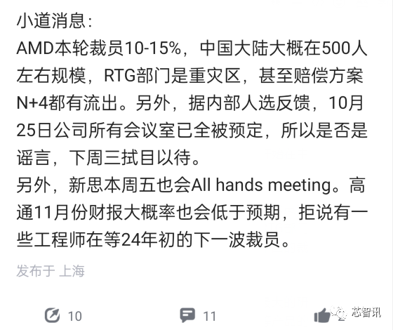

# 传AMD中国将裁员15%，GPU部门是重灾区，补偿方案“N+4”

10月20日消息，近日，某职场社交平台上有网友爆料称，AMD将开始在中国进行裁员，裁员规模或达450人。

根据爆料称，AMD这一轮裁员比例可能为10%-15%，或将涉及300-450名左右的员工，其中RTG部门是重灾区。赔偿方案据说是“N+4”，不过也有传闻称“N+7”也有一定可能。

有内部人士反馈，10月25日当天AMD上海内部的会议室都被HR预订完（裁员前兆）。

资料显示，AMD上海研发中心成立于2006年，是AMD公司在美国本土以外最大的研发中心，员工总数约3000名。该中心主要负责CPU、GPU和APU等产品的设计、开发和测试等工作，曾经为AMD贡献了不少创新的技术和产品，例如Ryzen系列处理器、Radeon系列显卡等。

爆料中提到的“RTG部门”全称是“Radeon Technologies Group”，即AMD的Radeon系列显卡技术部门。

**AMD为中国GPU产业贡献了大批人才**

近年来，随着人工智能产业的爆发，对于高性能GPU芯片的需求暴涨，这也直接带动了市场对于GPU厂商的追捧，GPU龙头大厂英伟达的市值也是持续大涨，今年更是突破了1万亿美元。与此同时，美国对于中国半导体产业也是持续打压，推动了国内对于自主可控的高性能GPU的需求，再加上资本的助推，国内这几年已经涌现出了一大批国产GPU初创公司，比如壁仞科技、天数智芯、燧原科技、沐曦集成电路、摩尔线程、瀚博半导体、智绘微电子、格兰菲、芯动科技等。

由于过去几十年来，GPU市场经过充分的市场竞争，主要就剩下了英伟达和AMD这两家巨头，几乎垄断了整个GPU市场，这也使得GPU人才高度集中于英伟达和AMD。即便是近两年重新进入独立GPU显卡市场的英特尔，发展独立显卡业务也不得从英伟达和AMD大肆挖人。

同样，很多国产GPU初创公司的核心GPU人才也主要都是来源于AMD和英伟达。

比如，成立于2020年的沐曦集成电路，该公司创始人陈维良曾任AMD全球GPGPU设计总负责人；两位CTO均为前AMD首席科学家，目前分别负责公司软硬件架构；核心成员平均拥有近20年高性能GPU研发经验。

成立于2018年的燧原科技，其公司创始人赵立东曾任紫光通信科技集团有限公司副总裁、AMD计算事业部高级总监；COO张亚林曾任AMD资深芯片经理、技术总监。

成立于2015年的天数智芯，其首席科学家郑金山为原AMD首席工程师，首席技术官Chien-Ping Lu曾任三星全球副总裁。

成立于2020年的摩尔线程，其核心创建团队基本都来自英伟达。比如其创始人兼CEO张建中曾是英伟达全球副总裁、中国区总经理。他于2005年加入英伟达，带领团队开拓了英伟达
GPU在中国完整的生态体系，推动中国成为英伟达全球最重要的市场。

成立于2018年的瀚博半导体，其创始人张磊任职于ATI / AMD多伦多，总体负责视频和深度学习加速器领域，在上述领域持有 40
多项专利。另一位创始人钱军也曾是前AMD高管。

成立于2019年的壁仞科技，在2021年就挖来了前AMD全球副总裁李新荣（Allen
Lee）出任联席CEO，专注壁仞科技组织，管理及产品设计端。同时还挖来了前AMD产品开发负责人陈文中正担任公司高级副总裁，主要负责壁仞科技芯片技术研发与管理工作，带领团队打造具有领先性能的通用算力芯片产品。资料显示，李新荣在GPU领域拥有超过30年的丰富经验，加入壁仞科技之前在AMD就职15年，担任全球副总裁、中国研发中心总经理，负责AMD大中华区的研发建设和管理工作；陈文中是躬耕GPU行业25年的老兵，有深厚的研发与团队管理经验。曾在AMD、S3、Trident等知名图形企业领导核心产品开发团队。在AMD工作期间，他曾领导一支规模近500人的技术团队，在8年内实现了9款芯片的流片与量产，其中包括首款采用HBM技术的GPU芯片。

通过上面的介绍，我们不难看出，众多国产GPU厂商的核心人员更多是来自于AMD，而非英伟达。这主要是因为，AMD在中国大陆有研发中心（英伟达则没有），也间接为中国的国产GPU产业的发展贡献了不少的人才。

特别是在去年10月7日，美国出台对华半导体限制新规之后，国内进口可以用于AI计算的高性能芯片也受到了管制。今年10月17日，美国再度升级限制，使得更多的英伟达和AMD的GPU产品被列入了管制。这也直接影响到了AMD在中国大陆的相关研发工作。在此背景之下，传出AMD将在中国进行裁员的消息也并不令人意外。虽然这并不是我们愿意看到的，但是从另一个方面来看，或许AMD此番裁员也将为国产GPU厂商贡献更多的人才。

**新思科技也将裁员？高通明年年初还将裁员？**

值得注意的是，该爆料还称，新思科技本周五（今天）也会“All hands
meeting”，预示可能也会有裁员动作。另外高通可能在2024年初进行新一轮裁员。

资料显示，作为全球EDA巨头，新思科技自1995年就在中国成立了公司，目前已经在北京、上海、深圳、厦门、武汉、西安、南京、香港等城市设立机构，员工人数超过1500人，拥有完善的技术研发和人才培养体系。

目前，美国的相关限制对于新思科技的影响主要在于，其无法向已经被美国列入实体清单的中国芯片设计企业（比如华为海思等）供货，这也确实对于其业务造成了不利的影响，但是在目前越来越多的企业开始加入自研芯片所带来对于EDA的更多需求的对冲之下，影响程度还是相对有限的。因此，裁员的传闻存疑，有待进一步确认。

至于高通，在今年9月下旬，业内有传闻称，高通将裁撤中国的WiFi部门，大约50多人（包括软件＋验证）将会全部裁掉。其余每个部门将会裁员20%。补偿标准最高N＋7。

对此，高通中国回应称，“这是今年早些时候公司总部对外公布的调整计划的一部分，网传的‘大规模撤离上海’、‘一窝端’等都不属实。鉴于宏观经济和需求环境的持续不确定性，公司预计将进一步采取调整措施，以实现对重要增长机遇和业务多元化的持续投资。虽然相应计划还在制定中，但预计主要措施将包括裁员，与此类措施相关将产生大量额外的调整费用，其中很大一部分预计将发生在2023财年第四季度。预计相应的调整措施将在2024财年上半年基本完成。在中国采取的调整措施也是之前对外沟通的相应计划的一部分。”

对于高通是否会在明年年初对国内员工进行新一轮裁员，从高通官方之前的说明来看，今年年底将是尾声。但是也不排除高通由于业绩继续下滑的压力，进一步进行调整。

编辑：芯智讯-浪客剑

