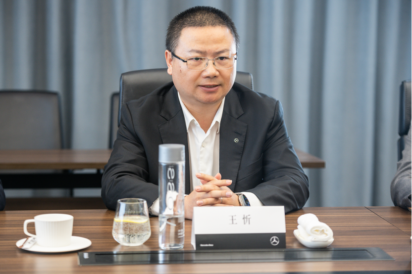

# 奔驰在华智能化提速：研发团队将扩至2000人，深化与本土科技公司合作

腾讯新闻《远光灯》 作者 谢婉

奔驰再次提速智能网联汽车在华落地进程。近日，奔驰与上海金桥管理局和金桥集团签署合作备忘录，三方将在自动驾驶和智能网联汽车领域建立深度合作。

“梅赛德斯-奔驰在德国已实现了L3 级有条件自动驾驶系统和 L4
级自动泊车的商用，在高级别自动驾驶方面，奔驰有非常清晰的发展路径和较强的场景运用实力，希望能够将这些技术尽早带到中国。 ”梅赛德斯-
奔驰（中国）投资有限公司高级执行副总裁、梅赛德斯-奔驰中国研发和采购负责人，梅赛德斯-
奔驰（上海）数字技术有限公司董事长欧立甫表示，为实现这一目标，奔驰与本土合作伙伴展开密切合作，同时，已经有许多试点项目取得了成果。

继2019年奔驰上海国际设计中心、2022年全新上海研发中心成立之后，2023年6月，奔驰（上海）数字技术有限公司在上海正式注册成立。据悉，奔驰上海研发中心全新办公大楼计划于2024年上半年正式启用。

欧立甫表示，中国研发团队是梅赛德斯-
奔驰全球研发体系中非常重要组成部分，本土研发团队已紧密融入全球的研发网络中。预计到2023年底，奔驰在中国的研发团队规模将增长至2000人，相比2020年增长近一倍。

据悉，2023年前9个月奔驰在华累计交付超过57.87万辆新车，同比增长3%。目前已有超720万中国用户创建了梅赛德斯-
奔驰账户，年内，奔驰将陆续向符合条件的80余万车辆推送包括高德定制导航更新、语音助手优化、零层级用户界面更新在内的多项OTA升级服务。

**以下是媒体沟通实录** （经删减整理） **：**

**被访人：**

梅赛德斯-奔驰（中国）投资有限公司高级执行副总裁、梅赛德斯-奔驰中国研发和采购负责人、梅赛德斯-奔驰（上海）数字技术有限公司董事长 欧立甫

梅赛德斯-奔驰（中国）投资有限公司执行副总裁、梅赛德斯-奔驰中国研发自动驾驶及车联网负责人、梅赛德斯-奔驰（上海）数字技术有限公司首席执行官 王忻

**提问：在中国市场，消费者对智能化的需求越来越多，梅赛德斯-奔驰如何响应这样的需求？梅赛德斯
-奔驰（上海）数字技术有限公司成立以后有哪些具体的技术或方向，能够反哺到全球市场？**

**欧立甫：** 今年 2月份，梅赛德斯-
奔驰发布了MB.OS操作系统的规划，我们对这套自主研发的覆盖芯片到云端的专属全新架构充满信心。基于MB.OS操作系统，我们将为中国、美国和欧洲在内的全球客户提供最先进的智能化技术、丰富的应用和内容以及便捷愉悦的数字化体验。

比如，我们最近发布的全新长轴距E级轿车将搭载
MB.OS操作系统的前身，配备第三代MBUX智能人机交互系统。全新长轴距E级车所搭载的导航辅助驾驶系统覆盖高速及城市快速路段，具备实现高速点到点的导航辅助驾驶能力，拥有自动变道、自动远离大车、自动驶入驶离匝道等L2+智驾功能；全新升级的语音交互系统将实现毫秒级响应；信息娱乐系统大幅改善和优化，可支持多种视频、音乐、有声书等多媒体APP
，包括爱奇艺、腾讯视频、火山车娱等；此外，采用由Unity中国提供的3D引擎，在全新高德定制导航实现高品质地图界面渲染。

**王忻：**
我们中国研发团队当前的首要任务是提升创新速度，充分满足中国市场和客户的需求。在与德国研发团队合作的过程中，我们本土团队越来越多地发挥着引领作用。全新长轴距E级车是豪华品牌中首款搭载了高通8295智能座舱芯片的座驾，这带给我们更多的想象空间。接下来，我们本土团队将不断地改进和升级软件。我们有一个非常明确的方向、非常努力的团队，通过数字化驱动，梅赛德斯-
奔驰将快速响应市场反馈，并不断优化我们的产品。

**提问：在研发的方向上，中国团队是否可以给全球研发体系带来一些新的思路，比如新的研发文化？MB.OS的发展计划是怎么样的？**

**王忻：** 全新梅赛德斯-
奔驰长轴距E级车上有很多中国专属的配置，包括与高德合作的导航系统、点到点的导航辅助驾驶系统（L2+），以及多种基于安卓的中国的车机应用。这些功能都是在中国团队深入研究的基础上进行迭代开发的。

中国研发团队是奔驰全球研发体系的一部分。我们开展的许多本土需求研究都直接反馈到全球的研发网络中，进行全球研发时会充分考虑中国市场和中国客户的需求。

提速MB.OS操作系统的研发，最主要就是软硬件的解耦。通过MB.OS操作系统，在应用层面中国团队可以自主开发符合本土需求的先进功能。这种模式将快速提升我们的研发速度和市场响应能力。

**提问：奔驰和金桥的合作中，双方分别扮演什么角色？**

**欧立甫：** 梅赛德斯-
奔驰与上海浦东金桥合作，旨在通过金桥优越的投资环境和政策支持，快速推进未来在数字化领域的创新。上海金桥的智慧城市发展战略与我们发展智能网联技术、智能汽车的战略不谋而合，我们相信，
此次合作将实现双赢。

在自动驾驶领域，我们正致力于将L2+智能辅助驾驶系统应用于全新车型上。事实上，梅赛德斯-
奔驰在德国已实现了L3级有条件自动驾驶系统和L4级自动泊车的商用。在高级别自动驾驶方面，我们有非常清晰的发展路径和较强的场景运用实力，我们非常希望能够将这些技术尽早带到中国，为客户带来更便捷、安全、舒适的智能化体验。

为实现这一目标，我们与本土合作伙伴展开密切合作，同时，已经有许多试点项目取得了成果。在自动驾驶技术的应用上，我们始终将安全置于首位。

**提问：在智能化方面， 除了自研，梅赛德斯-奔驰对于与中国本土企业的合作研发，有没有相应的规划？**

**欧立甫：**
我们正不断深化与中国的科技公司、初创企业和顶尖高校的合作，包括腾讯、清华大学等。此外，我们还有许多合作项目正在进行紧锣密鼓地推进中，范围涵盖语音识别技术、车载导航、娱乐系统等。我们的中国合作伙伴的技术研发实力处于全球领先地位，通过这些合作，我们希望快速地实现创新，为客户带来符合其需求的技术、产品和服务。

**提问：梅赛德斯-奔驰是否关注中国车企在软件上的发展，奔驰在软件方面的优势和挑战体现在哪儿？
针对一些先进且适合全球市场的中国专属配置，在反哺全球这一点上，奔驰是如何考虑的？**

**欧立甫：** 中国研发团队是梅赛德斯-
奔驰全球研发体系中非常重要组成部分，我们的本土研发团队已紧密融入全球的研发网络中。我们的首要目标是为中国客户带来量身定制的产品和服务。同时，如果某些功能也同样符合全球客户的需求，我们当然会将这些技术带给全球客户。预计到2023年底，奔驰在中国的研发团队规模将增长至2000人，相比2020年增长近一倍。

