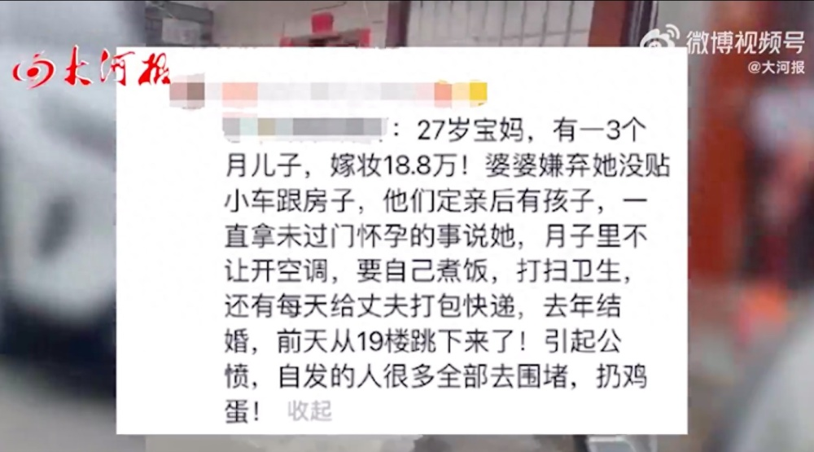

# 女子产后遭婆家冷暴力跳楼身亡？警方：暂无证据证明是被逼死的

据大河报报道，10月20日，网传广东揭阳一女子在小区内跳楼身亡，疑似其产后遭丈夫和婆婆冷眼相对。另有网友发视频称，该事件在当地迅速引起众怒。

网传图片显示，27岁宝妈，有3个月儿子，嫁妆18.8万。婆婆嫌弃她没贴小车跟房子，一直拿未过门怀孕的事说她，月子里不给开空调，要自己煮饭打扫卫生，还要每天给丈夫打包快递。

去年结婚，前天从19楼跳下来了，引起很多人不满。

10月20日，当地派出所一工作人员对大河报记者表示：不要听信外面人造谣，没有找到证据之前，不能说“是被逼死的”，该事件正在调查。

**【来源：大河报】**

