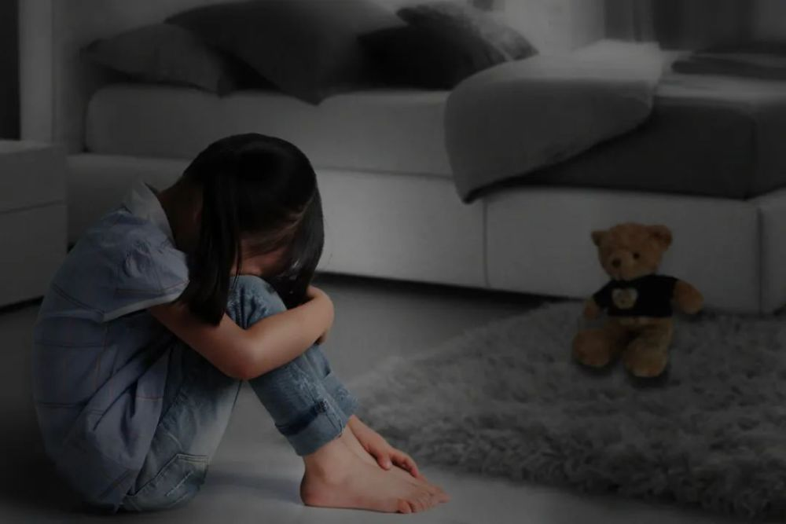

# 强迫幼儿吃呕吐物，幼师虐童如何根治

近日，沈阳一名家长发文称，自己的孩子遭到幼儿园老师虐待，被迫吃下呕吐物。家长称：“午饭后老师强迫孩子吃南瓜，孩子咽不下呕吐在盆里，老师又盛出呕吐物往孩子嘴里塞。”在得知孩子疑似遭到虐待后，家长多次与幼儿园沟通，经过多日争取，最终在派出所的协调下，他们才看到了监控回放。

10月13日，针对该事件，沈阳市和平区教育局微信公众号“和平教育”发布通报：“经核查，涉事教师不当行为属实”“责令幼儿园对涉事教师予以辞退处理，对幼儿园作降级降星处理，并约谈幼儿园负责人，要求其马上进行园内工作全面整顿”。

学龄前时期是儿童身心发展的重要阶段，学前教育也是基础教育的重要组成部分。研究表明，儿童虐待和其他幼时不良经历可长期较强地影响到儿童的脑结构、心理机能、心理健康、健康危害行为。然而，近年来，幼师行业中却频频曝出背弃师德的事件，幼儿园教师扎针体罚学生、连续扇孩子多个耳光、电熨斗烫伤儿童等虐童事件不时见诸网络，引发社会广泛关注，虽然一些幼教事后受到了惩治，但虐待行为对儿童身心健康造成的伤害已成事实，有限的事后追责对于防止幼儿园再发生此类行为，远远不够。

_图/图虫创意_

**幼师虐童，为何屡禁不止？**

儿童是国家、民族与家庭的未来和希望，他们健康快乐地成长是社会共同的愿望。幼儿园虐童事件在网络上被曝光后，往往会在短时间内引发社会各界的关注、批判与反思，相关部门也会在第一时间明确提出大力整顿的措施。但随着时间的流逝，事件的热度、关注度逐渐下降，类似事件又会不断出现。

中国学前教育社会化起步较晚，这使得目前我们的学前幼儿教育无论是在观念还是在专业性上都仍存在着短板。特别是幼师队伍素质良莠不齐，幼师无证上岗现象比较普遍，在一些幼儿园中，甚至是幼师的家属、亲戚齐上阵，失范的风险可想而知。由于师资队伍建设水平低，很多幼师都没有经过师范的正规学习，缺乏职业道德、法律知识和对儿童的同理心、耐心和爱心，使得幼儿园的虐童事件时有发生。

当然，幼师虐童并不只是教育部门就能解决的，其是一个牵扯到多部门、多机构综合性治理的难题。一方面，中国现有法律体系中涉及儿童保护的内容，大部分都是纲领性的规定，往往只规定了禁止某项行为，但是对行为的细致划分和对应的处罚措施则规定的不够详细，对于一些非典型性的虐童事件应该如何处理，无法做到法律上的统一，实践中会导致本应协同保护幼童权利的刑事、行政和民事法律互相推卸责任，最终致使法律无法落地实施。

另一方面，虽然在《未成年人保护法》《教师法》《幼儿园管理条例》等法律法规和部门规章均对儿童权利保护作出了一定程度上的细致规定，但是由于其散布于各专门法，立法时间和立法背景的不同，使得这些法律法规和部门规章之间也存在一些冲突，没有形成系统性、专门性的关于儿童权利保护的法律体系，实务中甚至还会因此发生法律适用上的困难。

**幼师虐童，法律怎么说？**

首先，幼师虐童将面临主管部门追究的行政责任，这也是公权力维护社会秩序的有力手段。如《未成年人保护法》规定学校、幼儿园、托儿所侵害未成年人合法权益的，由教育行政部门或者其他有关部门责令改正；情节严重的，对直接负责的主管人员和其他直接责任人员依法给予处分。除此之外，《幼儿园管理条例》也对体罚或变相体罚幼儿的规定了相应的行政处罚责任，教育部门还可以对幼儿园采取限期整顿、停止招生、停止办园的行政处罚。通过行政处罚的手段倒逼其加强自身管理。沈阳这起强迫儿童吃呕吐物事件，目前报道的处罚就是行政处罚。

更为严厉的是刑事责任。对于情节严重的虐童行为，可能触犯《刑法》规定的虐待被监护、看护人罪，将被处三年以下有期徒刑或者拘役。《刑法》还规定，构成虐待被监护、看护人罪的同时还构成其他犯罪的，依照处罚较重的规定定罪处罚。也就是说，对于幼师实施了更为严重的犯罪行为的，如故意伤害行为、强制猥亵行为等，会以更严厉的刑事处罚定罪量刑。

当公权力追究完了以上的行政和刑事责任后，受害人及其监护人还可以通过法律手段让虐童幼师和幼儿园承担民事责任并获得经济赔偿，进行全方位的追责。从民事角度来看，涉事幼师除了可能因为虐童行为，承担相应的民事侵权责任外，如果幼儿园不能证明其尽到了教育、管理职责，依法也应当承担侵权责任。也就是说，孩子在幼儿园受到伤害，幼儿园承担的是严格责任，如果幼儿园不能证明其尽到教育、管理职责的，推定其在法律上有过错，也需要对孩子在幼儿园期间的人身损害承担侵权责任。

**防止幼师虐童，如何做？**

“徒法不足以自行”，若是法律得不到有效的执行，就会显得苍白无力。面对幼师虐童行为长期不能得到有效解决的困境，政府相关部门应当强化监督管理体系，力求根治。

一方面，避免恶性事件的再次发生，规制虐童行为，亟需一套行之有效的法律途径。教育部门应协同公安、检察院、法院等，协调法律的适用条件，通过司法解释等方式，明确虐童行为在民事、行政和刑事角度的法律定性，并开展陈旧法律法规的修订工作，以保障其可以适应目前形式下的虐童治理体系要求。同时，要积极探索建立多层次、立体化的幼儿教育监督管理体系，制定虐待儿童强制报告机制，完善虐童事后救助体制，保障法律法规可以得到有效地施行。

此外，对虐童的违法犯罪要秉持“零容忍”的态度，按照性质而不是程度来治理虐童行为。对于虐童的违法犯罪活动，教育部门应会同公安机关等尽快介入，摸清案件性质，从严处罚；对于涉嫌刑事犯罪的，要尽快批捕归案。同时，在处罚侵害幼童身心健康的行为人时，可以要求其禁止从事与未成年人密切相关的职业，并在档案系统中进行公示记录，避免其更换从业机构后继续从业，给其他儿童造成不必要的伤害。

我们还应当注意，在虐童事件中，儿童才是遭受伤害最深的人，除加害人需要受到相应的处罚外，儿童身心健康的重建也是重要的部分。随着时间的推移，身体上的伤疤会渐渐淡去，但心理留下的阴影却不能轻易抹去，有些人甚至是终生难以治愈。所以，政府相关部门还需要加大对心理辅导机构的投入力度，聘请专业的心理辅导人员对受侵害的儿童进行心理疏导。

另一方面，要强化事前防御，提升幼儿园办园准入标准、建立严格的准入制度。主管部门对于新开办的幼儿园必须在申请办园审查的过程中，进行实质性审查，确保硬件设施与软件条件达到标准，严格按照国家规定的幼师资格条件招聘教师。对已经开办的幼儿园，相关部门要清查幼儿园的办学资质和幼儿教育从业者资格证书，整改或取缔未取得办园许可证、设施条件差、管理混乱、存在严重安全隐患的幼儿园，确保在园幼师的专业素质和道德素养。其次，要进一步加强师德师风建设。从现实看，发生一些师德师风问题，与个别地方教育主管部门及学校失察失职、纠正不力有关。加强师德师风建设，除了要把好幼师入口关，还要把好日常监督关。通过法治教育、警示教育、日常教育督导等，强化事前预防，引导广大幼师严于律己，严守师德底线。

幼儿问题牵扯到千家万户，儿童是祖国的未来，是最大的民心所向。希望相关部门秉持对伤害幼儿行为“零容忍”的态度，守住幼儿教育的底线，让天下父母能安心、放心。

（作者系民建安徽省社会与法治委员会主任、北京京师（合肥）律师事务所主任）

本文仅代表作者观点

发于2023.10.23总第1113期《中国新闻周刊》杂志

杂志标题：幼师虐童如何根治？

作者：朱政

编辑：王晓霞

