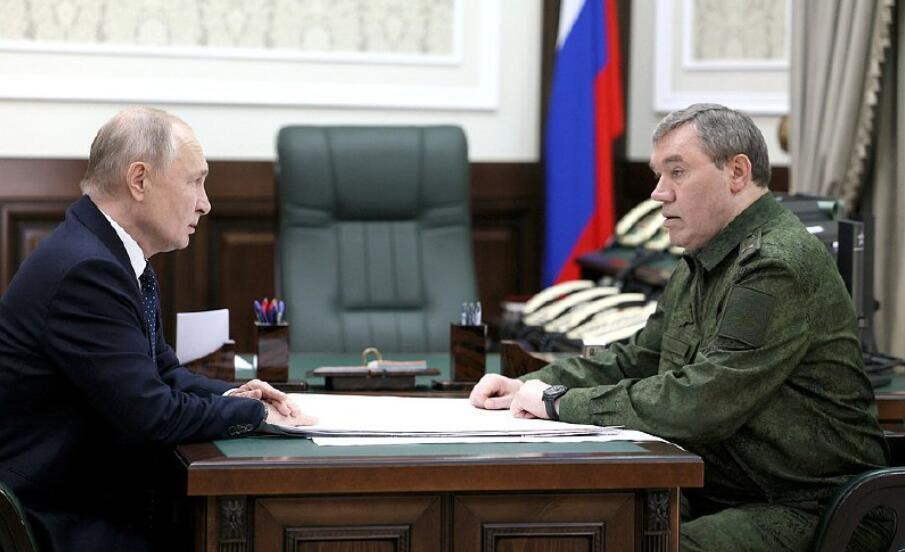
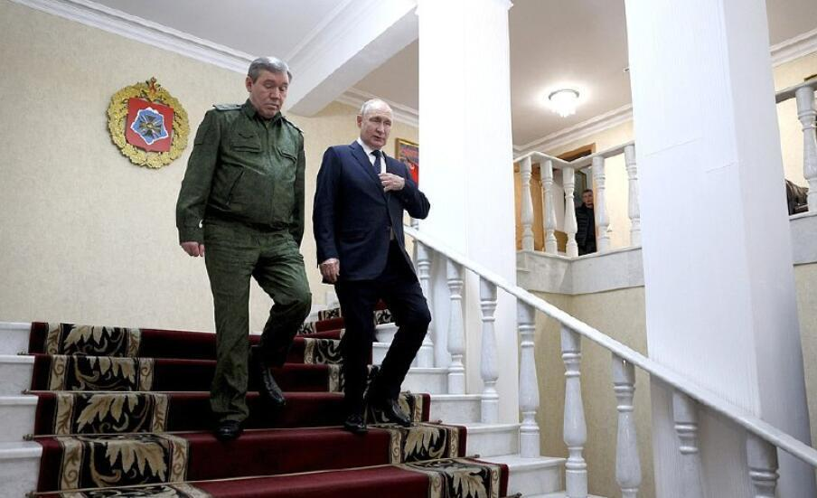
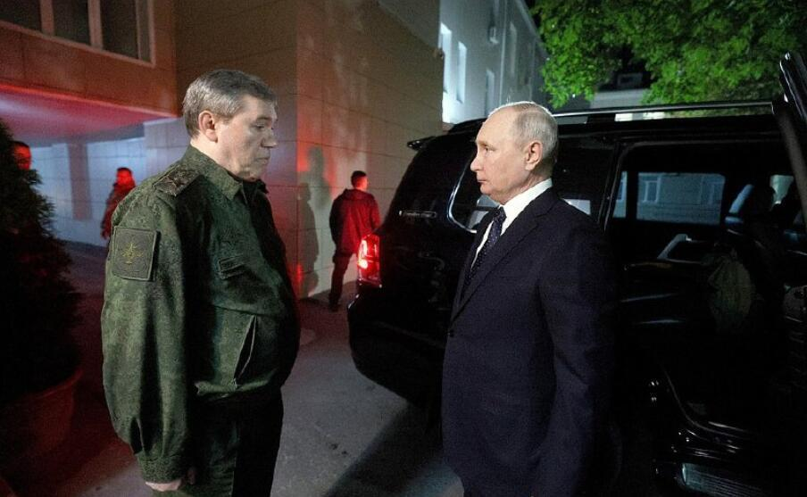

# 普京视察特别军事行动指挥部，听取俄军总参谋长格拉西莫夫汇报

（观察者网讯）据俄新社20日报道，俄罗斯总统新闻秘书佩斯科夫透露，俄总统普京视察了位于顿河畔罗斯托夫的“特别军事行动”指挥部，听取俄军总参谋长格拉西莫夫大将汇报“特别军事行动”进展情况。

格拉西莫夫汇报称，“区域联合部队”正在按照“特别军事行动”计划执行任务。随后，普京还与国防部高层官员举行了其他会议。

据悉，普京会定期视察俄罗斯武装力量总部，上一次视察是在八月份。

**本文系观察者网独家稿件，未经授权，不得转载。**

