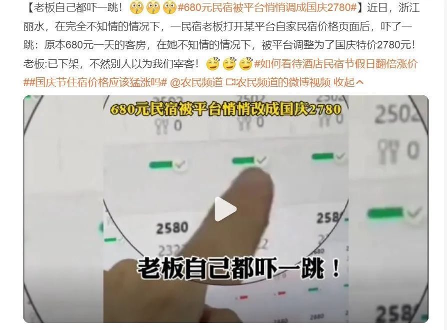
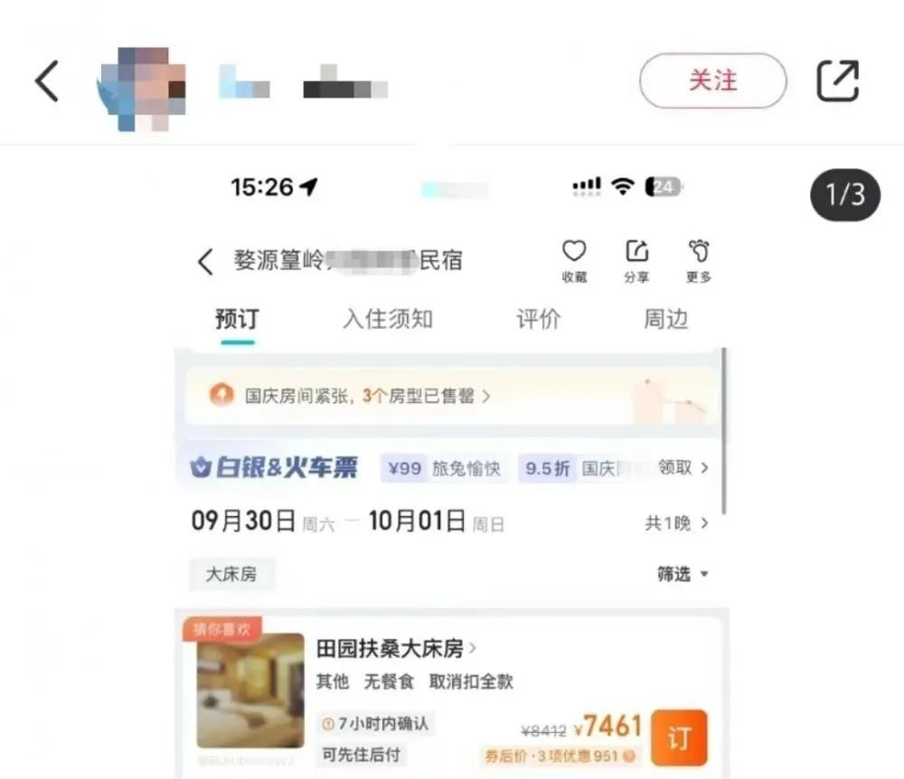

# 热门假期涨价4倍甚至60多倍，民宿“节日保护价”合理吗？

今年以来，随着疫情防控措施的解除，商务旅行及旅游度假需求均出现超预期的复苏，与此同时，酒店和民宿的价格也随之“水涨船高”。

此前，澎湃新闻（www.thepaper.cn）梳理主要酒店第二季度的财报发现，境内外酒店今年第二季度的住宿行业指标表现都远超去年同期，甚至超过2019年同期，其中披露平均每日房价的酒店数据显示，平均每日房价较2019年同期均出现增长。

_数据来源：上市公司财报。澎湃新闻记者 唐莹莹 整理_

不过，在今年节假日期间，有酒店涨价超过十倍，也有民宿涨价四倍甚至六十多倍，连“刺客”都不足以形容这些“离谱”的价格。澎湃新闻多方采访业内人士了解到，不少“离谱”的涨价与平台的“节日保护价”有关，而“节日保护价”的“保护方式”还不尽相同。

**“被涨价”4倍的民宿**

澎湃新闻此前报道，浙江丽水一位民宿老板表示，在打开某在线旅游平台的自家民宿价格页面后，发现在完全不知情的情况下，自家680元/晚的客房价格在国庆期间被上调至2780元/晚，涨价约4倍。

_来源：网络_

对此，多家民宿平台内部人士向澎湃新闻表示，平台无权也无法私自调价，只有民宿老板自己的界面才能调价。

有在线旅游平台的内部人士则表示，可能是由于民宿老板勾选了平台的“远期价格保护”（又称“节日保护价”）所致。

该人士举例称：“比如一个酒店平时卖500元/晚，国庆要卖1000元/晚，但是（老板）忘记改价，而有人提前两个月就以500元的价格预订了，到了国庆老板后悔了，别人都卖1000元，这种就容易确认后推翻。为了防止这种情况，系统就会自动设置一个比较高的价格，店家在临近的时候可以根据实际情况来设置。”

该人士表示，这样的机制主要是为了防止民宿老板因后悔节假日卖低了后“违约”而取消订单。“这是系统自动保护的机制，没人去动这个价格。平台从来都只有希望商家价格低，哪有往高了调的，而且平台也没权限调价格。”该人士还表示，“远期价格保护”的“开关”都掌握在商家自己手里，至于定价的标准，一般三倍起，五倍以内，看商家自己设置。

相对而言，民宿平台的做法显得较为“死板”。多家民宿平台内部人士表示，临近节假日，一般由系统和人工结合“提醒”商家，按照周边酒店民宿的价格来进行指导，至于是否涨价，涨价多少，则由商家自己上后台调整。如果监测到异常价格虚高，平台会降流和主动巡查，发现就会关房和警告。

**涨价60多倍的民宿**

9月26日上午，有网友发帖吐槽称，江西婺源篁岭某平时标间仅117元的民宿价格在9月30日涨至7461元，暴涨六十多倍。

 _来源：网络_

某在线旅游平台研究人员告诉澎湃新闻，这样的“节日保护价”属于“故意不让游客预订”的类型。

“一般这类酒店民宿可能已经满房了，但是代理又不想下架，还想让店有展示、有流量，就会虚标一个常人不会预订的价格。”该人士表示，“这类异常价格一般对消费者不会有影响，目的就是让人不订，就算有人订了也会告知无法入住。一般平台在发现后就会对其下架。”

多位业内人士向澎湃新闻解释，一般这类酒店是不具备在平台的“轮盘机制”里突出展示出来的，可能是消费者在搜索过程中搜索到很后面了，所以才会看到的。

此前，澎湃新闻曾报道，目前在线旅游平台展示酒店价格的机制一般为“轮盘机制”，即把多个可能是上百个代理供应商的价格集中到库存里，在一个“轮盘体系”中去展示，而展示位是有限的，所以如果代理想要自己的价格能够展示上去，第一个条件就是要优于平台直采（直接采购）的价格（即价格偏低）。如果价格和直采的一样，那政策要优于直采的政策，即其他优惠更多，比如直采含一个早餐，那么代理的同价格要含两个早餐。

“在这样的情况下才有被展示的机会。”一位在上海的代理公司内部人士沈丽（化名）指出，一般而言，只有一种情况，代理会把价格调得比较高，就是代理手里已经没有房间了。

“我们也会做这样的尝试。比如当天我手上已经没有某家酒店的房间了，那我需要把房间关闭。但如此一来，有可能会导致平台对我的确认率评估下降，那么为了不让我的确认率下降，我就会把价格调整得很高，这样我手上的这个价格不会在轮盘里展示出来，或者就算呈现出来，也不太会有人去预订，因为我们从常识判断客人是会比价的。”

沈丽解释，由于在线旅游平台对供应商的服务指标看得非常高，要求供应商的数据达标率高于直采。“比如平台直采的产品确认率在95%，而对供应商的产品确认率则要求达到97%。”沈丽说，“大家都有自己的KPI考核，都是这样艰难地生存。”

**价格保护机制合理吗？**

无论是“远期价格保护”还是“节日保护价”，这样的机制合理吗？

对平台而言，远期价格保护是一个行之有效的商户运营工具，但从目前实际应用的情况来看，也是一把双刃剑。

有业内人士表示，一方面对于刚刚经历过黑天鹅的行业来说，今年的供需关系波动之大已经远远超出了不少从业者的经验范畴，过去行之有效的价格策略在跌宕起伏的供需波动下已经失效，在从业者尚未做好迎接热门周期的情况下，远期价格保护是一个能有效调控价格体系的强效工具，至少能确保商户不会因为定价失误而错过黄金周期。

“看看今年已经过去的几个节点，热门目的地的中小商户层出不穷地确认后推翻带来了大量客诉，既打击了游客的积极性，也损害了远未恢复元气的目的地口碑。”该人士指出，“特别是不少中小商家由于房间数量少，平台保障金缴纳数值偏低，在遇到周边同类型商户动辄5-10倍的涨价幅度时，很难抵挡诱惑。”

不过，该人士坦言，从实际应用的层面来看，远期价格保护这个功能对于中小商户也带来了不少问题。首先是中小商户往往对于后台系统的功能并不熟练，一旦忘记在预订旺季将价格调控至合理区间，极容易错过黄金预订周期。此外，远期价格保护为了“劝退”提前预订的客人，往往都是3-4倍于平日价格，对于竞争压力较大的目的地商户，很容易劝退潜在的目标客群，导致口碑下滑。

“在此情况下，平台作为有技术优势和人员优势的一方，应该想办法优化提示的机制，无论是系统后台的提示还是对接业务经理的线下提示，相信以预订平台的力量，做到强提示并非难事，这个时候考验的实际是平台的运营能力。”

华美首席知识专家赵焕焱在接受澎湃新闻采访时则直言：“我不认为（价格保护机制）是行业内普遍存在的，而且这是不合理的。”

赵焕焱指出，在经营中，不论平台还是商家，都不能违反《中华人民共和国价格法》和《中华人民共和国消费者权益保护法》。其中，《中华人民共和国价格法》第十四条（四）明确，经营者不得利用虚假的或者使人误解的价格手段，诱骗消费者或者其他经营者与其进行交易。

赵焕焱还指出，《中华人民共和国消费者权益保护法》第十六条则规定，经营者和消费者有约定的，应当按照约定履行义务，但双方的约定不得违背法律、法规的规定。如果酒店擅自解约导致消费者另行订房产生损失，酒店应当退还已付款，并支付消费者另行订房导致的差价损失。第五十五条规定，经营者提供商品或者服务有欺诈行为的，应当按照消费者的要求增加赔偿其受到的损失，增加赔偿的金额为消费者购买商品的价款或者接受服务的费用的三倍；增加赔偿的金额不足五百元的，为五百元。法律另有规定的，依照其规定。如果酒店虚构解约理由、虚构价格等以谋求差价不当利益的，该酒店构成对消费者的欺诈，消费者可以要求酒店支付三倍的损失。

