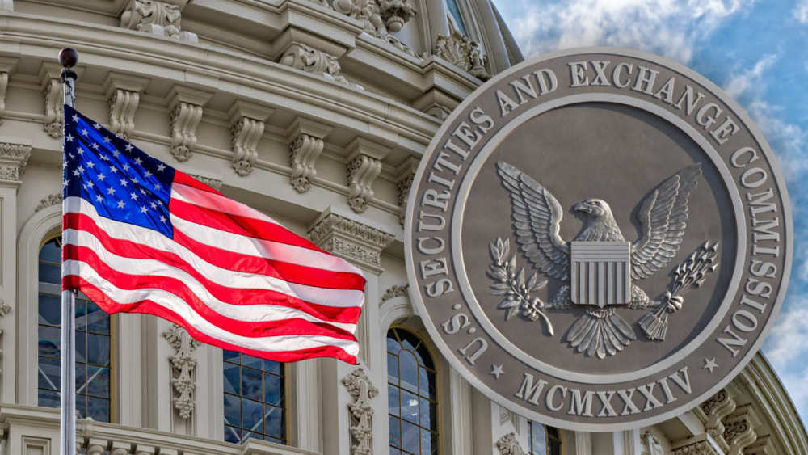
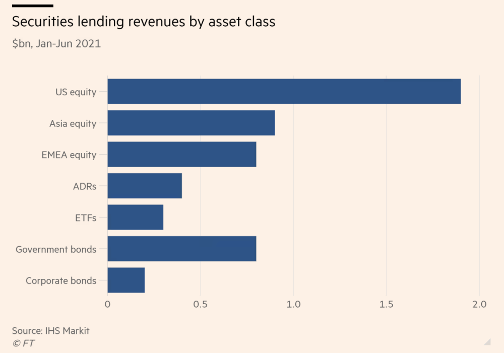

# 美SEC新规要求披露做空信息 机构吐槽：成本增加，更容易被“逼空”

腾讯新闻《潜望》作者 纪振宇 发自硅谷

两年前，美股市场中散户和机构围绕着“Gamestop游戏驿站”股票进行多轮激战的事件令人记忆犹新，其暴露出的问题，也让监管者加速出台新的监管政策。10月13日，美国证券交易委员会（SEC）发布最终的针对机构做空交易的新规，要求参与到融券业务和做空业务的机构在达到一定披露要求后，都需要进行相应的披露。

SEC表示，新的监管规定旨在落实国会早在2008年金融危机后就提出的提高市场信息披露透明度的要求，经过多轮修改并充分参考了公众反馈意见后，SEC最终以3-2的投票结果，通过了最终的规则。

一位美国券商合规部门负责人对腾讯新闻《潜望》表示，SEC的新规并不让机构意外，实际上之前已经进行过多次的沟通，最终的定稿也并没有初稿所要求的严厉。

“本质上并不是要打压市场中的做空行为，”这位人士说，“SEC实际上是在履行其防止市场操纵行为的主要职责。”

SEC在当天的声明中表示，新规则是为了增加有关做空活动的数据的透明度，降低市场中的信息不对称。

“基于过去的市场事件，让SEC和公众更多地了解股票市场中的做空活动，特别是在市场波动加剧的时期，尤其重要。” SEC主席Gary
Gensler在声明中表示。

对于机构来说，SEC的新规发布并不是一个好消息，尽管SEC的意图并不是直接打压做空交易，但新规所要求的信息披露将给参与相关活动的机构造成额外的合规成本支出，同时有机构表示，将交易信息公开披露将使得自己在市场中陷入被动，最终反而会导致更多的有针对性的“逼空”等极端行情的出现。

**持仓超1000万美元的空头需申报**

早在2008年金融危机后，当时针对加强金融监管的Dodd-
Frank法案便已经提出，应该提高机构持仓披露信息的透明度，尤其是要求机构披露进行证券做空的相关交易数据。

但直到2021年，美国证交会才开始有实质举措，这一次的触发事件是发生在2021年初的Gamestop事件。当时对Gamestop进行做空的对冲基金在与散户的较量中损失惨重，Gamestop股票在短时间出现暴涨，但问题的根源在于当时Gamestop的股票被做空的比例高达140%，意味着流通中的Gamestop股票被出借多次，这为随后出现的“逼空”行情埋下了隐患。

SEC在经过对事件的详细回顾和调查之后，起草了要求机构进一步详细披露出借股票信息的草案，几经修改和征集公众意见后，SEC于10月13日正式接纳了这一新的规定。在当天的声明中，SEC主席Gary
Gensler称，“在2008年金融危机之后，国会要求SEC进一步加强对股票证券卖空的信息透明度监管，今天新规则的接纳将促进做空对监管者和公众更大的透明度。”

他指出，这一新的规则回应了国会所要求的改善股票市场中现有卖空证券的情况，基于过去的市场事件，对于SEC和公众，了解市场中发生的做空活动是重要的，尤其是在市场波动率加剧的情况下。

按照这一新规，投资管理机构如果持有大量股票证券的空头头寸，需要在每个月后的两周内向SEC报告这些头寸和相关的卖空活动。具体的报告门槛是，当在某上市公司特定股票的空头头寸至少达到1000万美元，或月均占发行在外总股本的2.5%或以上时。对于非上市公司股票证券的空头头寸，报告门槛为在该月内任一结算日的50万美元。

SEC特别指出，这一最终规则，是根据公众意见反馈后进行修改后的版本，此前SEC所提出的披露要求更为严格，要求每个结算日超过1000万美元就需要申报，但最终的定稿则修改为当月平均持仓超过1000万美元。此外，最终版规则也不再要求投资机构披露每日做空活动的详细信息。

针对证券融出业务，最终规则要求证券出借人在每个交易日结束时向金融业监管局(FINRA)报告数据。FINRA将保密部分信息。保密信息将包括融券双方的姓名以及有关融券策略的更多细节以及使用情况。

FINRA将在下一交易日公布有关融券的信息，包括对融券所做的修改。这些信息将包括融券的时间、所用抵押品以及定价信息，如融券利率。FINRA还将按证券分类公布前一天融券活动的聚合数据。

**新规定导致合规成本增加**

根据美国财政部2021年金融稳定年度报告，美国证券融出业务总额达到3万亿美元，许多机构通过证券融出业务获得收入，同时许多机构也通过融入证券在市场中进行做空交易。

市场研究机构IHS
Markit的一份报告显示，2021年上半年，被融出的美国股票日平均市值总额在5400亿美元，相比2020年全年的4280亿美元的水平进一步上升，这部分融出股票相应将产生19亿美元的收入。2020年全年，这部分市场总收入为33亿美元。

但对于如此大的市场，目前外界能够获取的信息却十分有限。公众如果想要了解更详细的信息，通常要付费购买，这造成了信息不对称。同时，即便是付费获取到的信息也存在着很大的不足，目前交易商向券商披露信息是基于自愿原则，这些数据仅能代表一小部分融券市场。

SEC针对机构发布的这一信息披露新规定，本质上是为了进一步提高市场信息的透明度，提高市场效率，这一点在SEC的声明中也已经阐述得很清楚。需要明确的是，SEC的这一新规，并非要打击市场中的做空行为。

无数研究表明，做空机制在市场中的引入，有利于提高市场价格发现的效率，在多空两种力量的共同作用下，股票才能更有效地达到市场公允价格。此外，做空机制还提供了避险对冲的手段，能够在一定程度上平抑市场的过度波动，做空还向市场提供了更多的流动性，提高市场中的交易活跃度，降低流动性风险。

尽管SEC这一纸新的规定并非明确打压机构的做空行为，只是要求披露更多信息，但规则的实际作用效果，可能会导致对一些机构的做空行为的限制。

首先对于机构最直接的影响就是合规成本的提高。根据SEC此前的测算，证券融出方需要多付出3.75亿美元的初始费用，以及接下来每年1.4亿美元的合规费用以满足监管规定。

帮助机构进行融券业务的中介机构The Investment Company Institute发言人Stephen
Bradford表示，当新规定增加额外成本后，机构会问自己“还有必要再做这样的业务吗？”。

此外，尽管从市场整体信息披露的角度来看，有利于进一步改善市场效率，但可能让一些机构的持仓交易活动完全暴露在公众视线之下，造成业务上的被动和不利局面。

代表对冲基金利益的一家位于华盛顿的游说机构Managed Funds Association合规事务负责人Jennifer
Han表示，对这一新规“非常担忧”，因为一些市场参与者能够运用这些信息，重构某个对冲基金的交易策略，给交易对手方更多的优势。

“这将让市场中的‘逼空’行情更容易发生。”Han说。所谓“逼空”，是指某股票猛烈上涨导致做空者不得不平仓止损，而买入平仓的行为又进一步加剧了该股票的上涨，引起空头更大的损失，这样的行情在2021年初Gmaestop事件时就曾上演，当时对冲基金Malvin
Capital因为做空Gamestop损失惨重。

