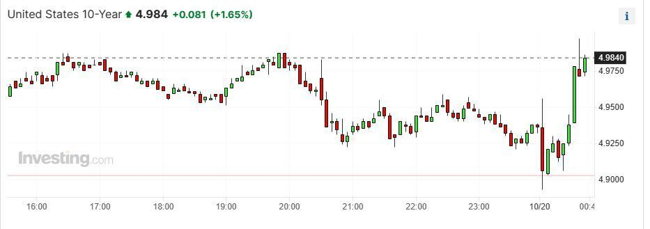
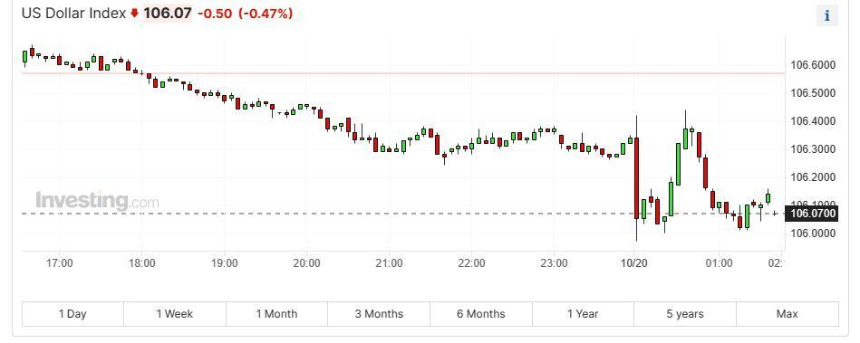
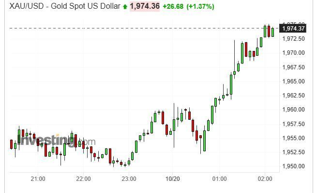

# 鲍威尔：美国通胀仍然太高，经济强劲的额外证据或支持再加息

10月19日周四，美联储主席鲍威尔在纽约经济俱乐部发表讲话。演讲之初，气候抗议者们一度冲上台打出“美联储正在燃烧：货币、未来、地球”的横幅，鲍威尔被护送到讲台之外。

在实现准备好的讲话稿中，鲍威尔首先总结了对近期经济数据的看法，即“近几个月来的数据显示，美联储在实现最大化就业和稳定物价这两个双重使命方面正在取得进展”。

被视为“美联储喉舌”、有“新美联储通讯社”之称的财经记者Nick Timiraos撰文称， **鲍威尔最新讲话坐实了11月暂不加息的市场预期，**
“除非有明确证据表明经济韧性会危机通胀的降温进展”。

还有分析称，鲍威尔讲话基本符合“偏向鹰派论调”的市场预期，重申应“谨慎”推进政策，既警告了不可对通胀降温过早自满，也印证了“利率在更高位保持更长时间”（higher
for longer）的大方向。

鲍威尔赞扬通胀降温进展“非常有利”，但警告9月起通胀下降趋势不太令人鼓舞

鲍威尔称，今年夏季美国通胀数据有所降温，“这是一个非常有利的发展”，预计9月的名义PCE（个人消费支出物价指数）同比增3.5%持平前值，较2022年6月的峰值7.1%砍半；预计9月核心PCE同比增3.7%，低于8月的3.9%和去年2月峰值5.6%。相关数据将于下周公布。

他认为，通胀进展既与后疫情时代的供应干扰得到缓解有关，也受益于去年3月开启的18个月激进加息周期令强劲需求降温。
**但他警告称，9月通胀或延续下降趋势，“不过不太令人鼓舞”** ：

“最近三个月和六个月的短期核心通胀指标目前低于3%，但这些短期措施往往不稳定。 **无论如何，通胀仍然过高，**
几个月的良好数据只是建立通胀持续下降以实现我们目标之信心的开端。我们尚不知道这些较低的读数会持续多久，也不知道未来几个季度通胀将稳定在什么水平。（抗击通胀的）道路可能会崎岖不平并且需要一些时间（才能实现目标），但我和我的同事们团结一致，致力于将通胀可持续地降至2%。”

鲍威尔称劳动力市场正在降温，但或需更长时间经济放缓和就业疲软才能通胀达标

在谈及劳动力市场时，鲍威尔赞扬劳动参与率提高，以及移民数量反弹至疫情前的水平，都“可喜地增加了”工人供应，“许多指标表明，尽管情况仍然紧张，但劳动力市场正在降温”。

这主要体现在：职位空缺数已从高点大幅下降，目前仅略高于疫情前水平；自主辞职率和跳槽者赚取的工资溢价都已降回疫情前；对工人和雇主的调查显示，就业市场的紧张程度重返疫情前水平；工资增长正逐渐降温到随着时间推移与2%通胀率相一致的水平。

鲍威尔也正面评价了美国经济发展，称“迄今为止，通胀下降并没有以失业率大幅上升为代价，这是一个非常受欢迎的发展，但在历史上却不寻常”。他还称，今年美国的经济增长一直令人惊讶，预测者普遍认为三季度GDP将保持韧性，随后在今年四季度和明年放缓。

但鲍威尔也表示， **要可持续地回归2%通胀目标，可能需要一段时期低于趋势的经济增长，以及劳动力市场状况进一步疲软** 。

再结合他在后文称：

“政策立场目前对增长具有限制性，这意味着紧缩政策正在给经济活动和通胀带来下行压力。鉴于此前政策的紧缩步伐较快，未来可能继续出现有意义的经济收紧。”

以及他承认：

“近几个月来金融状况显著收紧，长债收益率是此次收紧的重要驱动因素。美联储关注这些事态发展，因为金融状况的持续变化可能会对货币政策的路径产生影响。”

上述多重言论都令市场笃定至少11月美联储不会加息，美国掉期互换市场降低对美联储再加息一次的预期。

他没排除数据太好会进一步加息，但也强调风险和债市收益率上涨收紧了金融状况

在谈及货币政策时，鲍威尔重申，美联储“致力于采取对经济增长充分具有限制性的政策立场”，并保持政策的限制性，直到确信通胀正在可持续地降至2%目标。

**但他同时也保持了看似中立，实则有些模棱两可的态度** 。

一方面，鲍威尔没有排除年底之前再度加息的可能性，称：

“我们关注近期显示经济增长和劳动力需求都具有韧性的数据。（如果有）更多证据表明经济增长持续高于趋势水平，或者劳动力市场的紧张状况不再缓解，这可能会导致通胀进展的恶化风险上升，并可能导致货币政策进一步收紧。”

**但他同时也提到了货币政策前景面临的多重风险，** 包括：

“（新一轮巴以冲突带来的）地缘政治紧张局势高度加剧，对全球经济活动构成重大风险。美联储职责是监测这些事态发展对经济的影响，而经济影响仍然高度不确定。一系列新旧叠加的不确定因素，使我们平衡“货币政策过度紧缩风险”与“紧缩过少风险”的任务变得更加复杂。做得太少可能会让高于目标的通胀变得根深蒂固，最终令货币政策不得不用高昂的就业代价来实现抗击通胀。做得太多则可能对经济造成不必要的损害。
**考虑到不确定性和风险，以及我们已经取得的进展，美联储正在谨慎行事。我们将根据收到的数据总量、不断变化的前景和风险平衡，来决定额外政策紧缩的程度以及政策保持限制性的时长**
。”

鲍威尔称，债市收益率上升可能意味着无需加息更多，但当前政策并非太紧缩

在问答环节，鲍威尔也提到了几个值得注意的要点。

首先，他认为美债收益率快速攀升主要是“期限溢价”（term
premiums）在起作用，影响因素既包括了美联储缩表对债市供求心态的影响，也与人们更加关注美国财政赤字恶化，并认为经济实力更强劲等因素有关：

**而“美债收益率上升，与美国通胀上升的预期无关。** ”

他更是明确指出：

“收紧货币政策的一个目的是收紧金融状况，美债收益率近期涨势已经造成金融状况显著收紧，（因此，） **债市收益率上升可能意味着美联储无需加息更多** 。”

**不过，他也谈到“证据表明，美联储当前货币政策并非太紧缩”，**
似乎暗示还有进一步收紧的空间，这造成美股指数一度集体止涨转跌、10年期美债收益率重新上逼5%大关。

鲍威尔称，今年放慢加息节奏，从而让紧缩行动有时间发挥作用， **但“利率可能还不够高，维持的时间不够长”**
；“许多迹象表明，劳动力市场正回归平衡状态。商界领袖告诉我，美国经济仍然强劲”， 即“经济对此前一系列加息行动处理得很好”。

“新美联储通讯社”记者也认为，美国9月非农就业和本周的零售销售、工业产出等数据意外强于预期，都使得美联储很难宣布加息已经结束，而鲍威尔周四也确实没有这样呼吁。

不过，上述记者称，“鲍威尔并不认为这种经济实力已经产生了通胀上升的热度，从而证明进一步加息是合理的”，除了将6月份以来的通胀放缓描述为“非常有利的发展”之外：

“鲍威尔像今年8月的一次演讲中那样，两次使用‘可以（could）’一词、而不是更强有力的‘即将（would）’来描述美联储是否会再次收紧货币政策。”

上述记者认为，鲍威尔还提到货币政策已经具有限制性，以及由此前紧缩政策带来、有意义的经济收紧尚未完全实现，即货币政策对经济的影响存在滞后性，种种线索都指向11月不会加息。

美股和美元先升后跌、再升再跌，10年期美债收益率仍上逼5%，黄金全天上涨

**鲍威尔讲话对市场造成了不小的影响。** 在他讲话前，道指和标普500指数在美股午盘小幅上涨0.1%，纳指涨0.2%，此前在涨跌之间波动。

在他讲话之初，美股涨幅扩大至日内高点，10年期美债收益率抹去稍早涨幅并跌穿4.90%，两年期收益率跳水7个基点也转跌，刷新日低至5.16%。彭博美元指数跌至日低。

问答期间，美股回吐稍早涨幅并转跌，标普大盘和纳指刷新日低。10年期美债收益率重新上行并触及5%，30年期长债收益率涨幅扩大至10个基点交投5.10%。关键的两年/10年期美债收益率倒挂幅度创2022年以来最小。

而问答结束后美股又重新转涨，随后又在讲话结束近一小时重新转跌，10年期美债收益率涨幅收窄至4.95%。

整体来说，美元同样先跌、随后收复全部跌幅、然后再抹去全部涨幅，最终全天走低并下逼106关口。现货黄金则一路走高至涨超1%，并升破1970美元至两个半月最高。

此前有分析称，目前正值美国经济不确定性上升的时刻，鲍威尔讲话中暗示出的未来利率政策走向堪称关键，既能为市场预期定下基调，也对金融市场有潜在重要影响。

**这是鲍威尔在周六开启美联储FOMC决策之前静默期的最后一次公开发言**
，市场普遍预计11月1日美联储将暂不加息，成为去年3月开始加息以来首次连续两次会议都不加息。

值得注意的是，在鲍威尔讲话前，作为全球资产定价之锚的10年期美国基债收益率上破4.98%，若突破5%大关将是2007年7月下旬以来首次。

过去一周不断有美联储官员称，国债收益率走高带来的金融状况收紧，足以换来美联储不急着加息。自7月底上次加息以来，10年期美债收益率在非常短的时间内累涨了近100个基点。

