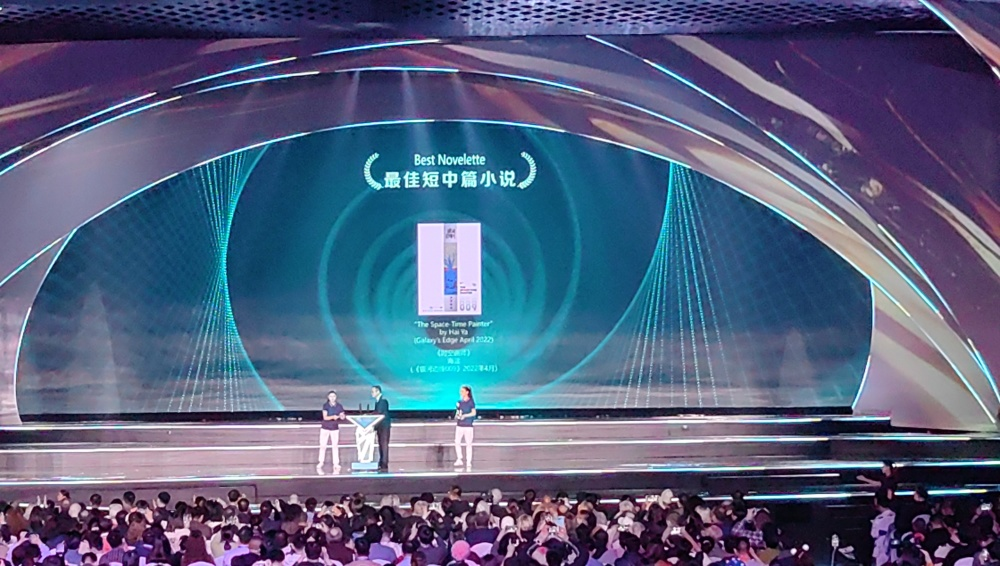
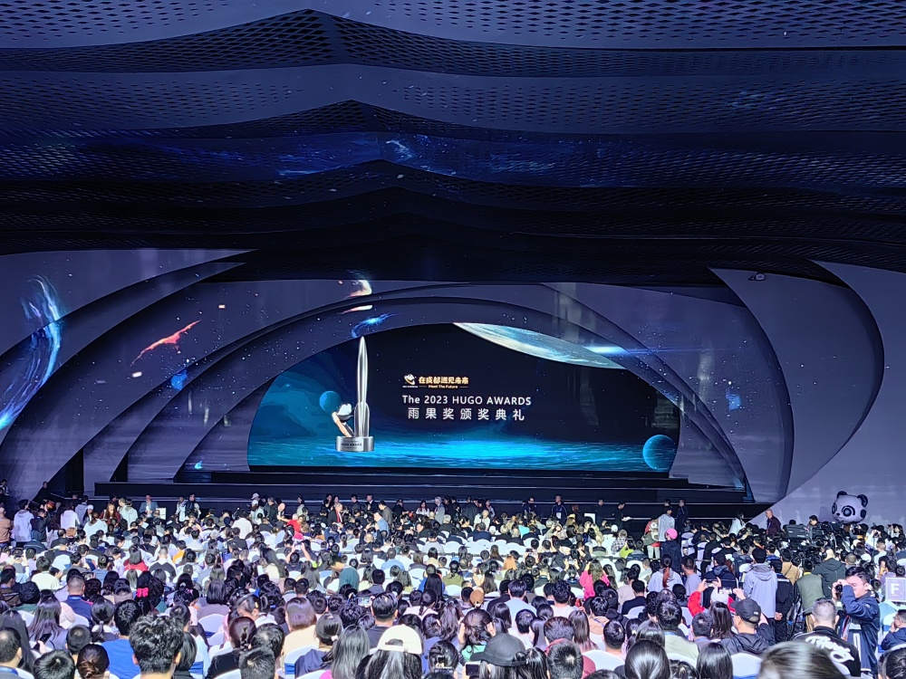

# 下一个“刘慈欣”诞生？中国科幻作家海漄获2023“雨果奖”

【环球时报记者
张妮】10月21日晚，在成都举行的第81届世界科幻大会上，中国作家海漄以《时空画师》获得2023雨果奖“最佳短中篇小说”。2015“雨果奖”获得者刘慈欣为其颁奖。

中国作家海漄以《时空画师》获得2023雨果奖“最佳短中篇小说”。

在这篇小说中，故宫博物院闭馆日惊现“鬼影”，刑警主人公介入调查后发现：事情可能与一幅宋朝古画有关。《时空画师》采用了推理小说的写法，将中国传统文化、历史、推理与科幻相结合，追溯了一幅虚构的名画创作以及“当时”的朝野权力斗争故事。

本届成都世界科幻大会是该大会第一次在中国、第二次在亚洲举行。

