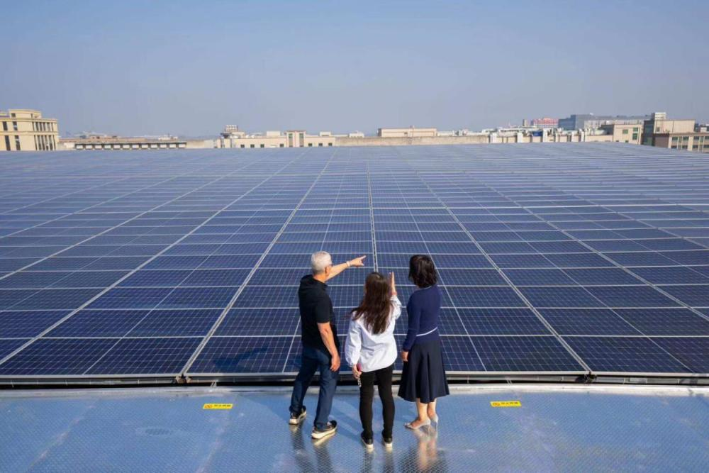

# 专访苹果CEO库克：超95%产品仍在中国制造 希望与供应链企业合作双赢

腾讯科技 文/吴彬

10月18日，苹果公司CEO库克“闪现”浙江嘉善，这是他今年开启第二次中国行后，三天内到访的第三个城市。

库克此行的目的地是位于浙江嘉善的立讯精密工厂，这座工厂用于帮助苹果生产和组装全新的Apple Watch。

在今年9月的发布会上，苹果宣布通过电力、材料和运输等三个温室气体排放来源着手进行减排，促成第九代的Apple
Watch成为全球首款实现碳中和的电子产品。这是苹果2030年在整个价值链条上实现碳中和的一个阶段性目标。

去年，苹果向全球供应商发起倡议，呼吁其全球供应链采取行动，解决温室气体排放问题，全面实现去碳化。供应链也成为苹果完全实现碳中和目标中最为重要的环节之一。

**新款Apple Watch的100%碳中和是如何实现的？**

这座位于浙江嘉善的立讯精密工厂，帮助苹果生产全新的Apple Watch系列表款，而这里最为引以为傲的，是他们为苹果打造的自动化程度极高的生产线。

库克参观的生产线，包括Apple Watch S9的总装产线以及Apple
Watch背部水晶模块的制造线。整条生产线自动化环节的占比超过60%，包括手表内部传感器、排线、主板等核心部件的安装和完整性比对验证，已经都能通过完全的自动化流程实现，确保工作效率。

据立讯精密的工作人员介绍，在这条Apple Watch的生产线上，整个的流程都是高度自动化的，大幅降低了对于人力的需求。

库克在接受腾讯科技采访时表示，这样自动化程度极高的生产线，可以帮助苹果建立重复和可预测的生产流程，这对于产品质量的提升有相当大的帮助。

 _库克和王来春在嘉善工厂参观立讯精密光伏基地_

而在这些生产线背后，支持它们连续运作的，是立讯精密的多项清洁能源举措，包括在嘉善工厂屋顶铺设的大面积光伏发电板，通过获取太阳能这样的清洁能源，为产线提供动力来源。

事实上，立讯精密早在2017年就加入了苹果的供应商清洁能源计划，并支持了许多可再生能源的解决方案，这其中包括了在厂房屋顶设置太阳能板，支持和加入中国的绿色电力交易项目，以及通过中国清洁能源基金投资可再生能源。通过该基金，苹果及其供应商共同投资大型风能和太阳能项目等等。

通过供应商能效计划与苹果的密切合作，立讯精密的嘉善工厂节省了超过40%的电力。根据公开数据显示，截至到2022年底立讯精密屋顶光伏的总装机容量接近55兆瓦。

这只是立讯精密和苹果构筑碳中和合作的一部分。在库克参观的另外一条Apple
Watch包装生产线上，立讯精密通过和国内的供应商合作，自主研发了用于产品标签的数字喷墨印刷自动化设备，它取代了传统人工贴附标签的运作方式，在减少人力运营成本提升效率的同时减少了纸质标签的使用。

除此之外，今年的Apple Watch S9的包装采用100%无塑化包装，
也减少了塑料的使用及碳排放。相比较上一代产品，新产品整体包装盒体积减少了大约四分之一，使得在运输的过程中，同样一个栈板上可以多放25%的产品，来料外包装上面的保护膜也已经100%的被去除掉。

这些产品设计和制造环节的变化，是促成今年首款实现100%碳中和电子产品的秘密，而在这背后，是苹果和供应链企业共同努力的结果。

**超过95%的产品仍在中国制造，希望与供应链企业合作“双赢”**

今年是苹果入华的第30年，这期间苹果在中国拥有非常多的供应商合作伙伴，其中立讯精密是较为特别的一个，在过去的十二年时间里，和苹果在中国的发展相辅相成，是苹果在中国构建完整供应链这30年的时间里，最好的缩影。

2011年首次和苹果合作时，立讯精密只有500人左右的团队能够服务苹果，起初的业务范围也只是帮助苹果生产数据线。

_库克和王来春_

12年后，随着和苹果合作关系的逐渐深入，如今立讯精密已拥有超过25万员工，承担了包括三款iPhone 15机型、全新一代Apple
Watch以及即将到来的Vision Pro生产的工作。

这其中还包括一支4000人的中央自动化团队，来满足客户在精密零部件、模组和系统组装等不同产品方面对于自动化的需求。通过部署数以万计的精密自动化设备、治工具（协助控制位置或动作的一种工具）来完成多个产品线的生产制造。其中，对于iPhone的高精度组装，以及Apple
Watch的自动光学检测、产品自动包装和自动装卸的智能仓库，立讯精密都在积极利用智能制造的能量进行数据驱动的决策。

同时，立讯精密是苹果中国供应商清洁能源计划的合作伙伴之一，公司承诺通过自建屋顶光伏、直购绿色电力、采购绿证、绿色能源投资等行动，确保为苹果提供的产品100%使用清洁能源进行生产。

去年立讯精密在江苏昆山新建了一个园区，专门支持iPhone的开发和量产，这座园区创造了数万个工作岗位，也为地方带来了重大的财政贡献。与此同时，立讯精密还通过苹果的供应商发展基金，为在立讯工作的员工带来更多教育和培训的机会。

_库克和杨模（右）在交流_

在此次库克嘉善工厂的参观过程中，他和一位年仅29岁的立讯精密线长做了交流。这位名叫杨模的员工，两年前加入立讯精密成为一名流水线工人，而在去年10月被提拔为线长，目前管理66名员工。

她也是苹果供应商员工发展基金的受益者，苹果曾专为供应链员工的教育和发展建立了一支5000万美元的基金，为供应链上的工人们提供学习新技术和管理技能的机会。杨模也在立讯精密为员工提供的课程中，通过个人领导力、心理辅导、管理能力等课程的学习后，实现了自身价值的突破。

而杨模只是该课程众多受益者中的一位，据王来春介绍，立讯精密积极参与了苹果的自动化技术员培训项目、线长计划、学徒制项目、个人领导力、残障员工教育与发展等优质教育培训项目；并在苹果的帮助下，立讯精密积极组建讲师团队，提高讲师能力，为员工带来更有意义的教育机会。员工个人则通过积极参加这些培训课程，一方面提高了工作能力，可以以更精湛的技艺完成本职工作，实现更优的产品交付质量；另一方面发展了适应未来的新技能，拓宽了自身职业生涯发展的可能性。

在今年3月库克来华时，库克曾在中国发展高层论坛上表示，苹果和中国共同成长，两者之间的关系是“共生的”。

截至目前，苹果有超过95%的产品仍在中国制造组装，这在过去30年的时间里，推动了中国供应链的蓬勃发展。以立讯精密为代表的一众供应链企业，相辅相成的帮助苹果实现在技术、环保、智能化等领域的创新。

库克在接受腾讯科技采访时表示，苹果希望和供应链企业在合作中实现“双赢”，这种双赢不限于产品制造的合作和企业相关的应收，还应该包括环境保护、企业社会责任以及教育等多方面。

