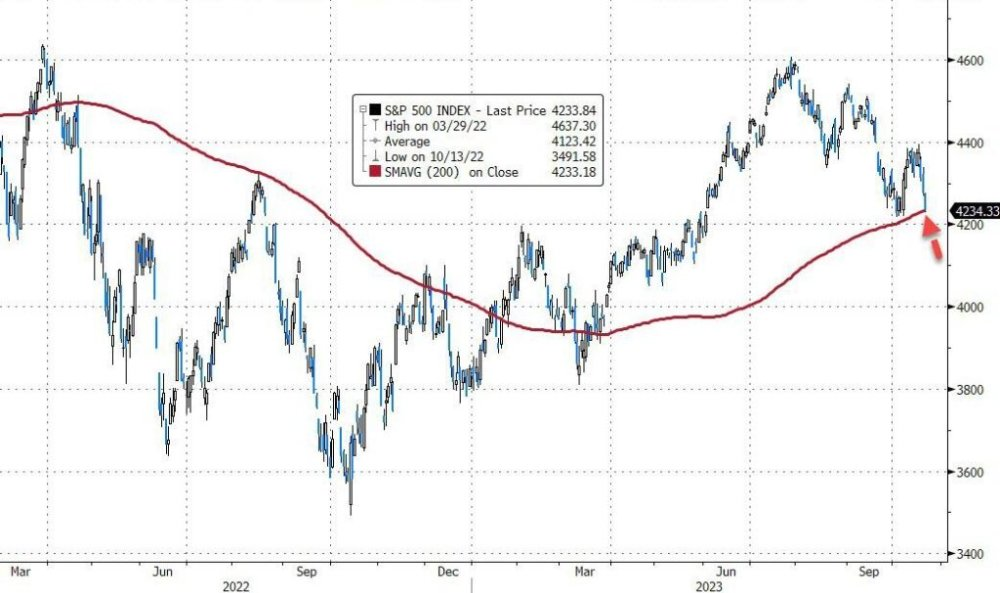
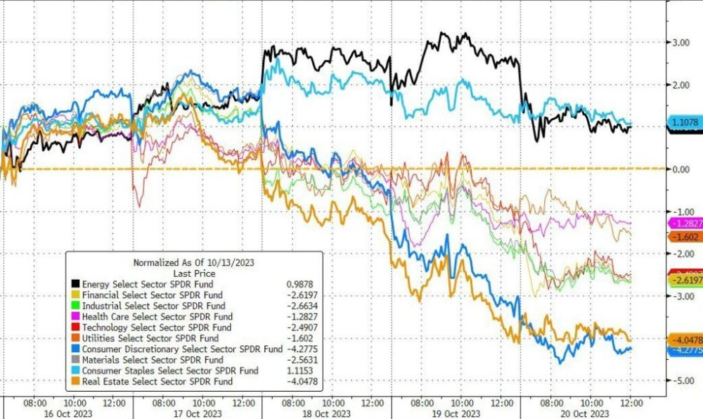
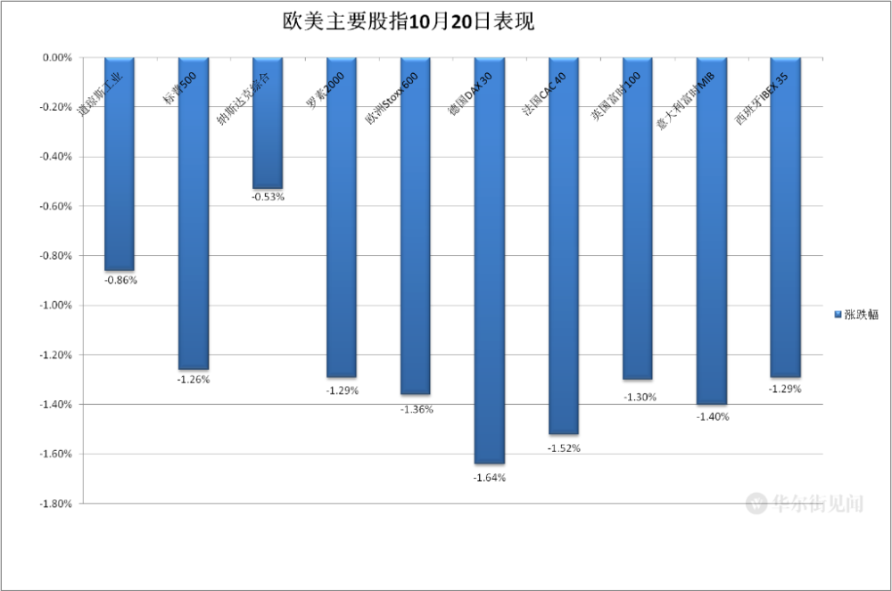
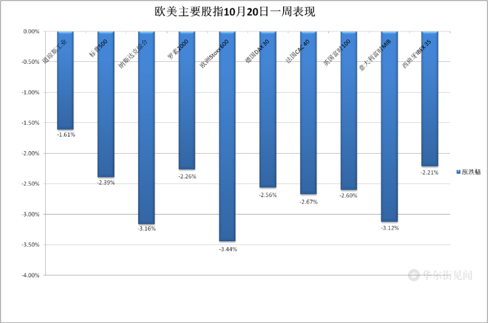
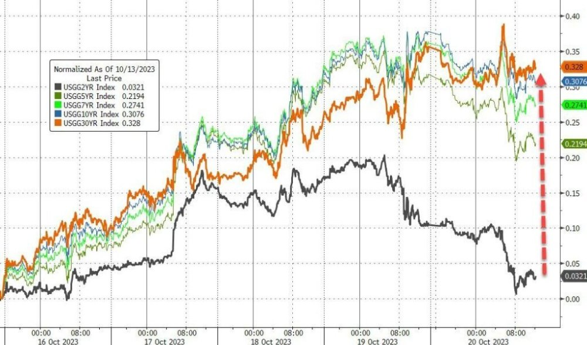
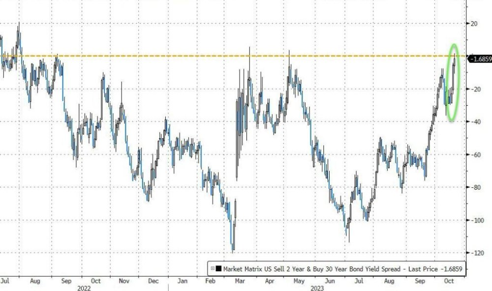
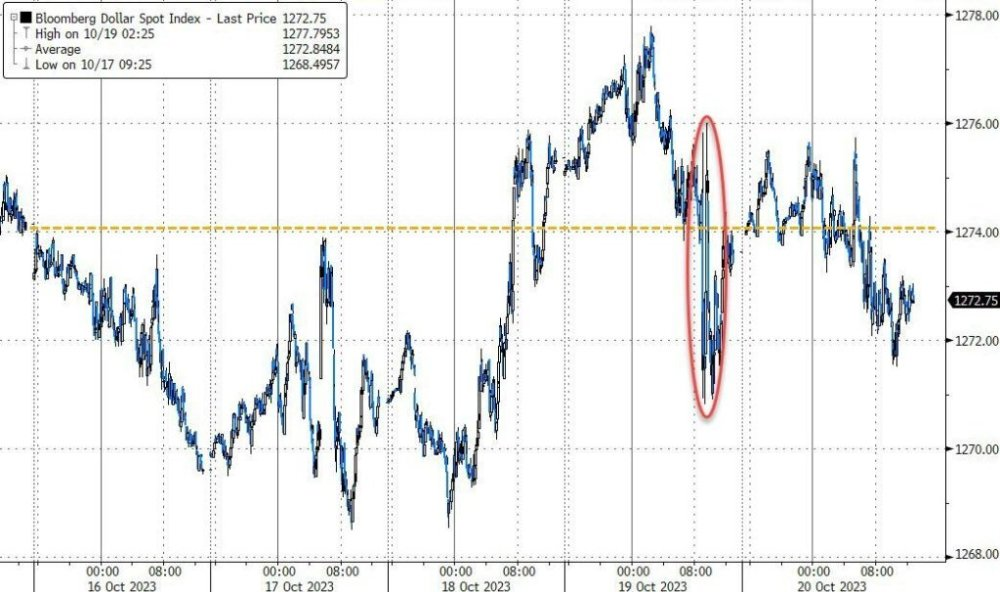
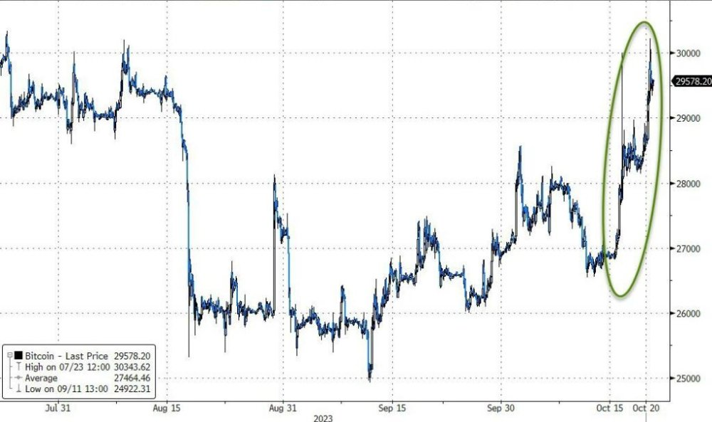
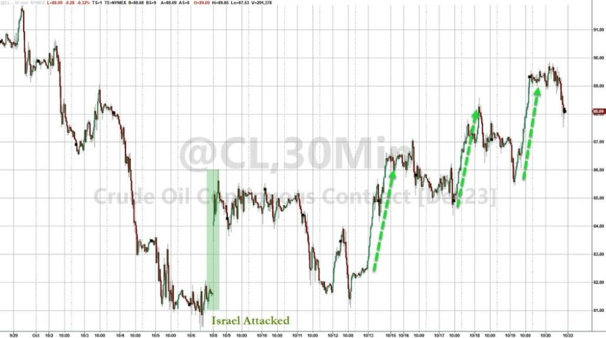
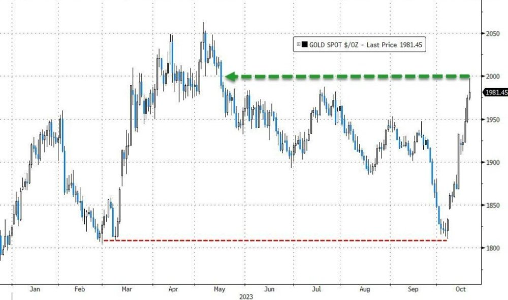

# 中东局势引爆市场！美股连跌，避险资产飞升，黄金一度冲上2000美元

中东局势加剧市场对巴以冲突扩大化的担忧，风险偏好再度受创，美股继续下挫，避险资产飞升：美债价格走高、长短期美债收益率集体下行，黄金两个多月来首次盘中突破2000美元关口，比特币盘中拉升超过1000美元、本周二度涨破3万美元关口，再创两个月新高。

据央视报道，以色列国防部长公布对加沙地带的作战计划和目标，要通过三个阶段的战争摧毁哈马斯的军事力量，彻底消灭该组织，并在加沙地带建立一个新的“安全政权”；以国防部称，迄今已有1000吨武器运抵以色列；以色列军方表示，正加强向加沙地带发动地面进攻的准备，针对黎巴嫩真主党对以北部的持续袭击，以军仍需做好多线作战的准备。

据新华社报道，美国官员称，美军设在叙利亚和伊拉克的多座军事基地最近三天遭到至少四次无人机袭击，造成美军人员受伤。据环球时报，媒体称美国在伊拉克的一个基地还持续遭到火箭弹袭击；有美国媒体警告，驻中东的美军本周遭受一系列袭击，有可能令美国“进一步卷入一场新的地区战争”。据央视，拜登向美国国会申请增加1050亿美元预算，用于对以色列、乌克兰等领域的军事援助方案。

巴以冲突持续、美债收益率一再刷新十多年高位，同时，美联储主席鲍威尔讲话未能像上周联储二把手杰斐逊等官员那样放鸽提振市场，本周美股遭受多重打击，主要股指全线累跌，创一个月来最差周表现，科技股成为一大拖累。特斯拉在发布财报的本周两位数重挫，其公布的三季度业绩逊色，CEO马斯克对经济和备受期待的电动皮卡Cybertruck的前景都不乐观。

基准十年期美债收益率在周五亚市早盘曾2007年来首度升破5.0%，此后一度回落超过10个基点，本周仍创一年半来最大周升幅。对利率敏感的两年期美债收益率在周四盘中转降后进一步下行，一度较周四盘中所创的2006年来高位回落20个基点，收益率本周仍累计攀升，但升幅远不及长债。分析人士认为，虽然鲍威尔周四的讲话可能降低了美联储再次加息的几率，但周二公布的9月美国零售销售意外强劲，强化了美联储可能需要将高利率保持更久的预期。

相比美股和美债，美元指数周五波动较小，盘中曾逼近周四跌破106.00所创的一周低位，全周回落。美元有所走软之际，人民币反弹，离岸人民币兑美元一度较周四所创的五周低位回涨超200点。以色列誓要加强对哈马斯军事打击，此前多日创2015年来新低的以色列本币谢克尔跌至2012年来低谷。

据新华社报道，哈马斯宣布，处于人道主义考虑释放两名被扣押的美国人，此后国际原油盘中转跌，本周涨势无碍。原油和黄金一样，都是受益于地缘政治风险高涨的大宗商品，均自本轮巴以冲突爆发以来每周持续累涨，但本周涨幅都不及冲突刚爆发冲击下的上周。

欧洲天然气周五反弹，却未能延续上周因巴以冲突等干扰供应因素而大涨的势头，受累于周一大幅回落逾10%。当时有评论称，欧洲大陆总需求更疲软，在可预见的未来，欧洲季节性的正常气温将保持不变，供暖需求预期大多低于正常水平。

美国天然气成为本周商品中的大输家，一周多来持续收跌，创四年来最长连跌，本周跌超10%，主要源于气象预报显示未来几个月美国部分地区的气温高于正常水平，降低了取暖方面的需求。美国能源部公布，上周美国EIA天然气库存超预期增加，也打击了气价。

纳指标普四连跌 三大美股指齐创一个月最大周跌 特斯拉财报周跌超15% 欧股周跌幅七个月最大

三大美国股指总体低开低走，纳斯达克综合指数早盘跌超1%，标普500指数午盘跌超1%，盘初曾短线转涨的道琼斯工业平均指数午盘跌幅扩大到200点以上，尾盘曾跌近300点，和纳指及标普均刷新日低。最终，三大指数连续三日集体收跌，纳指和标普连跌四日。

纳指收跌1.53%，报12983.81点，5月31日以来首次收盘跌破13000点。标普收跌1.26%，和纳指均继周三之后本周第二日跌超1%，报4224.16点，刷新6月1日以来低位。道指收跌286.89点，跌幅0.86%，报33127.28点，刷新10月5日以来低位。

_标普跌穿9月以来上行趋势线，跌至200日均线下方_

价值股为主的小盘股指罗素2000收跌1.29%，连跌三日，两日刷新去年10月以来低位。科技股为重的纳斯达克100指数收跌1.5%，连跌四日至9月26日以来低位。

本周主要股指均累跌，均创9月22日一周以来最大周跌幅。纳指累跌3.16%，罗素2000跌2.26%，均连跌三周；标普累跌2.39%，纳斯达克100跌2.9%，分别在连涨两周和三周后回落，道指累跌1.61%，抹平上周止住三周连跌的涨幅。

 _主要美股指本周走势_

标普500各大板块周五全军覆没，能源收跌超1.7%领跌，芯片股所在的IT和特斯拉所在的非必需消费品跌近1.7%，谷歌所在的通信服务、材料、金融、公用事业也都跌超1%。

本周，只有必需消费品和上周领涨的能源两个板块累涨，涨约0.7%。累跌的九个板块中，除了跌超0.5%的奈飞所在板块通信服务外，其他板块至少跌超1%，对利率敏感的房产和特斯拉拖累的必需消费品均跌超4%，IT跌超3%，工业和材料跌3%。

 _标普各板块ETF本周走势_

龙头科技股全线下挫。财报公布后周四重挫的特斯拉继续领跌，早盘曾跌超4%，收跌约3.7%，连跌三日、连续两日刷新6月1日以来低位，因周四一日跌超9%创7月20日以来最大收盘跌幅，本周势将累计跌15.6%。

FAANMG六大科技股中，亚马逊收跌2.5%，回落至10月3日以来低位；谷歌母公司Alphabet收跌近1.6%，连跌三日至10月5日以来低位；苹果收跌近1.5%，连跌六日至10月3日以来低位；微软收跌1.4%，回落至10月5日以来低位；Facebook母公司Meta收跌超1.3%，连跌三日，两日刷新10月5日以来低位
；周四在发布财报后飙涨16%的奈飞收跌0.2%，暂别周四反弹所创的9月13日以来高位。

本周这些科技股大多累跌，亚马逊和苹果跌超3%，Meta跌近2%，Alphabet跌超1%，微软跌0.3%，而奈飞一枝独秀，在发布财报当周累涨12.7%。

_蓝筹科技股周五齐跌，成为大盘下行主要推手_

芯片股总体连续四日收跌，费城半导体指数和半导体行业ETF
SOXX收跌约1.5%，刷新5月24日以来低位，本周跌约4%。到收盘，Arm跌约3.8%，连续两日收于发行价下方，本周累跌5.73%，英伟达跌1.7%、本周累跌8.96%，创去年9月以来最大周跌幅，英特尔、高通、德州仪器跌超2%，博通跌超1%，AMD跌0.6%。

AI概念股跑输大盘、总体连跌三日。截至收盘，Palantir（PLTR）跌超5%，C3.ai（AI）、
SoundHound.ai（SOUN）、BigBear.ai（BBAI）跌超3%，Adobe（ADBE）跌超2%。

_AI概念股本周也总体跑输大盘_

光伏股周五全线大跌，源于以色列太阳能产品制造商SolarEdge发布业绩预警，因欧洲市场需求大幅减弱，下调三季度营收、毛利率和营业利润指引。SolarEdge（SEDG）盘中曾跌近30%，
Enphase Energy（ENPH）盘中跌超10%，Sunnova（NOVA）盘中跌超6%，行业ETF Invesco Solar ETF
（TAN）盘中曾跌6%。

因油价上涨的冲击，美国航空公司股本周均继续累跌，至少7月下旬以来每周均跌，创2021年中以来最长连跌周。其中美国航空（AAL）收跌3.2%，本周跌近5.5%；阿拉斯加航空（ALK）收跌0.4%，本周跌近3.2%；达美航空（DAL）收跌近1.5%，本周跌近5.5%；西南航空公司（LUV）收跌0.7%，本周累跌4.6%；美联航（UAL）收跌2.6%，本周跌近9.4%；全球航空业ETF（JETS）收跌1.56%，本周累跌4.8%。

热门中概股总体连跌四日。纳斯达克金龙中国指数（HXC）收跌约1.4%，两日刷新5月31日以来低位，本周累跌6.1%。个股中，到收盘，晶科能源跌近8%，金山云、达达跌超5%，携程跌近3%，阿里巴巴、京东、腾讯粉单、网易跌超2%，百度、拼多多、B站、小鹏汽车、蔚来汽车、理想汽车、微博跌超1%。

银行股指数跑输大盘，连跌三日。整体银行业指标KBW银行指数（BKX）收跌3.1%，刷新5月12日以来低位，本周跌3.7%；地区银行指数KBW Nasdaq
Regional Banking Index（KRX）和地区银行股ETF
SPDR标普地区银行ETF（KRE）分别收跌3.5%和4%，刷新5月31日以来收盘低位，本周分别跌2.8%和3.3%。

本周公布财报的大银行中，摩根士丹利收涨近0.3%，势将在周三发布财报后首度收涨，但因周三跌约6.8%创2020年6月以来最大跌幅，本周仍跌6%。周二发布财报后逆市跌1.6%的高盛收涨约0.3%，结束三日连跌，本周累计跌3%。

自上周五开始发布三季报以来，六大美国银行累计涨跌不一，富国银行领涨，摩根士丹利领跌

周五公布三季度EPS盈利和净利息均低于预期后，地区银行Regions
Financial（RF）收跌约12.4%，创2020年3月以来最大日跌幅，拖累其他地区银行也大跌：收盘时Zions（ZION）跌超7%， Fifth
Third（FITB）和KeyCorp（KEY）跌超6%， 尽管季度业绩优于预期，Comerica（CMA）仍跌超8%。

其他金融股中，周四公布财报后大跌7.9%的另类资管巨头黑石（BX）收涨逾0.1%，本周跌约9%；周五公布三季度盈利和营收高于预期、但上调贷款损失拨备、同比增长58%后，美国运通（AXP）收跌5.4%。

其他公布财报的个股中，三季度营收低于预期的油服巨头谢伦贝谢（SLB）收跌2.9%；季度营收也逊于预期的手术设备公司Intuitive
Surgical（ISRG）收跌2.4%；而三季度盈利和收入均高于预期、全年盈利指引也高于预期的汽车运输公司Knight-
Swift（KNX）收涨近11.8%。

欧股方面，除了地缘政治风险，部分企业业绩逊色再度打击欧股，泛欧股指连跌四日。欧洲斯托克600指数连续三日收跌超1%，刷新去年12月30日以来收盘低位。主要欧洲国家股指继续齐跌，均跌超1%。

各板块中，矿业股所在的基础资源跌超3%领跌，受累于高成本打击下三季度利润超预期下降的欧洲金属生产巨头Boliden跌7.2%；因季度净单位增长放缓的洲际酒店集团跌4.5%连累，旅游与休闲板块跌超2%，科技板块也跌超2%。其他个股中，三季度业绩逊于预期的挪威回收和分拣产品生产商Tomra
Systems跌22.6%，领跌斯托克600成份股；三季度销售令人失望的欧莱雅跌1.5%。

本周斯托克600指数跌超3%，创3月17日以来最大周跌幅，在上周扭转三周连跌后重回跌势。欧洲主要国家股指均累跌，至少跌超2%，德法西股连跌五周，英股和意股连跌两周。

因周五大跌，基础资源本周跌超6%，在各板块中领跌，对利率敏感的房产跌超5%，科技和旅游都跌超4%，即使是上周一枝独秀、大涨超6%的油气板块，本周也跌超1%。

十年期美债收益率盘中升破5.0%后一度回落超10个基点 仍创一年半最大周升幅

交易员普遍预计下周欧洲央行将按兵不动，中东局势推升避险偏好，欧洲国债价格反弹，收益率回落。到债市尾盘，英国10年期基准国债收益率收报4.65%，日内降2个基点；2年期英债收益率收报4.85%，日内降10个基点；基准10年期德国国债收益率收报2.89%，日内降4个基点；2年期德债收益率收报3.11%，日内降8个基点。

本周欧债收益率均抹平上周大幅回落的降幅，在美国发布数据显示经济有韧性后，长期高利率前景预期下追随美债收益率回升；上周结束两周连升的10年期英债收益率累计升约27个基点；10年期德债收益率升约16个基点，最近七周内第六周攀升。

美国10年期基准国债收益率在亚市早盘曾短线升至微高于5.0%水平，自2007年7月以来首次盘中突破5.0%关口，连续三日刷新2007年7月来高位，后总体回落，美股盘前短线上逼5.0%后加速回落，美股早盘曾下逼4.89%，较日内高位回落近11个基点，到债市尾盘时约为4.91%，日内降约8个基点，在连升三日后回落，本周仍累计升约30个基点，创去年4月以来最大单周升幅，轻松抹平上周止步五周连升的降幅。

对利率前景更敏感的2年期美债收益率在亚市早盘曾接近5.17%刷新日高，美股早盘曾下破5.06%刷新日低，日内降近10个基点，较周四盘中接近5.26%而连续三日所创的2006年来高位回落约20个基点，到债市尾盘时约为5.07%，日内降近9个基点，在连升两日后连降两日，在上周回落后本周累计升约2个基点。

_长短期美债收益率本周升幅差距极大，长债的收益率升幅居首，短债的升幅垫底_

到债市尾盘时，重要衰退预警指标——2年期和10年期美债息差约为-16个基点，连续五日收窄、收益率曲线趋陡。2年期和30年期美债息差约为-4个基点，收益率曲线处于去年8月以来最陡峭水平。

_2年期与30年期美债收益率曲线处于去年8月以来最陡峭水平_

美元指数曾逼近一周低位 以色列谢克尔创2012年来新低 比特币盘中涨破3万美元创两月新高

追踪美元兑欧元等六种主要货币一篮子汇价的ICE美元指数（DXY）周五盘中不止一次在涨跌间交替，周五欧股盘前曾涨破106.40刷新日高，日内涨近0.2%
，美股盘前和美股早盘都曾涨破106.30，早盘转跌后，午盘刷新日低时跌破106.10，逼近周四跌破106.00所创的一周低位，日内跌近0.2%。

到周五美股收盘时，美元指数处于106.20下方，日内跌不到0.1%，连跌两日，在上周反弹后本周累跌近0.5%，最近14周内第二周累跌；追踪美元兑其他十种货币汇率的彭博美元现货指数跌不足0.1%，在连涨两日后连跌两日，继续跌离10月4日以来同时段高位，本周累跌0.1%，终结四周连涨。

_彭博美元现货指数本周小幅累跌，主要源于周四鲍威尔讲话后大幅回落_

以色列宣布加沙军事行动“三步走”计划后，以色列谢克尔兑美元在周五欧股盘中曾跌破4.0830，在此前多日创2015年来新低后，又创2012年来新低，为2012年以来首次跌穿4.08，日内跌超1%。

其他非美货币中，日元回落，美元兑日元在美股盘前曾逼近150.00，开始靠近10月3日涨破150.10所创的11个月高位，美股午盘曾短线转跌；欧元兑美元在美股盘中转涨，午盘涨破1.0600刷新日高，接近周四涨破1.0610所创的一周来高位，远离上周五跌破1.0500刷新的10月6日以来低位；英镑兑美元在美股午盘曾上测1.2170刷新日高，未再逼近周四下测1.2090所创的两周多来低位。

离岸人民币（CNH）兑美元在亚市早盘曾跌至7.3393，靠近周四跌破7.34关口至7.3470而连续三日刷新的9月11日以来盘中低位，欧美交易时段总体反弹，美股早盘曾接近7.32刷新日高至7.3211，较日低回涨182点、较周四低位回涨259点。北京时间10月21日4点59分，离岸人民币兑美元报7.3271元，较周四纽约尾盘涨94点，扭转三日连跌势头，本周累跌138点，连跌三周。

被一些支持者视为避免工具的比特币（BTC）加速走高，在周五亚市早盘曾处于2.87万美元下发刷新日低，欧股盘中曾涨破3.02万美元，继传出美国SEC批准贝莱德比特币现货ETF的假新闻当天周一之后，本周第二日突破3万美元关口，刷新周一所创两个月来高位，较日低涨超1600美元、涨近6%，未到美股盘前已跌落3万美元，美股收盘时处于2.95万美元上方，最近24小时涨近3%，最近七日涨超10%。

 _被视为避险工具的比特币周五盘中拉升超过1000美元_

原油暂别三周高位 巴以冲突后连涨两周 美国天然气八连跌 一周跌超10%

因周五盘中转跌，国际原油期货未能保持连日上涨势头，在欧股盘前刷新日高时，美国WTI原油涨至90.78美元，日内涨近1.6%，布伦特原油涨至93.79美元，日内涨超1.5%，美股午盘均转跌。

最终，WTI
11月原油期货收跌0.69%，报88.75美元/桶，跌落周四连涨两日刷新的9月29日以来收盘高位。布伦特12月原油期货收跌0.24%，报92.16美元/桶，暂别周四连涨三日刷新的9月28日以来收盘高位。

本周美油累涨1.21%，布油累涨1.40%，均在巴以冲突爆发后连涨两周，最近八周内第六周累涨，但涨幅都远逊上周。上周美油涨5.92%，创9月1日以来最大周涨幅、半年内第二大周涨幅，布油涨7.46%
，创2月10日以来最大周涨幅。

_美国WTI原油周五盘中涨破90美元后转跌，未能连续三日收涨_

欧洲天然气反弹，虽然抹平周四跌幅，但因周一跌超10%，全周仍累计下跌，未能延续上周大反弹逾40%的涨势。英国天然气期货收涨2.07%，报126.19便士/千卡，在上周累涨约44.7%后本周累跌约7.7%；欧洲大陆基准荷兰天然气期货收涨1.87%，报51.112欧元/兆瓦时，在上周累涨41.2%后本周累跌约5.3%。

美国汽油和天然气期货连续六日涨跌不一。NYMEX
11月汽油期货收涨0.5%，报2.3736美元/加仑，连续两日刷新10月2日以来高位，连涨六日，本周累涨4.8%，连涨两周；NYMEX
11月天然气期货收跌1.96%，报2.8990美元/百万英热单位，刷新10月2日以来低位，连跌八日，创2019年10月2日以来最长连跌日，本周累跌10.41%，连跌两周。

伦锌告别近八周低位 仍连跌三周 黄金四连阳 逾两月来首次盘中涨破2000美元

伦敦基本金属期货周五涨跌互见。伦锡连跌两日，一周来首次收盘跌穿2.5万美元。连涨两日的伦铜和伦铝回落，伦铜跌离一周来高位，伦铝未能继续脱离周二所创的8月末以来低位。而周四回落的伦锌和伦镍反弹，伦锌告别8月下旬以来低位，伦镍未继续靠近上周三所创的2021年10月以来低谷。伦铅小幅反弹，逼近周三所创的一周来高位。

本周基本金属表现不一。伦铝跌逾0.8%，伦锌跌超0.3%，均连跌三周；而连跌两周的伦铜微幅累跌、大致持平一周前水平，上周跌近4.8%领跌的伦铅涨逾2.8%，伦镍涨逾0.2%，分别止住三周和六周连跌，伦锡涨0.4%，连涨三周。

纽约黄金期货周五全天保持涨势，美股早盘时段，自8月1日以来首次盘中涨破2000美元关口，后一度涨至2009.2美元，日内涨近1.5%。最终，COMEX
12月黄金期货收涨0.70%，报1994.40美元/盎司，尽管未能收盘站上2000美元，仍连续两日刷新7月31日以来收盘高位，连涨四日。

本周期金累计上涨2.72%，在连跌三周后连涨两周，也是巴以冲突爆发以来持续单周累涨，但涨幅远不及上周。上周期金涨约5.22%，创3月17日以来最大周涨幅。

周四回落的纽约期银反弹，COMEX
12月白银期货盘中曾涨超3%，收涨2.05%，报23.504美元/盎司，刷新9月22日以来高位，本周累涨2.66%，连涨两周，涨幅也不及涨超5%的上周。

 _现货黄金周五上测2000美元关口_

