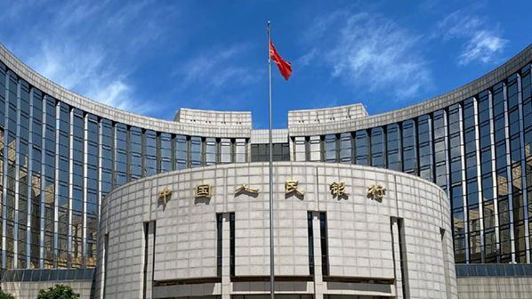

# 国务院组织法首次修订，人民银行行长将明确为国务院组成人员

新华社北京10月20日消息，国务院组织法修订草案20日提请十四届全国人大常委会第六次会议审议，这是国务院组织法施行以来的首次修订。

据了解，国务院组织法是关于国务院组织制度和工作制度的基本法律。1982年12月，五届全国人大五次会议在通过现行宪法的同时，通过了现行的国务院组织法。这部法律的颁布施行，对明确国务院组织制度和工作制度、保障国务院依宪依法履行职责发挥了重要作用。施行40多年来，国务院组织法一直没有修改过。

澎湃新闻记者注意到，10月21日出版的《人民日报》在5版刊文介绍了国务院组织法修订草案的内容。

文章提到，“现行国务院组织法对国务院组成人员的规定比较原则，需要总结40多年来国务院机构改革的实践经验和相关制度规范，作进一步完善。”

文章介绍，对此，修订草案进一步明确副总理、国务委员的职责。现行国务院组织法规定了国务委员职责，修订草案相应增加了副总理职责，统一规定：副总理、国务委员协助总理工作，按分工负责分管领域工作；受总理委托，负责其他方面的工作或者专项任务；根据统一安排，代表国务院进行外事活动。

文章还提到 **，修订草案增加规定国务院组成人员中包括“中国人民银行行长”。**
将国务院组成部门正职负责人统一表述为“部长（主任、行长、审计长）”，将部门副职负责人统一表述为“副部长（副主任、副行长、副审计长）”。

澎湃新闻记者注意到，根据现行的《中华人民共和国国务院组织法》第二条，国务院由总理、副总理、国务委员、各部部长、各委员会主任、审计长、秘书长组成。

此番国务院组织法修订通过后，中国人民银行行长将通过法律的形式明确为国务院组成人员。

