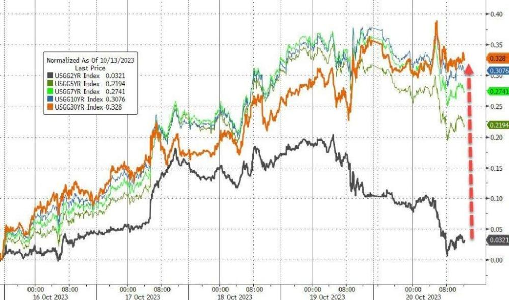
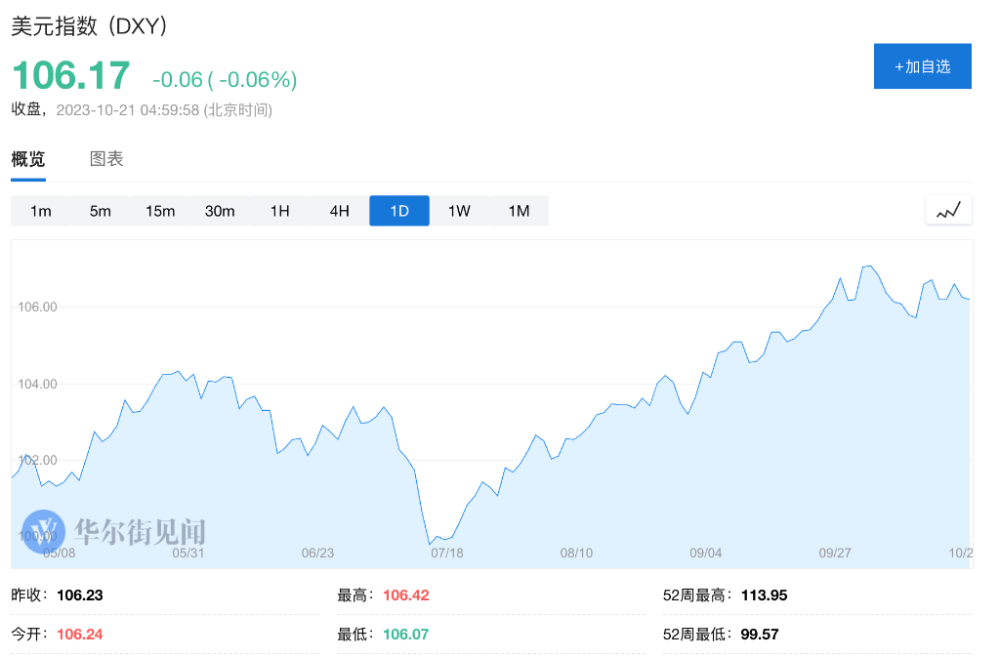
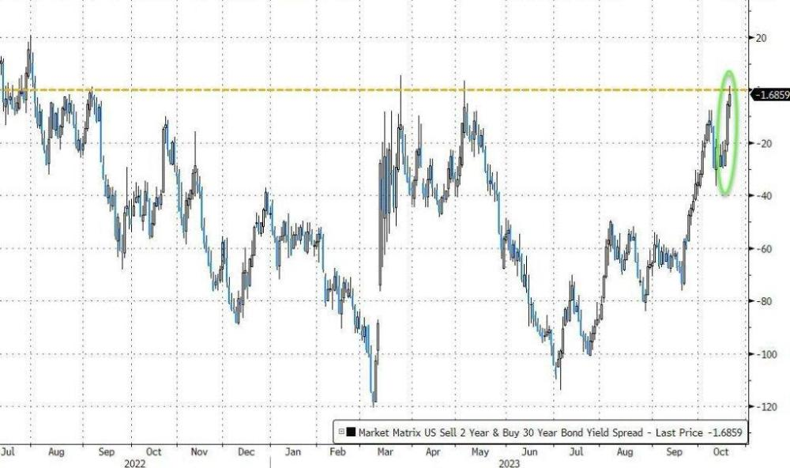

# 超过承受“临界点”了？这一次，美股、美国企业债没逃过“利率暴击”

美联储紧缩预期和美债供应等因素冲击下，美债收益率狂飙势头不止，自7月底以来，10年期美国国债收益率已经涨超100个基点，本周更是大幅上涨30个基点直冲5%，连续两日创2007年7月以来盘中新高，也逼近20年来的最高点。

作为“全球资产价格之锚”的十年期美债再创新高，对全球风险资产都造成了显著压制， **同时更高的美债收益率和美债溢价，还会提高企业和个人的信贷成本。**

在美国长债收益率飙升之际，短债收益率升幅相对较小，收益曲线出现“熊陡”
**，说明此前市场对长期经济增长的定价出现问题（对增长放缓速度和衰退担忧），也使得风险资产承压。**

根据标普全球最新市场情报数据显示，全球股市近期已创下4月以来的最低水平，标普500指数已从7月的高位下挫约8%。其中，公用事业和房地产等行业的高股息股票受到的打击最为严重，美国区域银行股也收到波及。

在企业债领域，近期的美债收益率的飙升导致信贷利差再次走阔，增加了潜在借款人的融资成本， **使得10月的企业债发行会相当有限，且压力或许会延续到11月。**

大宗商品市场也因美债收益率飙升出现了剧烈波动，因美债收益率飙升，引发人们对美国经济前景的担忧，避险情绪再升温，纽约黄金期货盘中突破2000美元/盎司。

美债收益率飙升却加速了对美元的需求。自7月中旬美债收益率加速上涨以来，美元对十国集团（G10）货币平均上涨了约7%。衡量美元对六种主要货币强弱的美元指数近期接近10个月高点。

野村证券首席经济学家辜朝明指出，飙升的美国十年期收益率正逼近 **风险资产价格大幅波动的关键点** 。

长端利率快速上行推动收益率曲线熊陡

在美国长债收益率飙升之际，短债收益率升幅相对较小，对货币政策更为敏感的2年期美国国债的收益率仅上涨了2个基点，这种情况导致了重要衰退预警指标——2年期和10年期美债息差约为-16个基点，连续五日收窄、收益率曲线趋陡——出现了所谓收益率曲线“熊陡”（长短端利率都上行，但长端上行得更快）。

2年期和30年期美债息差约为-4个基点，收益率曲线处于去年8月以来最陡峭水平。

从历史上看，3个月期和30年期美债收益率曲线会先于经济衰退开始变得陡峭，领先经济衰退大约五个月。当前美债收益率曲线倒挂程度缓解，其实某种程度上意味着美联储压制通胀的成效不佳，未来可能会维持高利率更久，也会增加未来经济衰退的风险。

中金公司分析师认为，一般而言，收益率曲线的熊陡更多发生在加息初期（如2022年3月-5月），但当前收益曲线熊陡，
**说明此前市场对长期经济增长的定价出现问题** （对增长放缓速度和衰退担忧）。

**同时，长端利率抬升反过来也会通过快速收紧金融条件来压制长期增长**
，近期高盛金融条件指数快速上升并创2022年以来新高。除非类似于年初中小银行风险暴露的问题再度发生，使得货币和财政重新注入流动性，否则快速收紧的金融条件指数对增长的压力也可能因此而逐步显现：

届时伴随增长压力的增加或风险事件的发生可能再度推动曲线下行（“牛平”，即长短端利率都下行但长端下行更快），直到美联储通过再度宽松压低短端利率，走向“牛陡”。

美股承压

华尔街见闻在多篇文章中分析指出，因收益率的飙升，地产和其他对利率敏感的行业已经对利率飙升做出了反应，但股市等风险资产还未对美债收益率飙升完全定价，因此如果没美债收益率达到这一临界水平，可能会使得风险资产面临更大的波动。

周五，市场担忧地区银行所持美债价值下滑，标普500的区域银行股再现抛压，SPDR S&P Regional Banking
ETF（KRE）收跌4.0%，西太平洋合众银行跌幅为4.6%，阿莱恩斯西部银行重挫8.4%。

此外，科技公司和成长型公司的股价也受到了影响，因为这些公司的未来预期利润承诺与眼下更高的美债收益率相比，吸引力大打折扣。龙头科技股全线下挫。

CIBC私人财富管理公司首席投资官David
Donabedian表示，股市多头们发现他们加仓的理由越来越少，而卖出的理由却很多，市场正密切关注债市情况，这不是件好事：

尽管通胀进展相对良好，但收益率仍在上升，这是股市疲软的主要原因。

企业债发行降温

而随着美债收益率上升和股市下跌，美国企业债市场出现发行疲软的迹象。

近期的美债收益率的飙升导致信贷利差再次走阔，增加了潜在借款人的融资成本，垃圾债的压力尤其显著，收益率已经上升到一年来的最高水平。

媒体报道称，一项衡量全球高收益债券的指数的平均收益率近期升至9.26%，创去年11月以来的最高水平，几乎是2022年初的两倍：

液化天然气提供商Venture Global LNG Inc.在上周四的公司债发行中受挫，只有支付了比最初预期更多的费用之后，才能发行了40亿美元企业债。

即使在资产支持证券市场（通常被视为相对低风险的市场，这些债券是由资产担保的，且具有相对短期的到期期限）企业债发行也不顺利，墨西哥快餐连锁餐厅Qdoba
Restaurant Corp.不得不将其发行规模从最初计划的3.25亿美元削减到3.05亿美元。

数据显示，垃圾债新债发行几乎面临枯竭，美国垃圾债在10月第一周出现了自8月18日当周以来的首个“零”发行周。而9月，美国垃圾债发行额一度超过230亿美元，为2022年1月以来最繁忙的一个月。

此前，巴克莱银行曾就前黄页出版商Hibu Inc．的一笔私人贷款再融资与投资者进行过初步讨论，但发现投资者兴趣不高，于是被迫取消发售计划。

本周有部分企业债的发行方为富国银行、高盛集团和摩根大通，他们公司债的市场交易价格低于它们周五时的发行价格，这表明下周企业债的发行方应该需要为投资者提供更有吸引力的条件。

媒体分析指出，投资级债券收益率上涨至2009年以来的最高水平，为那些能够承受市场波动的投资者创造了机会， MFS投资管理首席策略师Benoit
Anne说道：

对于长期投资者，投资级别债券收益率正处在非常有吸引力的水平。

Loop Capital Asset Management的董事总经理Scott
Kimball表示过去十多年里，企业债的发行与国债或抵押贷款支持证券几乎不存在竞争关系，但这一局势已经迅速产生了巨大的变化，这三个市场都在竞相为投资者提供更有吸引力的收益。

Beach Point Capital的投资组合经理Sinjin Bowron表示，如果美债收益率持续维持在高位，
**那么垃圾债发行企业将面临不得不大幅上调票息的风险。** 美银估计，明年美国企业的违约率可能达到5%。

美债利率与美元同步走强，历史上也并不常见

美债收益率飙升却加速了对美元的需求。自7月中旬美债收益率加速上涨以来，美元对十国集团（G10）货币平均上涨了约7%。衡量美元对六种主要货币强弱的美元指数近期接近10个月高点。

瑞银在近期的报告中写道，在美债不断攀升的这段时期内，美元走强已将其他货币推至结构性低点。例如，日元对美元汇率下跌近8%，至150左右，欧元和英镑也对美元分别下跌了6.1%和7%。

不过，美元走强会进一步收紧美国金融状况，并可能损害美国出口型企业、跨国企业的资产负债表。在全球范围内，美元走强则会使其他各国央行抑制通胀的努力变得复杂。

分析师指出， **美债利率与美元同步走强，历史上也并不常见。** **美元和美债利率走强时，意味着美国国内和海外美元流动性都在收紧**
（体现为汇率交叉互换走高和国外官方机构在美联储存托证券规模的减少），这对于美元定价的资产和新兴市场都是不利的。

分析师认为，需要注意的是， **快速上行的利率和美元本身也会触发风险，尤其是利率敞口较大且杠杆较高的薄弱环节**
。如此前硅谷银行为代表的中小银行持有未兑现损益较大，储蓄流入压力较大等、商业地产或高收益债等等， **这些薄弱环节更容易在极端市场环境下成为“黑天鹅”**
。

