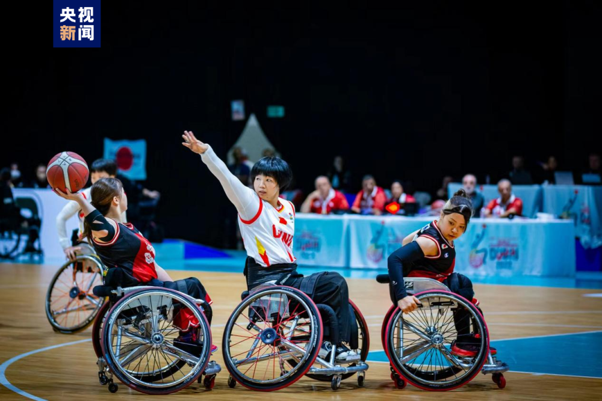
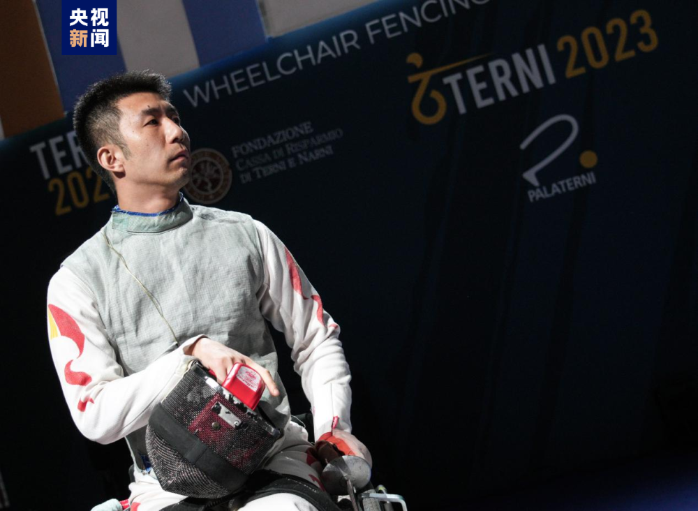

# 黄晓连、孙刚担任杭州第4届亚残运会开幕式中国体育代表团旗手

据央视新闻消息，10月21日，杭州第4届亚残运会中国体育代表团宣布，黄晓连、孙刚将担任杭州第4届亚洲残疾人运动会开幕式中国体育代表团旗手。

女子轮椅篮球运动员黄晓连，来自江苏，曾获得2018年印尼亚残运会轮椅篮球比赛女子组冠军。2020年东京残奥会轮椅篮球比赛女子组银牌。2023年迪拜轮椅篮球世锦赛女子组银牌。

男子轮椅击剑运动员孙刚，来自江苏，曾获得2016年里约残奥会重剑个人、花剑团体金牌。2018年印尼亚残运会花剑个人、团体金牌，重剑个人、团体金牌，佩剑团体金牌。2020年东京残奥会花剑个人、团体金牌。（总台央视记者
高磊 杜思源）

编辑 邓淑红

