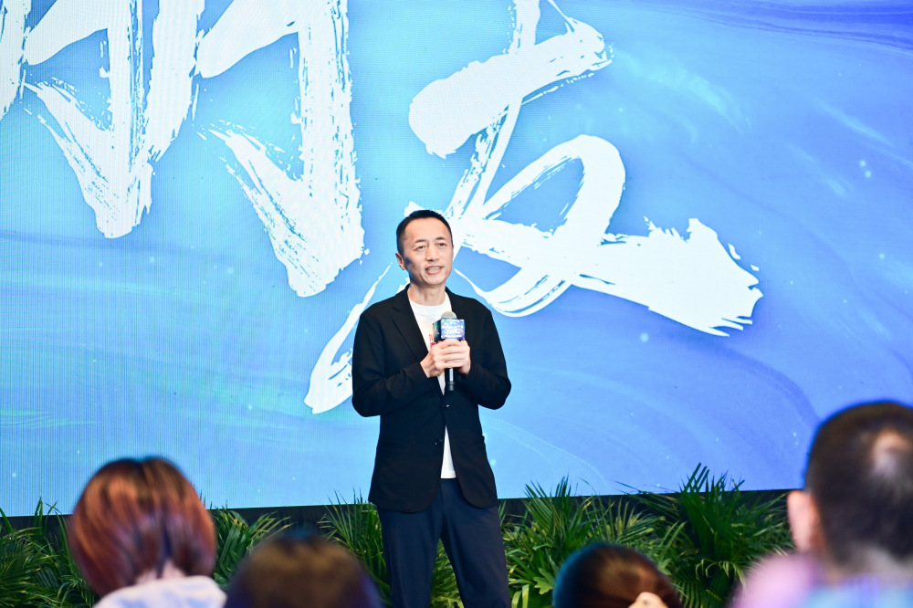

# 万科郁亮：房地产阵痛之后仍有机会，不能指望政策一招解决所有问题

每经记者：黄婉银 每经编辑：陈梦妤

“市场积累的反弹力量和政策支持给恢复提供了一定动力，但短期恢复的基础还不牢固，建议地方政府在供给端有更积极的落地举措。”

10月20日，万科媒体交流会上，对于外界普遍关心的市场形势问题，万科董事会主席郁亮表示，住房需求从“有没有”走向“好不好”的阶段。未来住宅建设的中枢值是10亿-12亿平方米，现阶段住房建设水平显然超跌了。

在两年前的交流会上，郁亮对房地产行业的感悟与看法是16个字——尊重常识，回归常态，阵痛之后，仍有机会。但他在本次交流会上坦言，目前行业内大家都很煎熬，压力都很大，都不容易。

 _郁亮在媒体会上 企业供图_

不能指望政策一招解决所有问题

关于市场是否存在供给过剩的问题，郁亮认为，主要城市当前的住房条件“被平均”了，城市被小镇平均了，大城市被小城市平均了。住房市场需求已经从“有没有”的阶段，走向“好不好”的阶段。

目前客户对居住的需求越来越多，类型也越来越多样化，但针对新需求的市场供应是不充分的。根据第七次人口普查数据，全国城镇人均住房建筑面积38.6平方米，折成使用面积只相当于日本1983年的水平，63%的城市住房还未达到配备电梯的基本门槛。

从城市人口增长、改善、更新的需求来看，郁亮预计，未来住宅建设的中枢值是10亿-12亿平方米。由此来看，现阶段住房建设水平超跌了。今年预计新开工不到7亿平方米，回到了2006年的水平，距离中枢值有较大差距。他认为，住房作为居民生活的刚需不会消失，压制久了总要释放出来。

在8月份的中期业绩会上，郁亮曾表示，当前国内城镇人口9.2亿，今年预计新开工水平折算成人均面积只有0.7平方米，国内目前城镇化率为65%，到2030年预计达到70%，城镇人口增加至9.8亿人左右，保守估计，未来10亿-12亿平方米的新开工面积是有保障的。

在本次交流会现场谈及短期市场表现时，郁亮分享了一组行业数据——8月以来，政策的发力释放了合理的住房需求，已显现出一定效果；9月，一、二线城市成交面积环比增加13.4%；10月上半月最新数据相较9月继续好转。他认为，市场积累的反弹力量和政策支持为恢复提供了一定动力。

“不能指望政策一招解决所有问题。”在郁亮看来，市场短期恢复的基础还不牢固，建议各地因城施策，结合本地市场情况做出更及时的调整，加快政策落地速度。尤其是在供给端，可以有更积极的举措。例如，对于库存过多的地区，暂时放缓土地供应节奏，而对于过去规划用途存在偏差的土地和房产，应考虑转变性质，做市场更需要的产品，这些都是地方政府权限内可考虑的举措。

在8月的中期业绩会上，郁亮就呼吁过，希望已出台的政策尽快落地实施，推动市场恢复到健康合理的水平，因为市场已经超跌。

此后一段时间，相关部门及各地确已相继落实重大的房地产政策，但市场反应还有待观察。郁亮在本次交流会上表示，目前市场情绪还是比较悲观的，还有一部分原因是房屋过剩论和政策无用这两种声音影响了市场情绪。

“政策不是万能的，但绝不是没用的。比如看9月份数据，销售有好转，那是因为市场本质修复力量跟政策发力来共同发力、共同作用的结果。”

对于当下楼市的阶段，郁亮说，好比马拉松“撞墙”。地产行业要从过去传统阶段向新发展阶段迈进，每个企业不管怎么样，无论愿意不愿意、是否准备好了，都要相信新发展阶段都将进入循环。

郁亮表示，市场短期存压力，长期要有信心。

“小钱、慢钱、辛苦钱”

针对开发业务，万科一直认为，现阶段是企业苦练基本功的时候。在开发业务之外，万科近年还在持续探索经营服务类业务。这些业务一直被郁亮形容是“赚小钱、赚慢钱、赚辛苦钱”。

在本次交流会上，物业、物流、泊寓等万科目前已经跑出行业领先成绩的经营类业务负责人也进行了业务分享。

万科联席总裁、开发业务负责人张海表示，当前行业环境已发生较大变化，客户已成为最宝贵的资源。今天客户对产品功能要求高，看重包括户型、室内装标、景观、配套设施、物业服务在内的综合体验，企业的操盘及格线标准从60分提高到80分，企业需要从单项冠军变成投资研判、客户洞察、产品定位、操盘效率等关键环节的全能高手。

张海认为，当前阶段首先要将基本功练得更好，其中练是核心，把业务和管理的基本动作练扎实，就能产生新的价值。所谓基本功，首先是按期、保质地将产品交到客户手中。截至9月底，万科已交付住宅近16万套，总面积2018.6万平方米，其中153个批次实现了“交付即办证”。与此同时，万科今年在全国360个项目举办了7267次工地开放行动，邀请7.1万余户准业主参与房屋查验和公共区域建设。

万科集团联席总裁、万物云董事长朱保全则表示，万物云“蝶城战略”进展顺利且效果显现，万科物业借助蝶城进入家装市场，“研选家”业务快速增长。

对于行业前景，朱保全表示，物业服务企业正处于地产产业链和大消费服务行业的交汇点，需厘清自身定位且增强独立性，在居住消费服务领域布局高增长业务。朱保全预测行业将出现“五化”趋势，即岗位物联网化、作业流程化与机械化、服务AI化以及管理报告数据化。

万纬物流首席合伙人、董事长张旭表示，万科旗下万纬物流目前已服务全球超1600家企业，是目前中国冷链行业唯一能服务7个不同行业的多温区供应链服务商。

而在集中式公寓领域，万科泊寓继续保持了规模和效率的领先，更重要的是，通过长期的精益运营，在开业规模和收入实现稳定增长的同时，自今年6月起，泊寓已实现单月利润连续回正，9月实现了累计权益净利润回正，预计今年内将实现整体盈利。

每日经济新闻

