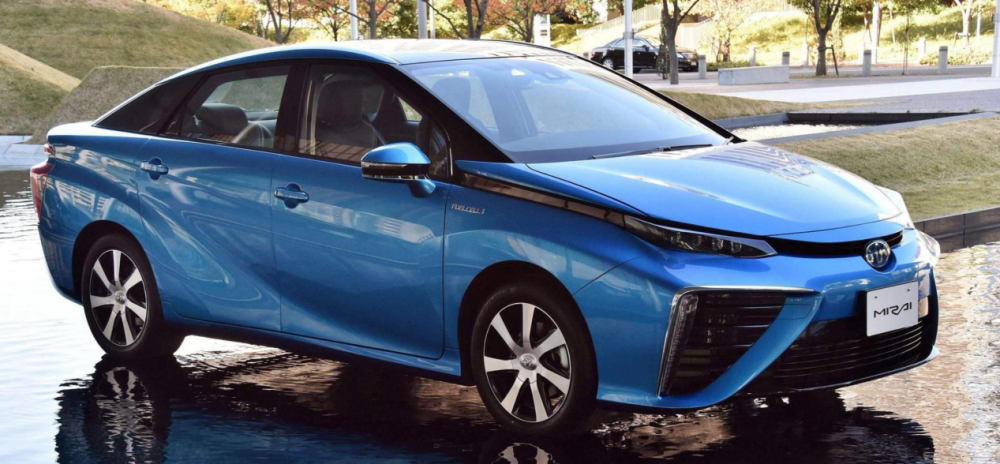
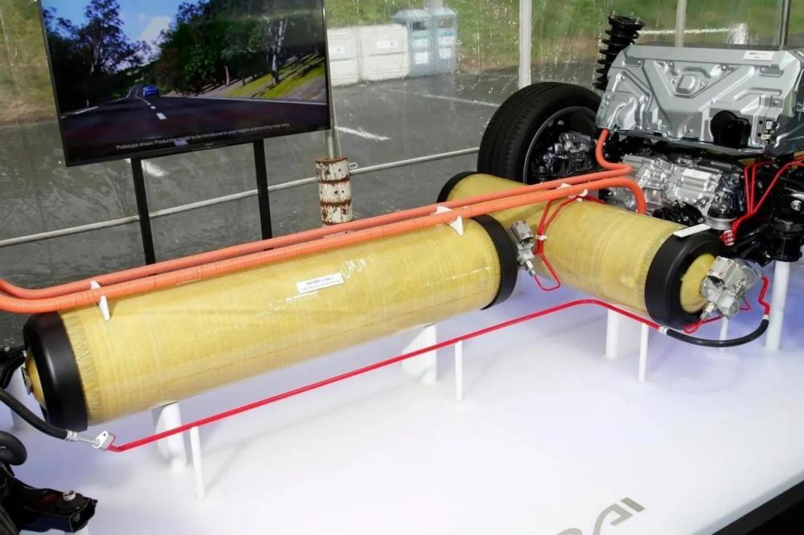
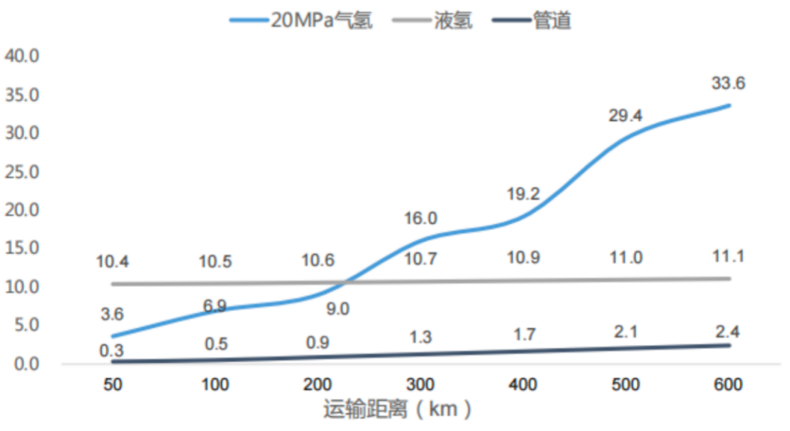

# 丰田押宝氢能车：一手好牌却败给特斯拉，75万一辆难入寻常百姓家

腾讯新闻《远光灯》作者 王博潇

在国内新能源汽车市场进入爆发和高速增长期之际，氢燃料汽车也欲来分一杯羹。

10月18日，BMWiX5氢燃料电池车首次在国内开放试驾，此次测试的车型由宝马集团位于慕尼黑的研发中心小规模生产，目前国内仅有5辆试装工程车。新车集成了氢燃料电池技术与第五代BMW
eDrive电力驱动技术，由两个储氢罐、一个燃料电池、一个块动力电池和驱动电机构成，可实现加氢4分钟，WLTP续航504km。

两个月前，丰田第二代Mirai氢燃料电池车已经正式上线并对外销售。根据官网介绍，第二代Mirai搭载丰田燃料电池系统，电堆功率128kW，储氢5.6kg，NEDC续航781公里，加满氢仅需约3分钟。

不久，丰田宣布将为2024年巴黎奥运会和残奥会提供500辆Mirai
FCEV氢燃料电池车作为官方用车。丰田曾为2022年北京冬奥会提供了140辆Mirai保障车，2021年东京奥运会Mirai作为本土车型自然也是得到重用。

作为新能源车的一个分支，包括丰田、现代、宝马、长城等国内外车企均在氢能源车上有布局，丰田更是在这个领域的领跑者。前述宝马氢燃料车的燃料电池单体，目前就是直接采购自丰田。燃料电池单体是整车最核心的部件，相当于汽油车的发动机。

但过去多年，氢能源车销售始终难见起色，丰田也因押宝失误在新能源车发展上失了先手。在最近政策利好不断的背景下，丰田能否借助氢能源车在新能源赛道上实现“弯道超车”？

**一手好牌为何打烂？**

早在1992年，丰田就开始氢燃料电池汽车领域的研发工作。2014年底，丰田的首款氢能源轿车——第一代Mirai量产，时任丰田掌门人的丰田章男将Mirai亲自交付给时任首相安倍晋三。面对极有可能改写汽车历史的Mirai，安倍给出了这样的评价：“Mirai象征着氢时代的序幕。”

一场氢能源革命就此开始。

起初，Mirai的销量并没有让人失望，首月订单约1500台，在北美市场也有大几百的销量成绩。因为同时期的电车无论是续航能力、售价还是补能速度，在数据上都比不过Mirai。以同期的特斯拉Model
S为例，一代Mirai续航比Model S多30km，补贴后售价是Model
S的6.5折，加氢也仅需要10分钟不到，彼时充电站对比加氢站数量也只能说是五十步笑百步。在当时，氢燃料电池车和电动车谁才是下一个风口，一时难以判断。

但就在一代Mirai发布的同年，马斯克宣布免费公开所有特斯拉的技术专利，直接利好电动汽车产业。作为对比，丰田掌握着70%氢相关的专利，并且几乎垄断了零部件供应链，但直到2019年才决定开放专利，增加“伙伴”数量。

然而，2019年“伙伴”们早已投身电动汽车产业。特斯拉此时年销量已达36.78万辆，全球新能源汽车渗透率达到2.5%，已然势不可挡。

相关数据显示，2021年，全球主要国家共销售氢能源车16313辆，同比增长68%。同一年，仅特斯拉的纯电动车在全球交付量就已达93.62万辆，同比增长87.2%。

2021年4月12日，丰田旗下的第二代氢燃料电池车 Mirai正式在日本上市。据悉，一代Mirai截至当时在全球销量仅超过10000辆。

中国氢能联盟研究院此前发布的统计数据显示，截至2022年底，全球燃料电池车保有量达到6.7万辆，同比增长36.6%，其中我国燃料电池车保有量为12682辆。

2021年12月，押宝氢能源的丰田汽车正式公布了电动化战略，为了保证自己能活到氢能源“起飞”的那天，暂时选择向市场妥协。

**75万氢能源车难入百姓家**

回头来看，如果当时丰田及时开放氢能源专利，情况会有转机吗？

事实上，2014-2019年丰田也没有闲着，也在想方设法地降低单车制造成本、提高核心技术，使其更接近民用。然而，氢能源市场不是只有丰田努力就够的。

电车配套设施的布局要比氢容易得多。基于成熟的电网建立充电站只是规划的问题，即便没有充电站，电车也可以在家中安装充电桩满足补能。但氢能源就没那么简单了，制氢、储氢、运氢、加氢等环节都还存在着各种不确定性。

在氢燃料电池车上，储氢罐是除了燃料电池之外成本最贵的零部件。储氢罐目前分为全金属瓶（I型）、钢制内胆纤维缠绕瓶（II
型）、铝内胆纤维缠绕瓶型（III型）及塑料内胆纤维缠绕瓶（IV型）共4种，未来随着技术的提高可能会出现全碳纤维的V型。级别越高，储存能量的压力也就越高，续航里程也越长，成本也就越高。IV型瓶在第二代Mirai上搭载了三个，总容积122.4L，能存储5.6公斤的氢气，最大支持90Mpa压力，所以在满压的情况下，二代Mirai续航达到781km。

以我国的加氢站为例，70Mpa的氢气价格为60元/公斤，按照正常的氢能源汽车能耗来计算，每公里的行驶成本在0.5元左右，用车成本不仅比不过电车，也比不过能耗好一些的混动车。尽管丰田通过几年的努力已经将二代Mirai的指导价降到了75万元，但仍然不是普罗大众能消费得起的。

60元/公斤的价格并不便宜，但这已经是政府大力补贴之后的价格，目前加氢站基本都是亏损运营状态，一个加氢站一年的运维成本在200万元左右，每公斤氢只有十几块钱毛利，并且需求总量小。

燃料运输方面，氢气主要有高压气态储运、低温液态储运、固态储运、管道运输四种方式。前三种适用于短途且少量运输，如果想实现规模化运输，把成本拉到最低，还需要像输送天然气一样建立管道。目前全球输氢管道总里程超4600km，其中美国达到2720km，但我国目前输氢管道仅约400km，实现低成本氢燃料运输还需要大量布局。

宝马在氢燃料电池车上的顾虑也证实了这一点。在10月18日的试驾会上，当被问及BMWiX5氢燃料电池车为什么现在不量产时，宝马集团氢燃料电池技术及汽车项目负责人Dr.Juergen
Guldner表示，目前基础设施还无法达到民用的标准，加氢站的数量虽然不用像现在的加油站那么多，但布局至少要覆盖人们的生活区域。此外，目前氢燃料的成本（上游制氢，中游储氢运氢）及单车生产制造成本也同样不低。

虽然目前iX5的售价暂未公布，但理论上是要高于丰田Mirai（75万人民币）指导价的，即便现在量产，也完全没有市场。

**丰田能否“弯道超车”？**

但丰田并没有放弃氢能源战略并对其寄予厚望。据内部人士向腾讯新闻《远光灯》透露，第三代Mirai正在研发，将于2026年正式上市，成本进一步压缩，终端售价会是二代Mirai的一半（40万元左右）。

丰田的bz纯电系列虽然算不上一塌糊涂，但与其燃油时代的体量相比无疑是一种退步。bZ4x作为代表之一，自去年10月上市以来，总计在华卖出不到1.5万辆。2022年，丰田在中国市场的销量为194万辆，同比下滑0.2%。

与此同时，押宝了近30年的氢能源在碳排放的压力下初见曙光，丰田能否实现弯道超车还要看地方政府是否认可，以及有没有支持建设的能力。

目前看来，在中国，政策方面的相关利好已经陆续到来。

8月8日，氢能行业迎来了首个国家层面的全产业链标准体系建设指南。国家标准化管理委员会、国家发展改革委、工业和信息化部、生态环境部、应急管理部、国家能源局六部门联合印发《氢能产业标准体系建设指南（2023版）》，明确了近三年国内国际氢能标准化工作重点任务，系统构建了氢能制、储、输、用全产业链标准体系，涵盖基础与安全、氢制备、氢储存和输运、氢加注、氢能应用等环节。

更早之前的2022年3月，国家发改委发布的《氢能产业发展中长期规划（2021-2035年）》提出，到2025年，燃料电池车辆保有量约5万辆，可再生能源制氢量达到10万-20万吨/年；到2035年，形成氢能产业体系，构建涵盖交通、储能、工业等领域的多元氢能应用生态。

根据中国汽车工程学会2020年发布的《节能与新能源汽车技术路线图2.0》，2030年-2035年，我国加氢站将超过5000座。截至2022年底，我国已建成加氢站358座，居世界第一。

事实上，氢气的化学特性决定了其更高的利用价值。氢气的热值高达142kJ/g，是汽油的3倍，焦炭的4.5倍，天然气的5倍；扩散系数是汽油的12倍，只要通风良好氢气很难爆炸。此外，氢气的贮存是非常稳定的，损耗低、能量密度高，可保存几年，即便不服务于新能源汽车，也可以用来稳定电网波动，调整用电负荷。从能源安全的角度，氢是具备巨大潜力的。

除了丰田，越来越多的车企开始布局氢能源汽车。宝马的首款氢燃料电池车i Hydrogen
NEXT将在今年小规模生产，并将于2025年正式量产，该车的电堆系统由宝马集团研发，但其单体氢燃料电池来自于丰田。

作为自主品牌的长安深蓝SL03和上汽大通MAXUS也都推出了自家的氢燃料电池车。此外，本田虽然在2021年宣布停产氢能源车Clarity，但内部也在进行技术储备，戴姆勒虽然终止了与本田氢能源乘用车的合作，也并没有放弃重型商用氢能源车的研发。

无论是发电还是制氢，在没有实现纯绿色零排放的情况下，大概率是相互依赖长期并存的关系。宝马集团氢燃料电池技术及汽车项目负责人Dr.JuergenGuldner就表示，无论是燃油、纯电、氢能源，目前没有单一解决方案能满足全球客户的全方位出行需求，未来出行将并存不同驱动系统，而氢燃料电池汽车是电力驱动系统的一个重要补充。

*部分图片来源于网络，如有侵权请联系我们删除。

