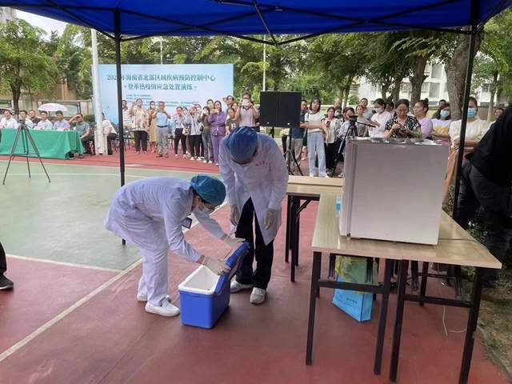

# 传染病防治法拟修订，对报告疑似传染病的予以激励和免责

（人民日报健康客户端记者 谭琪欣
赵苑旨）“春江水暖鸭先知，基层医务人员是最先接触到传染病病例的，由他们直接报告，报错了（非恶意）也免责，才能鼓励他们尽早发现、报告，将对未来新突发传染病防控有积极作用。”

10月21日，广州医科大学附属市八医院感染病中心主任医师蔡卫平接受人民日报健康客户端记者采访时指出，疑似传染病病例信息报告，如层层审批、关卡过多，可能会导致整个公卫体系反应过慢，建立报告的激励和免责制度，则可以很好地补短板、堵漏洞。

10月20日，《传染病防治法（修订草案）》提请十四届全国人大常委会第六次会议审议。在“改进传染病预防监测预警报告制度”部分，《修订草案》首次提出，建立报告的激励和免责机制，对及时发现并依法报告突发原因不明的传染病、新发传染病的单位和个人，按照国家有关规定给予奖励；任何单位和个人不得干预传染病疫情报告。

现行的《传染病防治法》于1989年公布施行，此前曾分别于2004年、2013年进行了修改。“《修订草案》体现了此前业界对传染病报告种种讨论的关注。”10月21日，多位从事传染病防控、研究的专家在采访中均向人民日报健康客户端记者肯定了上述新规对于传染病防治带来的积极影响，在他们看来，未来如何处理疫情的上报、处理一线医生以及一般民众对疫情的反应，是公共卫生体系建设中需要正视和研究的重大问题。

 _10月13日，海口市卫健委举办输入性登革热疫情处置应急演练。海口市卫健委供图_

北京大学公共卫生学院研究员刘珏长期从事传染病流行病学研究，她告诉人民日报健康客户记者，一旦发现原因不明的传染病、新发传染病，立即依法及时报告是非常重要的。“但有关这方面的激励机制和免责机制既往并没有相应的法律文件的明确规定。建立报告的激励和免责机制，禁止干预报告这一新规内容有助于从法律和机制上保障传染病疫情的早报告，有助于疫情的早处置和早应对。”

除上述提及的“建立报告免责机制”和“禁止干预报告”外，在“改进传染病预防监测预警报告制度”部分，《修订草案》还提出，拓展症状监测、强化联动监测、医防协同、医防融合；细化现行传染病防治法仅仅模糊提及的“预警”制度；传染病疫情信息和传染病暴发流行时的疫情信息公布方由原来的“国务院卫生行政部门”改为“各级疾病预防控制部门”。

“现行传染病防治法的实施，对有效防治传染病、保障人民群众生命健康发挥了重要作用。在此基础上，草案提出改进疫情报告制度，可以激励公众积极参与疫情报告和防控工作，提高疫情报告的及时性和准确性，增强社会合作和参与，促进传染病防控工作的开展。”10月21日，医法汇创始人张勇律师接受人民日报健康客户端采访时表示。

