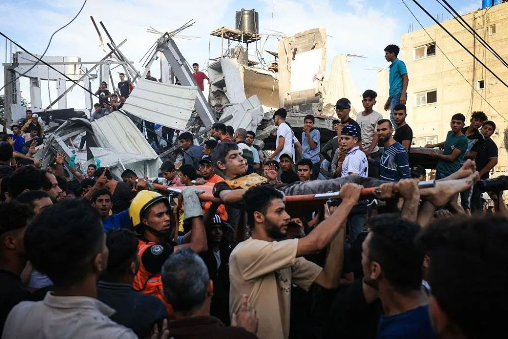

# 加沙“地面战”，为何已难以避免

拉法口岸发生的“积极变化”，并未改变加沙危机持续恶化的态势。

当地时间10月21日，埃及到加沙地带的拉法口岸对人道援助物资短暂开放，控制加沙的哈马斯当局在国际协调下释放两名美国人质。

但当天晚些时候，以色列国防军参谋长哈莱维重申了以军将进入加沙地带的决心。此前一天，以色列国防部长加兰特说，以色列将“彻底消灭哈马斯组织”，并在加沙地带建立一个新的“安全政权”。作为“全面地面进攻”的一部分，以色列国防军发言人哈加里当天还宣布，以军将加大对加沙的空袭力度。

从美国总统拜登到联合国秘书长古特雷斯，国际社会及以色列的西方盟友都在劝说内塔尼亚胡政府不要做出地面入侵加沙的决定。不过，美国田纳西大学荣休教授、青年与冲突研究中心创始主任布莱恩·巴伯对《中国新闻周刊》说，以色列不会因为国际社会的劝告就停止军事行动。巴伯也是位于黎巴嫩贝鲁特的巴勒斯坦研究所（IPS）的高级研究员，该机构是世界历史最悠久、也是规模最大的巴勒斯坦研究机构。

巴伯指出，一方面，哈马斯劫持人质的行为在任何国家都是不可被接受的；另一方面，即使没有人质，过往的经验让以色列人始终相信：以军能够解决巴勒斯坦问题。

布莱恩·巴伯是最熟悉加沙问题的国际专家之一。1994年至今，他几乎每年都前往加沙、东耶路撒冷及约旦河西岸的巴勒斯坦领土，调查青年及家庭受到冲突创伤的影响。他主持的三轮大规模社会学调查分别走访了7000个巴勒斯坦家庭、1000名巴勒斯坦青年和约2000名加沙中年人。

今年10月，巴伯的最新一次加沙之行计划，被哈马斯突然发动的袭击打断。他在加沙的友人，有的已和亲人生死两隔；有的将最后的积蓄换作食物和水，照顾躲进自己家中的数十名妇女儿童。

10月21日接受《中国新闻周刊》专访时，巴伯讲述了加沙地带的复杂图景：被视作极端武装团体的哈马斯在以色列政府的默许下发展，在巴以冲突局势不断加剧的背景下，从被加沙人看不起的边缘组织，逐渐成为令加沙人失望的巴解政府唯一可能的“替代品”。大多数加沙人并不认同哈马斯的意识形态，但他们别无选择。“被国际社会遗忘的是，近年来加沙人从未放弃非暴力反抗活动，可是什么也改变不了。”

在以色列的长期封锁和哈马斯的高压统治下，加沙往往被描述为一片绝望的废墟。但在巴伯眼中，这是充满生机的土地。加沙人重视教育，即使学校在冲突时期关闭，青年们也会在家学习。哈马斯统治并未影响加沙的高等教育和公共教育，因为“在巴勒斯坦的文化中，家庭第一，教育第二”。

但现在，加沙正面临本世纪以来最严峻的战争考验。据美国有线电视新闻网（CNN）报道，北京时间22日上午，以军又在加沙城附近投放传单，警告加沙北部的110万居民必须撤离到南部，否则“可能被视为恐怖组织的合作者”。

巴伯指出，军事行动的唯一后果，是让巴以双方的仇恨再度加深。“面对危机，人们总是团结一致，不计分歧，捍卫己方。”

_10月21日，加沙地带汗尤尼斯的一所学校附近遭到袭击后，巴勒斯坦人转移一名受伤男子。图/视觉中国_

**以色列军方的信条是加倍报复**

**中国新闻周刊：让我们从这一轮冲突的开始谈起。哈马斯为何发动针对平民的大规模血腥袭击？以色列军队为何通过对加沙平民和民用目标的无差别攻击来报复哈马斯的袭击？**

**巴伯：**
本质上，哈马斯是一个民族主义组织，其目标是收复巴勒斯坦的土地。你应该看看2017年发布的“哈马斯宪章”。其中一项原则是，他们并非针对犹太宗教信仰进行“圣战”，他们的主要目标是土地，无论对方的宗教信仰如何。他们相信武装斗争。对哈马斯来说，这并非“突然袭击”，而是又一次争取“解放土地”的尝试，但比之前的行动更加残酷。

关于袭击平民，我曾向一些哈马斯成员提出过这个问题。他们的典型反应是让我想想几十年来以色列军队杀害的无辜平民。在过去两国之间的战争中，巴以双方的死亡人数比例通常为10：1。

以色列军方的信条是“达希亚主义”，即不成比例的加倍报复。他们总是给出攻击平民目标的“理由”，比如某栋大楼下面有哈马斯地道，或者医院下面有哈马斯总部。

此外，绝大多数以色列人从未真正接触过巴勒斯坦人。如果回顾一下近年的民调，你就会发现：大多数以色列人将巴勒斯坦问题排在国家优先事项上相当靠后的位置。因此，以色列人对这次袭击的发生感到震惊。

**中国新闻周刊：哈马斯是否得到加沙民众的普遍支持？**

**巴伯：**
哈马斯直到1987年才成立，一开始并不是一个政治团体。它实际上是在以色列的鼓励或默许下成立的，目的是破坏当时巴勒斯坦的团结。20世纪90年代中期，当我开始到访加沙地带时，哈马斯还是一个边缘组织。当地年轻人经常悄悄嘲笑这些“疯狂的大胡子”。

哈马斯直到2006年大选才进入政治领域。通过与主要世俗政党法塔赫的残酷内战，他们获得了对加沙地带的军事控制。几乎每个加沙人都对我说，哈马斯的选举成功，是加沙人对法塔赫领导的巴勒斯坦权力机构表达不满的结果。阿拉法特13年执政时期的不成功，以及以色列未能遵守
1993 年扩大巴勒斯坦自治权的奥斯陆协议，导致巴勒斯坦人的生活质量在很长一段时间内没有得到任何改善。

在今天的加沙，只有少数本地人在意识形态上支持哈马斯。但在这样的危机时刻，人们会团结起来，哈马斯会被视为唯一愿意反抗以色列的组织。

**中国新闻周刊：国际社会要求以色列停止进一步军事行动，你认为以色列会听取这些意见，暂缓或不再考虑对加沙进行地面入侵吗？**

**巴伯：**
不会。以色列不会停止其军事行动。如我们刚才提到的，他们的政策就是进行“过度反击”。而且，加沙地带仍有约200名被哈马斯劫持的人质。在任何国家，军队都会为拯救人质而战。

即便没有人质，我认为以色列还是会继续其行动。一方面，没有人能阻止他们这样做。另一方面，过去几十年带给以色列的经验是：他们相信军队可以解决巴勒斯坦问题。

**中国新闻周刊：你提到了“没人能阻止他们”。一直以来，西方一些国家的政府和政要能及时谴责哈马斯的暴力活动，但很少谴责以色列军队违反人道法的行为。这是为什么？如果巴勒斯坦人进行非暴力反抗，他们能得到更多的国际支持吗？**

**巴伯：**
西方国家研究加沙的人并不多。我的哈佛大学同事莎拉·罗伊（哈佛大学中东研究中心研究员）曾在加沙生活过，并仔细记录了以色列禁止加沙发展经济的系统性政策。除此之外，除了我的研究团队所做的工作之外，对加沙地带的严肃研究很少。

人们忘记的是，巴勒斯坦人在整个解放斗争中都进行了非暴力抵抗。不幸的是，这难以取得成功。最近最好的例子是2018年的“回归大游行”。这是一场非暴力抗议活动，主要针对分隔加沙和以色列的隔离墙。抗议持续了整整
18 个月，以色列军队（主要是狙击手）杀死了 200 多名抗议者，打伤了 36000 多名抗议者，其中包括 8000 多名儿童。

**加沙人遭受“非人化”和边缘化**

**中国新闻周刊：你在加沙有很多朋友，他们现在安全吗？**

**巴伯：**
我最重要的三位朋友，也是我正在撰写的关于加沙的非虚构作品中的主要人物，都还活着，没有受伤。我现在通过社交媒体平台与他们沟通。人们可以在医院为手机充电，一些医院的发电机仍然有燃料。

我的一位朋友家里收留了50多名妇女和儿童，他们生活在黑暗中。这位朋友正在花掉最后的积蓄来购买水、面包和蔬菜。袭击发生时，我的另一位朋友正在埃及。现在他仍滞留在那里，不知道何时才能与加沙的家人团聚。他在加沙的一位兄弟在以色列对哈马斯袭击作出反应的初期就遇难了。

**中国新闻周刊：战前加沙的日常生活是怎样的？**

**巴伯：** 1996年我开始深入加沙地带。那时，几千名犹太定居者占据了加沙至少30%的土地，包括那里最肥沃的土地。他们的定居点由以色列军队重兵把守。

与当地阿拉伯人不同，定居者被允许在加沙的含水层打深井来抽取淡水，其中大部分用于灌溉他们肥沃的草坪。这与大部分干旱的土地形成了鲜明的对比。而加沙人不得不依赖因地中海海水侵蚀而严重盐碱化的浅井。我还亲眼目睹了以色列军队羞辱巴勒斯坦人，场面触目惊心。

2000年巴勒斯坦人第二次起义后，加沙基本与外界隔绝。自那时以来，和所有外国人一样，我每次进入加沙都需要以色列军方的许可。2005年以色列从加沙撤出定居者和军队，隔离了陆地边界，禁止以色列人进入加沙，而加沙人需要“几乎不可能获得”的以色列军方许可，才能离开加沙地带去接受医疗服务，或探望在耶路撒冷或约旦河西岸的家人。

很多人不知道的是，在这样的情况下，加沙人仍然非常重视教育。加沙目前的识字率为97%，是世界上识字率最高的国家和地区之一。即使学校在敌对行动期间关闭，加沙的巴勒斯坦人仍继续在家学习。中学毕业生会参加为期21天的非常复杂的Tawjihi（大学入学考试），科目包括阿拉伯语、英语、文化、地理、历史、数学和宗教。通过考试的人如果能负担大约1000美元的学费，就可以进入加沙当地的大学就读。但这对加沙人来说是一笔巨款。

加沙约60%的年轻人找不到工作。他们不断地申请为数不多的教师、非政府组织工作人员和企业的空缺职位。

世界必须理解加沙人遭受的非人化（dehumanization）和边缘化。我们的大规模研究表明，在1987年到1993年的第一次巴勒斯坦起义期间，当巴勒斯坦问题首次登上世界舞台时，超过80%的加沙青年的家园遭到以色列军队袭击；超过70%的人目睹自己的亲人被军队羞辱；超过60%的人自己也遭受羞辱。大约25%的年轻人曾被拘留或监禁；20%的年轻人曾被子弹击中，或遭遇酷刑，或在当时的以色列国防部长的指示下遭到军警殴打。

**中国新闻周刊：自2007年以来，哈马斯控制了整个加沙地带。哈马斯和以色列，哪一方对加沙的日常生活影响更大？**

**巴伯：**
这是一个有趣的话题。哈马斯之前没有任何政府经验，他们经常以严厉和惩罚性的方式管理加沙。而以色列虽然处于“外部”，但他们控制着“内部”的一切，包括加沙的网络、水电、能源、燃料和医疗用品。所以以色列极大地影响了加沙人的日常生活。我在加沙的时候，有时一天只有2小时供电，有时有4小时电，有时能有8小时电力供应。

**中国新闻周刊：我们经常看到以色列军队在空袭前致电加沙居民，要求他们撤离。这种做法真的能拯救平民生命吗？**

**巴伯：**
如果以色列军方决定警告加沙平民，他们有两种方法。一种是手机通话。他们拥有每个巴勒斯坦人的手机和固定电话号码。2014年冲突期间，我在加沙的两个朋友接到过这种电话，以色列军官要求他们离开家。另一种方法是所谓的“敲门”，即用非爆炸性导弹击中屋顶，警告屋内的人真正的空袭即将来临。

这能拯救生命吗？我认为这确实拯救了生命。但这些生命的家园、所有的贵重物品及他们的生活记忆都被摧毁了。

**中国新闻周刊：你提到你的朋友接到过这样的电话。他们所在的建筑地下真的有哈马斯成员吗？**

**巴伯：**
目前我们还不知道以色列军方定位攻击目标的方法和逻辑。其中一些空袭是为了斩首哈马斯领导人。总的来说，我认为以色列的逻辑是：任何他们认为与哈马斯有关的东西都必须被摧毁。这次尤其如此。

**中国新闻周刊：加沙地带和约旦河西岸、东耶路撒冷等巴勒斯坦其他地方完全分离，这是否会导致加沙人和其他地区的巴勒斯坦人在生活和观念上产生差异？**

**巴伯：**
事实上，早在90年代中期，当我开始前往加沙时，约旦河西岸和东耶路撒冷的人们就希望我向他们分享加沙的生活和状况，因为绝大多数人从未去过加沙。不过，加沙与这些领土完全分离，并没有削弱所有巴勒斯坦人为摆脱占领、过上有尊严的生活而奋斗的团结热情。

**中国新闻周刊：你第一次访问加沙时，巴以刚刚签署《奥斯陆协议》，哈马斯当时还不得人心。后来，随着巴以局势不断恶化和激化，哈马斯成为加沙的控制者。你认为人们选择哈马斯不是因为意识形态，而是因为他们对巴勒斯坦权力机构不满意。但现在，新的冲突发生了，这会改变加沙人民对哈马斯的看法吗？**

**巴伯：** 我认为这次的情况和以往没什么不同。面对危机，人们总是团结一致，不计分歧，捍卫自己的一方。这是很自然的事情，遭到哈马斯袭击后的以色列也是一样。

从长远来看，对普通巴勒斯坦人来说，他们的愿望很简单：他们希望找到工作、赚钱养家，有能力教育孩子，以及自由旅行。总而言之，就是过上有尊严的生活。这并不意味着他们认可哈马斯的斗争方式。

事实上，大多数巴勒斯坦人认为，任何应该对他们的未来负责的机构，无论是以色列、美国、巴勒斯坦权力机构，还是现在的哈马斯，都没有承担起责任。

在新一轮冲突爆发之前，加沙的局势已经比90年代我第一次去那里时糟糕得多。即使是专业人员（医生、教师等）也无法维持收支平衡，而且所有解决方案都没有取得进展。这是一个绝望的处境。但巴勒斯坦人是一个非凡的民族，有着坚强的意志和内心的希望。你很少听到巴勒斯坦人说“没有希望”。这种意志会一直持续到他们死为止。

记者：曹然

