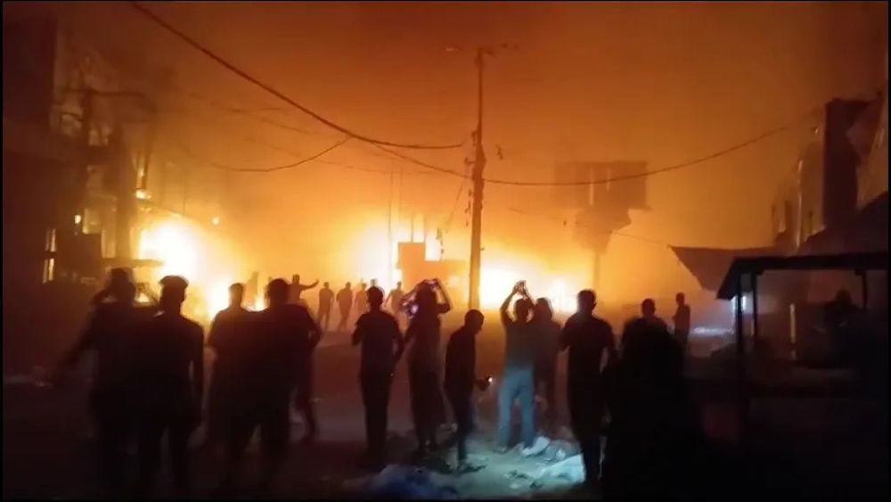

# 坦克、火炮集结，加沙面临噩梦般的“隧道战”？

近日来，以色利梅卡瓦主战坦克、自行火炮系统和成千上万全副武装的步兵，在加沙边境以色列一侧的农场和田地里集结。

巴勒斯坦伊斯兰抵抗运动（哈马斯）10月7日突袭以色列后，这一轮冲突已经持续超过两周。根据联合国10月21日发布的数据，冲突已造成以色列方面1400多人死亡，加沙地区4385人死亡。

在以色列方面多次宣布要全面消灭哈马斯之后，以色列国防部长阿夫·加兰特10月20日正式对外阐述了加沙地带的战争计划和目标。他表示，目标包括通过摧毁哈马斯的军事和政府能力来消灭该组织，并计划在加沙地带建立一个新的“安全政权”。但在一些分析人士看来，这样的目标实现起来并不太乐观。

 _当地时间10月21日，以色列军队空袭了加沙地带的努西拉特难民营。图/视觉中国_

**以军的三阶段作战计划**

在10月20日的以色列议会外交和国防委员会会议上，加兰特告诉委员会成员，以色列对加沙的战争将分为三个主要阶段。

第一阶段，先通过空袭开展军事行动，随后再发动地面袭击，目的是消灭特工和破坏基础设施，从而击败和摧毁哈马斯。他表示，“目前以色列正处于第一阶段，包括对加沙地带进行了数千次空袭。”

第二阶段，地面部队进入加沙后，将采取较低强度的行动，来消除“零星的抵抗力量”。

第三阶段，在加沙地带建立新的“安全政权”，免除以色列对加沙地带日常生活的责任，并为以色列及其公民创造新的安全环境。

根据公开的消息来源，10月7日之后，以色列一直在全力确保关键的军事供应，以维持可能持续数周或数月的军事行动，如在任何新的袭击之前及时补充航空炸弹库存。

在地缘政治和安全分析师佐兰·库索瓦茨看来，以色列军队已经进入战备状态，可以对加沙发动全面攻击。这最多只需要几天时间。

尽管具体的攻击计划和时间安排，只有以色列最高军事和文职指挥官能够掌握。但根据目前的信息，佐兰·库索瓦茨预测称，全面攻击几乎肯定会在夜间开始。因为，大多数以色列士兵都配备了夜视镜，并接受过使用夜视镜在黑暗中作战的训练。更重要的一点，以色列战机、直升机和无人驾驶飞机也可以在完全黑暗的情况下运行。协调一致的陆地和海上攻击将同时从多个方向发起，为攻击行动提供近六个小时的夜视优势。

当然，哈马斯也具备一些夜视设备，但他们并没有能在夜间瞄准和射击的空中设施。

全面进攻期间，地面部队将穿过以色列在加沙周围修建的隔离墙，大规模的装甲推土机将冲破隔离墙，挖掘并推开哈马斯武装分子可能埋设的反坦克地雷和杀伤人员地雷。他们的两侧将是梅卡瓦主战坦克和步兵，后面是装甲运兵车上的步兵连。而他们的目标是在黎明前到达加沙的建筑目标区。

**噩梦般的“隧道战”？**

以色列军队有着装备数量和质量的优势，以及更高端的技术和武器。此外，他们训练专业、指挥思路明确。与他们相比，哈马斯军力似乎要弱得多。但在一些分析人士看来，哈马斯的力量并不能过早低估，他们花费了至少两年时间来策划这次突袭，很有可能已经为以色列大规模报复做好了准备。

过去30多年，哈马斯的军事力量一直依靠游击战式的战术来攻击以色列，使用火箭、狙击手、简易爆炸装置发动袭击。哈马斯的军事力量也在不断壮大，它已经建造或获得了一个庞大的火箭武器库，射程几乎覆盖整个以色列，同时，哈马斯还修建了隧道将人员偷运到以色列境内，以便在以色列军队入侵时伏击他们。

此前也有报道指出，哈马斯下属武装派别卡桑旅已经展开行动，在加沙边境设置反坦克地雷和诱杀爆炸装置来伏击敌军。

对哈马斯有利的一个条件是，他们在主场作战，熟悉每一个角落、建筑物、屋顶和瓦砾堆。最重要的是，哈马斯多年来在加沙地下挖掘的强大的防御隧道网络。

哈马斯此前声称，他们已经在加沙地下修建了500公里的隧道。该隧道系统覆盖面很大且使用广泛，并被以色列国防军在内的一些人称为加沙“地铁”。根据《地缘政治》杂志2016年的一篇文章介绍，这些隧道平均高接近2米，宽接近1米。

美国军事与政治中心高级主任布拉德利·鲍曼认为，加沙庞大的隧道系统“将给以色列国防军带来严峻的挑战”。这些隧道使一些哈马斯战士能够在轰炸中幸存下来，在加沙周围行动，为其部队提供补给，隐藏人质并发动突然袭击。

“想象一下，当士兵穿过田野或进入城市郊区，然后突然间，一些敌军突然出现在你身后。这对于突击部队来说简直就是一场噩梦。”布拉德利·鲍曼表示。

**人道主义灾难升级**

“加沙地带人口密集，加上以色列大规模使用武器，地面行动将不可避免地对加沙平民产生严重影响。”华盛顿近东政策研究所高级研究员盖斯·奥马里表示。

迄今为止，以色列一直表示，它正在对哈马斯发动战争，而不是针对加沙平民。但以色列国防军发言人彼得·勒纳中校也坦言，虽然他们试图避免平民伤亡，但在城市战争中这是不可避免的。

巴勒斯坦卫生部10月21日表示，自10月7日哈马斯和以色列之间的冲突升级以来，加沙的死亡人数已上升至4385人，13651人受伤。卫生部补充说，死者包括1756名儿童和976名妇女。

联合国人道主义事务协调办公室表示，加沙约有140万人流离失所，占整个加沙地带人口的60%以上。同时，加沙地带已有14万所房屋被破坏，这几乎是加沙所有房屋的三分之一，近1.3万所房屋完全被毁。

加沙卫生部门同时表示：“该地区人道主义援助缺乏，意味着患者和伤者的生命仍将面临风险。加沙医院的医疗干预基本需求已经耗尽。”

世界卫生组织则称，情况一天天变得更加严峻，医院已处于“崩溃边缘”，而在以色列近乎持续的轰炸下，加沙人的食物、水和其他重要物资正在迅速耗尽。

粮食短缺也是一个严重问题，世界粮食计划署执行主任辛迪·麦凯恩对媒体表示，“加沙的饥饿现象正在愈演愈烈。”

当加沙地带正面临新的人道主义灾难之时，10月20日，一场和平峰会在埃及首都开罗举行。这场峰会由埃及总统塞西发起，旨在缓和加沙局势并保护当地平民。来自中东、非洲、欧洲等34个国家以及联合国的代表出席了此次峰会，但以色列缺席了此次峰会，美国仅派出驻埃及使馆临时代办参会。

据一位参会官员证实，由于各代表团在措辞上存在“分歧”，各方未能就遏制暴力事件达成一致。最终，这场峰会也未发表联合声明。

和平峰会召开之际，以色列军方也正在加大对加沙的空袭力度。以色列国防军发言人丹尼尔·哈加里10月20日在特拉维夫举行的新闻发布会上对记者表示：“我们将加大打击力度，最大限度地降低我们部队在战争下一阶段面临的风险。”以色列国防军参谋长赫尔齐·哈莱维进一步表示，军队正在准备进入加沙，消灭哈马斯。

不过对于此项行动，路透社援引美国消息人士称，华盛顿对以色列能够彻底摧毁哈马斯的态度不太乐观，而且美国官员认为以色列几乎不可能重新占领加沙领土。他还表示，更可能的情况是，以色列军队尽可能多地杀死或俘虏哈马斯成员，炸毁隧道和火箭车间，然后在以色列伤亡人数增加后，寻找宣布胜利并退出的方法。

记者：郑立颖

