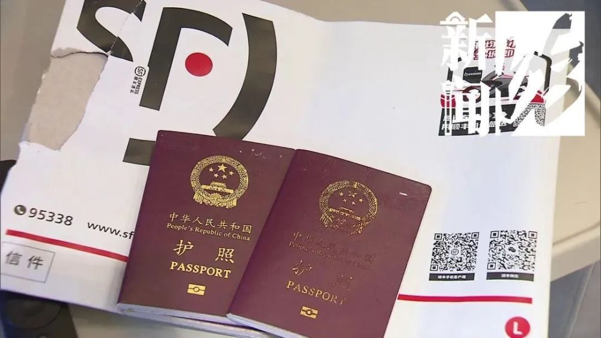
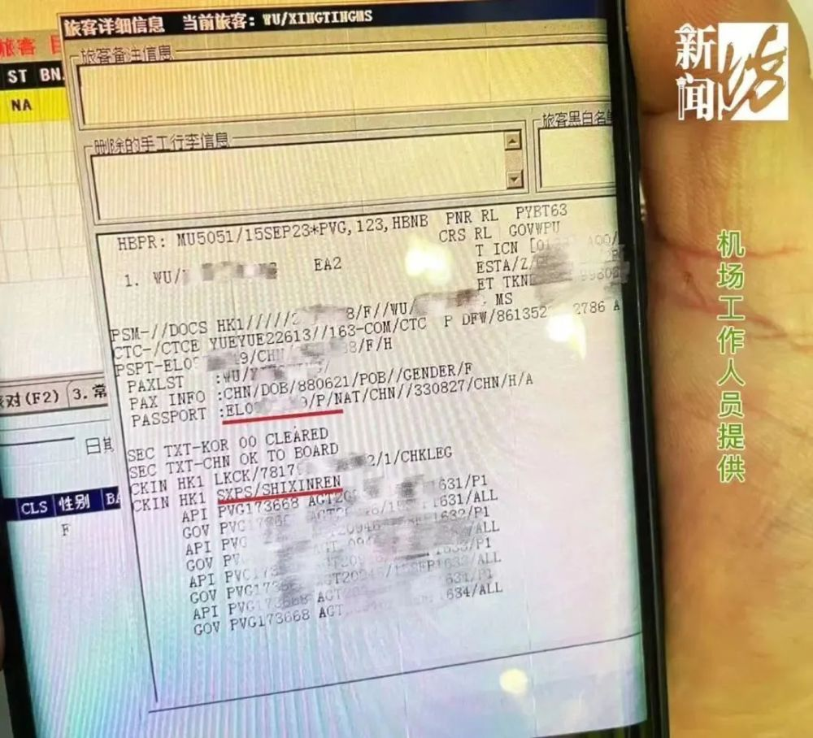
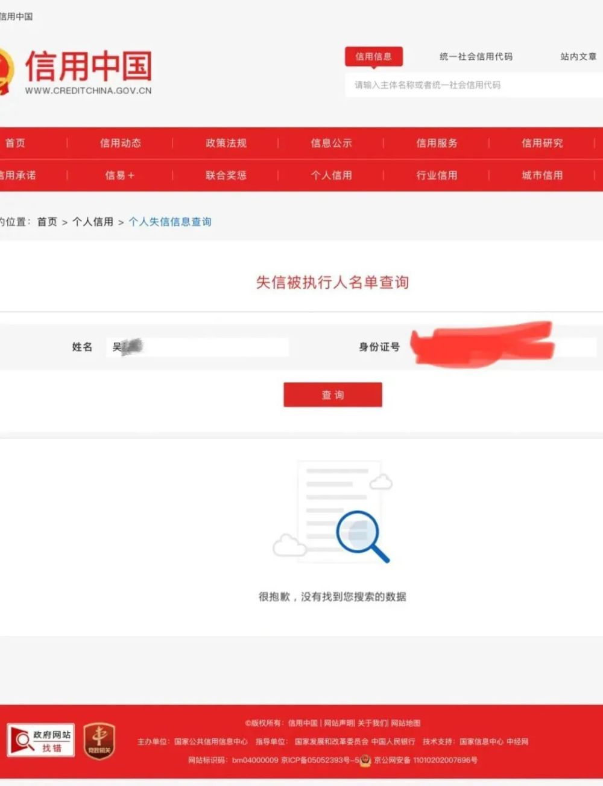
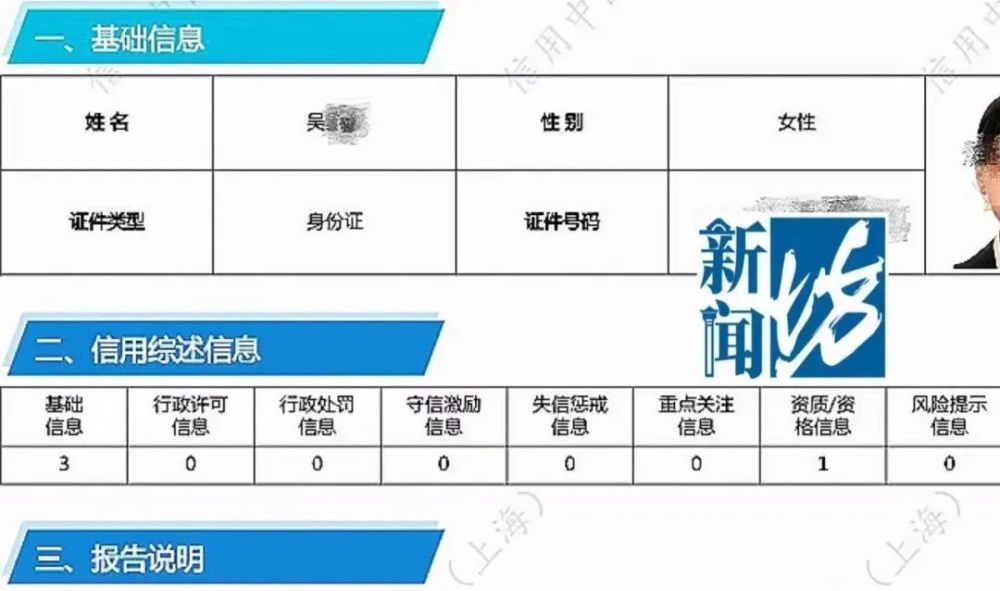
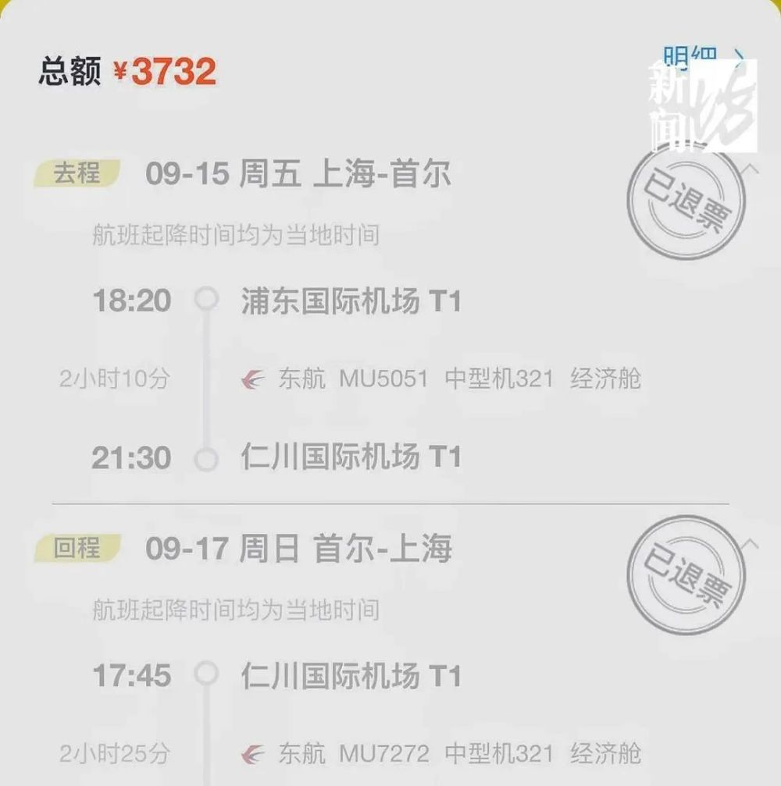
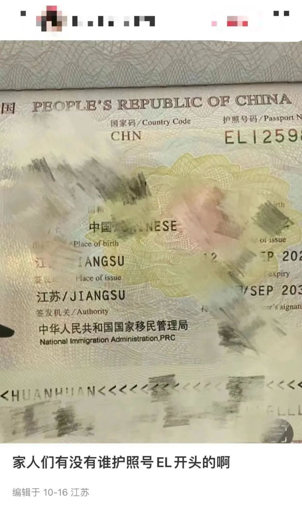
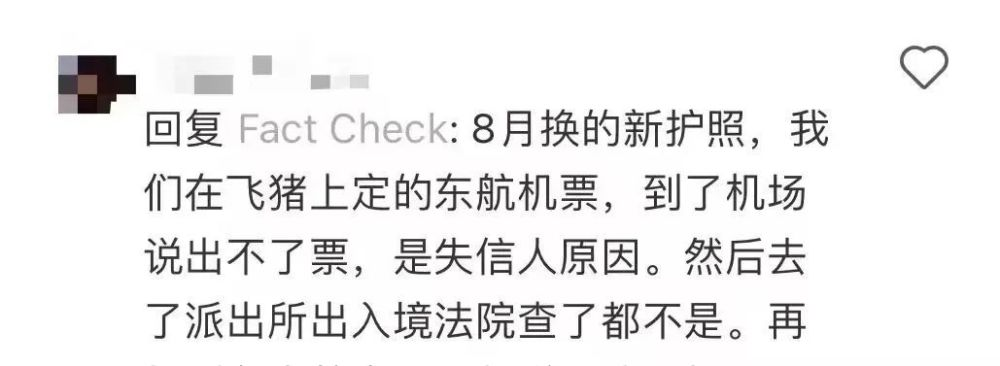
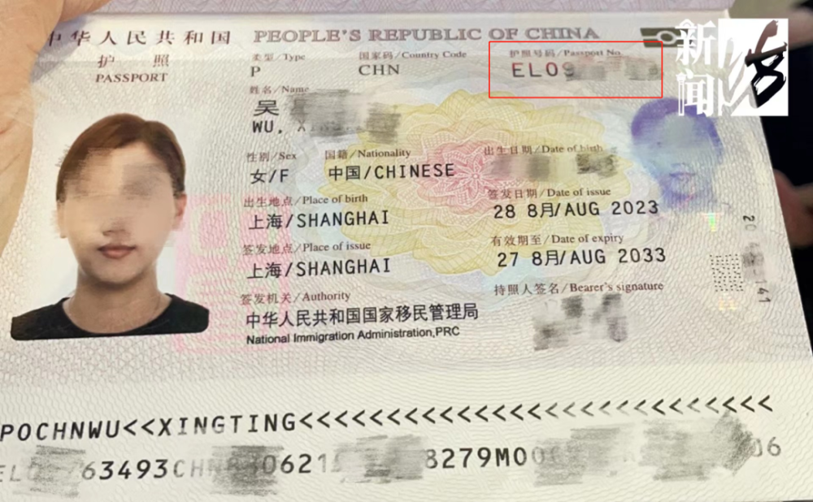
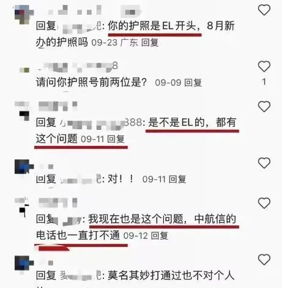
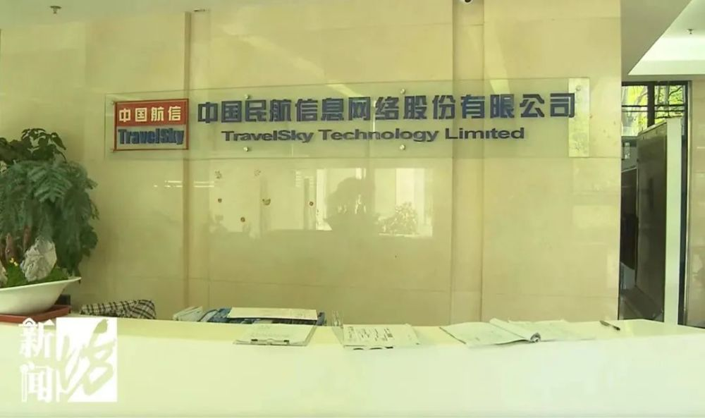

# 女子出国旅行莫名因“失信人”身份被拦，中航信：失信名单出自最高法

**莫名被“失信”，有人机票无法出票，有人只能放弃出游。**

陈女士最近遇到了糟心事，她开开心心地等着出国游。谁曾想，却被旅行平台告知，经“东航航空公司”反馈，她被列入了失信人员名单，还被限制了高消费，所以机票无法出票。

上海另一位吴女士，最近也有了类似遭遇，而比陈女士更糟心的是，吴女士在买机票时没遇到问题，最终却是在出国当天，到了机场才因“失信人”身份被拦下了。

吴女士告诉记者，她是通过飞猪平台购买了从上海到首尔的往返机票。9月15日，当她到浦东机场东航柜台值机时，却被机场地勤告知“被失信人不能值机”。吴女士称，自己随后联系派出所并在网上查询，显示自己并非失信人。不过，机场工作人员还是表示“没办法，系统就是做死的”。无奈之下，吴女士只能先回家，放弃出游。

**护照这组字母开头被怀疑？**

记者在社交平台发现，全国范围内，和陈女士、吴女士一样，上网投诉莫名“被失信”的网友还不在少数。

网友们自发调查整理，发现被误判为失信人的公民，都有一个共同的特点：手持最新办理的护照，且护照号都以"EL"开头，没错，陈女士、吴女士的护照开头也是EL。也因此，“护照号码EL开头为失信人员的护照段”的传言在网上愈演愈烈，这个说法是真的吗？国家移民管理局已经辟谣：网传“护照号码EL开头为失信人员”纯属谣传！

那么问题来了，这些类似遭遇的乘客，“被失信”的原因又是什么呢？吴女士告诉记者，她事后向东航方投诉，当时东航方面表示，这件事情不归他们管，要找“中航信”系统，由它判定谁是失信人。但是，“中航信”不对接个人，电话打不通。

**※“中航信”系统到底是个什么系统？为何能判定乘客是否“失信”呢？**

据东航负责人透露，“中航信”
全名为中国民航信息网络股份有限公司，是一家为国内大部分航空公司提供旅客个人征信信息系统的供应商。目前陈女士“被失信”一事，已经有了新的修正。“我们把这个情况反馈给了中航信，根据现在掌握的情况看，您的护照号码已经没有失信人标识了，可以正常购票。”东方航空售后处置部负责人称。

**※陈女士很疑惑，（失信）标识是怎么产生的，为什么会产生？ “中航信”又是做了什么判断，把它删掉了？**

东方航空售后处置部负责人称：这些不是东航可控的，该标识是中航信系统后台修订的。目前，陈女士不再是失信人，可以正常购买境外机票了；修改、删除陈女士为被失信人一事，是“中国民航信息网络股份有限公司”所为，具体原因还得陈女士自己去问中航信。陈女士通过12345市民热线尝试与“中航信”取得联系，但对方始终未有回应。

记者也特意赶往了位于田林路888弄的“中国民航信息网络股份有限公司”，在得知记者来意后，相关工作人员表示：他不负责此事，记者需将陈女士的遭遇以采访函件的形式发送给他，之后他再帮着转给北京总部。隔天，该工作人员回复记者表示，函件已收到，但记者和陈女士可能还要去北京询问最高法。

“我们是一家系统的服务提供商，所谓的失信名单是由最高人民法院给我们的名单，相当于我们给民航局做了一个黑名单系统工作，来限制他这些失信人员的高消费。我们不会去对失信的原因去把握，所以这个事情我觉得最后，你可能还要找到这个北京的高法去
。”中国民航信息网络股份有限公司上海分公司工作人员说。

根据该工作人员的表述，陈女士当初“被失信”一事，名单出自最高法。那么，为什么东方航空称经过“中航信”调整，陈女士就可以买机票了？这跟最高法有什么关系呢？

目前，记者还在等待“中国民航信息网络股份有限公司”的相关回应。

本文来源：新闻坊

作者：马跃龙 陈玮

校对：rong

