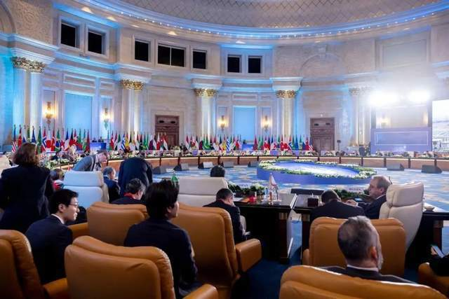
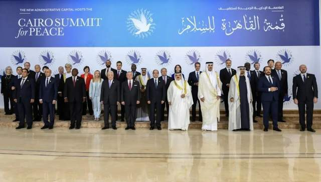

# 巴勒斯坦问题峰会闭幕，“分歧非常明显”

由埃及主持的巴勒斯坦问题峰会21日闭幕。埃及总统府在峰会闭幕后发表声明称，埃及呼吁结束本轮冲突，要求尊重国际法和人道主义相关原则保护平民，使其免遭风险和威胁。声明说，加沙地带获得人道主义援助是重中之重。

声明同时强调，埃及永远不会接受以牺牲该地区任何其他国家的利益为代价来解决巴勒斯坦问题。鉴于当前日益危险的形势，埃及在维护其主权和国家安全方面不会有任何松懈。

_巴勒斯坦问题峰会21日在埃及举行。图源：路透社_

据新华社报道，巴勒斯坦问题峰会当天在开罗附近的埃及新行政首都举行，与会各方讨论如何解决巴以新一轮冲突升级问题，并呼吁巴以停火止战。

本次“开罗和平峰会”由埃及发起，邀请了30多个国家的元首、政府首脑、特使以及联合国等国际组织负责人参会。应埃及政府邀请，中国政府中东问题特使翟隽出席此次峰会。

_30多个国家的元首、政府首脑、特使以及联合国等国际组织负责人出席峰会。图源：路透社_

埃及总统塞西在峰会开幕致辞中说，埃方拒绝将巴勒斯坦人驱逐到埃及土地上，解决巴勒斯坦问题的唯一办法是赋予巴勒斯坦人合法生活在独立国家的权利。他呼吁国际社会共同努力，制定恢复中东和平进程的路线图，结束当前的人道主义悲剧。

巴勒斯坦总统阿巴斯强调，只有落实“两国方案”、根据联合国大会第194号决议解决难民问题，才能实现和平与安全。他谴责以色列对加沙地带的“野蛮侵略”，呼吁立即停止“侵略”并开放人道主义走廊，允许食品、药品等必需品进入被围困的加沙地带。他同时警告不要企图驱逐在加沙地带的巴勒斯坦人。

约旦国王阿卜杜拉二世呼吁立即停止冲突，保护平民，并采取统一立场谴责以平民为目标的袭击行为。他重申反对强迫巴勒斯坦人流离失所，认为这是国际法规定的战争罪。

联合国秘书长古特雷斯在讲话中呼吁通过“两国方案”解决巴勒斯坦问题，并对20辆主要装载医药援助物资的卡车当天从拉法口岸埃及一侧进入加沙地带表示欢迎。他强调，在埃及一侧等待的援助卡车需要以大规模、可持续和安全的方式尽快驶入加沙地带。

阿盟秘书长盖特表示，国际社会必须努力推动停火止战，并紧急开辟一条安全走廊，向加沙地带人民提供可持续的人道主义援助。

英国外交大臣克莱弗利表示，国际社会有责任共同努力，防止不稳定的局势蔓延至整个地区并夺走更多生命。相信通过外交努力，国际社会可以确保以色列人和巴勒斯坦人未来和平相处。

土耳其外长菲丹表示，巴以冲突需要新的保障机制，有必要保障各方为实现公正和平而采取的步骤。如果以色列继续发动袭击，将导致地区局势升级，威胁全球稳定与和平。

峰会未能达成联合声明 以色列发声

英国广播公司（BBC）指出，此次“开罗和平峰会”没有发表联合声明，没有以色列或美国高级官员出席，阿拉伯和欧洲国家间的分歧非常明显。

据《以色列时报》报道，以色列外交部在声明中称，“令人遗憾的是，即使面对这些令人震惊的暴行，仍有一些人难于谴责恐怖主义或承认其危险性”。声明补充说，以色列将做它“必须做的事”，并期望国际社会承认其“正义的战斗”。

《以色列时报》提到，据法新社早些时候报道，阿拉伯外交官称，由于阿拉伯国家和西方国家在是否谴责哈马斯的问题上出现分歧，“开罗和平峰会”未能达成联合声明。一位不愿透露姓名的外交官告诉法新社，西方代表要求“明确谴责哈马斯应对局势升级负责”，但阿拉伯领导人拒绝这一要求。

来源丨新华社、环球网、法新社等

编辑丨陈淼松，深圳卫视直新闻主编

排版丨苏瑞雪，深圳卫视直新闻编辑

