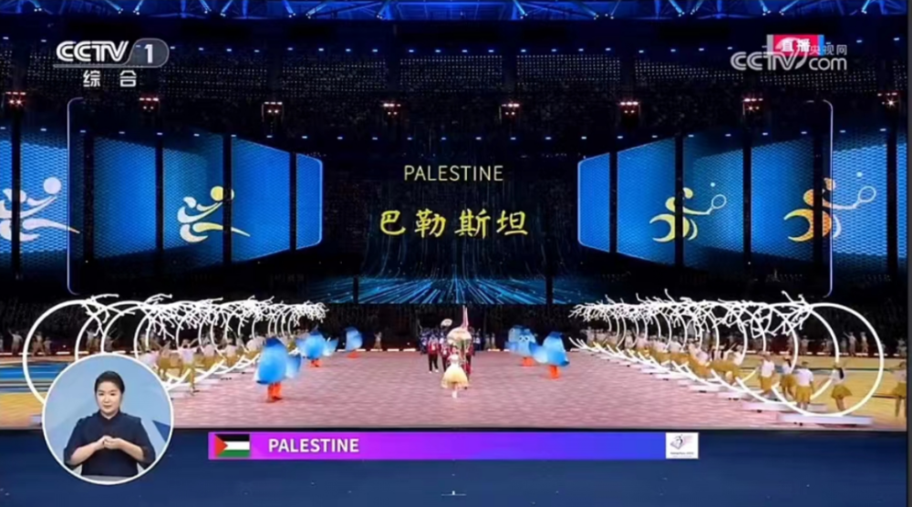
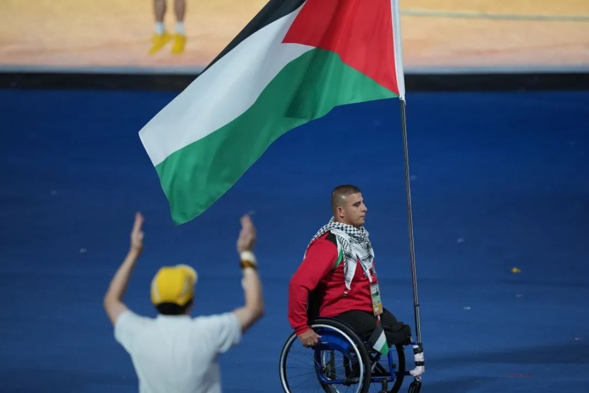
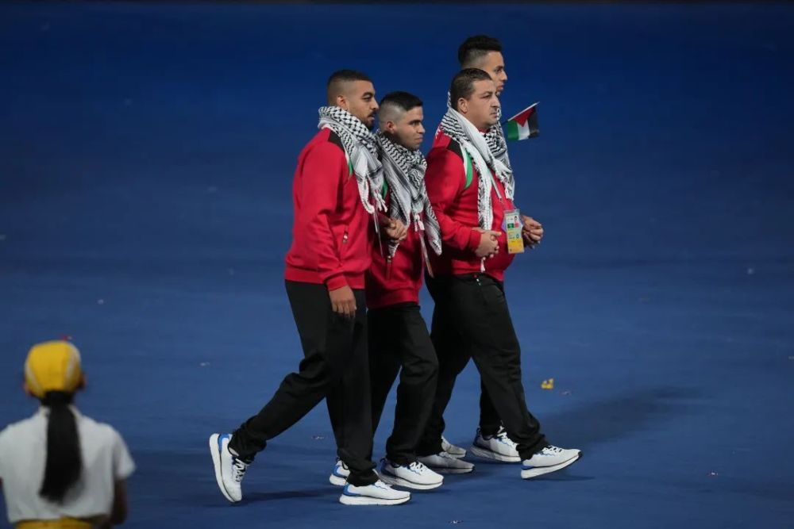
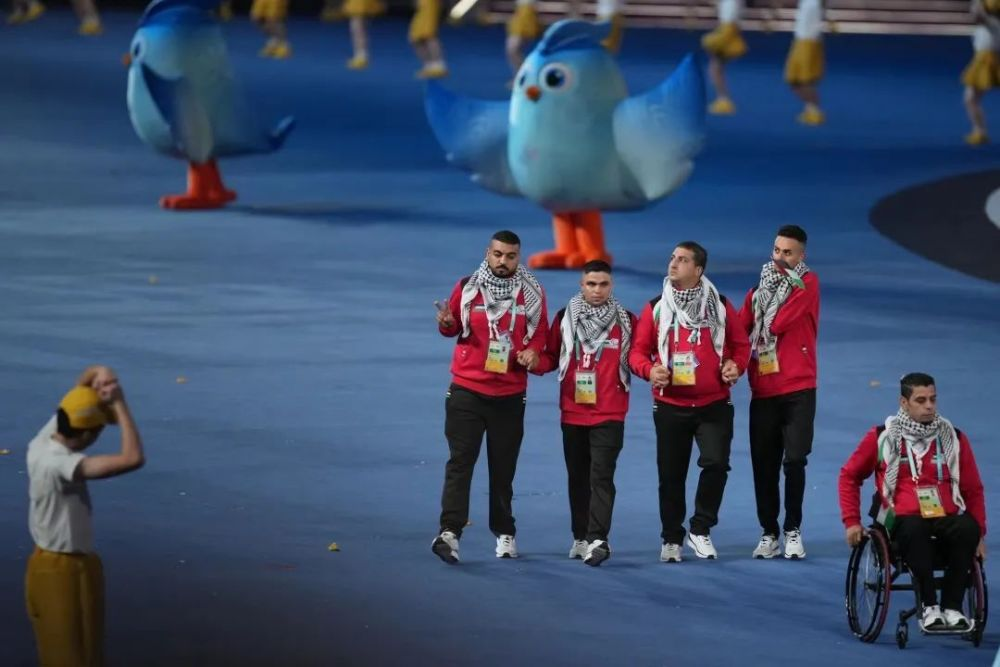

# 杭州亚残运会开幕式巴勒斯坦代表团入场：手挽手，​比V字手势

在杭州亚残运会开幕式上，巴勒斯坦代表团入场了。

_运动员手挽手，比V字手势入场。_

目前巴以冲突仍在持续，参加亚残运会的巴勒斯坦运动员，能否顺利参赛？

在今天举行的亚残奥委员会，与杭州亚残组委联合新闻发布会上，亚残奥委员会主席马吉德·拉什德表示：“在巴以本轮冲突发生前，巴勒斯坦参赛运动员和教练几乎都在位于埃及开罗的训练营训练，因此，他们来杭州并未受到影响，目前他们已经顺利抵达，相信他们已经做好了比赛的准备。”

马吉德强调，“但他们现在一定非常痛苦，因为他们的家人正处于战火，相信我们的组委会会给他们提供最合适的比赛环境。”

中国青年报（ID：zqbcyol 中青报·中青网记者：张力友 梁璇 摄影：李峥苨 编辑：李丽)

来源：中国青年报官微

