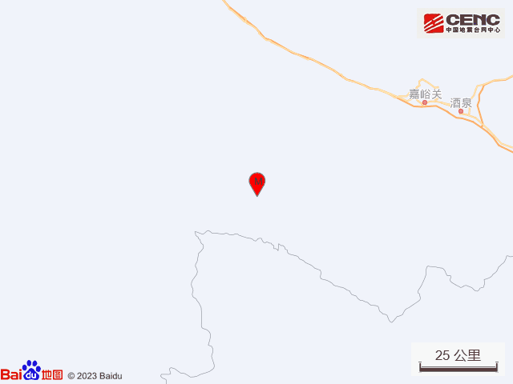
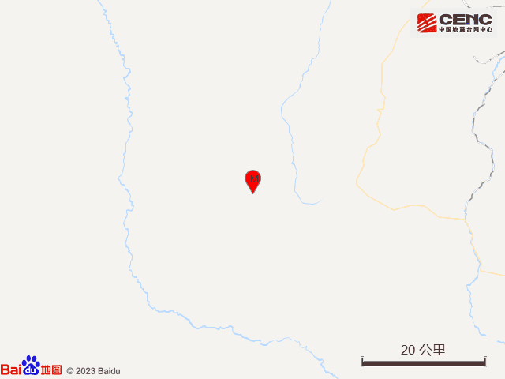
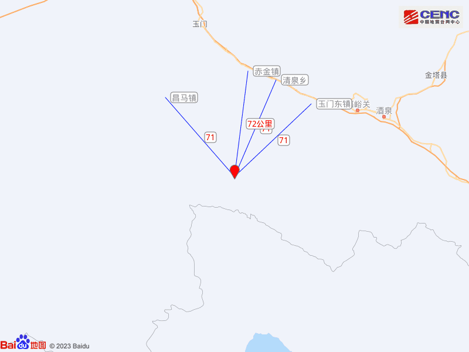
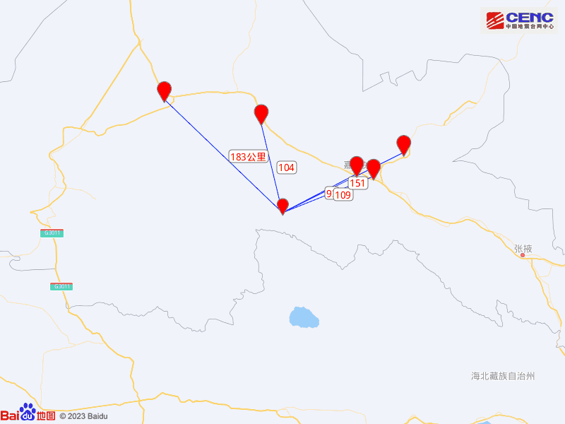
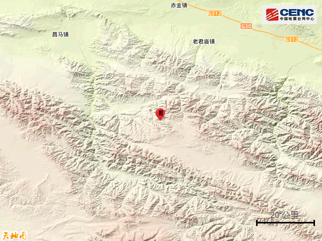
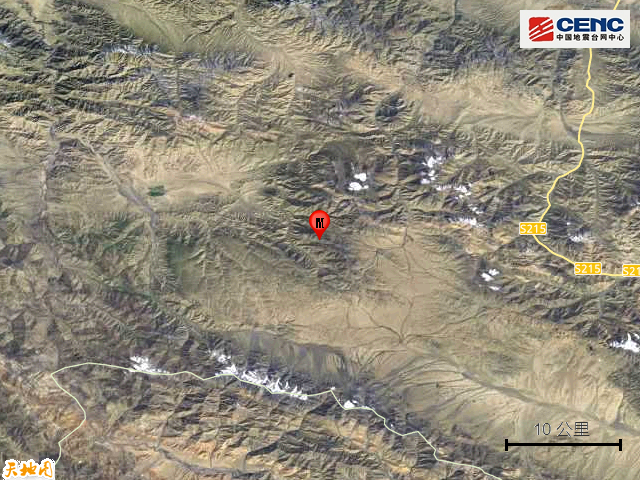
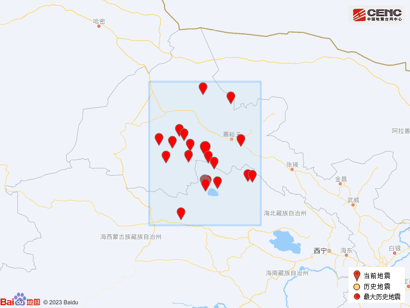

# 甘肃酒泉发生4.7级地震，敦煌、玉门、嘉峪关等多地有震感

@中国地震台网速报
正式测定：10月22日23时14分在甘肃酒泉市肃北县（北纬39.38度，东经97.33度）发生4.7级地震，震源深度10千米。甘肃敦煌、玉门、嘉峪关等地网友表示当地有震感，注意安全，盼平安！
​​​（央视）

**此前消息：**

[甘肃酒泉市肃北县发生4.7级地震，震源深度10千米](https://new.qq.com/rain/a/20231022A07MAX00)

本次地震周边5公里内的村庄有刃岗沟，50公里内无乡镇驻地分布，100公里内的乡镇有昌马镇、玉门东镇、清泉乡、赤金镇。

震中距嘉峪关市93公里、距玉门市104公里、距肃州区109公里、距金塔县151公里、距瓜州县183公里，距嘉峪关市93公里，距酒泉市107公里，距兰州市681公里，距西宁市497公里。

震中5公里范围内平均海拔约3943米。

根据中国地震台网速报目录，震中周边200公里内近5年来发生3级以上地震共33次，最大地震是2022年3月26日在青海海西州德令哈市发生的6.0级地震（距离本次震中98公里），历史地震分布如图。

