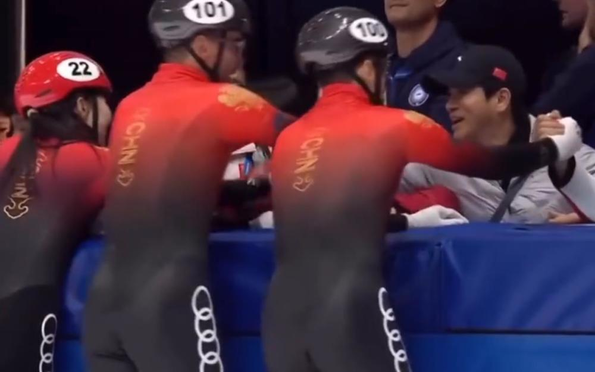
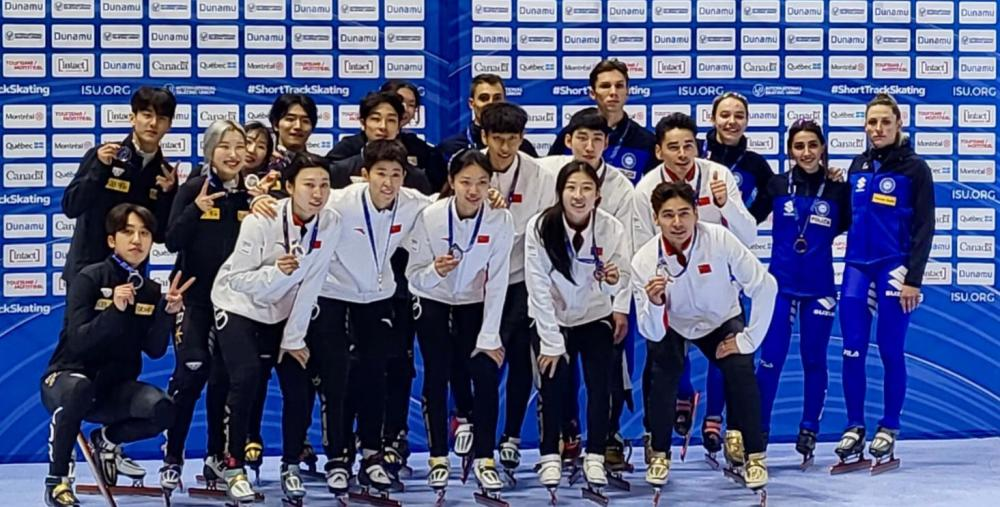

# 短道速滑赛季首金！林孝埈摔倒重滑，2000米混合接力中国队夺冠

北京时间10月22日凌晨，短道速滑世界杯蒙特利尔站第2比赛日进行。在混合团体2000米接力的比赛当中，中国队力压韩国队和意大利队，成功拿下了金牌。这是中国队在短道速滑世界杯拿下了赛季首金。

中国队派出了公俐、臧一泽、林孝埈、刘少林的组合出战，第一棒公俐和刘少林交接棒时，中国队已经占据了头名。此后中国队一直在线路上封住了韩国队，始终排在第1的位置。最后一棒林孝埈突然摔倒，头跟韩国队选手刀磕在一起，裁判判定为危险，吹哨重滑。

林孝埈的伤势非常严重，裁判跟中国队教练沟通之后，确定可以派替补选手上场。刘少昂临危受命，替补林孝埈出战比赛。

比赛重新开始之后，中国队几乎都被韩国队所压制，甚至一度排到了第4名。最后一棒刘少林和刘少昂在交接棒时实现了对韩国队选手的超越，2分40秒683，中国队力压韩国拿到了金牌。韩国队以2分40秒766的成绩获得银牌，意大利队2分57秒869获得第3名。

