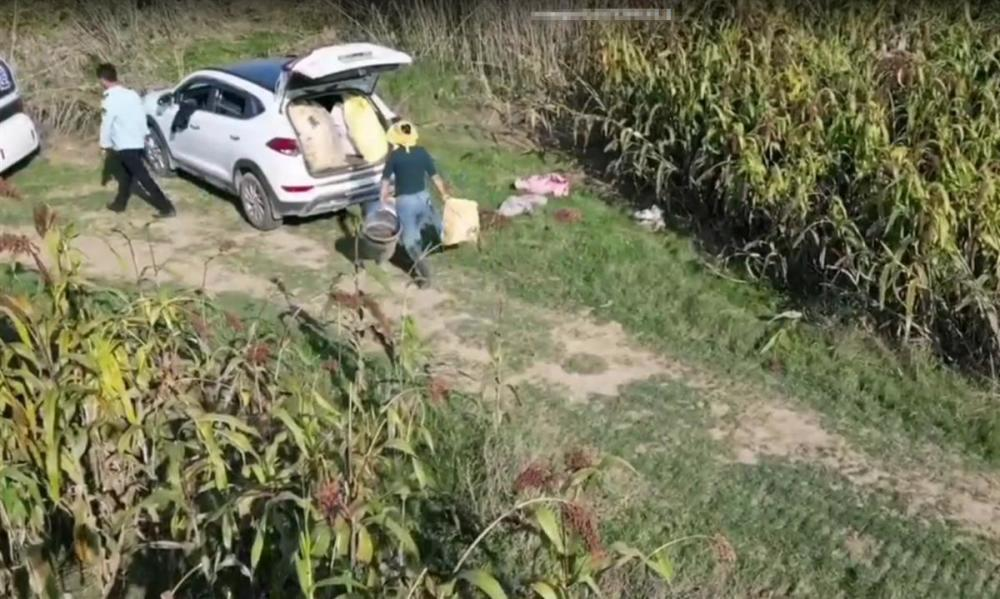
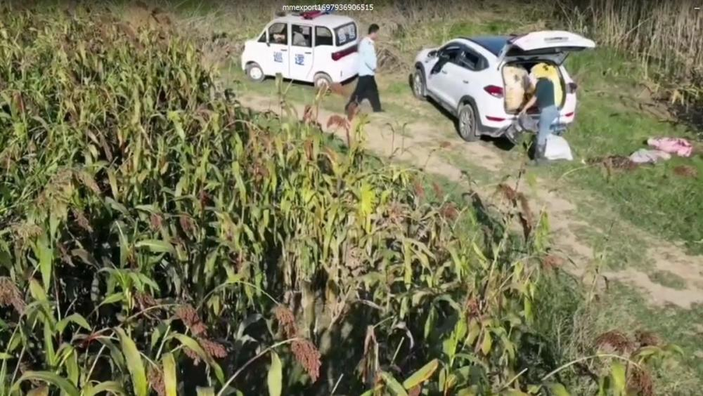
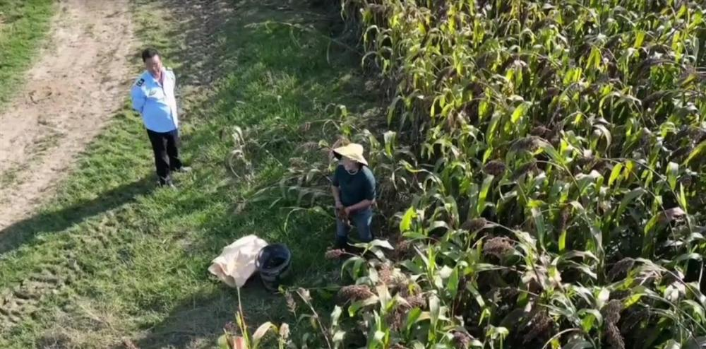

# 网传河南固始有执法人员带人偷红高粱，被无人机发现后停止 当地回应

极目新闻记者 张万军

10月22日，网友发布视频称，河南信阳固始县三河尖镇，有执法人员带人偷高粱，并被无人机拍下。极目新闻记者从当地镇政府获悉，他们已关注到此事，正在展开调查，到时候会出官方通报。

 _视频中疑似执法人员（网络视频截图）_

 _相关人员发现无人机后离开（网络视频截图）_

网络视频显示，一名身穿执法人员制服的男子站在一片成熟的高粱地边，一名女子在收高粱，两人发现天上有无人机后，立即停止行动；现场当时停着两辆车，一辆车身印有“巡逻”字样的车子先离开，制服男子随后发动另一辆车，车辆后备厢装着多个袋子。

_相关人员发现无人机后离开（网络视频截图）_

视频发布者称，事发地点位于河南信阳固始县三河尖镇。

10月22日上午，极目新闻记者私信视频发布者，截至发稿时为止，未收到回应。

_疑似执法者和采收红高粱者发现无人机（网络视频截图）_

固始县三河尖镇派出所工作人员告诉极目新闻记者，他们未接到关于此事的报警，如果接到相关警情，肯定会展开调查。

三河尖镇政府工作人员向极目新闻记者表示，他们已经关注到此事，正在展开调查，到时候会出官方通报。

固始县委相关部门工作人员表示，此事已经交办属地核实，相关情况正在核实中。

（来源：极目新闻）

