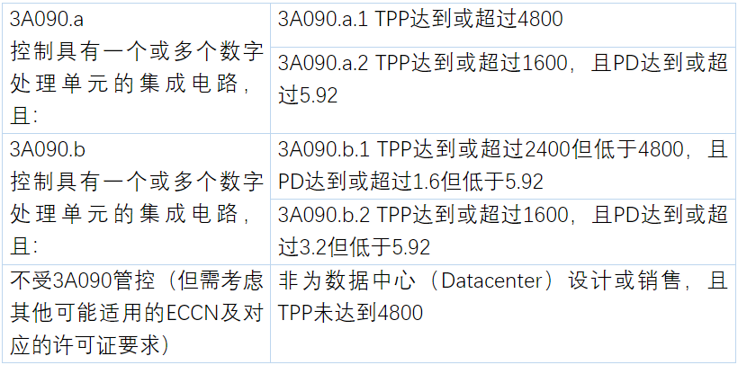
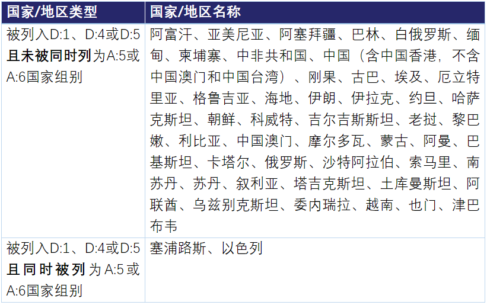
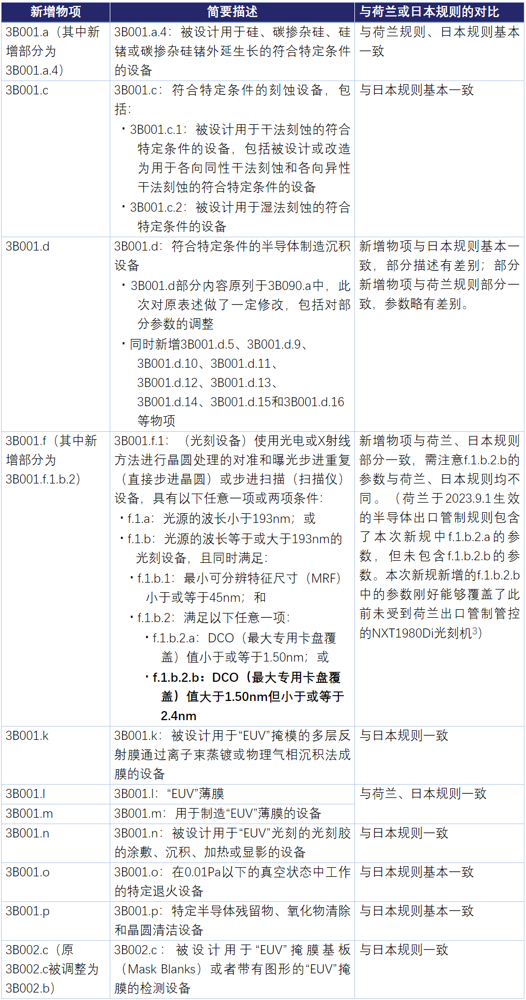
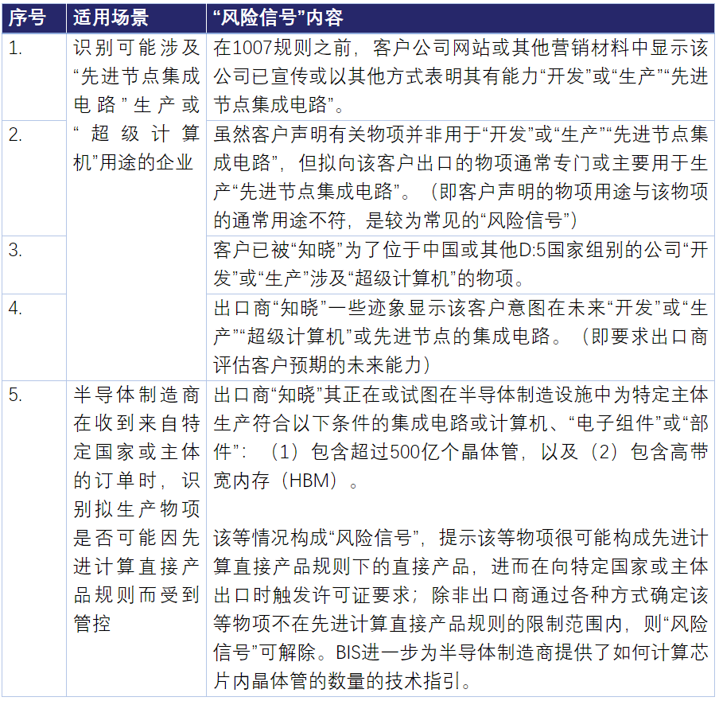

# 美对华半导体出口管制新规详解：管控精细度提升，多项规定阐述不清晰

美国时间2023年10月17日，美国商务部工业与安全局（以下简称“BIS”）将13家中国企业列为实体清单的同时，发布了《先进计算芯片更新规则》及
《半导体制造物项更新规则》。这两份规则是BIS针对其于2022年10月7日发布的出口管制规则（以下简称“1007规则”）的修订，在1007规则的基础上全面升级了对华半导体行业的出口管制规则。

区别于1007规则几乎毫无预警的“突然袭击”，过去一年里全球半导体行业几乎是拿着显微镜在关注着BIS每一点的风吹草动，试图把握规则修订的动向，在规则出台前提前布局。但BIS最终公布的规则中新的内容仍然极其丰富，充分体现了BIS过去一年对于1007规则执行效果的评估与反思。规则里既能看到BIS以所谓“国家安全”为名义，扩大管控范围和加强管控措施的决心，也看到了BIS在试图扩大管控的同时，精细化管控方式，尽可能实现商业利益和安全平衡的斟酌。

两份规则仍然聚焦在先进计算芯片、半导体设备和先进半导体生产制程等领域，制定了更为细致的规则，形成了新的管控图景，对国内半导体产业的后续发展影响深远，中国企业应当予以充分重视。另一方面，这两份规则的
**发布明显十分仓促，存在许多规定阐述不清晰、前后范围不一致、文字错漏等问题。**
一些大众十分关注的问题，BIS明确表示仍在征求公开意见，这也为规则的后续变化带来更多的可能。

因此，我们在以下所作的解读仅基于目前发布的版本展开。我们理解BIS可能在两份规则正式生效前，就现有版本作进一步的勘误、更新及修订，而这些规则将具体如何发挥影响仍留待观察。

01 对先进计算芯片管控机制的全面升级

1007规则是美国管控广泛用于人工智能模型训练的先进计算芯片的核心规则之一。1007规则规定了满足峰值算力（TOPS）超过4800且双向传输速率达到600
Gbyte/s的芯片被归入ECCN
3A090，并围绕该等物项归类标准设置了直接产品规则及针对流片的限制规定，限制中国直接获取并通过自行研发及流片获取该等芯片的能力。

本次发布的《先进计算芯片更新规则》全面升级了上述近乎“一刀切”的管控机制，一方面极大地拓宽了3A090覆盖的物项范围，提高了中国主体获取特定芯片的难度；另一方面，通过许可证例外等机制设置，意图实现精细化的管理效果。

**1\. 3A090物项范围及许可证适用范围的扩大**

**（1）3A090物项范围的扩大**

《先进计算芯片更新规则》将1007规则中用于确认3A090物项的TOPS调整为“总处理性能”（TPP，Total Processing
Performance）；同时，去除“双向传输速率”并引入“性能密度”（PD，Performance
Density）作为归类标准。[1]我们理解，对PD的引入直接导致包括某些芯片厂商为中国推出的较低性能的“特供版”GPU芯片落入管控范围，阻止了厂商通过调整或降低芯片性能来绕开出口管制的可能性，也进一步预防了厂商通过诸如“芯粒”（chiplet）技术绕过对全芯片（full
chips）的限制，进而组装成高性能芯片组的路径。

在确定归类标准后，BIS通过对两项参数的组合将3A090物项分成了.a及.b两类，并通过引入“为数据中心（Datacenter）设计或销售”的用途限制，将一类物项排除在3A090物项的范围之外，从而为后续的精细化管理提供基础。

（请单击放大图片，进行详细阅读）

相比1007规则，本次修改后的3A090所覆盖的物项范围显著扩大，除1007规则所限制的物项外，还将包括在1007规则生效后众多可以在中国销售的主流知名产品，甚至影响到日常消费类电子产品中所使用的GPU、TPU等产品。

虽然非为数据中心设计或销售且在TPP上表现稍弱的物项可以直接被排除在3A090物项之外，但由于目前对何为“非为数据中心设计或销售”尚无明确定义，这使得能被3A090物项所排除的物项范围仍存在需讨论的空间。

此外，BIS专门在9个已有ECCN下新增.z类，以涵盖具有满足或超过3A090或4A090性能参数，且符合该等ECCN描述的物项，并相应修改针对该等.z类物项的管控要求，以实现对符合3A090及4A090性能参数物项的全面管控。

**（2）3A090物项许可证适用范围的扩大**

在1007规则下，受EAR管控的3A090物项
仅在被出口、转出口及（国内）转移至中国（为本文之目的，如无特别列明，“中国”包括中国大陆、中国香港、中国澳门，不包括中国台湾）时将触发获取BIS签发的出口许可证要求。

《先进计算芯片更新规则》极大地扩张了触发出口可证要求的国家及地区范围，并针对BIS认为在实施1007规则中显现出的潜在漏洞作了针对性的规范。具体体现在以下两个方面：

**为避免部分国家向中国转运3A090物项** ，《先进计算芯片更新规则》规定受EAR管控的3A090物项，在出口、转出口或（国内）转移至下列
**被列入D:1、D:4、D:5国家组别且未被同时列入A:5、A:6国家组别的目的地** 时，均将触发出口许可证要求；

（请单击放大图片，进行详细阅读）

为了避免总部设在中国或其他D:5国家组别的企业通过在其他国家设立云或数据服务器来规避美国出口管制规则并继续训练其人工智能模型，《先进计算芯片更新规则》规定受EAR管控的3A090物项，在出口、转出口或（国内）转移至被列入A5、A6国家组别及其他未被列入D:1、D:4、D:5国家组别的目的地，但接收主体涉总部或最终母公司（ultimate
parent company）位于中国或下列D:5国家组别的实体时（
**与上一条相结合，实际效果为至位于世界上的任何地点，但总部或最终母公司位于中国或下列D:5国家组别的实体** ）时，均将触发出口许可证要求。

（请单击放大图片，进行详细阅读）

需注意的是，虽然对于如何判断“总部或最终母公司位于中国或其他D:5国家组别”，目前尚无明确定论且BIS仍就本问题向公众征求意见，但体现了BIS关注到中国企业通过在海外设立主体并获取3A090物项的路径，并尝试着手施加更为严格的限制。

**2\. 增设许可证例外，意图实现精细化管理**

虽然通过上述规定，BIS实现了将更大范围的物项及出口所涉目的地纳入许可证管控的目的，但与1007规则下“一刀切”的管理思路不同，本次BIS通过增设NAC（Notified
Advanced
Computing）许可证例外的方式，为相当范围内的3A090物项提供了在一定条件下自由出口、再出口和（国内）转移的机会与空间，意图通过精细化管理，实现国家安全与商业利益间的平衡。

与前述可直接被排除在3A090范围外的物项类似，可适用NAC许可证例外的物项同样考虑其参数及是否为数据中心设计和销售，具体包括（1）全体3A090.b物项；及（2）非为数据中心设计或销售但TPP达到或超过4800的3A090.a物项。总的来说，
**对于（1）为数据中心设计或销售，但性能表现较弱；或（2）性能表现强，但非为数据中心设计或销售的3A090物项，提供了适用NAC以豁免许可证要求的空间**
。

同时，NAC的具体适用将因所涉国家的不同而不同，具体而言：

将3A090物项 **出口、再出口及（国内）转移至D:1、D:4国家组别** 的目的地，或在 **中国或其他D:5国家组别目的地的（国内）转移**
时，可适用NAC；

在 **满足提前通知程序的前提** 下（至少25个日历日前在SNAP-R上履行提前通知程序），将3A090物项
**出口、再出口至中国或其他D:5国家组别** 的目的地时，可适用NAC。

此外需注意，NAC许可证例外的适用不能免除该等出口活动在EAR744、746的其他规则下产生的许可证要求（例如基于出口管制黑名单、禁运规定等产生的许可证要求），同时，涉及军事最终用户、用途的出口活动也无法适用NAC。

在BIS发布以上规则后，我们已注意到了部分国际知名厂家已广泛下架了相关产品。而结合上述NAC的规则，我们理解符合一定参数性能、用途限制并在满足了一定合规程序的基础上，部分3A090物项将仍有机会继续出口至中国。我们认为各大厂商将会通过物项识别、开展合规尽调流程等方式来实现或恢复部分物项的供应，也建议中国企业保持关注并持续跟进。

**3\. 针对为生产3A090物项所发起的流片活动的限制**

除对获取3A090物项施加的限制外，在1007规则中也要求中国芯片设计公司利用自己研发的技术，到海外代工厂寻求流片服务以获取3A090物项时，将触发出口许可证的要求。

《先进计算芯片更新规则》在延续了对流片活动的限制基础上，通过扩大流片活动发起地的方式，大规模加强了限制力度和广度。具体而言：

当任何主体 **自中国或其他D:5国家组别的国家或地区，向全球任何目的地出口** （除同时被列入A:5、A:6国家组别）
**由总部或最终母公司位于中国或其他D:5国家组别所研发的技术**
（即为生产3A090物项而研发的3E001技术），并寻求流片服务以获取3A090物项时，将触发出口许可证的要求；及

**由总部或最终母公司位于中国或其他D:5国家组别的主体研发的技术，并自被列入D:1、D:4、D:5且未被列入A:5、A:6国家组别的国家再出口或（国内）转移**
以寻求流片服务并获取3A090物项时，将触发出口许可证的要求。

我们理解
**这一规则既限制了中国公司自中国发起的围绕3A090物项的研发和流片活动，也将直接影响到中国公司在海外特定国家设立的关联机构，并在海外发起3A090物项的研发和流片活动的能力**
。

02 持续加强对中国半导体制造能力的限制，与盟友管控水位对齐同时确保自身法律的域外管辖

1007规则的一项核心管控措施是从人、物和最终用途等多个维度全面加强对于中国获取受管控半导体制造物项与设备的能力的限制：（1）新增3B090管控编码，限制中方获取该编码下受管控的半导体制造设备；（2）限制将受EAR管控物项用于特定半导体制造用途，以及（3）限制美国人为中国半导体制造相关的活动提供支持。在1007规则发布后的数月中，美国联合在全球半导体产业链同样起关键作用的荷兰和日本，三国于2023年1月底达成了协议，并陆续出台了针对半导体制造设备的出口管制措施。

本次规则的调整是对此前已取得的协同管控成果的巩固，同时从美国法的角度为荷兰、日本的管控措施增加“双保险”。

**1\. 物项层面 – 调整并新增受管控半导体制造设备**

物项管控层面，本次新规最核心的变化是删去了1007规则下引入的3B090这一管控编码，在将原先落入3B090范围的部分物项转入其他编码的基础上持续增加受管控设备；并为相关设备出口、再出口和（国内）转移到中国或其他D:5国家组别的活动设置美国出口管制许可证要求。本次主要新增的受管控设备请参见下方表格：

（请单击放大图片，进行详细阅读）

上述设备层面的调整外，1007规则下与3B090相关的软件和技术的管控通过3D001和3E001这两个编码实现。在本次新规中，由于3B090已被删除，BIS也同步对配套的用于受管控半导体制造设备的3D和3E类软件和技术作了调整，将其与3B001、3B002下新增的ECCN相对应。

**2\. 新规背后的目的以及可能实现的管控效果**

从上述表格的对比结果可以直观地看出，BIS本次新增受管控设备的具体内容和参数几乎与日本、荷兰的管控清单完全对应（相关例外情况请见脚注）[4]。在美国、荷兰、日本作为全球半导体制造设备主要来源地的情况下，美方事实上已通过与全球盟友的合作，初步构建起了半导体设备的全面管控机制。本次修改体现了其在日本、荷兰已有管控措施基础上的“双保险”机制。尤其是：

**通过直接产品规则的适用，使得非美国制造的相关设备可能同样受到EAR管控**
：根据更新后的管控设备的编码，即使相关设备在美国之外（例如在日本）被制造、但如果其制造全过程使用到了同样因国家安全原因受到管控的美国原产软件或是技术（满足相关性能参数的设备的生产可能很难完全脱离该等软件、技术的适用），则
**在出口到中国的情况下可能会触发美国出口管制国家安全直接产品规则的适用，进而导致外国制造物项被认为受到EAR管控** 。

**受EAR管控的设备的再出口等活动将持续面临美国管控，且在海外设立子公司或生产线等方式可能无法绕开限制**
：今年10月初就有美国权威智库在其发布的报告[5]中指出：因为荷兰和日本没有与美国直接产品规则类似的法律规定，所以其出口管制是否能够真正有效可能存在疑问。这是因为，不似美国规则的域外管辖效力，荷兰和日本的设备、组件和备件如果不是从荷兰、日本出口而是通过外国子公司或分销商等进行销售和运输，那么可能不落入两者的管控范围。因此，我们理解：（1）美国
**本次新增物项的调整为相关盟友的管控政策设置了“双保险”，尤其是更好地确保自身在受管控设备首次出口后的再出口等环节的管辖权** ；（2）
**由于荷兰、日本等国的出口管制法规没有对再出口等活动有严格的限制，客观上使得荷兰、日本企业可能通过在海外设立分、子公司或生产线等方式绕开其本国政府的出口管制限制**
；但是一旦美国政府对相关设备建立了管辖权，那么相关物项在不从荷兰、日本等国出口的情况下，即使无需遵守荷兰、日本的法规，但仍然需要遵守美国的管制要求。

综上，我们理解本次美国对受管控半导体制造设备的范围的扩大，不仅仅是物项层面的变化，也体现了其管控思路和管控机制的变化 –
其不仅仅依赖盟友实施的管控措施，而是利用自身在全球半导体供应链特定环节的优势地位，巧妙地进行制度设计，进而一边向盟友靠齐、一边倒逼盟友对齐自身的合规水位。

**3\. 用途层面 – 继续细化半导体制造设备最终用途相关的限制**

在最终用途层面，BIS在1007规则下就对将 **受EAR管控的物项** 用于在中国开发或生产 **特定半导体制造设备**
及其相关的零部件等活动进行了限制。本次新规基本沿袭了去年的限制，但是做出了如下主要调整：

（1）对特定半导体制造设备的表述进行了调整，更新为“前端集成电路生产设备”。围绕该点，BIS进一步澄清了2点重要的内容：

前端集成电路生产设备主要包括用于从空白晶圆或基板到已完工的晶圆或基板（即集成电路已加工，但仍在晶圆或基板上）的生产阶段的设备，但 **不包括**
专门用于后端步骤或其他应用（如集成电路生产之外）但不改变集成电路技术水平的设备；

BIS明确在该点限制下 **将满足特定参数的掩膜、光罩和掩膜基板坯料（masks, reticles, and mask substrate
blanks）排除出了限制范围** 。

（2）将1007规则下“受EAR管控的物项”调整为“受EAR管控且在CCL中被列明的物项”，实际上排除了EAR99类物项；从而实现更精细化的管控。

（3）对特定半导体制造设备对应的ECCN编码进行了调整，即删去了1007规则下关于3B090的表述，引入了新的3B001、3B002等编码。

（4）1007规则及BIS后续的配套规则主要针对中国，本次在目的地层面将适用范围扩展到中国或其他D:5国家组别。

综上，我们理解相比1007规则的部分规定不甚清晰的情况，BIS在本次新规调整的过程中进一步厘清了诸如“前端集成电路生产设备”等重要概念的范围，从而为相关企业业务的合规推进留下了相对更多的合规空间，我们理解这体现了BIS合规管控的精细化，不排除也有其对企业商业利益的考量。

03 细化并澄清对于“美国人”的限制

承上所述，在半导体制造层面，1007规则下一个具有代表性的变化是，BIS首次在针对中国半导体行业的出口管制限制下，引入了对“美国人”的限制，企图实现“人员脱钩”。相关限制主要内容是，限制“美国人”在知晓的情况下：（1）
**先进集成电路制造** ：为在位于中国的半导体制造设施中 **开发** 或 **生产** 先进集成电路的活动提供特定支持；（2） **半导体制造设备**
：开展牵涉中国的涉及满足特定半导体制造设备的参数要求的物项的活动。

本次新规基本沿袭了上述规定、尤其是虽然引入了“先进节点集成电路”（advanced-node
ICs）这一概念，但其主要标准与1007规则下“先进集成电路”一致；同时做出了如下主要调整：

围绕上述先进集成电路制造下的“开发”活动，BIS进一步澄清：
**仅发生“开发”活动的“设施”不属于控制范围，主要是因为这可能会过度涵盖专门从事“设计”或其他形式“开发”活动的“设施”** ；

BIS进一步澄清，上述先进集成电路制造下的 **“生产”活动不适用于组装、测试或封装等不改变集成电路技术水平的后端步骤** ；

如果相关美国人受雇于或代表总部设在美国或A:5、A:6国家组别的公司工作，且该公司未被总部设在中国或其他D:5国家组别的实体拥有多数股权，则其不受到相关限制；我们理解该等例外规定体现了美方对其本国企业及其部分盟友（尤其是日本、韩国和荷兰等在全球半导体制造领域具有领先地位的盟友）的优待。

在目的地层面将适用范围扩展到中国或其他D:5国家组别；以及

在“半导体制造设备”相关的限制下，用新的调整后的3B001和3B002相关的编码替换了此前3B090的表述并新增了3D002下与3B001配套的调整。

上述调整外，美方还通过正式法规的形式，对于美国人受到限制的具体活动的范围进行了说明：

**构成受限制的活动：授权或实际开展装运、传输或（国内）转移相关物项或是提供维护、修理、大修或翻新** 等服务；

**不构成受限制的活动** ：从事 **行政或文秘活动** （例如安排运输或准备财务资料等）、或
**以其他方式执行经批准的受到限制的运输、传送或（国内）转移活动的决定** 、或与
**向先进节点集成电路的开发或生产提供特定物项或为该物项提供服务的行为没有直接关系的活动** 。

综上，我们理解BIS一方面对“开发”、“生产”等重点术语的范围进行了更详细的说明，另一方面同步对美国人不受限制的活动范围进行说明，这些都体现了其本次管控的精细化以及相关管控措施的出台可能综合考虑国家安全利益、限制措施的必要性和有效性以及企业的商业利益等因素。

04 为企业履行合规义务提供进一步指导

1007规则以及本次新规对涉及先进节点集成电路生产、超级计算机用途以及先进计算芯片等施加了限制，该等限制为企业在业务活动中开展对相关因素的尽职调查提出了要求。BIS在本次新规中为企业履行相应尽调义务提供了进一步指导。具体而言，
BIS在EAR第732部分补编3新增了五条“风险信号”，以供企业在不同业务场景下开展尽调活动时予以关注。

（请单击放大图片，进行详细阅读）

05 其他值得企业关注的细节规定

虽然距发布1007规则已相隔一年，但本次两份规则的发布仍稍显仓促，例如对于部分在过往已引发关注与讨论的问题，BIS仍未作出最终的决定，并继续在相关规则下征求公众意见。这些问题的答案将同样影响本次发布的规则的执行效果，值得企业关注：

是否以及如何对通过IaaS的方式开发大型人工智能基础模型的场景进行管控；

如何帮助半导体制造厂商识别可能适用先进计算直接产品规则的物项；

对3A090物项的视同出口、视同再出口是否可能因RS受控原因触发许可证要求；

如何细化3A090下的参数，以便更精细地仅涵盖在训练大规模人工智能系统中使用会引起担忧的集成电路；

如何明确并非为数据中心设计或销售的集成电路的定义；

对总部位于中国或其他D:5国家组别的实体的定义；以及

是否以及如何细化“超级计算机”定义下的参数细节。

06 结语

本次新规的出台，标志着美国继续奉行“小院高墙”政策，在沿袭去年1007新规的基础上，进一步评估规则的实施情况与限制效果、提升管控精细程度、封堵可能存在的漏洞并根据技术环境的变化适时调整。随着管控措施的不断演化，企业也面临愈发复杂的合规挑战。

**注释：**

1.根据3A090下的注释，TPP的计算方式为2x“MacTOPS”x“操作的Bit”长度；而PD则是TPP除以适用的芯片单元面积（平方毫米）。

2\. 此处的物项范围也包括与3A090相关的其他ECCN下的.z类物项。但为表述简洁，此处仅以3A090物项为代表展开分析。

3\. 公开网络信息显示该系列的光刻机在实际应用中，可以用于生产7nm芯片。

4\.
一个显著的例外是：在3B001.f.1.b.2.b下，BIS新增受管控的物项超出了荷兰的管控标准。我们理解这可能是美国政府希望向荷兰政府施压、以实现荷兰政府管控水位与其对齐的目的。这主要是考虑到，在设定新的参数外：BIS围绕3B001.f.1.b.2.b物项新增了0%最低价值占比的规定，即非美国制造（例如荷兰制造）的满足3B001.f.1.b.2.b参数的物项，如果用于开发或生产先进节点集成电路，则不设最低价值占比要求，进而导致相关物项只要含有任何美国原产受控成分，都可能被认为受到EAR管控，进而使得美国政府对其的出口、再出口等活动享有管辖权。美国政府对此进一步设定了例外规定，即如果该外国制造产品的出口国同样将3B001.f.1.b.2.b物项纳入管控清单，则美方不会实施额外管制。

5.https://www.csis.org/analysis/chip-race-china-gives-huawei-steering-wheel-
huaweis-new-smartphone-and-future.

