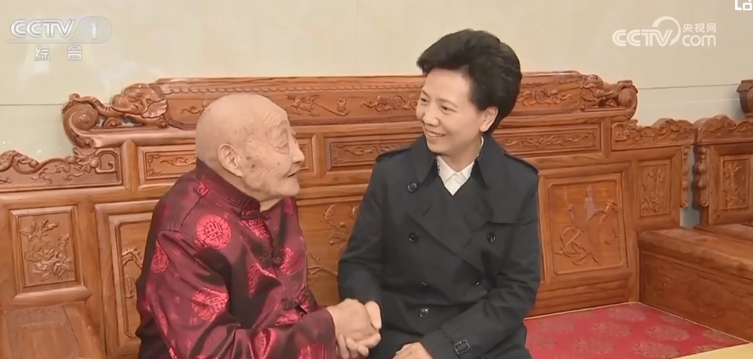
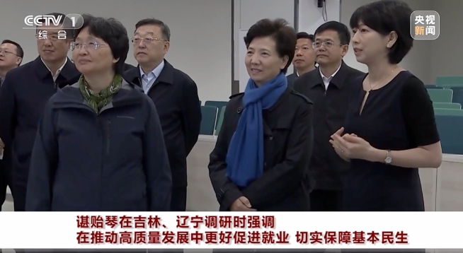

# 调研东北、西北省份后，谌贻琴以“新身份”赴东南省份调研

**撰文 | 李岩**

中国政府网消息，在我国传统节日“重阳节”即将来临之际，10月19日至20日，国务委员、全国老龄工作委员会主任谌贻琴在浙江省调研老龄和养老服务工作。

此次系谌贻琴就任国务委员、国务院党组成员之后，首次以“全国老龄工作委员会主任”的身份调研。

新身份

调研中谌贻琴强调，要深入学习贯彻习近平总书记关于老龄事业的重要指示批示精神，贯彻落实积极应对人口老龄化国家战略，进一步加强老龄工作和养老服务保障，不断推动老龄事业高质量发展。

在杭州，谌贻琴实地调研社区为老服务综合体和老年食堂建设运营情况。她强调，要健全养老服务体系，加强社区养老服务设施建设，优化服务功能和运营管理，让更多老年人在家门口就能享受到高质量的养老服务。

谌贻琴在义乌市出席“浙里情深·敬老情浓”尊老敬老活动月主题活动，并看望慰问了百岁老人。

梳理公开报道，此番赴浙江， **系谌贻琴首次以“全国老龄工作委员会主任”的身份调研。**

事实上，去年仍在地方任职时，谌贻琴也曾就老龄工作作出批示。

贵州省政府网站消息显示，2022年7月7日，全省老龄工作会议在贵阳召开。

时任贵州省委书记谌贻琴作批示强调，老龄工作事关全省发展全局和百姓福祉。全省各级党委、政府和有关部门单位要认真贯彻落实积极应对人口老龄化国家战略，坚持
**“党委领导、政府主导、社会参与、全民行动”方针**
，把积极老龄观、健康老龄化理念融入经济社会发展全过程，加快健全社会保障体系、养老服务体系、健康支撑体系。

连续赴多地调研

梳理公开报道显示，近期，谌贻琴赴多地调研。

在此次调研前，10月16日，据新华社消息，谌贻琴近日在吉林省、辽宁省调研就业和基本民生保障工作。

她强调，要切实抓好高校毕业生、退役军人、农民工等重点群体就业工作，加强零就业家庭、残疾人等就业困难群体帮扶等。

几天后，谌贻琴赴宁夏调研重点群体就业等情况，并出席10月18日在银川举行的全国劳务协作暨劳务品牌发展大会。

在银川，她要求当地发挥特色产业优势，优化就业服务和支持政策，拓宽就近就地就业渠道，支持返乡创业就业，促进就业形势持续向好。

此次调研老龄工作，谌贻琴强调要贯彻落实积极应对人口老龄化国家战略。

政知君注意到，前述谌贻琴近期的调研主题——就业、老龄工作，在2019年底印发的《国家积极应对人口老龄化中长期规划》（以下简称“规划”）中被同时提及。

《规划》部署了应对人口老龄化的工作任务，“改善人口老龄化背景下的劳动力有效供给”正是五大任务之一。《规划》指出，
**推进人力资源开发利用，实现更高质量和更加充分就业，确保积极应对人口老龄化的人力资源总量足、素质高。**

老龄工作回归民政部

资料显示，全国老龄工作委员会上世纪90年代末就已经成立。在近几年的国家层面机构改革中，全国老龄工作委员会进行了相关调整——

**2018年印发的《深化党和国家机构改革方案》明确，将国家卫生和计划生育委员会、国务院深化医药卫生体制改革领导小组办公室、全国老龄工作委员会办公室等部门的职责整合，组建国家卫生健康委员会，作为国务院组成部门。留全国老龄工作委员会，日常工作由国家卫生健康委员会承担。**

**2023年印发的《党和国家机构改革方案》指出，实施积极应对人口老龄化国家战略，推动实现全体老年人享有基本养老服务，将国家卫生健康委员会的组织拟订并协调落实应对人口老龄化政策措施、承担全国老龄工作委员会的具体工作等职责划入民政部。全国老龄工作委员会办公室改设在民政部，强化其综合协调、督促指导、组织推进老龄事业发展职责。**

最新的改革方案印发后，相关工作近期已经落地。

10月12日，中国机构编制网发布《中共中央办公厅 国务院办公厅关于调整国家卫生健康委员会职责机构编制的通知》。

《通知》称，将国家卫健委的组织拟订并协调落实应对人口老龄化政策措施、承担全国老龄工作委员会的具体工作等职责划入民政部。界面新闻刊文评价称，这意味着，经过半年多对机构改革方案的审议和工作交接，
**老龄工作已正式回归民政部。**

上述《通知》发布后，10月13日，经济观察网援引接近全国老龄办的人士消息称， **民政部将专门成立老龄工作司** ，承担原下设于国家卫健委的全国老龄办职能。

文章还分析称，2018年的机构改革主要考虑到要着力解决老年人的健康问题。如今，全国老龄办相关职能重回民政部并将专设司级机构，这显示出有关部门对老龄工作的重视程度提升了。

**资料 ｜ 中国政府网 贵州政府网 央视 经济观察网等**

**【版权声明】本文著作权归政知新媒体独家所有，未经授权，不得转载。**

