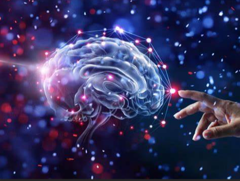

# 马斯克想要通过脑机接口实现人类与AI的共生 多少大脑将受到损伤？

划重点：

  * _1_ 今年5月，Neuralink宣布获得FDA的批准，将启动首次脑植入物人体临床研究。
  * _2_ 因为担心AI有一天接管世界，帮助瘫痪的人并不是马斯克的终极目标，其抱负是实现人类与人工智能的共生。
  * _3_ 为推进马斯克的目标，Neuralink启用了带有潜在危险性的植入方法。
  * _4_ 对整个社会而言，脑机接口人体试验还会带来伦理风险。

腾讯科技讯 10月17日消息，国外媒体周一撰文指出，在“硅谷钢铁侠”埃隆·马斯克（Elon Musk）的所有勋绩当中--
特斯拉电动车、SpaceX火箭、Twitter收购案、殖民火星的计划--
神秘的脑机接口公司Neuralink可能是最危险的。Neuralink究竟是做什么的？从短期来看，它是为了救助瘫痪的病人。但这不是全部的答案。以下为文章全文：

马斯克在2016年出资创办Neuralink。2019年，该公司宣布开发出柔性“线（threads)”，这些线将通过机器人被植入大脑，工作方式类似于缝纫机。按照Neuralink的构想，柔性“线”将从瘫痪患者的大脑中读取信号，并将数据传输到iPhone或计算机，使患者不需要点击、打字或滑动屏幕，就能够用意念控制计算设备。

到目前为止，Neuralink只在动物身上做过测试。但在今年5月，该公司宣布获得美国食品和药物管理局（FDA）的批准，将启动首次脑植入物人体临床研究。目前，它正在招募瘫痪的志愿者来研究植入物是否能让他们控制外部设备。如果该技术在人类身上发挥作用，它能够改善数以百万计的人的生活质量。仅仅在美国，目前就有大约540万人瘫痪病人。

但帮助瘫痪的病人并不是马斯克的终极目标。这只是实现他更远大的长期目标的一步。用马斯克自己的话说，他的抱负是“实现人类与人工智能的共生。”马斯克的目标是开发一种帮助人类“与人工智能融合”的技术，以便在人工智能变得越来越复杂后，人类不会“落后”。马斯克这种异想天开的构想肯定不可能让美国食品和药物管理局为Neuralink的人体试验开绿灯。但如果是致力于帮助瘫痪病人呢？这肯定会得到美国食品和药物管理局的欢迎。事实就是如此。

需要清楚的是，Neuralink的技术伴随着巨大的风险。Neuralink的前员工和该领域的专家声称，为推进马斯克的人与人工智能融合的目标，该公司启用了一种不必要的侵入性、带有潜在危险的植入方法。该方法可能会损害大脑（显然动物试验对象已经出现了这样的问题）。截至目前，Neuralink方面对此报道未予置评。

对整个社会而言，脑机接口人体试验还会带来伦理风险。目前，许多公司都在开发植入人类大脑的技术，能够解码人类大脑中的意识，并有可能侵犯精神隐私。我们必须为即将到来的事情做好准备。

马斯克为何要把人类大脑与人工智能结合在一起？

马斯克的抱负为何是努力实现人类与人工智能的共生？因为他担心，人工智能有一天可能会接管世界。如今，这种恐惧已在人工智能产业领军人物中蔓延开来。他们普遍担心，我们可能会创造出比自身更聪明的机器，有能力欺骗我们并最终从我们手中夺取控制权。

今年3月，包括马斯克在内的许多大佬联名签署了一封公开信，呼吁所有人工智能实验室立即暂停比GPT-4更强大的人工智能系统的训练，时间至少持续6个月。这封信警告称：“我们是否应该开发非人类的大脑，使其最终超过人类数量，胜过人类的智慧，淘汰并取代人类？我们是否应该冒着失去对我们文明控制的风险？这样的决定绝不能委托给未经选举的技术领袖。只有当我们确信强大的人工智能系统的效果是积极的，其风险是可控的，才应该开发。”

尽管马斯克并不是唯一一个警告人工智能系统带来“文明风险”的大佬，但他与其他人不同的地方在于，他已经悄然制定出抵御风险的计划。马斯克计划的基本逻辑是：如果不能战胜对手，就加入到他们中间去。

在马斯克预见的未来世界中，人工智能系统能够以每秒1万亿比特的速度交流信息，完全瞧不起只能以每秒39比特交流的人类。对人工智能系统而言，人类在这时似乎已毫无用处。除非，人类变得和它们一样。在马斯克看来，其中很大一部分是能够以人工智能的速度思考和交流。“这将涉及到人脑与数字版的自己之间的通信带宽和连接速度，尤其是输出方面，”马斯克在2017年说。“将来能够连接到人类大脑的高带宽接口，将是那些能够帮助人类与机器智能实现共生的事物，并能够解决控制和有效性问题。”

在马斯克发表上述讲话近6年后，我们能够看到他仍然痴迷于带宽的概念，也就是计算机从人类大脑中读取信息的速率。事实上，这也推动着Neuralink的构想。Neuralink的设备是一种大脑植入物，配备有1024个电极，可以接收来自大量神经元的信号。电极越多，能监听的神经元就越多，得到的数据就越多。此外，越接近神经元，数据质量就越高。

Neuralink的设备非常靠近神经元。该公司植入它的程序需要在头骨上钻一个洞并穿透大脑。有一些不那么极端的方法来解决这个问题，其他公司正在证明这一点。让我们来分析一下这些公司在做什么，以及马斯克为什么觉得有必要做一些不同寻常的事情。

Neuralink为何选择最极端的脑机接口接入方式？

Neuralink并不是唯一一家探索使用脑机接口恢复瘫痪病人运动机能的公司。诸如Synchron、Blackrock
Neurotech、Paradromics和Precision Neuroscience等公司，还有美国军方都在该领域不断探索。

近年来，许多登上头条的研究都集中在将瘫痪病人的意念转化为语言的大脑移植上。举例来说，马克·扎克伯格（Mark
Zuckerberg）的Meta正在研究脑机接口，可以直接从人类神经元中提取意念，并实时将其转化为语言。该公司表示，从长远来看，其目标是让每个人都能够用自己的意念来控制键盘、增强现实头显等硬件设备。

早期在脑机接口领域取得的成功集中在动作，而不是语言上。2006年，美国马萨诸塞州一位名叫马修·纳格尔（Matthew
Nagle）的四肢瘫痪患者，在接受了脑机接口植入手术后，成功地用意念控制了电视、电脑、机器臂等设备。手术后不久，纳格尔就能够用意念玩史上第一款街机游戏《Pong》。

植入纳格尔大脑中的设备由研究机构BrainGate开发，使用的是犹他电极阵列（Utah
Array），通过手术把一串由100个尖尖的电极组成的列阵植入大脑。虽然犹他电极阵列只有Neuralink设备中电极的十分之一左右，但它仍能让瘫痪病人用意念移动光标、查看电子邮件、调节电视音量或频道，以及控制机器肢体。从那以后，其他瘫痪病人也通过脑机接口技术得到了一定的康复。

像犹他阵列这样的早期技术会从头骨中笨拙地伸出来，但最新的脑机接口一旦植入，外面的观察者根本察觉不到它，而且它的侵入性要小得多。举例来说，Synchron的脑机接口技术建立在自上世纪80年代以来就存在的支架技术上。金属支架可以引入血管，能够安全地留在血管中几十年（许多心脏病患者早已采用该技术，保持他们的动脉畅通）。Synchron使用导管将支架送入大脑运动皮层的血管中。抵达合适位置后，支架就会像花一样展开，上面的传感器会接收来自神经元的信号。该技术使一些瘫痪病人能够用意念发推特和短信。

换句话说，现有的脑机接口技术既不需要开颅手术，也不需要在头骨上钻孔。在2016年Recode举行的Code大会中，马斯克本人在一段5分钟的视频中表示，脑机接口不一定需要开颅手术。“你可以穿过静脉和动脉，因为这为你所有的神经元提供了一个完整的通道，”他说。“你可以在颈静脉里插入一些东西，然后……”在观众紧张地大笑之后，他补充说：“这并不涉及把头颅砍下来之类的事情。”

Neuralink的多位前员工透露，在该公司创办之初，旗下的一个研发团队曾考虑过更温和的血管植入法。该团队探索通过动脉将设备输送到大脑的方式，并证明这是可行的。但到2019年，Neuralink放弃了这种选择，而是选择了更具侵入性的手术机器人，将柔性“线”直接植入大脑。

如果血管植入法可以恢复瘫痪患者的关键功能，同时避免穿越血脑屏障带来的一些安全风险，如炎症和大脑中的疤痕组织堆积，Neuralink为什么要选择比此方法更具侵入性的方法呢？

虽然Neuralink没有对此作出解释，但根据2018年曾领导Neuralink血管植入法研究团队的Hirobumi
Watanabe的说法，主要原因是该公司对带宽最大化的痴迷。“Neuralink的目标是植入更多的电极，从而能够从更多的神经元中收集更多的数据，”Hirobumi
Watanabe说。

毕竟，马斯克已经提出，与机器的无缝融合可以让我们做任何事情，从增强记忆、上传意念到永生--
这些都是硅谷超人类主义幻想的主要内容。这或许有助于理解Neuralink的双重使命：“创造一个通用的大脑界面，救助目前无法得到医疗救治的人，并在未来释放人类的潜力。”

“Neuralink的明确目标是生产通用神经接口，”慕尼黑的神经伦理学家马尔切洛·伊恩卡（Marcello
Ienca）说。“据我所知，他们是目前唯一一家计划对可植入医疗神经接口进行临床试验的公司。同时，这家公司还发表公开声明，称增强认知的神经植入物未来会应用于非医学领域。为了创造通用技术，需要在人类和计算机之间开发出一个无缝界面，实现增强的认知和感官能力。实现这一愿景可能确实需要更具侵入性的方法来获得更高的带宽和精度。

Hirobumi
Watanabe认为，Neuralink优先考虑最大化带宽，因为这符合马斯克的目标，即创造一个通用的脑机接口，让人类与人工智能融合在一起。“因为这是马斯克说的，所以这就是Neuralink必须要做的事情，”他说。

血管内植入法似乎不能像颅脑钻洞那样提供那么多带宽。虽然留在血管里可能更安全，但缺点是接触不到那么多的神经元。“这是Neuralink没有采取这种方法的最大原因，”Hirobumi
Watanabe说。“挺难过的。”他补充说，他认为Neuralink放弃微创方法有点太早。“我们本可以推进这个项目。”

对Synchron的首席执行官汤姆·奥克斯利（Tom
Oxley）来说，这提出了一个大问题。“问题是，患者临床健康结果的短期目标和人工智能共生的长期目标之间是否会出现冲突？”他说。“我想答案大概是肯定的。重要的是设计的初衷是什么，以及是否考虑过病人的问题，”奥克斯利补充说。Synchron理论上可以通过将其技术小型化和深入血管的更深分支来增加带宽；而且研究表明这是可行的。“但是，Neuralink却选择了另一种极端的方式，”他说。

离开Neuralink创办Precision Neuroscience的神经外科医生本·拉波波特（Ben
Rapoport）强调，任何时候让电极穿透大脑，都在对脑组织造成一些损害。如果目标是帮助瘫痪病人，这种做法完全没有必要。“要恢复中风和脊髓损伤患者的语言和运动功能，我认为这种神经假体功能没有必要。我们的指导思想之一是，可以在不损害大脑的情况下建立高保真脑机接口系统。”

为了证明不需要马斯克侵入式的植入方式来实现高带宽，Precision设计了一种薄膜，在大脑表面覆盖了1024个电极--
与Neuralink的植入物中的电极数量相同--
这些电极可以传递类似Neuralink植入物的信号。这种薄膜必须通过头骨上的裂缝插入，但优点是它位于大脑表面而不穿透大脑。拉波波特称之为“金凤花姑娘（恰好之意）解决方案”。目前，Precision已经把这种薄膜植入到少数病人脑部，用高分辨率记录他们的大脑活动。

拉波波特说：“关键是要做一台非常非常安全的手术，不损伤大脑，而且本质上是微创的。此外，随着我们扩大系统的带宽，对患者的风险不应增加。如果你最珍视的抱负是尽可能地帮助病人改善生活，而不去冒不必要的风险，这是有意义的。但我们知道，马斯克还有其他野心。”

“虽然更具侵入性的方法可能在带宽方面提供优势，但它会引发更大的道德和安全问题。Neuralink似乎并不在乎这个问题，”拉波波特说。“至少，我没有听到任何公开声明，表明这家公司打算如何解决他们的方法产生的更大的隐私、安全和精神完整性风险。这很奇怪，因为根据国际研究伦理准则，如果使用侵入性较小的方法可以实现相同的性能，那么使用侵入性较大的技术就不符合伦理。”正如Neuralink在动物身上的实验所显示的那样，更具侵入性的方法，就其本质而言，会对大脑造成真正的损害。

Neuralink引发的伦理问题

一些Neuralink的员工透露，因为该公司匆忙进行拙劣的手术，在实验中使用的猪和猴子遭受的痛苦和死亡率高于必要的水平。他们声称，在马斯克多次声称将尽快开始人体试验后，他一直在推动员工尽快获得美国食品和药物管理局的批准。

举例来说，Neuralink在2021年给60头试验用猪中的25头植入了尺寸错误的设备。后来，该公司杀死了所有受影响的猪。对此，Neuralink员工曾向媒体表示，如果他们有更多的时间准备，这个错误是可以避免的。

兽医报告表明，Neuralink用于试验的猴子也遭受了可怕的命运。在一只猴子身上，该装置的一部分在植入大脑的过程中“脱落”。猴子又抓又拽，直到设备的一部分脱落，随后开始感染。另一只猴子的大脑出现出血，植入物使她的部分皮层“破烂不堪”。最终，两只猴子都被执行安乐死。

去年12月，美国农业部总监察长办公室对Neuralink对待一些动物实验对象的处理方式展开了调查。该公司还面临运输部的调查，担心从试验用猴大脑中取出的植入物可能被不安全地包装和运输，可能使人暴露于病原体。

“Neuralink过去的动物试验表现出严重的安全问题，这些问题源于该产品的侵入性和公司员工仓促草率的行动，”反对动物试验的非营利组织the
Physicians Committee for Responsible
Medicine在今年5月发布的声明中说。“鉴于此，公众应继续对Neuralink生产的所有设备的安全性和功能性保持怀疑。”

如果Neuralink的方法效果太好了怎么办？

除了手术对被招募参加Neuralink试验的个人意味着什么之外，还有关于脑机接口技术对更广泛的社会意味着什么的伦理问题。如果马斯克正在追求的高带宽植入物真的允许对人们大脑中发生的事情进行前所未有的访问，这可能会增加反乌托邦的可能性。一些神经伦理学家认为，滥用的可能性如此之大，以至于我们在前进之前需要修改人权法来保护自己。

首先，大脑是最后的隐私边界。大脑是人类个人身份和最私密想法的所在地。如果头盖骨里宝贵的3磅黏液不由人类自己控制，又会发生什么情况？想象一个场景，政府使用脑机接口进行监视或审讯。如果当局有权未经个人同意窃听其精神状态的世界里，美国宪法规定的不自证其罪的权利可能变得毫无意义。

其次，专家还担心Neuralink正在制造的设备可能容易受到黑客攻击。如果用户正在使用脑机，而一个恶意的参与者拦截了蓝牙连接，改变了进入大脑的信号，让用户变得沮丧或者顺从，会发生什么？神经伦理学家将此称之为脑劫持。这仍然是假设的，但这种可能性已经在概念验证研究中得到证明。像这样的黑客攻击并不需要那么复杂的技术。

最后，考虑一下用户的心理连续性或基本的自我意识是如何被脑机接口强加或破坏的。在一项研究中，一名植入脑机接口的癫痫病人开始感受到与它的彻底共生。这名病人说：“它变成了我。”后来，在她大脑中植入该装置的公司破产了，她被迫将脑机接口取出。她哭着说：“我迷失了自己。”

为了抵御未来假设的全能人工智能的风险，马斯克希望在人类的大脑和机器之间建立一种共生关系。但是，这种共生关系也产生了自身非常真实的风险，而且这些风险现在正降临到人类的头上。（无忌）

