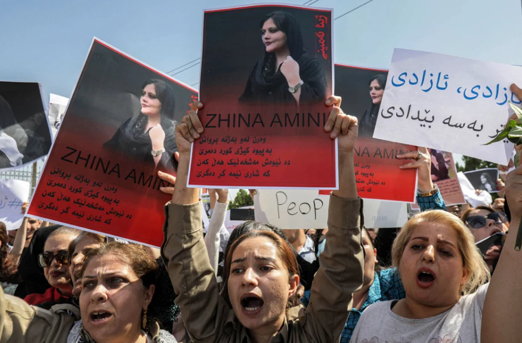
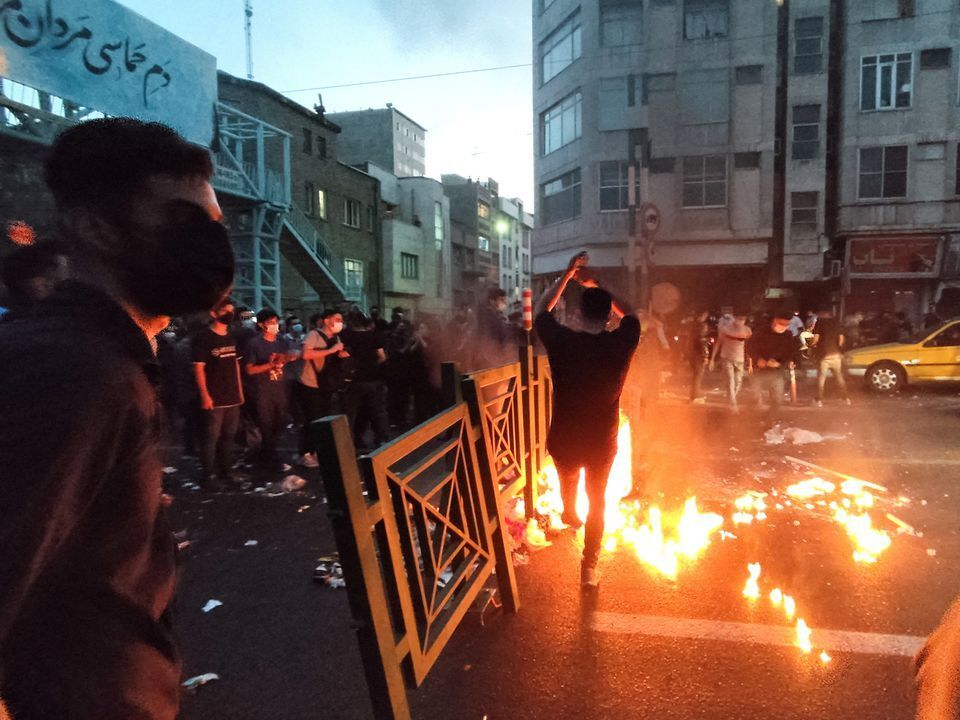

# 伊朗16岁女孩地铁内晕倒后脑死亡 ，此前疑因未戴头巾与道德警察冲突

（观察者网讯）据伊朗半官方通讯社塔斯尼姆通讯社10月22日报道，最新健康状况报告显示，10月1日在德黑兰地铁站晕倒的16岁少女阿米塔·杰拉万德（Armita
Geravand）目前被确认“脑死亡”。

对于杰拉万德晕倒原因，各方说法不一。伊朗人权组织和西方媒体称，事发当天，杰拉万德没有佩戴头巾，有目击者看到她晕倒前曾与道德警察发生冲突；而伊朗官方坚称杰拉万德晕倒前没有与他人发生冲突，并发布监控视频片段和援引杰拉万德友人的话予以佐证，同时批评“敌人试图借此在伊朗制造紧张和混乱”。

_伊朗官方公布的监控视频截图_

16岁少女阿米塔·杰拉万德近期成为伊朗国内外热议焦点。当地时间10月1日清晨，杰拉万德与两名女性友人在德黑兰一个地铁站搭乘地铁。

伊朗官方公布的监控视频显示，一名同行的女孩先下车厢，弯下腰，和其他几名乘客将昏迷不醒的杰拉万德搬到站台上。稍晚时候，赶来的急救人员将杰拉万德送到医院救治。

10月22日，塔斯尼姆通讯社援引最新报告称，尽管医护人员尽了最大努力，但杰拉万德的健康状况不容乐观，“脑死亡的情况似乎是确定的”。

_10月1日清晨，没有佩戴头巾的杰拉万德搭乘地铁。图自伊通社_

对于杰拉万德晕倒原因，各方有不同说法。此事件在伊朗国内外引发争议。

路透社、英国广播公司（BBC）报道称，伊朗国内人权组织表示，有目击者看到，杰拉万德因为没有佩戴头巾与伊朗道德警察发生争执，随后陷入昏迷。根据伊朗头巾法，所有女性都被规定必须在公共场合佩戴头巾，道德警察则是负责头巾法等“公共道德”执法工作的单位。

但伊朗官方坚决否认上述说法。根伊通社和塔斯尼姆通讯社报道，杰拉万德的同伴作证说，杰拉万德是在登上地铁后“突然仰头向后摔倒，头撞到了地上”。德黑兰地铁总经理也称，杰拉万德晕倒前没有与“乘客或地铁管理人员”之间存在“任何言语或身体冲突”。

塔斯尼姆通讯社还称，根据监控视频，杰拉万德登上地铁和晕倒后被抬出车厢之间只有几分钟，这就排除了杰拉万德与他人发生冲突的可能性。但BBC提到，伊朗官方并没有公布车厢内部的视频。

路透社、BBC等媒体将杰拉万德事件与阿米尼事件联系在一起。2022年9月16日，22岁的伊朗女子玛莎·阿米尼（Mahsa
Amini）因涉嫌违反头巾法被道德警察拘留后陷入昏迷死亡。随后，伊朗各地爆发大规模示威游行，期间造成至少有200名示威者死亡，数千人受伤。

 _伊朗国内因阿米尼事件爆发大规模示威抗议，图自外媒_

此外，杰拉万德事件发生之际，伊朗一家法院刚刚宣布对两名报道阿米尼之死的记者判处长期监禁。

伊通社称，因在阿米尼事件中涉嫌“与美国政府合作和危害国家安全”等罪名，这两名记者分别被判处13年和12年监禁。但两名记者的律师否认了这些指控，预计将提起上诉。

对于杰拉万德事件，塔斯尼姆通讯社称，这只是一个“普通事故”，但“敌人的媒体试图借此在伊朗制造紧张和混乱”。伊通社也认为，“某些媒体试图利用杰拉万德事件制造混乱，但因为官方准确、及时地发布信息而未能达到目的”。

**本文系观察者网独家稿件，未经授权，不得转载。**

